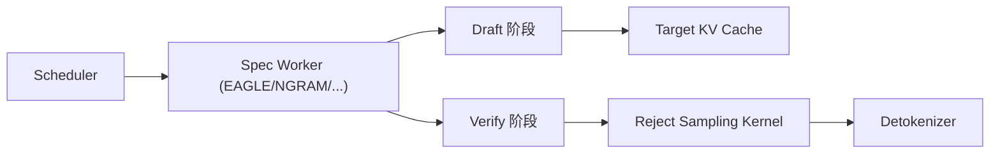

# 投机解码 · 核心概念

## 用户故事：accept rate 低于 0.5 反而变慢

### Persona

**李博**，推理性能 owner，为 Qwen-72B 开启 EAGLE 投机解码，Grafana 显示 `spec_accept_rate` 长期在 0.3–0.4，tokens/s 比关闭投机时还低 15%。

### 时间线

| 时刻 | 事件 |
|------|------|
| T0 | 启动参数 `--speculative-algorithm EAGLE --speculative-num-steps 5`，吞吐未提升 |
| T1 | 观察 metrics：`spec_accept_rate` ≈ 0.35，draft+verify 双 forward 开销显性 |
| T2 | 减小 `speculative-num-steps` 至 2，accept rate 升至 ~0.55，吞吐转正 |
| T3 | 对开放问答类 workload 关闭投机（`NONE`），确认净收益为负时不必强开 |

**Explain：** 投机解码净收益 = **接受 token 节省的 decode 步** − **draft/verify 额外算力**。Scheduler 通过 `SpeculativeAlgorithm.create_worker` 包装 `TpModelWorker`；accept rate 低于 ~0.5 时 verify 拒绝多、KV 回滚频繁，额外 forward 往往超过收益。本模块核心在 **算法枚举 + SpecInput 阶段模型**，调参前先量 accept rate。

**Code：**

```python
# 来源：python/sglang/srt/speculative/spec_info.py L28-L41
class SpeculativeAlgorithm(Enum):
    """Builtin speculative decoding algorithms. Plugin-registered ones are
    ``CustomSpecAlgo`` instances; ``from_string`` returns either type, and
    both expose the same ``is_*()`` / ``create_worker`` interface so callers
    dispatch uniformly without isinstance checks.
    """

    DFLASH = auto()
    EAGLE = auto()
    EAGLE3 = auto()
    FROZEN_KV_MTP = auto()
    STANDALONE = auto()
    NGRAM = auto()
    NONE = auto()
```

**Comment：** `NONE` 走普通 TpModelWorker；accept rate 与 batch 大小、draft checkpoint 质量强相关，见本模块 §6 追问清单。

### 如果…会怎样（调试）

| 现象 | 可能原因 | 排查 |
|------|----------|------|
| accept rate < 30% | draft 与 target 分布不匹配 | 换专用 EAGLE draft 或减 `--speculative-num-steps` |
| GPU 利用率低仍无收益 | topk 过大、verify 并行度不足 | 调 `--speculative-eagle-topk`，增大 batch |
| PD 分离下 accept 骤降 | draft hidden 未正确 transfer | 查 `carries_draft_hidden_states()` 与 KV 通道 |

---

## 1. 投机解码是什么

**Explain：** 投机解码用「廉价 Draft 模型或启发式」一次提出多个候选 token，再由 Target 模型并行验证；接受率越高，decode 吞吐越大。SGLang 将各算法抽象为 `SpeculativeAlgorithm` 枚举 + 可插拔 `CustomSpecAlgo`，Scheduler 通过统一 `create_worker` 工厂分发，无需感知具体算法实现细节。

**Code：**

```python
# 来源：python/sglang/srt/speculative/spec_info.py L28-L41
class SpeculativeAlgorithm(Enum):
    """Builtin speculative decoding algorithms. Plugin-registered ones are
    ``CustomSpecAlgo`` instances; ``from_string`` returns either type, and
    both expose the same ``is_*()`` / ``create_worker`` interface so callers
    dispatch uniformly without isinstance checks.
    """

    DFLASH = auto()
    EAGLE = auto()
    EAGLE3 = auto()
    FROZEN_KV_MTP = auto()
    STANDALONE = auto()
    NGRAM = auto()
    NONE = auto()
```

**Comment：**

- `NONE` 表示关闭投机，Scheduler 走普通 TpModelWorker。
- `from_string` 先查枚举，再查插件注册表 `_REGISTRY`。
- 各算法通过 `is_eagle()`、`is_ngram()` 等谓词在 Scheduler / Attention 后端分支，避免硬编码枚举值。

---

## 2. SpecInput 阶段模型

**Explain：** 一次 decode step 在投机路径上分为 Draft、Draft Extend、Verify 等阶段；`SpecInputType` 标识当前 `ScheduleBatch.spec_info` 携带的数据类型，Attention 后端据此选择 mask 与 KV 写入策略。

**Code：**

```python
# 来源：python/sglang/srt/speculative/spec_info.py L243-L269
class SpecInputType(IntEnum):
    # NOTE: introduce this to distinguish the SpecInput types of multiple algorithms when asserting in attention backends.
    # If all algorithms can share the same datastrucutre of draft_input and verify_input, consider simplify it
    EAGLE_DRAFT = auto()
    EAGLE_DRAFT_EXTEND = auto()
    EAGLE_VERIFY = auto()
    FROZEN_KV_MTP_DRAFT = auto()
    FROZEN_KV_MTP_VERIFY = auto()
    DFLASH_DRAFT = auto()
    DFLASH_VERIFY = auto()
    NGRAM_VERIFY = auto()


class SpecInput(ABC):
    def __init__(self, spec_input_type: SpecInputType):
        self.spec_input_type = spec_input_type

    # Cross-algorithm phase guards. Used by attention backends and
    # ForwardBatch padding logic to dispatch on phase without hardcoding the
    # specific algo class (EAGLE / FROZEN_KV_MTP / DFLASH / NGRAM each have
    # their own draft / verify SpecInput subclasses).
    def is_draft_input(self) -> bool:
        return self.spec_input_type in {
            SpecInputType.EAGLE_DRAFT,
            SpecInputType.EAGLE_DRAFT_EXTEND,
            SpecInputType.FROZEN_KV_MTP_DRAFT,
            SpecInputType.DFLASH_DRAFT,
```

**Comment：**

- EAGLE Draft Extend 在 verify 拒绝后延长 draft 树；NGRAM 只有 Verify 阶段（无 draft KV）。
- `is_draft_input()` / `is_verify_input()` 供 ForwardBatch padding 与 FlashInfer mask 复用。
- 跨算法统一接口，新增算法只需扩展 `SpecInputType` 与子类。

---

## 3. 架构位置



投机 Worker 包装 `TpModelWorker`（Target），在 `forward_batch_generation` 内交替执行 draft 与 verify；接受 token 写回 Target KV，拒绝则回滚到 last accepted 位置。

---

## 4. 插件注册机制

**Explain：** 第三方可通过 `@SpeculativeAlgorithm.register("MY_ALGO")` 注册自定义算法；注册时校验 duck-typing 接口完整性，防止 Scheduler 调用缺失方法。

**Code：**

```python
# 来源：python/sglang/srt/speculative/spec_registry.py L189-L219
def register_algorithm(
    name: str,
    *,
    supports_overlap: bool = False,
    validate_server_args: Optional[ServerArgsValidator] = None,
    spec_class: Type[CustomSpecAlgo] = CustomSpecAlgo,
) -> Callable[[WorkerFactory], WorkerFactory]:
    """Return a decorator that registers a plugin algorithm under ``name``.

    Pass a ``spec_class`` subclass of ``CustomSpecAlgo`` to override any
    ``is_*()`` / ``supports_*()`` / ``create_worker`` method.
    """
    upper = name.upper()
    if upper in _reserved_names():
        raise ValueError(
            f"'{upper}' is a reserved speculative algorithm name; cannot be re-registered."
        )
    if upper in _REGISTRY:
        raise ValueError(f"Speculative algorithm '{upper}' already registered.")
    _assert_custom_spec_algo_conforms(spec_class)

    def decorator(factory: WorkerFactory) -> WorkerFactory:
        _REGISTRY[upper] = spec_class(
            name=upper,
            factory=factory,
            supports_overlap=supports_overlap,
            validate_server_args=validate_server_args,
        )
        return factory

    return decorator
```

**Comment：**

- 内置枚举名（EAGLE、NGRAM 等）与别名 NEXTN 保留，插件不可覆盖。
- `supports_overlap=False` 已弃用：V1 Worker 路径移除后，非 overlap 算法在 V2 schema 上同步运行。
- `spec_class` 可子类化 `CustomSpecAlgo` 覆盖 `is_eagle()` 等，以接入现有分支。

---

## 6. 设计追问

**Explain：** 投机 decode 的收益完全取决于接受率与额外开销的净差；线上 accept rate 持续偏低时，应优先排查是 draft 模型不匹配、步数/topk 过大，还是 batch 太小导致 adaptive 无法生效。调参顺序建议：先量 accept rate → 再动 `--speculative-num-steps` / `--speculative-eagle-topk` → 最后才考虑缩小 batch 或关闭投机。

**追问清单：**

| 现象 | 可能原因 | 优先动作 |
|------|----------|----------|
| accept rate < 30% | draft 与 target 分布偏差大 | 换专用 EAGLE draft checkpoint 或减 `speculative-num-steps` |
| GPU 利用率低、吞吐无提升 | draft+verify 双 forward 开销 > 节省 | 减 topk 或增大 batch，让 verify 并行度吃满 |
| 延迟抖动大 | adaptive 频繁切换 runtime state | 固定步数或放宽 EMA 阈值 |
| PD 分离下 accept 骤降 | draft hidden 未正确 transfer | 查 `carries_draft_hidden_states()` 与 disagg 通道 |
| 仍无收益 | workload 本身难预测（开放问答） | `--speculative-algorithm NONE` 关闭投机，避免白跑 draft |

**Comment：** NGRAM 路径 accept rate 与语料重复度强相关；EAGLE 路径更吃 draft 质量。关闭投机不是失败，而是承认当前 workload 下净收益为负。
