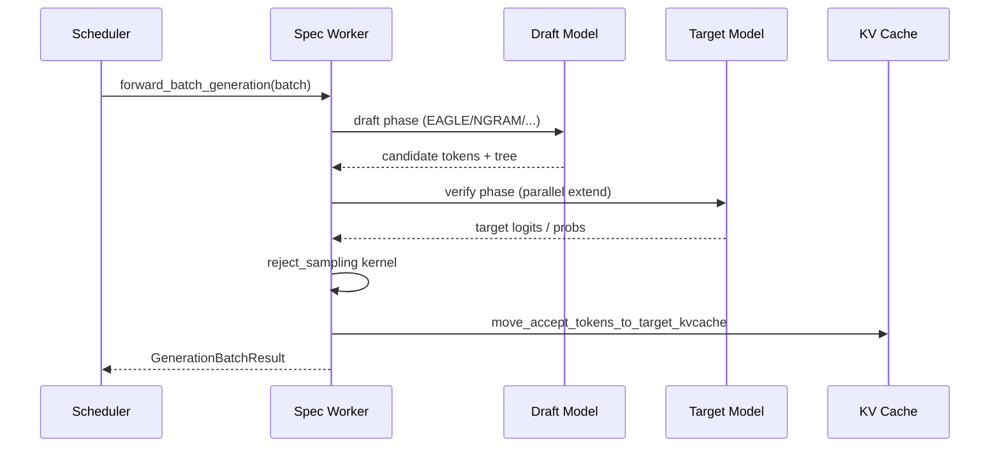
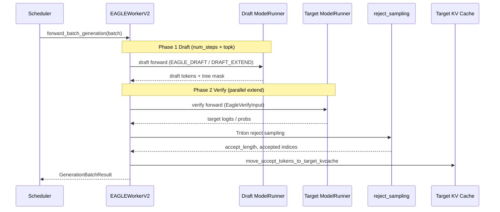

# 投机解码：数据流与交互

## 1. 架构位置

投机解码位于 **Scheduler → TpModelWorker** 之间：启用 `--speculative-algorithm` 后，Scheduler 实例化 Spec Worker 替代纯 Target Worker，但对外仍通过 `GenerationBatchResult` 返回 token。



---

## 2. 输入 / 输出

| 方向 | 类型 | 说明 | 定义位置 |
|------|------|------|----------|
| 输入 | `ScheduleBatch` | 含 `spec_info`、`input_ids`、seq_lens | managers/schedule_batch.py |
| 输入 | `ServerArgs` | speculative_* 系列参数 | server_args.py |
| 输出 | `GenerationBatchResult` | next_token_ids、accept counts | managers/scheduler.py |
| 中间 | `EagleVerifyInput` 等 | verify 阶段 mask 与 cache loc | speculative/eagle_info.py |

**Explain：** EAGLE verify 输入封装 draft 树结构与 retrieve index，供 Attention 一次性 prefill 多候选位置。

**Code：**

```python
# 来源：python/sglang/srt/speculative/eagle_info.py L17-L43
@dataclass
class EagleVerifyInput(SpecInput):
    draft_token: torch.Tensor
    custom_mask: torch.Tensor
    positions: torch.Tensor
    retrieve_index: torch.Tensor
    retrieve_next_token: torch.Tensor
    retrieve_next_sibling: torch.Tensor
    retrieve_cum_len: torch.Tensor
    spec_steps: int
    topk: int
    draft_token_num: int
    capture_hidden_mode: CaptureHiddenMode
    seq_lens_sum: int
    seq_lens_cpu: torch.Tensor
    grammar: BaseGrammarObject = None
    # Stacked per-step draft proposal distribution q, shape (bs, num_steps,
    # vocab); only set under rejection sampling. Consumed by the verify kernel.
    draft_probs: torch.Tensor = None

    # Shape info for padding
    num_tokens_per_req: int = -1  # -1 auto-fills from draft_token_num.

    def __post_init__(self):
        super().__init__(SpecInputType.EAGLE_VERIFY)
        if self.num_tokens_per_req < 0:
            self.num_tokens_per_req = self.draft_token_num
```

**Comment：** `retrieve_*` 三元组描述 draft 树拓扑；`generate_attn_arg_prefill` 据此构造 FlashInfer 的 kv_indices 与 custom_mask。

---

## 3. 上下游连接

| 上游/下游 | 模块 | 交互方式 | 说明 |
|-----------|------|----------|------|
| 上游 | Scheduler | 调用 `forward_batch_generation` | 与普通 Worker 同接口 |
| 上游 | ServerArgs | `spec_algorithm.handle_server_args` | 启动时配置 |
| 下游 | Attention Backend | 读 `batch.spec_info` | 选择 tree mask / page table |
| 下游 | mem_cache | `move_accept_tokens_to_target_kvcache` | 接受 token 写入 Target KV |
| 下游 | Detokenizer | 经 Scheduler 转发 | 输出最终 token |
| 横向 | PD Disaggregation | `build_disagg_draft_input` | Prefill→Decode 传递 draft hidden |

**Explain：** PD 分离下 EAGLE 需在 prefill 端构造 draft 输入，decode 端继续 verify。

**Code：**

```python
# 来源：python/sglang/srt/speculative/spec_info.py L142-L157
    def build_disagg_draft_input(
        self,
        batch: ScheduleBatch,
        server_args: ServerArgs,
        last_tokens_tensor: torch.Tensor,
        future_map: FutureMap,
    ) -> Optional[SpecInput]:
        if self.is_eagle():
            from sglang.srt.speculative.eagle_disaggregation import (
                build_eagle_disagg_draft_input,
            )

            return build_eagle_disagg_draft_input(
                batch, server_args, last_tokens_tensor, future_map
            )
        return None
```

**Comment：** 仅 EAGLE 家族携带 draft hidden states；STANDALONE draft 忽略 hidden transfer。

---

## 4. EAGLE Draft / Verify 时序（单步 Decode）

**Explain：** 一步投机 decode 在时间上严格分为 Draft 与 Verify 两阶段：Draft 在独立 ModelRunner 上自回归扩展候选树（可 overlap 与上一专题 Verify 交错）；Verify 阶段 Target 以 EXTEND 模式一次 forward 全部候选位置，再经 GPU reject sampling 决定接受长度。两阶段共用 Scheduler 的 `forward_batch_generation` 入口，由 `batch.spec_info` 区分。



| 阶段 | ForwardMode | spec_info 类型 | KV 写入 |
|------|-------------|----------------|---------|
| Draft | DECODE / EXTEND | EAGLE_DRAFT / EAGLE_DRAFT_EXTEND | Draft pool |
| Verify | EXTEND | EAGLE_VERIFY | Target pool（临时 loc） |
| 接受后 | — | — | 合并到 Target 主链 |

---

## 5. 典型数据流：EAGLE 单步 Decode（步骤详解）

**步骤 1 — Draft：** Target 最后 hidden → Draft 模型自回归 `speculative_num_steps` 步，topk 扩展为树。

**Explain：** Draft 使用独立 `TpModelWorker`，KV 与 Target 分离；CUDA Graph 捕获 draft decode。

**Code：**

```python
# 来源：python/sglang/srt/speculative/base_spec_worker.py L87-L90
    def init_cuda_graphs(self):
        """Capture draft graphs (decode disabled on the draft TpModelWorker)."""
        self.draft_worker.init_cuda_graphs(capture_decode_cuda_graph=False)
        self._capture_cuda_graphs()
```

**Comment：** Draft worker 不 capture decode graph（由 spec worker 侧 capture extend/verify）。

**步骤 2 — Verify：** 构造 `EagleVerifyInput`，Target 以 EXTEND 模式一次 forward 全部候选，得到 target probs。

**步骤 3 — Reject Sampling：** GPU kernel 决定接受长度，更新 `batch.output_ids` 与 KV loc。

**Explain：** 接受后调用 `move_accept_tokens_to_target_kvcache` 将 verify 写入的 KV 合并到 running 序列。

**Code：**

```python
# 来源：python/sglang/srt/speculative/spec_utils.py L526-L555
def move_accept_tokens_to_target_kvcache(
    batch: ScheduleBatch,
    accept_index: torch.Tensor,
    num_correct_drafts: torch.Tensor,
    token_to_kv_pool_allocator: BaseTokenToKVPoolAllocator,
):
    """
    Move accepted tokens (drafts + bonus) to the target KV cache.

    Args:
        batch: The batch to run.
        accept_index: The index of the accepted tokens (incl. bonus).
        num_correct_drafts: Per-req count of correct drafts (excludes bonus);
            seq_lens is advanced by ``num_correct_drafts + 1`` to cover the bonus slot.
    """
    bs = len(batch.seq_lens)
    device = batch.seq_lens.device
    # accept_index element count, NOT bs * num_draft_tokens: for topk > 1 the
    # tree exceeds the accepted chain, over-reading accept_index (illegal memory).
    size = bs * accept_index.shape[1]

    # fill_accept_out_cache_loc reads out_cache_loc[accept_index]; -1 sentinel ok.
    maybe_detect_oob(
        accept_index,
        -1,
        batch.out_cache_loc.size(0),
        "spec v2 move_accept_tokens accept_index",
    )

    tgt_cache_loc = torch.zeros(
```

**Comment：** NGRAM 路径同样调用此函数，但 draft 阶段无 KV 写入；`num_correct_drafts + 1` 中的 `+1` 是 bonus token 槽位。

---

## 6. NGRAM 数据流差异

**Explain：** NGRAM 在 verify 前从 corpus 匹配 draft 树，仅一次 Target forward + verify；语料随生成更新。

**Code：**

```python
# 来源：python/sglang/srt/speculative/ngram_worker.py L74-L76
        # rids of the last decode batch; used to erase corpus match state for
        # requests that left the batch (see forward_batch_generation).
        self._prev_decode_rids: set = set()
```

**Comment：** 请求离批时必须 erase corpus 状态，否则 trie 与错误上下文绑定。

---

## 7. Adaptive Spec 交互

**Explain：** `AdaptiveController` 根据运行时接受率动态调整 draft 步数或 topk（EAGLE V2 可选）。

**Code：**

```python
# 来源：python/sglang/srt/speculative/adaptive_runtime_state.py L61-L126
class AdaptiveController:
    """Facade that owns adaptive decision-making and runtime state switching.

    Works with any worker that implements AdaptiveSpecWorker protocol:
      - build_adaptive_runtime_state(steps, draft_tokens) → runtime state
      - apply_runtime_state(state) → apply it to the worker

    The worker only needs to:
      1. Call register() for the initial state, then init_states()
         once during startup.
      2. Call on_verify_complete(num_correct_drafts_per_req) after each decode verify.
    """

    def __init__(self, worker: AdaptiveSpecWorker, config_path: str | None = None):
        self.worker = worker
        self.params = AdaptiveSpeculativeParams(
            initial_steps=worker.speculative_num_steps,
            cfg_path=config_path,
        )
        self._states: dict[int, SpecRuntimeState] = {}

    @property
    def candidate_steps(self) -> list[int]:
        return self.params.candidate_steps

    def register(self, state: SpecRuntimeState, steps: int | None = None) -> None:
        """Register a pre-built runtime state.

        *steps* defaults to state.speculative_num_steps when not given.
        """
        key = steps if steps is not None else state.speculative_num_steps
        self._states[key] = state

    def init_states(self, cuda_graph_bs: list[int] | None = None) -> None:
        """Build and register runtime states for all candidate steps."""
        self.params.set_cuda_graph_bs(cuda_graph_bs)

        for steps in self.candidate_steps:
            if steps in self._states:
                continue

            pruned_bs = self.params.cuda_graph_bs_for_step(steps)
            state = self.worker.build_adaptive_runtime_state(
                speculative_num_steps=steps,
                speculative_num_draft_tokens=steps + 1,
                cuda_graph_bs=pruned_bs,
            )
            self._states[steps] = state

        # Start on the initial step.
        self._activate(self.worker.speculative_num_steps)

    def activate_step_by_batch(self, batch_size: int) -> None:
        target = self.params.get_steps_for_batch(batch_size)
        if target != self.worker.speculative_num_steps:
            self._activate(target)

    def on_verify_complete(
        self, num_correct_drafts_per_req: list[int], batch_size: int
    ) -> None:
        """Feed verify results; switch runtime state if EMA warrants it."""
        new_step = self.params.on_verify_complete(
            num_correct_drafts_per_req, batch_size
        )
        if new_step is not None:
            self._activate(new_step)
```

**Comment：** 切换 draft 步数时会原子替换 `SpecRuntimeState`（含 draft/verify/extend 三套 Attention backend 与 CUDA graph）；与 `eagle_worker_v2.adaptive_controller` 字段联动。

---

## 8. 用户故事：一步投机的内心独白

Scheduler 把这一批 decode 请求交到我手上时，`batch.spec_info` 还是空的——我是 `EAGLEWorkerV2`，要先替 Target 想几步棋。Draft ModelRunner 拿到 Target 最后一层 hidden，自回归展开 `speculative_num_steps` 步、每步 topk 分叉，拼出一棵候选树；我把 `EagleVerifyInput` 填好：`draft_token`、`custom_mask`、`retrieve_index` 告诉 Attention「这些位置要并行看」。

Verify 阶段换 Target ModelRunner，一次 EXTEND forward 扫完整棵树，logits 交给 Triton reject sampling。内核逐链比对 draft 与 target 分布，算出每条请求接受了几个 token——可能全拒，也可能一口气吃下五步加一个 bonus。接受的部分不能留在临时 loc：我调用 `move_accept_tokens_to_target_kvcache`，把 KV 合并进主链，更新 `seq_lens` 和 `output_ids`。

若开了 adaptive spec，`AdaptiveController.on_verify_complete` 会记下这轮接受长度；EMA 偏低就降 draft 步数，偏高则加步——下一轮的 CUDA graph 与 backend 整套切换。最后我把 `GenerationBatchResult` 还给 Scheduler，对用户来说只是多蹦出几个 token，背后却是 draft、verify、写回 KV 的一整套接力。
