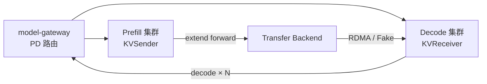

# PD 分离：Prefill-Decode 分离（Disaggregation）

> **阶段 V · 高级特性** | 状态：已完成 | Git：`70df09b83363e0127b43c83a6007d3938f815b2d` 
> **源码范围：** `srt/disaggregation/`、`srt/managers/disagg_service.py`

---

## 本模块在架构中的位置

PD 分离将 **Prefill（计算密集、变长）** 与 **Decode（带宽密集、定长步进）** 拆到不同 GPU 集群，KV 经 Mooncake/NIXL 等 Transfer Backend 跨节点搬运。Gateway 维护 prefill/decode 池映射；各节点通过 `DisaggregationMode` 枚举声明角色。



---

## 零基础一句话

**像中央厨房与分店：** Prefill 店专门「备菜」（处理长 prompt），Decode 店专门「上菜」（逐 token 生成），中间冷链（KV 传输）把半成品送到分店。

---

## 用户场景

**Persona：** 平台架构师阿敏负责聊天峰 decode 多、批处理峰 prefill 多的混合负载。她需要判断何时 PD 分离比 unified 更划算，以及如何调 `pre_alloc_size` 减少 Prefill 端 blocking。

---

## 五件套阅读顺序

| 顺序 | 文件 | 一句话说明 |
|------|------|------------|
| 01 | [[22-Disaggregation-01-核心概念]] | DisaggregationMode、四队列模型、KVPoll |
| 启动链路 | [[22-Disaggregation-02-源码走读]] | metadata gate、PrefillBootstrapQueue、DecodeReqToTokenPool |
| HTTP Server | [[22-Disaggregation-03-数据流与交互]] | **端到端 PD 六步数据流**（本模块重点） |
| OpenAI API | [[22-Disaggregation-04-关键问题]] | Backend 选型、HiCache、TCO 决策 |
| ✓ | [[22-Disaggregation-05-checkpoint]] | 验收清单 |

---

## 核心源码锚点

**Explain：** Prefill 节点在 `--disaggregation-mode prefill` 时启动 bootstrap server；Decode 节点作为 receiver 握手并拉取 KV。

**Code：**

```python
# 来源：python/sglang/srt/managers/disagg_service.py L14-L44
def start_disagg_service(
    server_args: ServerArgs,
):
    # Start kv bootstrap server on prefill
    disagg_mode = DisaggregationMode(server_args.disaggregation_mode)
    transfer_backend = TransferBackend(server_args.disaggregation_transfer_backend)

    if disagg_mode == DisaggregationMode.PREFILL:
        # only start bootstrap server on prefill tm
        kv_bootstrap_server_class = get_kv_class(
            transfer_backend, KVClassType.BOOTSTRAP_SERVER
        )
        bootstrap_server = kv_bootstrap_server_class(
            host=server_args.host,
            port=server_args.disaggregation_bootstrap_port,
        )
        is_create_store = (
            server_args.node_rank == 0 and transfer_backend == TransferBackend.ASCEND
        )
        if is_create_store:
            try:
                from memfabric_hybrid import create_config_store

                ascend_url = os.getenv("ASCEND_MF_STORE_URL")
                create_config_store(ascend_url)
            except Exception as e:
                error_message = f"Failed create mf store, invalid ascend_url."
                error_message += f" With exception {e}"
                raise error_message

        return bootstrap_server
```

**Comment：**

- `get_kv_class` 按 backend 返回 Mooncake/NIXL/Mori/Fake/Ascend 连接类。
- Bootstrap 仅 Prefill 侧 TokenizerManager 进程启动；Decode 侧连接 bootstrap 完成 room 分配。
- `DisaggregationMode.NULL` 表示 unified，不走 PD 数据流。

---

## 验证建议

1. **Fake backend 本地双进程：** `--disaggregation-mode prefill` + `--disaggregation-transfer-backend fake` 与 decode 节点配对，无需 RDMA 即可验证队列流转。
2. **metadata gate：** 若 decode 卡在 Transferring，检查 `bootstrap_room` 是否已写入 metadata buffer（见 02 §1）。
3. **TCO：** 短 prompt、跨 AZ 传 GB 级 KV 时 PD 可能更慢——见 [[08-设计追问与框架对比|08-设计追问]] 追问 1–2。

---

## 阅读路径

← [[21-Speculative-00-MOC|投机解码]] 
→ [[23-Distributed-00-MOC|分布式并行]]
