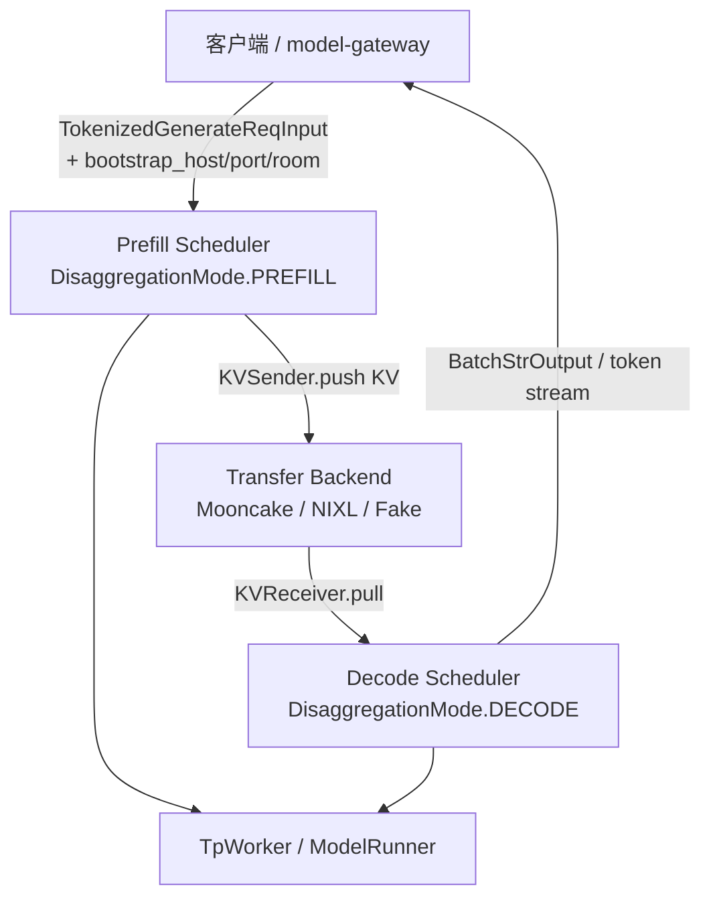
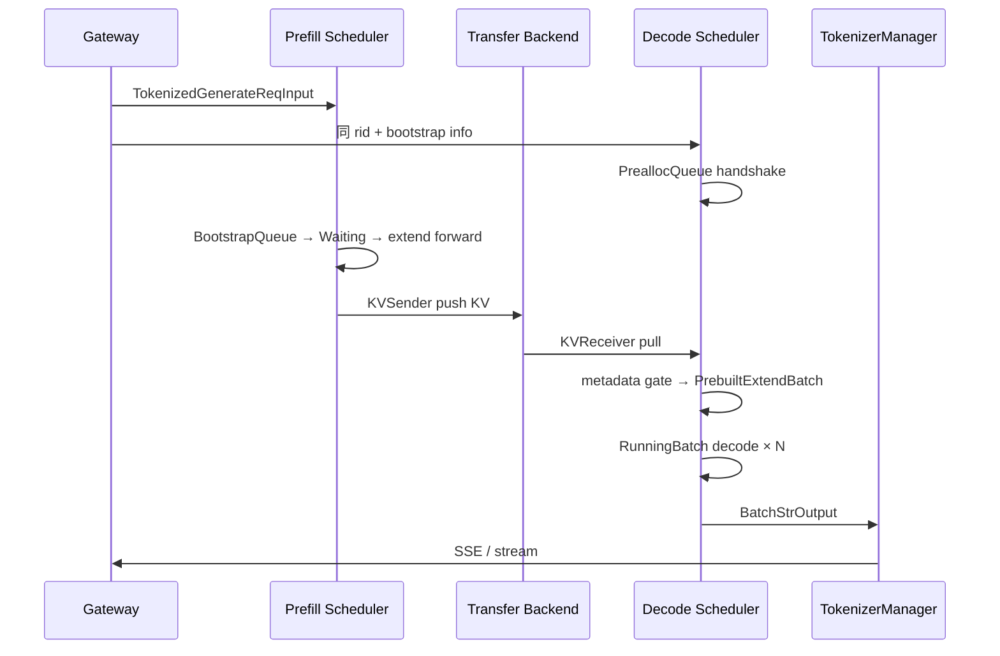

# PD 分离：数据流与交互

> PD（Prefill-Decode）分离场景下，请求跨 **Prefill 节点**、**KV 传输层**、**Decode 节点** 三段的完整数据流。 
> 内嵌代码对应 sglang Git commit `70df09b`。

---

## 1. 架构位置



**Explain：** 与 unified 模式不同，Prefill 节点只跑 extend forward 并通过 `KVSender` 异步推送 KV；Decode 节点通过 `KVReceiver` 拉取 KV 后构造 `PrebuiltExtendBatch`，**跳过 prefill forward**，直接进入 decode 循环。Gateway 或客户端负责为每个请求指定 decode 侧的 bootstrap 信息（host/port/room）。

---

## 2. 输入 / 输出

| 方向 | 类型 | 说明 | 构造/消费位置 |
|------|------|------|---------------|
| 输入 | `TokenizedGenerateReqInput` | 含 `bootstrap_host/port/room` 等 PD 字段 | TokenizerManager → Prefill Scheduler |
| Prefill 中间 | `PrefillBootstrapQueue` 内 `Req` | handshake 未完成前暂存 | `prefill.py` |
| 传输 | `KVPoll` 状态 | Bootstrapping / Transferring / Success | `utils.py` poll + all_reduce |
| Decode 中间 | `DecodeReq` + `kv_receiver` | pre-alloc → transfer → waiting | `decode.py` |
| Decode 执行 | `PrebuiltExtendBatch` | 仅填 metadata、无 prefill forward | `decode.py` WaitingQueue |
| 输出 | `BatchStrOutput` 等 | 与普通 unified 相同 | Decode Scheduler → TokenizerManager |

**Code（请求侧 bootstrap 字段）：**

```python
# 来源：python/sglang/srt/managers/io_struct.py L802-L810（节选）
    # Whether to return captured routed experts
    return_routed_experts: bool = False
    # See GenerateReqInput.routed_experts_start_len.
    routed_experts_start_len: int = 0
    return_indexer_topk: bool = False

    # Session info for continual prompting
    session_id: Optional[str] = field(default=None, kw_only=True)
    session_params: Optional[SessionParams] = None
```

**Comment：**

- `bootstrap_room` 是 Decode 侧 KV 接收槽位的逻辑 ID；Prefill 完成 extend 后向该 room 推送 KV。
- Gateway PD 路由层维护 prefill pool ↔ decode pool 映射；直连调试时可手工指定 bootstrap 三元组。

---

## 3. 上下游连接

| 上游/下游 | 模块 | 交互方式 | 说明 |
|-----------|------|----------|------|
| 上游 | TokenizerManager / Gateway | ZMQ `TokenizedGenerateReqInput` | 请求进入 Prefill 或 Decode 队列 |
| 同级 | Transfer Backend | RDMA / Fake / Ascend memfabric | `CommonKVSender` ↔ `CommonKVReceiver` |
| 下游 | TpWorker / ModelRunner | 同进程调用 | Prefill 跑 extend；Decode 跑 prebuilt + decode |
| 下游 | TokenizerManager | ZMQ 输出 | Decode 节点产出 token 流 |
| 协同 | RadixAttention / HiCache（RadixAttention–KV Cache） | prefix match | Decode 侧可减少全量 KV 传输字节 |

---

## 4. 端到端 PD 数据流（逐步）

### 步骤 1：Gateway / 客户端路由到 Prefill 节点

**Explain：** 请求携带 prompt 与 decode bootstrap 信息到达 Prefill Scheduler。`dispatch_event_loop` 在 `DisaggregationMode.PREFILL` 下进入 `event_loop_overlap_disagg_prefill()`，与普通 unified loop 分离。

**Code：**

```python
# 来源：python/sglang/srt/managers/scheduler.py L4164-L4192
def dispatch_event_loop(scheduler: Scheduler):
    # Dispatch to the appropriate event loop based on the disaggregation mode
    server_args = scheduler.server_args
    disaggregation_mode: DisaggregationMode = scheduler.disaggregation_mode
    if disaggregation_mode == DisaggregationMode.NULL:
        if scheduler.enable_pdmux:
            scheduler.event_loop_pdmux()
        elif server_args.pp_size > 1:
            scheduler.event_loop_pp()
        elif scheduler.enable_overlap_mlx:
            scheduler.event_loop_overlap_mlx()
        elif scheduler.enable_overlap:
            scheduler.event_loop_overlap()
        else:
            scheduler.event_loop_normal()
    elif disaggregation_mode == DisaggregationMode.PREFILL:
        if server_args.pp_size > 1:
            scheduler.event_loop_pp_disagg_prefill()
        elif scheduler.enable_overlap:
            scheduler.event_loop_overlap_disagg_prefill()
        else:
            scheduler.event_loop_normal_disagg_prefill()
    elif disaggregation_mode == DisaggregationMode.DECODE:
        if server_args.pp_size > 1:
            scheduler.event_loop_pp_disagg_decode()
        elif scheduler.enable_overlap:
            scheduler.event_loop_overlap_disagg_decode()
        else:
            scheduler.event_loop_normal_disagg_decode()
```

**Comment：** CLI `--disaggregation-mode prefill|decode|null` 决定节点角色；`null` 即 unified，不走本模块数据流。

---

### 步骤 2：Decode 侧 Prealloc — 握手占坑

**Explain：** Decode 节点收到请求后，**先于 KV 到达**在 `PreallocQueue` 初始化 `KVReceiver` 并完成 handshake + KV slot 预分配。这使 Prefill 端 bootstrap 不必等待 decode running 槽位空闲——`DecodeReqToTokenPool` 允许 `#pre-allocated + #transfer` 超出 `--max-running-requests`。

**Code：**

```python
# 来源：python/sglang/srt/disaggregation/decode.py L1-L19
"""
Life cycle of a request in the decode server

1. PreallocQueue:
    a. Initialize a receiver for each request
    b. The request handshakes first, and pre-allocate kv once there is available kv.
    c. Move the request to TransferQueue.

2. TransferQueue:
    a. Poll the receiver to check the transfer state
    b. If the transfer has finished, move the request to waiting queue

3. WaitingQueue:
    a. Use the requests in the queue to construct a PrebuiltExtendBatch
    b. Skip the prefill forward but only populate metadata

4. RunningBatch:
    a. Merge the resolved PrebuiltExtendBatch into running batch to run decoding
"""
```

**Comment：** 步骤 2b 是关键：Decode **先占坑再收 KV**，Prefill 端 sender 才有目标 room；顺序反了会导致 transfer 阻塞。

---

### 步骤 3：Prefill 侧 Bootstrap → Waiting → Inflight

**Explain：** Prefill 侧为每个请求创建 `KVSender`，在 `PrefillBootstrapQueue` 轮询直到 handshake 完成，再进入 `WaitingQueue` 被 `PrefillAdder` 调度做 extend forward。forward 完成后请求进入 `InflightQueue`，KV 异步传输。

**Code：**

```python
# 来源：python/sglang/srt/disaggregation/prefill.py L1-L18
"""
Life cycle of a request in the prefill server

1. Bootstrap Queue
    a. Initialize a sender for each request
    b. Use the queue to store requests whose bootstrap (handshake and preallocation) has not finished
    c. Poll senders to check bootstrap state
    d. Once bootstrap is complete, move request to Waiting Queue

2. Waiting Queue
    a. Use PrefillAdder to pop requests
    b. Run forward
    c. Add the request to Inflight Queue

3. Inflight Queue
    a. Poll (non-blocking) the sender of the request
    b. Once the transfer has finished, return the request
"""
```

**Comment：** Bootstrap 完成前不占 Prefill GPU 算力；Inflight 期间 GPU 可服务下一专题 waiting 请求，提高 Prefill 集群利用率。

---

### 步骤 4：KV 传输与 poll 同步

**Explain：** 各 rank 对 `KVPoll` 结果做 `all_reduce(MIN)`，保证 TP 网格内所有参与者在同一状态转移点提交。Decode 侧若 KV 物理传完但 `bootstrap_room` metadata 尚未写入，`_apply_metadata_gate` 将 Success 降回 Transferring。

**Code：**

```python
# 来源：python/sglang/srt/disaggregation/utils.py L103-L118
def _apply_metadata_gate(polls, decode_reqs, metadata_buffers, server_args) -> None:
    """Downgrade Success → Transferring for requests whose metadata hasn't landed.

    Mutates `polls` in-place. Called before all-reduce so that MIN across TP
    ranks naturally prevents any rank from committing before all ranks are ready.
    """
    for i, poll_val in enumerate(polls):
        if poll_val == int(KVPoll.Success):
            decode_req = decode_reqs[i]
            if _is_fake_transfer(decode_req.req, server_args):
                continue
            actual_room = metadata_buffers.bootstrap_room[
                decode_req.metadata_buffer_index, 0
            ].item()
            if actual_room == 0:
                polls[i] = int(KVPoll.Transferring)
```

**Comment：** 禁止在 `actual_room == 0` 时构造 `PrebuiltExtendBatch`——否则 decode forward 基于空 KV，logits 错误。Fake backend 测试路径跳过 gate。

---

### 步骤 5：Decode 构造 PrebuiltExtendBatch → Running

**Explain：** Transfer 完成且 metadata gate 通过后，WaitingQueue 将请求组装为 `PrebuiltExtendBatch`：**只填 forward metadata，不跑 prefill kernel**。随后 merge 进 `RunningBatch`，与普通 decode step 相同，每步 seq_len+1 直到 finish。

**Code：**

```python
# 来源：python/sglang/srt/disaggregation/decode.py L107-L117
class DecodeReqToTokenPool:
    """
    The difference of DecodeReqToTokenPool and ReqToTokenPool is that
    DecodeReqToTokenPool subscribes memory for pre-allocated requests.

    In ReqToTokenPool, if `--max-running-requests` is 8,
    #pre-allocated + #transfer + #running <= 8, but there are in fact more memory can carry pre-allocated requests.

    In DecodeReqToTokenPool, if `--max-running-requests` is 8,
    #running <= 8, #pre-allocated + #transfer <= pre_alloc_size, so we can use the free memory to pre-allocate requests to unblock prefill.
    """
```

**Comment：** `pre_alloc_size` 调大可提高 transfer/running 流水线并行度，代价是预留更多 KV 显存；与 unified 模式的 `check_decode_mem` retract 策略独立。

---

### 步骤 6：HiCache 可选 — 减少传输字节

**Explain：** 若 prefix 已在共享 HiCache，Decode 侧 `_build_decode_prefix_match` 可本地 restore 部分 KV，Prefill 仅传 delta。前提：Prefill/Decode 共享 cache key 策略且 `enable_decode_hicache` 开启。

**Code：**

```python
# 来源：python/sglang/srt/disaggregation/decode_hicache_mixin.py L61-L68
    def _build_decode_prefix_match(self, req: Req, result: Any) -> DecodePrefixMatch:
        """Convert a ``match_prefix_for_req`` result into ``DecodePrefixMatch``.

        Performs the optional L3 storage hit length query when decode-side
        HiCache is enabled and the last host node is backed up.
        """
        prefix_indices = result.device_indices
        l1_prefix_len = len(prefix_indices)
```

**Comment：** 与RadixAttention RadixAttention、KV Cache KV Cache 交叉阅读；PD + 高前缀命中场景下 TCO 收益最大。

---

## 5. 典型 PD 请求时序（Mermaid）



---

## 6. 与 unified 模式对比

| 维度 | Unified（`DisaggregationMode.NULL`） | PD 分离 |
|------|--------------------------------------|---------|
| Scheduler loop | `event_loop_overlap` | `event_loop_overlap_disagg_prefill/decode` |
| Prefill 与 Decode | 同一 GPU 队列争抢 | 独立集群扩缩 |
| KV 跨节点 | 无 | Transfer Backend RDMA |
| 额外字段 | 无 | `bootstrap_host/port/room` |
| 适用场景 | 单集群、短 prompt | prefill/decode 峰值错开、长 prompt 专池 |

**Comment：** 短 prompt、低 QPS、跨 AZ 传 GB 级 KV 时 PD 可能**更慢**——见 [[08-设计追问与框架对比|08-设计追问与框架对比]] 追问 1–2。
