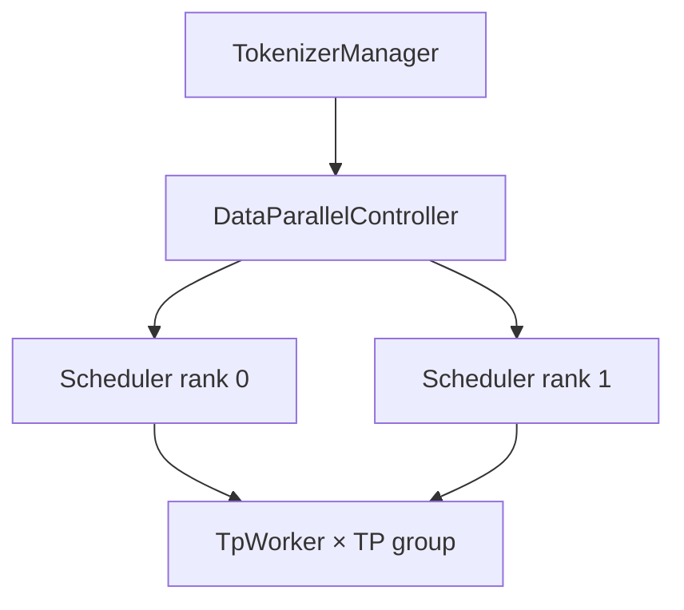

# 分布式并行（Distributed）

> **阶段 V · 高级特性** | 状态：已完成 | Git：`70df09b83363e0127b43c83a6007d3938f815b2d` 
> **源码范围：** `srt/distributed/`、`data_parallel_controller.py`、`elastic_ep/`

---

## 本模块在架构中的位置

大模型放不进单卡时需要 **TP / PP / EP / DP / CP** 等并行维度。`initialize_model_parallel` 在模型加载前创建 ProcessGroup；Scheduler 通过 Data Parallel Controller 将请求分发到多个 DP rank；MoE 层（MoE 专题）与 Attention CP 与本模块 collective 深度耦合。



---

## 零基础一句话

**像多柜台分单：** 模型太大一张 GPU 放不下就「切片」到多卡（TP）；请求太多就「多开几个柜台」并行接客（DP）。

---

## 用户场景

**Persona：** 运维工程师小韩部署 70B 模型，需要选择 TP=4 还是 TP=2+PP=2，并理解 `--dp-size` 与 model-gateway routing_key 如何配合做负载均衡。

---

## 五件套阅读顺序

| 顺序 | 文件 | 一句话说明 |
|------|------|------------|
| 01 | [[23-Distributed-01-核心概念]] | 并行维度、ProcessGroup、通信原语 |
| 启动链路 | [[23-Distributed-02-源码走读]] | parallel_state、communication_op、DP Controller |
| HTTP Server | [[23-Distributed-03-数据流与交互]] | 请求路由、collective 调用链 |
| OpenAI API | [[23-Distributed-04-关键问题]] | 组网、性能调优、Elastic EP |
| ✓ | [[23-Distributed-05-checkpoint]] | 验收清单 |

---

## 核心源码锚点

**Explain：** 模型加载前调用 `initialize_model_parallel` 创建 TP/PP/EP/DP/CP 等 ProcessGroup；后续层通过 `get_tp_group().all_reduce` 等访问。

**Code：**

```python
# 来源：python/sglang/srt/distributed/parallel_state.py L1967-L1979
def initialize_model_parallel(
    tensor_model_parallel_size: int = 1,
    expert_model_parallel_size: int = 1,
    pipeline_model_parallel_size: int = 1,
    attention_data_parallel_size: int = 1,
    attention_context_model_parallel_size: int = 1,
    moe_data_model_parallel_size: int = 1,
    decode_context_parallel_size: int = 1,
    backend: Optional[str] = None,
    duplicate_tp_group: bool = False,
    enable_symm_mem: bool = False,
    recovered_rank: bool = False,
) -> None:
```

**Comment：**

- 典型 workflow：`init_distributed_environment` → `initialize_model_parallel` → 业务代码 → `destroy_model_parallel`。
- docstring 内含 8 GPU 组网示例（TP×PP、Attn-CP×MoE-EP 等）。
- `decode_context_parallel_size` 在 decode 阶段切分 KV。

---

## 验证建议

1. **单卡 baseline：** 先 `--tp-size 1` 跑通，再逐步加 TP 观察 NCCL 日志。
2. **DP 路由：** `--dp-size 2` 时观察 DataParallelController 如何将请求 hash 到不同 Scheduler。
3. **与 Gateway：** 多 worker 场景配合 [[27-model-gateway-00-MOC|27-model-gateway]] routing_key。

---

## 阅读路径

← [[22-Disaggregation-00-MOC|PD 分离]] 
→ [[24-Multimodal-00-MOC|Multimodal：多模态 VLM]]
