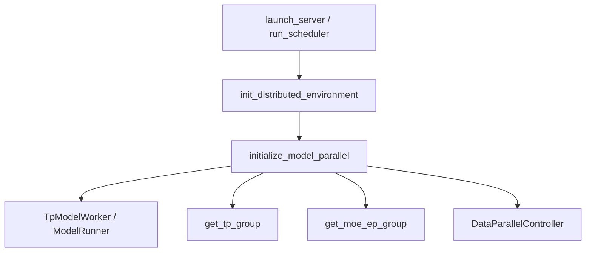

# 分布式并行：数据流与交互

## 1. 启动时组网数据流



---

## 2. Forward 中 collective 链

**Explain：** 一次 decode step 中，Attention 输出经 TP all_reduce；MoE router 结果经 EP all_to_all；LM head logits 可能 gather 到 rank0。

**Code：**

```python
## 来源：python/sglang/srt/distributed/communication_op.py L43-L47
def tensor_model_parallel_all_gather(
    input_: torch.Tensor, dim: int = -1
) -> torch.Tensor:
    """All-gather the input tensor across model parallel group."""
    return get_tp_group().all_gather(input_, dim)
```

**Comment：** ColumnParallelLinear 用 all_reduce，RowParallelLinear 用 all_reduce 或 reduce_scatter，取决于实现。

---

## 3. DP 请求路由

| 步骤 | 组件 | 数据 |
|------|------|------|
| 1 | TokenizerManager | TokenizedGenerateReqInput |
| 2 | DataParallelController | 选 DP rank |
| 3 | ZMQ | pickle 消息到 Scheduler |
| 4 | Scheduler | 入 waiting queue |

**Explain：** `LoadBalanceMethod.FOLLOW_BOOTSTRAP_ROOM` 根据 PD room 哈希选 rank，保证 KV 本地性。

**Code：**

```python
## 来源：python/sglang/srt/managers/data_parallel_controller.py L76-L80
class LoadBalanceMethod(Enum):
    """Load balance method."""

    ROUND_ROBIN = auto()
    FOLLOW_BOOTSTRAP_ROOM = auto()
```

**Comment：** ROUND_ROBIN 适合无 PD 的多副本吞吐场景。

---

## 4. 与 PD / Speculative 的交互

**Explain：** PD 的 `poll_and_all_reduce` 使用 gloo cpu group；模型 forward 使用 nccl device group——两套 group 互不干扰。

**Code：**

```python
## 来源：python/sglang/srt/disaggregation/utils.py L138-L139
    tensor_to_reduce = torch.tensor(polls, dtype=torch.uint8, device="cpu")
    dist.all_reduce(tensor_to_reduce, op=dist.ReduceOp.MIN, group=gloo_group)
```

**Comment：** PD 分离 PD 文档中的 poll 同步依赖此模式；勿与 TP nccl all_reduce 混用同一 group。

---

## 5. Elastic EP（Mooncake 弹性恢复）

**Explain：** `elastic_ep/` 在 MoE EP 场景下跟踪各 rank 的 active 状态；rank 故障后通过 Mooncake `recover_ranks` 重建 WORLD 与各 derived process group（TP/EP 等），并刷新 `EPBuffer` 成员。`ElasticEPStateManager` 在启动时初始化 active_ranks mask；rejoin 模式下仅本 rank 置 1 以便独立 CUDA graph capture。

**Code：**

```python
## 来源：python/sglang/srt/elastic_ep/elastic_ep.py L17-L38
@dataclass
class ElasticEPState:
    active_ranks: Optional[torch.Tensor]
    last_active_ranks: Optional[torch.Tensor]
    active_ranks_cpu: Optional[torch.Tensor]

    def is_active_equal_last(self) -> bool:
        return torch.equal(self.active_ranks, self.last_active_ranks)

    def sync_active_to_cpu(self):
        if self.active_ranks is not None:
            self.active_ranks_cpu = self.active_ranks.detach().cpu().clone()

    def snapshot_active_to_last(self):
        if self.active_ranks is not None:
            self.last_active_ranks = self.active_ranks.clone()

    def reset(self):
        if self.active_ranks is not None:
            self.active_ranks.fill_(1)
            self.snapshot_active_to_last()
            self.sync_active_to_cpu()
```

**Comment：** 与MoE MoE EPLB 配合；生产弹性扩缩需 Mooncake EP backend 与 `--elastic-ep-backend` 配置。

**Code（rank 恢复主路径）：**

```python
## 来源：python/sglang/srt/elastic_ep/elastic_ep.py L147-L174
def try_recover_ranks(global_ranks: List[int]) -> bool:
    from mooncake import ep as mooncake_ep

    world_backend = _get_process_group_backend(torch.distributed.group.WORLD, "cuda")
    if not all(mooncake_ep.get_peer_state(world_backend, global_ranks)):
        # The relaunched ranks have not finished initializing yet.
        return False

    # Recover the world backend first, then recover each derived process group
    # using ranks mapped into that group's local rank space.
    mooncake_ep.recover_ranks(world_backend, global_ranks)

    for group in _iter_live_parallel_groups():
        group_local_ranks = _map_global_to_group_local_ranks(group.ranks, global_ranks)
        if not group_local_ranks:
            continue

        device_backend = _get_process_group_backend(group.device_group, "cuda")
        _wait_for_peer_state(mooncake_ep, device_backend, group_local_ranks)
        mooncake_ep.recover_ranks(device_backend, group_local_ranks)

        cpu_backend = _get_process_group_backend(group.cpu_group, "cpu")
        _wait_for_peer_state(mooncake_ep, cpu_backend, group_local_ranks)
        mooncake_ep.recover_ranks(cpu_backend, group_local_ranks)
        _maybe_create_message_queue(group)

    _refresh_ep_members()
    return True
```

**Comment：** 先恢复 WORLD，再按 GroupCoordinator 映射 local rank；`_refresh_ep_members` 更新 MoE dispatch buffer。

---

## 6. parallel_state_wrapper

**Explain：** 将 TP/PP/DP/Attn/MoE 各维 rank/size 打包为不可变 `ParallelState`，Scheduler 与子组件通过 `self.ps` 读取，单测可手工构造而无需完整分布式初始化。

**Code：**

```python
## 来源：python/sglang/srt/distributed/parallel_state_wrapper.py L5-L23
@dataclass(frozen=True, slots=True, kw_only=True)
class ParallelState:
    tp_rank: int
    tp_size: int
    pp_rank: int
    pp_size: int
    dp_rank: Optional[int]
    dp_size: int
    attn_tp_rank: int
    attn_tp_size: int
    attn_cp_rank: int
    attn_cp_size: int
    attn_dp_rank: int
    attn_dp_size: int
    moe_ep_rank: int
    moe_ep_size: int
    moe_dp_rank: Optional[int]
    moe_dp_size: int
    gpu_id: int

```

**Comment：** Scheduler 构造 `ParallelState` 快照供子组件读取；单元测试可手工构造 `ParallelState` 而无需 `init_process_group`。
