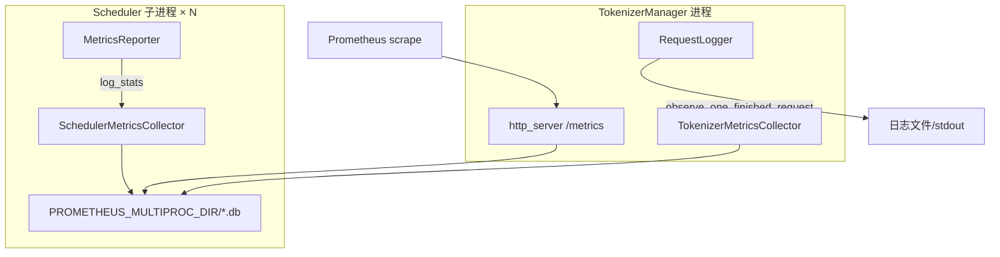
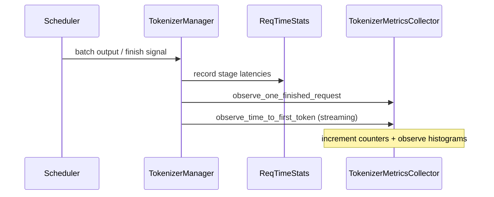

# 可观测性：数据流与交互

## 1. Metrics 上报总览

**Explain：** SGLang metrics 跨两个主进程：TokenizerManager（HTTP 入口、请求 finish histogram）与 Scheduler 子进程（aggregate gauge）。两者通过 `PROMETHEUS_MULTIPROC_DIR` 共享写入，HTTP `/metrics` 聚合 scrape。RequestLogger 走独立日志 sink，不经过 Prometheus。



---

## 2. Scheduler stats tick 数据流

**Explain：** Scheduler event loop 每个 `stats_interval` 组装 `SchedulerStats`（running/queue 长度、KV pool usage、spec accept rate 等），`MetricsReporter` 调用 `log_stats` 写入 multiprocess gauge 文件。attn_tp_rank==0 的进程负责写入，scrape 时 MultiProcessCollector 聚合。

**Code：**

```python
# 来源：python/sglang/srt/managers/scheduler.py L590-L603
    def init_metrics_collector(
        self, tp_rank: int, pp_rank: int, dp_rank: Optional[int]
    ) -> None:
        self.metrics_collector_context = SchedulerMetricsCollector.init_new(
            server_args=self.server_args,
            ps=self.ps,
            tp_rank=tp_rank,
            pp_rank=pp_rank,
            dp_rank=dp_rank,
            enable_priority_scheduling=self.enable_priority_scheduling,
            enable_lora=self.enable_lora,
            enable_hierarchical_cache=self.enable_hierarchical_cache,
        )
        self.metrics_collector = self.metrics_collector_context.collector
```

**Comment：**

- DP 多副本时各 dp_rank 可有独立 label。
- enable_metrics_for_all_schedulers 时每个 attn tp rank 均上报。

---

## 3. Scheduler → MetricsReporter 调用链

**Explain：** `MetricsReporter` 是 Scheduler 的 stats 组装与上报组件。它在 periodic stats tick 填充 `SchedulerStats`，调用 `log_stats`；在 decode iteration 做轻量 realtime token 计数。这是 Scheduler 侧 metrics 的唯一写入入口。

**Code：**

```python
# 来源：python/sglang/srt/managers/scheduler_components/metrics_reporter.py L672-L678
        if self.current_scheduler_metrics_enabled:
            decode_tokens = batch.batch_size() + num_correct_drafts
            self.metrics_collector.increment_realtime_tokens(
                # TODO unify this w/ the bumping logic in `Scheduler.num_generated_tokens` accumulator
                decode_tokens=decode_tokens,
                dp_cooperation_info=batch.dp_cooperation_info,
            )
```

**Comment：**

- decode_log_interval 控制重 stats 频率。
- SchedulerStatusLogger 并行输出人类可读日志。

---

## 4. 请求 finish metrics 链



**Explain：** TTFT 在首个 output token 返回时 observe；ITL 在 streaming 每个 chunk 按 token 数归一化；e2e 在请求完全 finish 时 observe。Abort 走单独 counter `num_aborted_requests_total`。

---

## 5. ReqTimeStats 与 Scheduler collector 分工

**Explain：** ReqTimeStats 可同时驱动 Prometheus（per_stage_req_latency_seconds）与 OpenTelemetry trace；Scheduler collector 聚焦 aggregate stats 而非单请求。两者通过 `set_metrics_collector` 绑定同一或不同 collector 实例。

**Code：**

```python
# 来源：python/sglang/srt/observability/req_time_stats.py L224-L233
class ReqTimeStatsBase:
    enable_metrics: bool = False
    metrics_collector: Optional[
        Union[SchedulerMetricsCollector, TokenizerMetricsCollector]
    ] = None
    trace_ctx: Union[TraceReqContext, TraceNullContext] = field(
        default_factory=TraceNullContext
    )
    disagg_mode: DisaggregationMode = DisaggregationMode.NULL
    diff_realtime_monotonic: float = 0.0
```

**Comment：**

- stage 枚举与 PD bootstrap/transfer 对齐。
- metrics_is_observed 控制是否 observe histogram。

---

## 6. HTTP /metrics 暴露链

**Explain：** launch_server 在创建 FastAPI app 后，若 enable_metrics 则调用 add_prometheus_middleware；此前 launch 流程已 set_prometheus_multiproc_dir。Prometheus 定期 GET `/metrics` 获取全部 `sglang:*` 指标。

**Code：**

```python
# 来源：python/sglang/srt/entrypoints/http_server.py L274-L276
    if server_args.enable_metrics:
        add_prometheus_middleware(app)
        enable_func_timer()
```

**Comment：**

- func_timer 记录函数级耗时 histogram（开发/调试用）。
- gRPC 模式 metrics 在 sidecar 端口。

---

## 7. Request logging 链

**Explain：** OpenAI serving_base 在 level≥2 时 log_openai_received_request；TokenizerManager 统一 log_received / log_finished_request。与 metrics 并行，不共享数据通路。

**Code：**

```python
# 来源：python/sglang/srt/utils/request_logger.py L94-L106
        if not self.log_requests:
            return

        max_length, skip_names, _ = self.metadata
        headers = _extract_whitelisted_headers(request)
        if self.log_requests_format == "json":
            log_data = {
                "rid": obj.rid,
                "obj": _transform_data_for_logging(obj, max_length, skip_names),
            }
            if headers:
                log_data["headers"] = headers
            log_json(self.targets, "request.received", log_data)
```

**Comment：**

- JSON format 便于 ELK/Loki 索引。
- schedule_simulator 可 load_from_request_logger 回放。

---

## 8. 与 Gateway 的边界

**Explain：** model-gateway（model-gateway）在 Rust 层暴露路由、限流、backend health 等 metrics；srt 进程内 metrics 反映 GPU 利用率、KV pool、spec 接受率等引擎内部状态。生产部署通常两者同时 scrape，dashboard 分 panel 展示。

| 维度 | srt `/metrics` | Gateway Prometheus |
|------|----------------|-------------------|
| 进程 | Python Scheduler/TM | Rust gateway |
| 典型指标 | token_usage, gen_throughput, queue_time | route latency, backend selection |
| 开启方式 | `--enable-metrics` | gateway 配置 |
| scrape 路径 | `:port/metrics` | gateway admin port |

---

## 9. weight_load 与 paused reqs（交叉 32）

**Explain：** 异步权重更新期间 Scheduler 暂停部分请求，`num_paused_reqs` gauge 上升；更新完成时 `observe_weight_load` 写入 `weight_load_duration_seconds`。IPC 路径由 checkpoint-engine 触发，详见 CheckpointEngine。

**Code：**

```python
# 来源：python/sglang/srt/observability/metrics_collector.py L1143-L1149
    def observe_weight_load(self, duration_seconds: float, source: str) -> None:
        # Edge-triggered: engine is paused during the update, so log_stats
        # won't fire — write the gauge inline at end of update_weights_from_*.
        # `source` is "disk" | "distributed" | "tensor" | "ipc".
        self.weight_load_duration_seconds.labels(**self.labels, source=source).set(
            duration_seconds
        )
```

**Comment：**

- checkpoint-engine IPC 路径 source=ipc。
- flush_cache 热更新后 prefix cache 失效，cache_hit_rate 可能骤降。
- 完整流程见 [[32-CheckpointEngine-00-MOC]] 与 [[12-ModelLoader-00-MOC]]。

---

## 10. RequestMetricsExporter 数据流

**Explain：** 若配置了 exporter，TokenizerManager finish 路径调用 exporter.write_record，把 latency/token 与请求参数写入文件。与 Prometheus 并行，适合需要完整请求快照的离线 pipeline。

**Code：**

```python
# 来源：python/sglang/srt/observability/request_metrics_exporter.py L34-L38
    def _format_output_data(
        self, obj: Union[GenerateReqInput, EmbeddingReqInput], out_dict: dict
    ) -> dict:
        """Format request-level output data containing performance metrics. This method
        should be called prior to writing the data record with `self.write_record()`."""
```

**Comment：**

- ALWAYS_EXCLUDE_FIELDS 过滤 multimodal 二进制字段。
- 具体 sink 由子类 write_record 实现。
