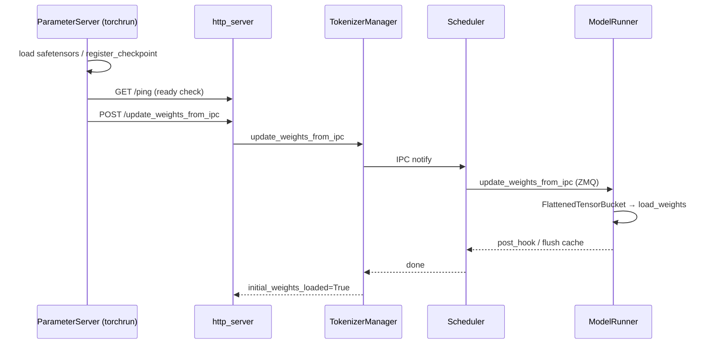
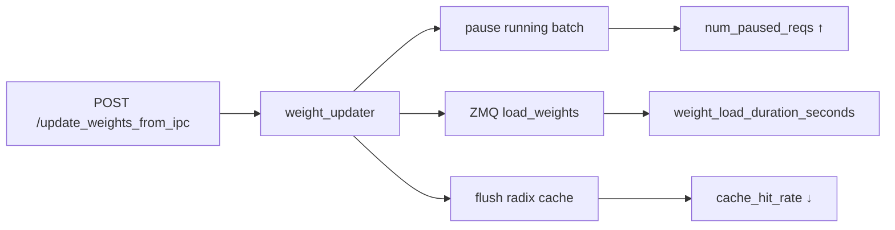

# CheckpointEngine：数据流与交互

## 1. 热更新总览

**Explain：** 外部 ParameterServer（torchrun）加载 safetensors → ZMQ 广播 flattened weights → HTTP POST 通知 srt → Scheduler IPC → ModelRunner load_weights → flush cache → initial_weights_loaded=True。整条链路跨三个进程域：训练 torchrun、HTTP TokenizerManager、GPU Scheduler。



---

## 2. wait_weights_before_ready 启动流

**Explain：** dummy 启动 → HTTP listen → `_wait_weights_ready` 阻塞 warmup → 外部 update.py torchrun → IPC 灌权重 → initial_weights_loaded → warmup → ServerStatus.Up。未灌权重则 `_wait_weights_ready` 超时 error 但不 kill 进程。

**Code：**

```python
# 来源：python/sglang/srt/entrypoints/http_server.py L2145-L2151
def _wait_and_warmup(
    server_args: ServerArgs,
    launch_callback: Optional[Callable[[], None]] = None,
    execute_warmup_func: Callable = _execute_server_warmup,
):
    if server_args.checkpoint_engine_wait_weights_before_ready:
        _wait_weights_ready()
```

**Comment：**

- 常配合 `--load-format dummy`。
- 适合 RL 训练 loop 先占 GPU 再灌权重。

---

## 3. tensor 扁平化数据流

**Explain：** 发送端：List[(name, tensor)] → flatten uint8 → cat → ZMQ 传输；接收端：metadata slice → view shape/dtype → load_weights(name, tensor)。与 distributed broadcast 路径不同，IPC 走单 buffer 大 message。

**Code：**

```python
# 来源：python/sglang/srt/weight_sync/tensor_bucket.py L53-L72
            for i, (name, tensor) in enumerate(named_tensors):
                flattened = tensor.flatten().view(torch.uint8)
                flattened_tensors[i] = flattened

                # Store metadata

                numel = flattened.numel()
                metadata_obj = FlattenedTensorMetadata(
                    name=name,
                    shape=tensor.shape,
                    dtype=tensor.dtype,
                    start_idx=current_idx,
                    end_idx=current_idx + numel,
                    numel=numel,
                )
                self.metadata[i] = metadata_obj
                current_idx += numel

            # Concatenate all flattened tensors
            self.flattened_tensor = torch.cat(flattened_tensors, dim=0)
```

**Comment：**

- supports_multi_dtypes=True 支持混合 dtype bucket。
- 与 12-ModelLoader update_weights_from_tensor 共用。

---

## 4. ZMQ handle 映射

**Explain：** ParameterServer.update 完成后回调 req_func，向 srt POST zmq_handles：key 为 GPU UUID（`GPU-{cuda uuid}`），value 为 ZMQ socket path。每个 inference_parallel rank 对应一个 handle；ModelRunner 按本卡 UUID 选取 handle。

**Code：**

```python
# 来源：python/sglang/srt/checkpoint_engine/checkpoint_engine_worker.py L77-L82
        device_uuid = self.get_device_uuid()
        device_id = self.get_device_id()
        if device_uuid not in zmq_handles:
            raise ValueError(
                f"Device UUID {device_uuid} not found in zmq_handles: {list(zmq_handles.keys())}"
            )
```

**Comment：**

- inference_parallel_size 必须与 server TP 一致。
- UUID mismatch 是最常见配置错误。

---

## 5. Scheduler pause / flush 交互

**Explain：** weight_updater 在 `_observe_weight_load` 内暂停 running batch，更新完成后 flush radix cache（若 flush_cache=True），TP barrier 同步。期间 num_paused_reqs metrics 上升。

**Code：**

```python
# 来源：python/sglang/srt/managers/scheduler_components/weight_updater.py L166-L174
    def update_weights_from_ipc(self, recv_req: UpdateWeightsFromIPCReqInput):
        """Update the online model parameter from IPC for checkpoint-engine integration."""
        with self._observe_weight_load("ipc"):
            success, message = self.tp_worker.update_weights_from_ipc(recv_req)
            tp_success = success
            if success and self.draft_worker is not None:
                success, message = self.draft_worker.update_weights_from_ipc(recv_req)
            if tp_success:
                self.flush_cache_after_weight_update(recv_req)
```

**Comment：**

- EAGLE 场景 draft_worker 也需同步更新。
- metrics 见 [[31-Observability-03-数据流与交互|31-Observability]] §9。

---

## 6. 与 Observability 交互

**Explain：** 更新期间 `num_paused_reqs` 上升；完成后 `weight_load_duration_seconds{source="ipc"}` 记录耗时。flush 后 `cache_hit_rate` 骤降属预期。监控 dashboard 应分 panel 展示热更新事件。



---

## 7. 与 12-ModelLoader 边界

| 能力 | 12-ModelLoader | 32-CheckpointEngine |
|------|----------------|---------------------|
| 冷启动 load | ✓ disk/HF | dummy + wait |
| 热更新 disk | update_weights_from_disk | |
| 热更新 distributed | update_weights_from_distributed | |
| 热更新 IPC | weight_sync 共用 bucket | ✓ checkpoint-engine 协议 |
| tensor_bucket | ✓ | ✓ 本模块详解 |
| flush_cache | weight_updater 共用 | ✓ 默认 true |

---

## 8. update.py 两种 update_method

**Explain：** broadcast（默认）不设置 ranks，p2p 指定 inference_parallel rank 列表；all 两种都跑用于测试。p2p 前 sleep 2s 等待 destroy process group。

**Code：**

```python
# 来源：python/sglang/srt/checkpoint_engine/update.py L161-L172
    if update_method == "broadcast" or update_method == "all":
        with timer("Update weights without setting ranks"):
            ps.update(checkpoint_name, req_func)

    if update_method == "p2p" or update_method == "all":
        if update_method:
            # sleep 2s to wait destroy process group
            time.sleep(2)
        with timer("Update weights with setting ranks"):
            ps.update(
                checkpoint_name, req_func, ranks=list(range(inference_parallel_size))
            )
```

**Comment：**

- 与 TP 组网需 inference_parallel_size 一致。
- join 模式可 load 预存 metas 跳过 gather。

---

## 9. TokenizerManager IPC 转发

**Explain：** HTTP 层 async 调用 tokenizer_manager.update_weights_from_ipc，经 communicator 广播到各 Scheduler 子进程，等待全部 rank 返回后聚合 success/message。

**Comment：**

- 与 update_weights_from_disk 共用 model_update_lock 语义。
- admin auth 可选（AuthLevel.ADMIN_OPTIONAL）。

---

## 10. 典型部署拓扑

**Explain：** 一终端 launch_server（dummy + wait_weights）；另一终端 torchrun update.py（nproc = inference_parallel_size）。endpoint 默认 `http://127.0.0.1:<port>`；uds 模式走 unix socket transport。

**Code（用法注释）：**

```python
# 来源：python/sglang/srt/checkpoint_engine/update.py L1-L10
"""
Usage:
1) Launch the server with wait-for-initial-weights option in one terminal:
   python -m sglang.launch_server --model-path /workspace/Qwen/Qwen3-4B/ --tensor-parallel-size 2 --port 19730 --load-format dummy --checkpoint-engine-wait-weights-before-ready --mem-fraction-static 0.7

2) Torchrun this script in another terminal:
    torchrun --nproc-per-node 2 update.py --update-method broadcast --checkpoint-path /workspace/Qwen/Qwen3-4B/  --inference-parallel-size 2

Or use the integrated entry point:
    python -m sglang.srt.checkpoint_engine.update --update-method broadcast --checkpoint-path /workspace/Qwen/Qwen3-4B/  --inference-parallel-size 2
```

**Comment：**

- mem-fraction-static 需在 dummy 启动时预留足够 GPU 内存。
- weight_version 可选追踪版本号。
