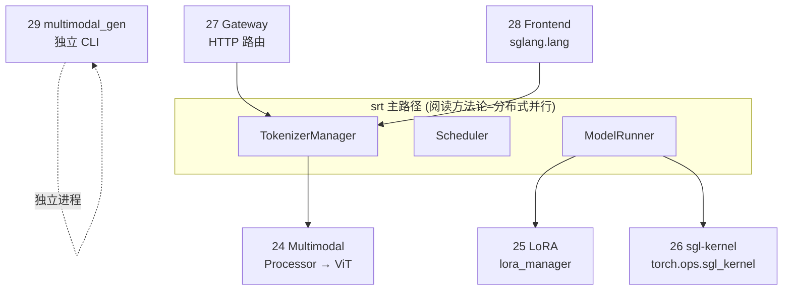

# 阶段 VI · 扩展组件（Multimodal–multimodal_gen）

> **你只需阅读本目录，不必打开 `sglang/` 源码。** 
> 内嵌代码对应 sglang Git commit `70df09b`。

---

## 本阶段解决什么问题

阶段 I–V 覆盖标准 LLM text serving 主路径。阶段 VI 回答：**多模态、LoRA、底层 kernel、Gateway 路由、Frontend DSL、扩散模型** 如何作为可选扩展挂载到同一 Runtime？

| 模块 | 模块 | 一句话 |
|------|------|--------|
| [[24-Multimodal-00-MOC|24 Multimodal]] | VLM | Processor 注册、ViT、特殊 token |
| [[25-LoRA-00-MOC|25 LoRA]] | 动态 LoRA | LoRAAdapter、MemoryPool、eviction |
| [[26-sgl-kernel-00-MOC|26 sgl-kernel]] | CUDA 算子 | attention / MoE / quant custom op |
| [[27-model-gateway-00-MOC|27 model-gateway]] | 路由网关 | PD 池、负载均衡、Rust gateway |
| [[28-Frontend-lang-00-MOC|28 Frontend lang]] | 编程接口 | `@function`、控制流、Remote |
| [[29-multimodal_gen-00-MOC|29 multimodal_gen]] | 扩散 runtime | 独立 diffusion 子系统 |

---

## 扩展组件与 srt 主路径关系



**Explain：** 24/25 深度集成在 srt 内（TokenizerManager mixin、ModelRunner layer）。26 被 srt 层 import 调用，本身无 Python 推理逻辑。27 是集群前置路由，对 client 暴露统一 endpoint。28 是客户端 SDK，通过 HTTP 调 srt。29 与 LLM serving 并行，共用 monorepo 但启动路径不同（见 02 启动链路 diffusion 分支）。

**Code：**

```python
# 来源：python/sglang/srt/lora/lora_manager.py L98-L115
        # LoRA backend for running sgemm kernels
        logger.info(f"Using {lora_backend} as backend of LoRA kernels.")
        backend_type = get_backend_from_name(lora_backend)
        self.lora_backend: BaseLoRABackend = backend_type(
            max_loras_per_batch=max_loras_per_batch,
            device=self.device,
            server_args=server_args,
        )

        # Initialize mutable internal state of the LoRAManager.
        self.init_state(
            max_lora_rank=max_lora_rank,
            target_modules=target_modules,
            lora_paths=lora_paths,
        )

    def init_cuda_graph_batch_info(
        self, max_bs_in_cuda_graph: int, num_tokens_per_bs: int
```

**Comment：**

- 动态加载不重启 server；MemoryPool 满时 eviction（见 25 走读）。
- API 层 `/load_lora_adapter` 最终调到此 manager。
- MoE 模型有专用 LoRA backend 路径（25 关键问题）。

---

## 零基础一句话

**像餐厅周边业务：** 24 是图片菜单，25 是临时特色菜，26 是中央厨房设备厂，27 是外卖平台分流，28 是会员 APP，29 是另一家烘焙坊（扩散）共用物业。

---

## 推荐阅读顺序

| 顺序 | 文档 | 必读理由 |
|------|------|----------|
| 1 | [[24-Multimodal-03-数据流与交互|24/03-数据流与交互]] | VLM 全链路 |
| 2 | [[25-LoRA-02-源码走读|25/02-源码走读]] | load / forward 集成 |
| 3 | [[26-sgl-kernel-01-核心概念|26/01-核心概念]] | 算子分层与 dispatch |
| 4 | [[27-model-gateway-03-数据流与交互|27/03-数据流与交互]] | PD 路由 |
| 5 | [[28-Frontend-lang-02-源码走读|28/02-源码走读]] | IR 与 backend |
| 6 | [[29-multimodal_gen-01-核心概念|29/01-核心概念]] | 与 srt 边界 |

---

## 阶段衔接

| 方向 | 模块 | 衔接点 |
|------|------|--------|
| ← 上一阶段 | 20–23、31–32 | 22 PD 与 27 Gateway；19 量化与 26 kernel |
| → 收官 | 30 | [[07-总结与索引-00-MOC]] onboarding |
| → 排障 | — | [[09-生产排障速查]] 多模态/LoRA 章节 |

---

## 验证建议（零基础可试）

1. **LoRA：** `/load_lora_adapter` 后带 `lora_path` 请求，对比 base 输出差异。
2. **VLM：** 带 image_url 的 chat 请求，日志应有 multimodal processor 路径。
3. **Gateway：** 本地起 prefill+decode 双节点 + gateway，观察 routing_key（27）。

---

## 模块导航

| 模块 | 目录 | 五件套 |
|------|------|--------|
| 24 | [[24-Multimodal-00-MOC|Multimodal]] | ✅ |
| 25 | [[25-LoRA-00-MOC|LoRA]] | ✅ |
| 26 | [[26-sgl-kernel-00-MOC|sgl-kernel]] | ✅ |
| 27 | [[27-model-gateway-00-MOC|model-gateway]] | ✅ |
| 28 | [[28-Frontend-lang-00-MOC|Frontend lang]] | ✅ |
| 29 | [[29-multimodal_gen-00-MOC|multimodal_gen]] | ✅ |

← [[05-高级特性-00-MOC|高级特性]] · → [[07-总结与索引-00-MOC|阶段 VII：总结与索引]]
