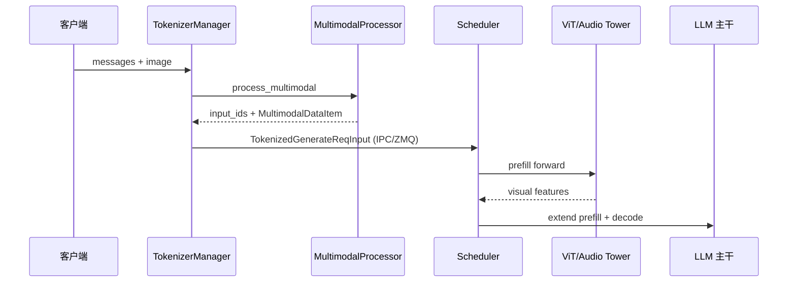

# Multimodal · 核心概念

## 用户故事

**Persona：** 产品运营小陈，在客服后台上传商品截图，问「这是什么」。峰值 200 QPS，VLM 首 token 延迟是体验红线。

**时间线：**

| 时刻 | 事件 |
|------|------|
| T0 | HTTP 请求到达 TokenizerManager；Processor 解码 JPEG、resize，展开 image placeholder token |
| T1 | 若开启 CUDA IPC，pixel tensor 经 `CudaIpcTensorTransportProxy` 跨进程传给 Scheduler，无 D2H 拷贝 |
| T2 | Scheduler prefill 跑 ViT forward，visual embedding 与 text embedding 拼接进入 LLM 主干 |
| T3 | decode 阶段与普通文本相同，prefix 中 image token 对应 KV 已就绪 |

**涉及模块：**



**Explain：** VLM 推理分三阶段：(1) Processor 将媒体转为 embedding 或 placeholder token；(2) ViT/Audio Tower forward 产生 visual/audio features；(3) LLM 主干与 text token 拼接后走正常 Scheduler。Multimodal 模块负责 (1) 与部分 (2) 的预处理。与纯文本路径相比，额外开销主要在 ViT forward 与跨进程 feature 传输。

**Code：**

```python
# 来源：python/sglang/srt/multimodal/processors/base_processor.py L473-L482
        if not self.server_args.keep_mm_feature_on_device:
            # move feature tensors to cpu
            for feature_name in self.FEATURE_NAMES:
                if SGL_USE_CUDA_IPC:
                    pass
                else:
                    if feature_name in result and isinstance(
                        result[feature_name], torch.Tensor
                    ):
                        result[feature_name] = result[feature_name].to("cpu")
```

### 如果…会怎样（调试）

| 现象 | 可能原因 | 排查 |
|------|----------|------|
| TTFT 高但 decode 正常 | ViT prefill 或 IPC fallback 到 CPU | 设 `SGLANG_USE_CUDA_IPC_TRANSPORT=1`，看 pool 配额 |
| 图像 token 错位 | placeholder 数与 patch 数不一致 | 检查 Processor `build()` regex 展开 |
| 多 worker OOM | `keep_mm_feature_on_device=True` | 对比 `--keep-mm-feature-on-device` |

---

## 1. 多模态在 SGLang 中的位置

**Explain：** 多模态路径从 TokenizerManager 的 Processor 开始，经 Scheduler prefill 调用 ViT，再进入 LLM RadixAttention。HTTP 层只传 messages 与 media URL/base64，具体 tensor 形态由 `MultimodalDataItem` 承载。

---

## 2. Modality 与数据结构

**Explain：** `schedule_batch.py` 定义 `Modality` 枚举（IMAGE/VIDEO/AUDIO）与 `MultimodalDataItem`，承载 pixel values、grid_thw、audio waveform 等。每条请求可携带多种模态，`MultimodalDataItem` 在 Scheduler 侧与 `Req` 绑定，供 prefill 时按序消费。Processor 输出经 `organize_results()` 按 IMAGE → VIDEO → AUDIO 顺序展开，保证 placeholder 与 feature 一一对齐。

**Code：**

```python
# 来源：python/sglang/srt/multimodal/processors/base_processor.py L48-L81
@dataclasses.dataclass
class BaseMultiModalProcessorOutput:
    # input_text with all multimodality placeholder token expanded
    input_text: str

    # original pre-tokenized ids, useful for processor_output/precomputed inputs,
    # when they already carry the input ids
    input_ids: Optional[Union[List[int], torch.Tensor]] = None

    # frames loaded from image, in given order
    images: Optional[list[Union[Image.Image, dict]]] = dataclasses.field(
        default_factory=list
    )

    # videos
    videos: Optional[list[Union[torch.Tensor, dict]]] = dataclasses.field(
        default_factory=list
    )

    # audios
    audios: Optional[list[Union[np.ndarray, dict]]] = dataclasses.field(
        default_factory=list
    )

    def organize_results(self) -> List[Tuple[Modality, Any]]:
        """

        :return: a list of results, with their corresponding modalities
        """
        return (
            [(Modality.IMAGE, data) for data in self.images]
            + [(Modality.VIDEO, data) for data in self.videos]
            + [(Modality.AUDIO, data) for data in self.audios]
        )
```

**Comment：** `organize_results` 按模态顺序展开，供后续 pad input_ids 与 feature 对齐。

---

## 3. MultimodalSpecialTokens

**Explain：** 各 VLM 用不同 placeholder（如 `<|image_pad|>`）；Processor 在 `build()` 中编译 regex，将文本中的 placeholder 展开为正确数量的 image token。不同模型的 placeholder 字符串与 token_id 可能不同，`MultimodalSpecialTokens` 同时保存 string 与 id 双轨，避免仅靠字符串匹配时 tokenizer 版本不一致。`combined_regex` 一次扫描多种模态 placeholder，减少多次 regex pass 的开销。

**Code：**

```python
# 来源：python/sglang/srt/multimodal/processors/base_processor.py L84-L98
@dataclasses.dataclass
class MultimodalSpecialTokens:
    image_token: Optional[Union[str, List[str]]] = None
    video_token: Optional[Union[str, List[str]]] = None
    audio_token: Optional[Union[str, List[str]]] = None

    image_token_id: Optional[int] = None
    video_token_id: Optional[int] = None
    audio_token_id: Optional[int] = None

    image_token_regex: Optional[re.Pattern] = None
    video_token_regex: Optional[re.Pattern] = None
    audio_token_regex: Optional[re.Pattern] = None

    combined_regex: Optional[re.Pattern] = None
```

**Comment：** token_id 与 string 双轨支持；combined_regex 一次扫描多种模态 placeholder。

---

## 4. Processor 注册机制

**Explain：** `import_processors("sglang.srt.multimodal.processors")` 动态 import 各模型 Processor，以 `models` 类属性映射到架构名。启动时扫描包内所有 `BaseMultimodalProcessor` 子类，无需手工维护注册表。`get_mm_processor(model_arch)` 按模型架构名查表，找不到则 fallback 到通用路径或报错。

**Code：**

```python
# 来源：python/sglang/srt/managers/multimodal_processor.py L16-L41
def import_processors(package_name: str, overwrite: bool = False):
    package = importlib.import_module(package_name)
    for _, name, ispkg in pkgutil.iter_modules(package.__path__, package_name + "."):
        if not ispkg:
            try:
                module = importlib.import_module(name)
            except Exception as e:
                logger.warning(f"Ignore import error when loading {name}: {e}")
                continue
            all_members = inspect.getmembers(module, inspect.isclass)
            classes = [
                member
                for name, member in all_members
                if member.__module__ == module.__name__
            ]
            for cls in (
                cls for cls in classes if issubclass(cls, BaseMultimodalProcessor)
            ):
                assert hasattr(cls, "models")
                for arch in getattr(cls, "models"):
                    if overwrite:
                        for model_cls, processor_cls in PROCESSOR_MAPPING.items():
                            if model_cls.__name__ == arch.__name__:
                                del PROCESSOR_MAPPING[model_cls]
                                break
                    PROCESSOR_MAPPING[arch] = cls
```

**Comment：** import 失败仅 warning，避免可选依赖拖垮启动；新 VLM 只需新增 processor 文件并声明 `models`。

---

## 5. 设计追问

**Explain：** 多模态路径的性能瓶颈常在「Processor → Scheduler」之间的 tensor 搬运与 GPU 显存占用。`keep_mm_feature_on_device` 与 CUDA IPC 是两条正交优化轴：前者决定 feature 是否留在 GPU，后者决定跨进程时走 IPC handle 还是序列化 tensor。部署时需按 tokenizer worker 数量、显存预算与进程拓扑一并权衡。

**追问：`keep_mm_feature_on_device` 取舍**

| 开启 | 关闭（默认） |
|------|-------------|
| feature 留在 GPU，省 D2H 拷贝 | Processor 输出 `.to("cpu")`，Scheduler 侧再 H2D |
| tokenizer worker 占用 GPU 显存 | CPU 侧缓冲，GPU 显存压力小 |
| 适合单卡、低并发、feature 复用 | 适合多 worker、显存紧张 |

**Code：**

```python
# 来源：python/sglang/srt/server_args.py L2547-L2550
    keep_mm_feature_on_device: A[
        bool,
        "Keep multimodal feature tensors on device after processing to save D2H copy.",
    ] = False
```

```python
# 来源：python/sglang/srt/multimodal/processors/base_processor.py L473-L482
        if not self.server_args.keep_mm_feature_on_device:
            # move feature tensors to cpu
            for feature_name in self.FEATURE_NAMES:
                if SGL_USE_CUDA_IPC:
                    pass
                else:
                    if feature_name in result and isinstance(
                        result[feature_name], torch.Tensor
                    ):
                        result[feature_name] = result[feature_name].to("cpu")
```

**追问：ZMQ vs CUDA IPC**

| 通道 | 传什么 | 适用场景 |
|------|--------|----------|
| ZMQ（默认 IPC 名） | 请求 metadata、input_ids、小 payload | TokenizerManager ↔ Scheduler 控制面 |
| CUDA IPC | GPU tensor 指针 + pool handle，无 D2H/H2D | 大 feature tensor 跨进程（`SGLANG_USE_CUDA_IPC_TRANSPORT=1`） |

**Explain：** ZMQ 负责进程间消息投递（`tokenizer_ipc_name` / `scheduler_input_ipc_name`），payload 通常是 pickle 后的 Python 对象；开启 CUDA IPC 时，大 tensor 本体不随 ZMQ 序列化，只传 `CudaIpcTensorTransportProxy` 的 handle，Scheduler 侧在 GPU 上直接映射同一块显存。关闭 IPC 时 ZMQ 传 CPU tensor，Scheduler 再 `.cuda()`，延迟更高但无 pool 配额限制。

**Comment：** `MmItemMemoryPool` 按 `tokenizer_worker_num` 均分 `SGLANG_MM_FEATURE_CACHE_MB` 预算；多 worker 时单 worker pool 变小，IPC 命中失败会 fallback 到 CPU 路径。

---

## 6. CUDA IPC Transport

**Explain：** 大 feature tensor 跨进程（TokenizerManager → Scheduler）可走 CUDA IPC，避免 D2H/H2D 拷贝。IPC pool 在 Processor 初始化时按 worker 数分配，tensor wrap 后随 ZMQ 消息传递 proxy 对象。Scheduler 收到 proxy 后解引用 GPU 指针，ViT forward 直接消费 device 侧 feature。

**Code：**

```python
# 来源：python/sglang/srt/multimodal/processors/base_processor.py L33-L38
from sglang.srt.utils.cuda_ipc_transport_utils import (
    MM_FEATURE_CACHE_SIZE,
    MM_ITEM_MEMORY_POOL_RECYCLE_INTERVAL,
    CudaIpcTensorTransportProxy,
    MmItemMemoryPool,
)
```

**Comment：** `MmItemMemoryPool` 复用 feature 缓冲；`SGLANG_USE_IPC_POOL_HANDLE_CACHE` 缓存 handle。
