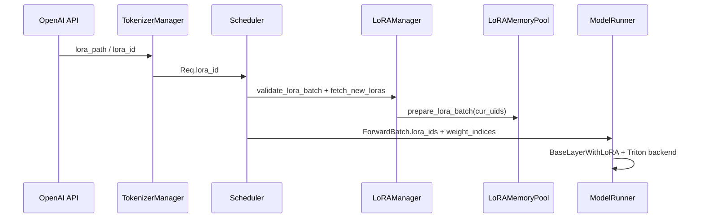

# LoRA · 核心概念

## 用户故事

### Persona

**林薇**，B2B SaaS 平台的 ML 工程师。平台为 200+ 企业客户提供同一基座 Llama-3-8B，每客户微调独立 LoRA adapter（客服话术、行业术语、合规过滤）。网关按 `lora_id` 路由，Scheduler 需在**同一 forward batch** 内混合最多 8 个 adapter，避免为每租户起独立进程。

### 时间线

| 时刻 | 事件 |
|------|------|
| T0 | 8 个租户请求同时到达；`ForwardBatch.lora_ids` 含 8 个不同 uid |
| T1 | `LoRAManager.validate_lora_batch` 校验 slot 数 ≤ `max_loras_per_batch` |
| T2 | `fetch_new_loras` → `memory_pool.prepare_lora_batch` 将权重写入 GPU 槽位 |
| T3 | Triton CSGMV 按 `weight_indices` 批处理；每 token 映射到对应 adapter |
| T4 | LRU eviction 踢出冷 adapter；RadixCache `extra_key` 含 lora_id，前缀不跨租户误共享 |

### 涉及模块



**Explain：** 请求携带 `lora_id` 进入 Scheduler 后，`LoRAManager` 在 forward 前把 batch 内活跃 uid 映射到 `LoRAMemoryPool` 槽位。`prepare_lora_batch` 设置 `weight_indices`，Triton backend 一次 kernel 覆盖多 adapter，实现 S-LoRA / Punica 风格多租户批处理。RadixAttention 的 `extra_key` 必须含 lora namespace，否则不同 adapter 会错误共享 KV 前缀。

**Code：**

```python
# 来源：python/sglang/srt/lora/lora_manager.py L273-L338
    def validate_lora_batch(self, lora_ids: set[Optional[str]]) -> bool:
        """
        Validate if the LoRA IDs in the batch can be loaded into the current LoRA memory pool.
        """
        if len(lora_ids) > self.max_loras_per_batch:
            return False

        # skip pinned LoRA check if no pinned LoRA adapters are loaded.
        if self.num_pinned_loras == 0:
            return True

        # counting the number of pinned LoRA adapters in the batch.
        pinned_loras_in_batch = 0
        for lora_id in lora_ids:
            if lora_id is not None:
                lora_ref = self.lora_refs.get(lora_id)
                assert (
                    lora_ref is not None
                ), f"LoRA ID {lora_id} not found in lora_refs."
                pinned_loras_in_batch += int(lora_ref.pinned)

        assert pinned_loras_in_batch <= self.num_pinned_loras, (
            f"Number of pinned LoRA adapters in the batch ({pinned_loras_in_batch}) exceeds the total number of pinned adapters "
            f"({self.num_pinned_loras}). This indicates a bug in the LoRA loading logic."
        )

        required_slots = len(lora_ids) - pinned_loras_in_batch
        mem_pool_vacancy = self.memory_pool.max_loras_per_batch - self.num_pinned_loras

        return required_slots <= mem_pool_vacancy

    def fetch_new_loras(
        self, new_loras: set[Optional[str]], running_loras: set[Optional[str]] = set()
    ):
        # Load active loras into lora memory pool
        cur_uids = new_loras | running_loras

        assert len(cur_uids) <= self.max_loras_per_batch
        self.memory_pool.prepare_lora_batch(
            cur_uids=cur_uids,
            lora_adapters=self.loras,
            lora_modules=self.lora_modules,
            lora_refs=self.lora_refs.copy(),  # copy snapshot of current lora_refs to avoid mutation during the batch preparation.
            lora_embed_tokens_module=self.embed_tokens_module,  # merge into embedding or lora module
            lora_lm_head_module=self.lm_head_module,  # merge into embedding or lora module
        )

    def prepare_lora_batch(self, forward_batch: ForwardBatch):
        # set up batch info shared by all lora modules
        bs = forward_batch.batch_size

        use_cuda_graph = (
            hasattr(self, "max_bs_in_cuda_graph")
            and bs <= self.max_bs_in_cuda_graph
            and forward_batch.forward_mode.is_cuda_graph()
        )

        weight_indices = [0] * len(forward_batch.lora_ids)
        lora_ranks = [0] * self.max_loras_per_batch
        scalings = [0] * self.max_loras_per_batch
        for i, uid in enumerate(forward_batch.lora_ids):
            if uid not in self.memory_pool.uid_to_buffer_id:
                continue
            weight_indices[i] = self.memory_pool.get_buffer_id(uid)
            if uid is not None:
                lora = self.loras[uid]
```

```python
# 来源：python/sglang/srt/lora/lora_manager.py L304-L318
    def fetch_new_loras(
        self, new_loras: set[Optional[str]], running_loras: set[Optional[str]] = set()
    ):
        # Load active loras into lora memory pool
        cur_uids = new_loras | running_loras

        assert len(cur_uids) <= self.max_loras_per_batch
        self.memory_pool.prepare_lora_batch(
            cur_uids=cur_uids,
            lora_adapters=self.loras,
            lora_modules=self.lora_modules,
            lora_refs=self.lora_refs.copy(),  # copy snapshot of current lora_refs to avoid mutation during the batch preparation.
            lora_embed_tokens_module=self.embed_tokens_module,  # merge into embedding or lora module
            lora_lm_head_module=self.lm_head_module,  # merge into embedding or lora module
        )
```

**Comment：**

- `--max-loras-per-batch 8` 与 SaaS 并发租户上限对齐；超出时 batch 拆分或排队。
- `fetch_new_loras` 合并 new 与 running uid，保证 batch 内 adapter 权重已在 pool。
- eviction 后该 uid 下次请求需 reload 权重，短时 TTFT 上升。
- MoE 基座走 `FusedMoEWithLoRA`，slot 逻辑与 Linear 层相同。
- API 层通过 `lora_path` 动态注册 adapter，无需重启 base model。

### 如果…会怎样（调试）

| 现象 | 可能原因 | 排查 |
|------|----------|------|
| `No available buffer slots` | batch 内 adapter 数 > max_loras_per_batch | 调大 `--max-loras-per-batch` 或限流 |
| 租户 A 输出像租户 B | RadixCache extra_key 未含 lora_id | 对比 `GenerateReqInput.extra_key` |
| 冷 adapter 首请求慢 | LRU evict 后 reload | 对 VIP 租户设 `pinned=True` |
| Triton fallback 到 torch | rank 超限或 dtype 不匹配 | 日志 `Using triton as backend` |

---

## 1. 多 LoRA 服务模型
**Explain：** 每个请求可指定不同 LoRA adapter（uid）；同一 batch 内多个 adapter 并行计算，通过 **批索引** 将 token 映射到对应 LoRA 权重槽位。权重驻留 GPU `LoRAMemoryPool`，按 LRU 等策略 eviction。设计参考 S-LoRA 与 Punica 的多租户批处理，与 vLLM 单 adapter 模式相比，SGLang 默认面向多租户 serving。

---

## 2. LoRAConfig 与 LoRAAdapter

**Explain：** `LoRAConfig` 从 `adapter_config.json` 读取 r、alpha、target_modules；`LoRAAdapter` 加载权重并 normalize QKV/gate_up 等命名。

**Code：**

```python
# 来源：python/sglang/srt/lora/lora_config.py L25-L45
class LoRAConfig:
    def __init__(
        self,
        path: Optional[str] = None,
        config_dict: Optional[Dict] = None,
        added_tokens_config: Optional[Dict] = None,
        base_vocab_size: Optional[int] = None,
    ) -> None:
        self.path = path

        if config_dict is not None:
            self.hf_config = config_dict
            self.added_tokens_config = added_tokens_config
        else:
            self.hf_config = self.get_lora_config()
            self.added_tokens_config = self.get_added_tokens_config()

        self.target_modules = self.hf_config["target_modules"]
        self.r = self.hf_config["r"]
        self.lora_alpha = self.hf_config["lora_alpha"]
        self.use_dora = self.hf_config.get("use_dora", False)
```

**Comment：** `added_tokens.json` 可选；fake added token（id < base_vocab_size）会被过滤。

---

## 3. LoRAMemoryPool

**Explain：** 预分配 `(max_loras_per_batch, num_layers, ...)` 形状 GPU buffer；adapter load/unload 写入槽位；`EMPTY_SLOT` 表示空闲。

**Code：**

```python
# 来源：python/sglang/srt/lora/mem_pool.py L52-L69
class EmptySlot:
    """
    Singleton class to represent an empty slot in the memory pool.
    This is used to improve readability by not using special str as a placeholder.
    """

    __slots__ = ()

    def __repr__(self):
        return "|EMPTY|"

    def __new__(cls):
        if not hasattr(cls, "_instance"):
            cls._instance = super().__new__(cls)
        return cls._instance


EMPTY_SLOT = EmptySlot()
```

**Comment：** Pool 按层类型（ColumnParallel、QKV、MoE expert）分 buffer；TP/EP rank 各持分片。

---

## 4. Eviction Policy

**Explain：** 当活跃 adapter 数超过 pool 容量，按 LRU（默认）或配置策略 evict 权重，保留 base model 槽（uid=None）。

**Code：**

```python
# 来源：python/sglang/srt/lora/eviction_policy.py L47-L71
class LRUEvictionPolicy(EvictionPolicy):
    """LRU eviction policy - evicts the least recently used adapter."""

    def __init__(self):
        self.access_order = OrderedDict()  # key=uid, value=last_access_time
        self.total_accesses = 0
        self.eviction_count = 0

    def mark_used(self, uid: Optional[str]) -> None:
        if uid is not None:
            current_time = time.monotonic()
            # Remove and re-add to move to end (most recent)
            self.access_order.pop(uid, None)
            self.access_order[uid] = current_time
            self.total_accesses += 1
            logger.debug(f"LoRA {uid} marked as used at {current_time}")

    def select_victim(self, candidates: Set[Optional[str]]) -> Optional[str]:
        """Select the least recently used adapter from candidates."""
        # Iterate through access_order (oldest first) to find LRU victim
        for uid in list(self.access_order.keys()):
            if uid in candidates:
                logger.debug(f"Selected LoRA {uid} for eviction (LRU)")
                self.eviction_count += 1
                return uid
```

**Comment：** `get_eviction_policy(server_args.lora_eviction_policy)` 工厂创建；evict 后需重新 load 权重才能服务该 uid。

---

## 5. Backend 分层

| Backend | 路径 | 特点 |
|---------|------|------|
| triton | backend/triton_backend.py | 默认，CSGMV 批 kernel |
| torch | backend/torch_backend.py | 回退 / 调试 |
| chunked | backend/chunked_backend.py | 大 rank 分块 |
| ascend | backend/ascend_backend.py | NPU |

**Explain：** `BaseLoRABackend` 定义 `run_lora_a_sgemm` / `run_lora_b_sgemm`；layers 调用 backend 而非直接 triton。

**Code：**

```python
# 来源：python/sglang/srt/lora/lora_manager.py L98-L100
        # LoRA backend for running sgemm kernels
        logger.info(f"Using {lora_backend} as backend of LoRA kernels.")
        backend_type = get_backend_from_name(lora_backend)
```

**Comment：** `--lora-backend triton|torch|...` 由 ServerArgs 传入。
