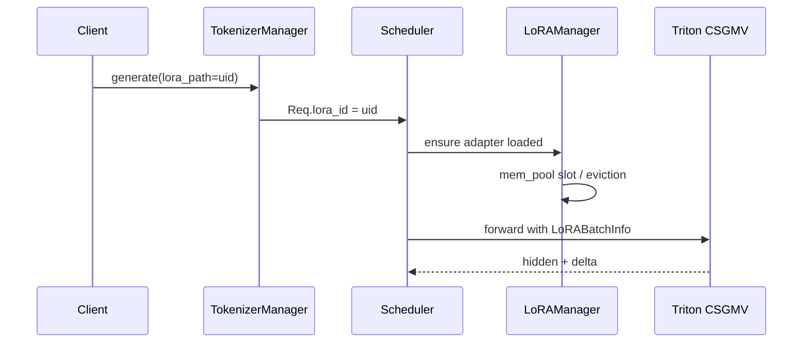

# LoRA：数据流与交互

## 1. 请求级 LoRA 数据流



---

## 2. ForwardBatch 中的 LoRA 元数据

**Explain：** `ForwardBatch` 携带 `lora_ids` 或等价 batch_info，每层 `apply_lora` 根据 token→adapter 映射选 buffer 行。

**Code：**

```python
# 来源：python/sglang/srt/lora/layers.py L142-L161
    def run_lora_a_embedding(
        self, input_: torch.Tensor, batch_info: LoRABatchInfo
    ) -> torch.Tensor:
        """
        Apply LoRA A weights using efficient embedding lookup with CUDA graph support.
        Maps tokens to their corresponding LoRA adapters internally.
        It also includes added/extra token processing.
        """
        # Efficient embedding lookup for LoRA A (already support extra token embedding process)
        lora_a_output = self.lora_backend.run_lora_a_embedding(
            input_ids=input_,
            weights=self.embedding_A_buffer,
            vocab_size=self.vocab_size,
            extra_embeddings=(
                self.new_embeddings_buffer
                if hasattr(self, "new_embeddings_buffer")
                and self.new_embeddings_buffer is not None
                else None
            ),
        )
```

**Comment：** Linear 层用 shrink/expand 两阶段；embedding 用 lookup 替代 shrink。

---

## 3. 启动时静态加载

| 来源 | 配置 | 行为 |
|------|------|------|
| CLI | `--lora-paths uid=path` | init 时 load 进 pool |
| API | `/load_lora_adapter` | 运行时 load |
| eviction | LRU | 超容量 evict |

**Explain：** `lora_paths: List[LoRARef]` 传入 LoRAManager 构造函数，在 `init_lora_modules` 之后 load。

**Code：**

```python
# 来源：python/sglang/srt/lora/lora_manager.py L71-L72
        lora_paths: Optional[List[LoRARef]] = None,
    ):
```

**Comment：** 动态 load 路径相同，经 `load_lora_adapter` 方法写 pool 并 `set_lora_info`。

---

## 4. 与 TP 的交互

**Explain：** LoRA A/B 权重按 TP rank 分片；`tp_rank` / `tp_size` 传入 Manager，load 时只加载本分片。

**Code：**

```python
# 来源：python/sglang/srt/lora/lora_manager.py L67-L68
        tp_size: int = 1,
        tp_rank: int = 0,
```

**Comment：** ColumnParallel 与 RowParallel 层 shard 规则与 base 层一致；错误 shard 导致数值偏差。

---

## 5. MoE + LoRA 数据流

**Explain：** Router 选 expert 后，expert 权重加 LoRA delta；virtual experts 将多 adapter 映射到扩展 expert 维。

**Code：**

```python
# 来源：python/sglang/srt/lora/triton_ops/fused_moe_lora_kernel.py L410-L518
@torch.inference_mode()
def _fused_moe_lora(
    output: torch.Tensor,  # (num_tokens, top_k_num, N*len(lora_a_stacked),)
    qcurr_hidden_states: torch.Tensor,  # (num_tokens, K,)
    lora_a_stacked: list[
        torch.Tensor
    ],  # [(max_loras, num_experts, max_lora_rank, K,),...]
    lora_b_stacked: list[
        torch.Tensor
    ],  # [(max_loras, num_experts, N, max_lora_rank,),...]
    topk_weights: torch.Tensor,  # (num_tokens, top_k_num)
    sorted_token_ids: torch.Tensor,  # (max_loras, _)
    expert_ids: torch.Tensor,  # (max_loras, _ ,)
    num_tokens_post_padded: torch.Tensor,  # (max_loras, )
    max_lora_rank: int,
    top_k_num: int,
    lora_ids: torch.Tensor,
    adapter_enabled: torch.Tensor,
    shrink_block_size_m: int,
    shrink_block_size_n: int,
    shrink_block_size_k: int,
    shrink_group_size_m: int,
    shrink_num_warps: int,
    shrink_num_stages: int,
    shrink_split_k: int,
    expand_block_size_m: int,
    expand_block_size_n: int,
    expand_block_size_k: int,
    expand_group_size_m: int,
    expand_num_warps: int,
    expand_num_stages: int,
    expand_split_k: int,
    mul_routed_weight: bool = False,
    fully_sharded: bool = False,
    offset: int = 0,
) -> None:
    assert len(lora_a_stacked) == len(lora_b_stacked) > 0
    assert (
        sorted_token_ids.dim()
        == expert_ids.dim()
        == topk_weights.dim()
        == qcurr_hidden_states.dim()
        == 2
    )
    assert (
        sorted_token_ids.shape[0]
        == expert_ids.shape[0]
        == num_tokens_post_padded.shape[0]
    )
    assert output.shape[0] == topk_weights.shape[0]
    assert top_k_num == topk_weights.shape[1]
    device = qcurr_hidden_states.device
    num_slices = len(lora_a_stacked)
    w1_lora_b_stacked = lora_b_stacked[0]
    num_experts = lora_a_stacked[0].shape[1]
    N = max_lora_rank
    M = topk_weights.shape[0]
    EM = sorted_token_ids.shape[1]
    K = qcurr_hidden_states.shape[1]
    num_tokens = M * top_k_num
    w1_output_dim_size = w1_lora_b_stacked.shape[2]

    # Detect whether input is already expanded (down path: [M*top_k, dim])
    # or not (gate_up path: [M, dim]). Down path needs divisor=1.
    input_is_expanded = qcurr_hidden_states.shape[0] == M * top_k_num
    shrink_top_k_divisor = 1 if input_is_expanded else top_k_num

    a_intermediate_cache1 = torch.zeros(
        (num_slices, M, top_k_num, max_lora_rank),
        dtype=output.dtype,
        device=device,
    )

    b_intermediate_cache1 = torch.zeros(
        (num_slices, M, top_k_num, w1_output_dim_size),
        dtype=output.dtype,
        device=device,
    )

    _fused_moe_lora_shrink(
        a_intermediate_cache1,
        qcurr_hidden_states,
        lora_a_stacked,
        topk_weights,
        sorted_token_ids,
        expert_ids,
        num_tokens_post_padded,
        top_k_num,
        lora_ids,
        adapter_enabled,
        ## adding for kernel
        device,
        N,
        M,
        EM,
        K,
        num_tokens,
        num_experts,
        num_slices,
        shrink_block_size_m,
        shrink_block_size_n,
        shrink_block_size_k,
        shrink_group_size_m,
        shrink_num_warps,
        shrink_num_stages,
        shrink_split_k,
        top_k_divisor=shrink_top_k_divisor,
        mul_routed_weight=False,
    )
```

**Comment：** `lora_moe_runners.py` / `lora_moe_runner_marlin.py` 提供 Marlin 量化 MoE LoRA 路径。

---

## 6. io_struct 回传

**Explain：** Load/unload 完成后 Scheduler 经 ZMQ 返回 `LoRAUpdateOutput` 给 TM，客户端可 poll 状态。

**Code：**

```python
# 来源：python/sglang/srt/managers/io_struct.py（类型引用）
# class LoRAUpdateOutput: success_uids, failed_uids, error messages
```

**Comment：** 与 OpenAI fine-tune 风格 API 扩展字段对齐。
