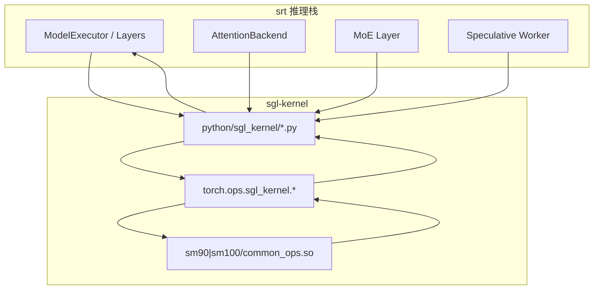

# sgl-kernel：数据流与交互

---

## 1. 架构位置

**Explain：** sgl-kernel 位于 srt **计算层最底端**，不参与请求调度或 HTTP 协议。数据流是单向的：srt 上层构造好 GPU tensor → Python 薄封装校验 → CUDA kernel 写回 output tensor。



---

## 2. 输入 / 输出（典型算子）

| 方向 | 算子 | 输入 tensor | 输出 | 源码 |
|------|------|-------------|------|------|
| 入+出 | `merge_state_v2` | `v_a,s_a,v_b,s_b` (fp16/bf16) | `v_merged,s_merged` | attention.py |
| 入→出 | `cutlass_mla_decode` | `q_nope,q_pe,kv_cache,page_table` | `out` (B,H,512) | attention.py |
| 入→出 | `int8_scaled_mm` | `mat_a,mat_b,scales_*` | `out_dtype` tensor | gemm.py |
| in-place | `moe_align_block_size` | `topk_ids` + 预分配 buffers | 无（写 buffer） | moe.py |
| in-place | `transfer_kv_per_layer` | src/dst K/V + indices | 无（拷贝） | kvcacheio.py |

**Explain：** 绝大多数算子遵循「预分配 output / in-place buffer」模式，避免 Python GC 与 CUDA sync 开销。

**Code：**

```python
# 来源：sgl-kernel/python/sgl_kernel/attention.py L87-L100
    out = q_nope.new_empty((B_q, MAX_HEADS, D_latent))

    torch.ops.sgl_kernel.cutlass_mla_decode.default(
        out,
        q_nope,
        q_pe,
        kv_c_and_k_pe_cache,
        seq_lens,
        page_table,
        workspace,
        sm_scale,
        num_kv_splits,
    )
    return out[:, :H].contiguous()
```

**Comment：**

- output 用 `q_nope.new_empty` 保证 device/dtype 一致。
- 返回时 slice 掉 padding head 并 `contiguous()`。

---

## 3. 上下游连接

| 上游/下游 | 模块 | 交互方式 | 说明 |
|-----------|------|----------|------|
| 上游 | srt `layers/attention` | `from sgl_kernel import merge_state_v2` | cascade/split-KV merge |
| 上游 | srt `layers/moe` | `topk_sigmoid`, `moe_align_block_size` | MoE forward |
| 上游 | srt `disaggregation` | `transfer_kv_*` | prefill→decode KV 搬运 |
| 上游 | srt `speculative` | `tree_speculative_sampling_target_only` | 投机 accept |
| 下游 | CUDA driver | `torch.ops` dispatch | 无 Python 回调 |
| 打包 | pip wheel | `sm90/`, `sm100/` 目录 | 架构相关 `.so` |

---

## 4. 典型数据流：MoE forward 一步

**Explain：** 一次 MoE layer forward 中，sgl-kernel 参与 4 个阶段：路由 → 对齐 → grouped GEMM → 聚合。

**步骤 1 — 路由（gating → topk）**

```python
# 来源：sgl-kernel/python/sgl_kernel/moe.py L57-L76
def topk_sigmoid(
    topk_weights: torch.Tensor,
    topk_ids: torch.Tensor,
    gating_output: torch.Tensor,
    renormalize: bool = False,
    correction_bias: Optional[torch.Tensor] = None,
) -> None:
    """
    Compute top-k sigmoid for MoE routing.

    Args:
        topk_weights: Output tensor for top-k weights [num_tokens, topk]
        topk_ids: Output tensor for top-k expert indices [num_tokens, topk]
        gating_output: Gating logits [num_tokens, num_experts]
        renormalize: Whether to renormalize the top-k weights
        correction_bias: Per-expert bias correction [num_experts], must be float32 if provided
    """
    torch.ops.sgl_kernel.topk_sigmoid.default(
        topk_weights,
        topk_ids,
```

→ `gating_output [num_tokens, num_experts]` 经 sigmoid + topk → `topk_ids`、`topk_weights`。

**步骤 2 — 对齐（token → expert block）**

```python
# 来源：sgl-kernel/python/sgl_kernel/moe.py L6-L22
def moe_align_block_size(
    topk_ids,
    num_experts,
    block_size,
    sorted_token_ids,
    experts_ids,
    num_tokens_post_pad,
    cumsum_buffer,
    pad_sorted_token_ids=False,
):
    torch.ops.sgl_kernel.moe_align_block_size.default(
        topk_ids,
        num_experts,
        block_size,
        sorted_token_ids,
        experts_ids,
        num_tokens_post_pad,
```

→ 产出按 expert 排序、block 对齐的 token index 列表。

**步骤 3 — grouped GEMM（FP8 示例）**

```python
# 来源：sgl-kernel/python/sgl_kernel/moe.py（调用方 srt 侧典型用法示意）
# fp8_blockwise_scaled_grouped_mm 在 moe.py 中 export，对对齐后 token batch 做 expert 并行 GEMM
```

**步骤 4 — 聚合**

```python
# 来源：sgl-kernel/python/sgl_kernel/moe.py
def moe_sum_reduce(input_tensor, output_tensor, ...):
 torch.ops.sgl_kernel.moe_sum_reduce.default(...)
```

→ 将各 expert 输出按 `topk_weights` 加权求和写回 `output_tensor`。

---

## 5. 典型数据流：import 时加载链

**Explain：** 任何 `import sgl_kernel` 都会触发完整加载链，与具体算子调用无关。

```
import sgl_kernel
 → _get_compute_capability()
 → glob sm90|sm100/common_ops.*
 → importlib.exec_module(common_ops) # 注册 torch.ops
 → _preload_cuda_library()
 → from sgl_kernel.attention import ...
 → maybe_wrap_debug_kernel (若 SGLANG_KERNEL_API_LOGLEVEL=1)
```

**Code：**

```python
# 来源：sgl-kernel/python/sgl_kernel/load_utils.py L15-L25
def _get_compute_capability():
    """Get the compute capability of the current GPU."""
    if not torch.cuda.is_available():
        return None

    # Get the current device
    device = torch.cuda.current_device()
    properties = torch.cuda.get_device_properties(device)

    # Return as integer (major * 10 + minor)
    return properties.major * 10 + properties.minor
```

**Comment：**

- 加载发生在**首次 import**，后续算子调用无额外加载开销。
- 多 GPU 场景以 `current_device()` 为准选择 variant。

---

## 6. PD Disaggregation KV 搬运流

**Explain：** prefill worker 完成一层 forward 后，通过 `transfer_kv_per_layer` 将 K/V 按 slot index 拷贝到 decode worker 的 paged buffer。

**Code：**

```python
# 来源：sgl-kernel/python/sgl_kernel/kvcacheio.py L53-L68
        src_v,
        dst_v,
        src_indices,
        dst_indices,
        layer_id,
        item_size,
        src_layout_dim,
        block_quota,
        num_warps_per_block,
    )


def transfer_kv_per_layer_ph_lf(
    src_k: torch.Tensor,
    dst_k: torch.Tensor,
    src_v: torch.Tensor,
```

**Comment：**

- `all_layer` 变体一次搬运模型全部层，减少 Python 循环开销。
- MLA 格式 KV 维度不同，使用 `transfer_kv_all_layer_mla`。
