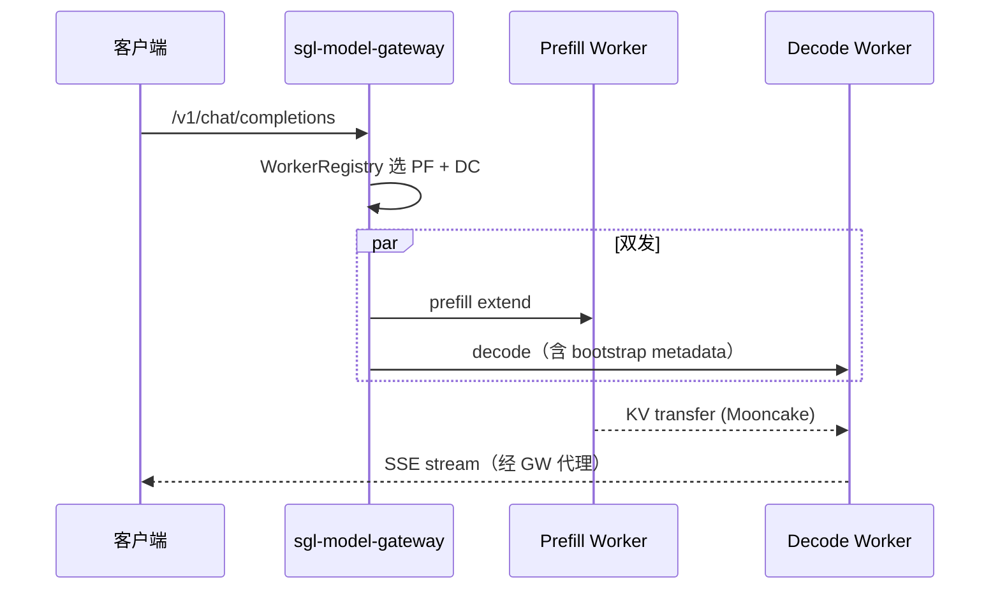

# model-gateway · 核心概念

## 用户故事

### Persona

**老周**，云厂商 AI infra 架构师。Prefill 池（H100×8 TP）负责长 prompt extend，Decode 池（A100×4）负责高并发 decode；客户端只连一个 Gateway 地址，由 Gateway 做 PD 双发与 worker 健康治理。

### 时间线

| 时刻 | 事件 |
|------|------|
| T0 | 客户端 POST `/v1/chat/completions` 到 Gateway（唯一入口） |
| T1 | `RoutingMode::PrefillDecode` 选中 prefill worker + decode worker |
| T2 | `prepare_pd_worker_requests` 向两侧准备 JSON；decode 侧注入 `disagg_prefill_dp_rank` |
| T3 | `execute_dual_dispatch` 并行转发 prefill 与 decode；Mooncake 传 KV |
| T4 | K8s readiness：`has_prefill && has_decode` 才返回 200，否则 503 |

### 涉及模块



**Explain：** Gateway 不做 GPU forward，只做 worker 发现、策略选路、HTTP/gRPC 代理与熔断。PD 模式下同一次 chat 需同时命中 prefill 与 decode 池：`pd_router` 的 `prepare_pd_worker_requests` 为两侧构造 endpoint URL 与 body，decode 请求携带 prefill 的 DP rank 以便 KV 对齐。readiness 探针要求两类 worker 均 healthy，避免「只能 prefill 不能 decode」的半残集群对外服务。

**Code：**

```rust
// 来源：sgl-model-gateway/src/routers/http/pd_router.rs L349-L363
 async fn prepare_pd_worker_requests<'a>(
 route: &'static str,
 json_request: &'a Value,
 prefill: &dyn Worker,
 decode: &dyn Worker,
 ) -> Result<(PreparedWorkerRequest<'a>, PreparedWorkerRequest<'a>), String> {
 let prefill_request =
 Self::prepare_worker_request(route, prefill, Cow::Borrowed(json_request)).await?;
 let decode_json_request =
 Self::inject_prefill_dp_rank_for_decode(Cow::Borrowed(json_request), prefill)?;
 let decode_request =
 Self::prepare_worker_request(route, decode, decode_json_request).await?;
 Ok((prefill_request, decode_request))
 }
```

```rust
// 来源：sgl-model-gateway/src/server.rs L148-L156
 RoutingMode::PrefillDecode { .. } => {
 let has_prefill = healthy_workers
 .iter()
 .any(|w| matches!(w.worker_type(), WorkerType::Prefill { .. }));
 let has_decode = healthy_workers
 .iter()
 .any(|w| matches!(w.worker_type(), WorkerType::Decode));
 has_prefill && has_decode
 }
```

**Comment：**

- prefill/decode 可配置不同 policy（如 prefill cache-aware、decode round-robin）。
- `enable_igw` 时四套 router 并存，Gateway 按请求特征选路。
- Gateway `/health` 只表示进程存活；`/readiness` 才反映后端 worker 是否足够。
- PD 双发失败时 breaker 分别记录 prefill/decode 侧，避免误归因。
- 客户端无需感知 worker 拓扑，bootstrap metadata 由 Gateway 注入 decode body。

### 如果…会怎样（调试）

| 现象 | 可能原因 | 排查 |
|------|----------|------|
| readiness 503 | 仅 prefill 或仅 decode healthy | `worker_registry.get_all()` 按 type 过滤 |
| decode 找不到 KV | bootstrap host/port 未注入 | 查 prefill worker 的 bootstrap 字段 |
| 流式中断 | 一侧 breaker open | metrics `call_upstream_decode_error` |
| 全打到同一 worker | policy 配置为 consistent hash | 换 round-robin 或 cache-aware |

---

## 1. Model Gateway 的角色
**Explain：** Gateway 解决**多 worker 统一入口**问题：客户端只连一个地址，gateway 负责 worker 发现、健康检查、负载均衡、流式转发、熔断重试。它**不加载模型、不做 GPU forward**——所有推理发生在 srt worker 进程内。

**Code：**

```rust
// 来源：sgl-model-gateway/src/server.rs L184-L193
async fn v1_chat_completions(
 State(state): State<Arc<AppState>>,
 headers: http::HeaderMap,
 ValidatedJson(body): ValidatedJson<ChatCompletionRequest>,
) -> Response {
 state
 .router
 .route_chat(Some(&headers), &body, Some(&body.model))
 .await
}
```

**Comment：**

- Handler 仅解析 JSON 并委托 `RouterTrait::route_chat`。
- 与 srt 内置 HTTP server 的区别：srt 是单实例推理引擎；gateway 是前置代理层。

---

## 2. 路由模式（RoutingMode）

**Explain：** 三种互斥模式决定 gateway 行为。

| 模式 | 说明 | 典型部署 |
|------|------|----------|
| `Regular` | 每个 worker 独立完成 prefill+decode | 标准多副本 |
| `PrefillDecode` | prefill worker 与 decode worker 分离 | PD disaggregation |
| `OpenAI` | 代理到外部 OpenAI 兼容 API | 混合云 |

**Code：**

```rust
// 来源：sgl-model-gateway/src/routers/factory.rs L44-L59
 ConnectionMode::Http => match &ctx.router_config.mode {
 RoutingMode::Regular { .. } => Self::create_regular_router(ctx).await,
 RoutingMode::PrefillDecode {
 prefill_policy,
 decode_policy,
 ..
 } => {
 Self::create_pd_router(
 prefill_policy.as_ref(),
 decode_policy.as_ref(),
 &ctx.router_config.policy,
 ctx,
 )
 .await
 }
 RoutingMode::OpenAI { .. } => Self::create_openai_router(ctx).await,
 },
```

**Comment：**

- `ConnectionMode` 与 `RoutingMode` 正交：HTTP vs gRPC × Regular/PD/OpenAI。
- PD 模式可为 prefill/decode 配置**不同** policy（如 prefill 用 cache-aware，decode 用 round-robin）。

---

## 3. Worker 抽象

**Explain：** 每个后端 srt 实例注册为 `Worker` trait 对象，携带 URL、类型（Regular/Prefill/Decode）、健康状态、模型 ID、连接模式（HTTP/gRPC）。

**Code：**

```rust
// 来源：sgl-model-gateway/src/core/worker.rs L26-L33
/// Default worker priority (mid-range on 0-100 scale)
pub const DEFAULT_WORKER_PRIORITY: u32 = 50;

/// Default worker cost factor (baseline cost)
pub const DEFAULT_WORKER_COST: f32 = 1.0;

/// Default HTTP client timeout for worker requests (in seconds)
pub const DEFAULT_WORKER_HTTP_TIMEOUT_SECS: u64 = 30;
```

**Comment：**

- `WorkerRegistry` 按 model_id 索引 worker，维护 consistent hash ring（150 virtual nodes/worker，blake3）。
- `is_healthy()` / `is_available()` 区分健康检查通过与熔断器允许转发。

---

## 4. IGW（Inference Gateway）多 Router 模式

**Explain：** `enable_igw=true` 时，`RouterManager` 同时注册 HTTP Regular、HTTP PD、gRPC Regular、gRPC PD 四套 router，按请求特征选择。适合同一 gateway 实例服务 heterogeneous 后端。

**Code：**

```rust
// 来源：sgl-model-gateway/src/routers/router_manager.rs L91-L113
 if config.router_config.enable_igw {
 info!("Initializing RouterManager in multi-router mode (IGW)");

 match RouterFactory::create_regular_router(app_context).await {
 Ok(http_regular) => {
 info!("Created HTTP Regular router");
 manager.register_router(router_ids::HTTP_REGULAR, Arc::from(http_regular));
 }
 Err(e) => {
 warn!("Failed to create HTTP Regular router: {e}");
 }
 }

 match RouterFactory::create_grpc_router(app_context).await {
 Ok(grpc_regular) => {
 info!("Created gRPC Regular router");
 manager.register_router(router_ids::GRPC_REGULAR, Arc::from(grpc_regular));
 }
```

**Comment：**

- IGW 模式自动启用 PD router（注释：`PD disaggregation auto-enabled for IGW mode`）。
- `routers_snapshot: ArcSwap` 提供无锁读 snapshot，热路径友好。

---

## 5. 健康探针语义

**Explain：** Kubernetes 常用 `/health`（liveness）与 `/readiness`。Gateway 的 readiness 检查**后端 worker 是否足够**，而非 gateway 进程本身。

**Code：**

```rust
// 来源：sgl-model-gateway/src/server.rs L102-L122
async fn readiness(State(state): State<Arc<AppState>>) -> Response {
 let workers = state.context.worker_registry.get_all();
 let healthy_workers: Vec<_> = workers.iter().filter(|w| w.is_healthy()).collect();

 let is_ready = if state.context.router_config.enable_igw {
 !healthy_workers.is_empty()
 } else {
 match &state.context.router_config.mode {
 RoutingMode::PrefillDecode { .. } => {
 let has_prefill = healthy_workers
 .iter()
 .any(|w| matches!(w.worker_type(), WorkerType::Prefill { .. }));
 let has_decode = healthy_workers
 .iter()
 .any(|w| matches!(w.worker_type(), WorkerType::Decode));
 has_prefill && has_decode
 }
 RoutingMode::Regular { .. } => !healthy_workers.is_empty(),
 RoutingMode::OpenAI { .. } => !healthy_workers.is_empty(),
 }
 };
```

**Comment：**

- PD 模式：**必须**同时有 healthy prefill 与 decode worker，否则返回 503。
- liveness 始终返回 200 OK（进程存活即可）。
