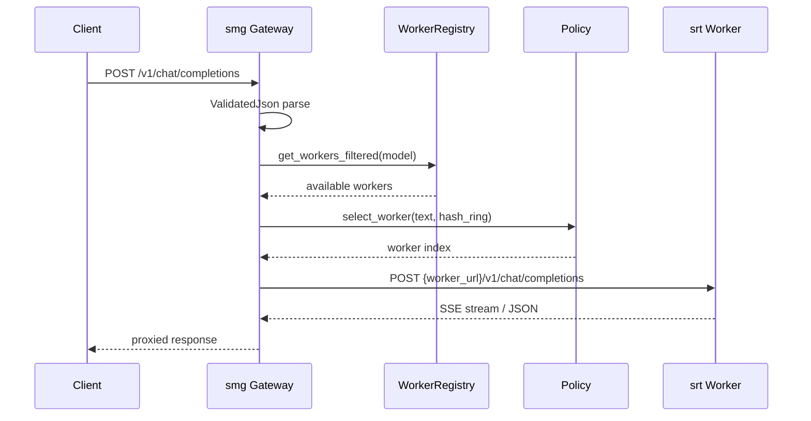
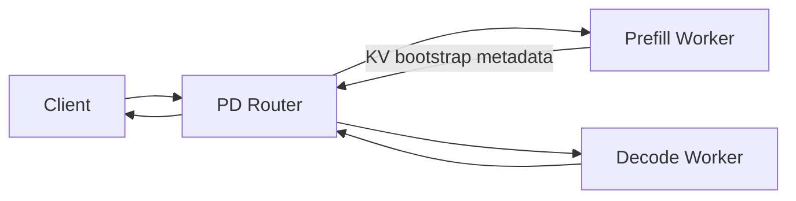

# model-gateway：数据流与交互

---

## 1. 架构位置

**Explain：** Gateway 是**控制面 + 数据面代理**，不参与 tensor 计算。数据面：HTTP/gRPC 请求体原样（或轻微改写）转发到 worker；控制面：worker 注册、健康检查、policy 配置、mesh 同步。



---

## 2. 输入 / 输出

| 方向 | 类型 | 字段说明 | 源码 |
|------|------|----------|------|
| 输入 | `ChatCompletionRequest` | OpenAI chat 格式：messages, model, stream | `protocols/chat.rs` |
| 输入 | `GenerateRequest` | SGLang 原生：text, sampling_params | `protocols/generate.rs` |
| 输出 | HTTP Response | 流式 `text/event-stream` 或 JSON body | worker 原样转发 |
| 控制 | `WorkerConfigRequest` | url, model_id, worker_type | `protocols/worker_spec.rs` |

**Explain：** Gateway **不修改**推理语义字段；仅在 PD 模式下拆分 prefill/decode 两次 upstream 调用。

**Code：**

```rust
// 来源：sgl-model-gateway/src/server.rs L184-L193
async fn v1_chat_completions(
 State(state): State<Arc<AppState>>,
 headers: http::HeaderMap,
 ValidatedJson(body): ValidatedJson<ChatCompletionRequest>,
) -> Response {
 state
 .router
 .route_chat(Some(&headers), &body, Some(&body.model))
 .await
}
```

**Comment：**

- `ValidatedJson` 在 Axum extract 阶段做 schema 校验，失败直接 400。
- `body.model` 用于 worker 过滤与 policy 选取。

---

## 3. 上下游连接

| 上游/下游 | 模块 | 交互方式 | 代码位置 |
|-----------|------|----------|----------|
| 上游 | OpenAI SDK / curl / LangChain | HTTPS | `server.rs` Axum routes |
| 下游 | srt HTTP server | reqwest 反向代理 | `routers/http/router.rs` |
| 下游 | srt gRPC Engine | tonic client | `routers/grpc/router.rs` |
| 下游 | 外部 OpenAI API | HTTPS 代理 | `routers/openai/router.rs` |
| 侧向 | Prometheus | metrics scrape | `observability/metrics/` |
| 侧向 | K8s API / DNS | service discovery | `service_discovery.rs` |

---

## 4. 典型数据流：Regular HTTP Chat Completion

**步骤 1 — 客户端请求到达 Axum**

```rust
// 来源：sgl-model-gateway/src/server.rs L544-L546
 let protected_routes = Router::new()
 .route("/generate", post(generate))
 .route("/v1/chat/completions", post(v1_chat_completions))
```

**步骤 2 — Handler 委托 Router**

→ `state.router.route_chat(headers, &body, Some(&body.model))`

**步骤 3 — 选 worker**

```rust
// 来源：sgl-model-gateway/src/routers/http/router.rs L171-L181
 let idx = policy
 .select_worker(
 &available,
 &SelectWorkerInfo {
 request_text: text,
 tokens: None,
 headers,
 hash_ring,
 },
 )
 .await?;
 Some(available[idx].clone())
```

**步骤 4 — 构造 upstream URL 并 POST**

→ `client.post(format!("{}/v1/chat/completions", worker.url()))`，body 序列化 `ChatCompletionRequest`，headers 注入 trace context。

**步骤 5 — 流式/非流式返回**

- `is_stream=true`：将 worker 的 byte stream 包装为 Axum `Body`，客户端收到 SSE chunk。
- 非流式：读完整 body 返回 JSON。

**步骤 6 — 重试（可选）**

→ 若 worker 返回 502/503/429，`RetryExecutor` 按配置重试，可能换 worker。

---

## 5. 典型数据流：PD Disaggregation

**Explain：** PD 模式下一次用户请求在 gateway 内拆为两跳：prefill worker 计算 KV → decode worker 继续生成。



**Code：**

```rust
// 来源：sgl-model-gateway/src/server.rs L109-L117
 RoutingMode::PrefillDecode { .. } => {
 let has_prefill = healthy_workers
 .iter()
 .any(|w| matches!(w.worker_type(), WorkerType::Prefill { .. }));
 let has_decode = healthy_workers
 .iter()
 .any(|w| matches!(w.worker_type(), WorkerType::Decode));
 has_prefill && has_decode
 }
```

**Comment：**

- readiness 强制双角色就绪，避免「只能 prefill 不能 decode」的半开状态。
- `routers/http/pd_router.rs` 与 `routers/grpc/pd_router.rs` 分别实现 HTTP/gRPC PD 协议细节。

---

## 6. Worker 生命周期数据流

**Explain：** Worker 从注册到摘除的 state 变化。

```
create_worker(WorkerConfigRequest)
 → WorkerBuilder 构造 Worker 对象
 → WorkerRegistry.register(model_id, worker)
 → HashRing rebuild
 → HealthChecker 周期 GET /health
 → is_healthy=true → is_available=true（无熔断）
 → 请求可选中该 worker
 → 连续失败 → CircuitBreaker OPEN → is_available=false
 → delete_worker → unregister → HashRing rebuild
```

**Code：**

```rust
// 来源：sgl-model-gateway/src/core/worker_registry.rs L29-L31
/// Number of virtual nodes per physical worker for even distribution.
const VIRTUAL_NODES_PER_WORKER: usize = 150;
```

**Comment：**

- registry 使用 `DashMap` + immutable Arc snapshot，读多写少。
- mesh sync（可选）跨 gateway 实例同步 worker 状态与 rate limit。

---

## 7. IGW 多 Router 选路

**Explain：** IGW 启用时，单一 `AppState.router` 可能是 `RouterManager` 实现的 composite router，按 connection mode 与 PD 标志分发到子 router。

**Code：**

```rust
// 来源：sgl-model-gateway/src/routers/router_manager.rs L51-L59
pub mod router_ids {
 use super::RouterId;
 pub const HTTP_REGULAR: RouterId = RouterId::new("http-regular");
 pub const HTTP_PD: RouterId = RouterId::new("http-pd");
 pub const HTTP_OPENAI: RouterId = RouterId::new("http-openai");
 pub const GRPC_REGULAR: RouterId = RouterId::new("grpc-regular");
 pub const GRPC_PD: RouterId = RouterId::new("grpc-pd");
}
```

**Comment：**

- 客户端无需感知子 router；gateway 根据请求协议（HTTP vs gRPC）与 worker 类型自动选择。
- default_router 配置 fallback 当无法匹配时的行为。

---

## 8. 观测数据流

**Explain：** 三层 metrics：Router 层（请求计数/延迟）、Worker 层（选择/retry）、Upstream 层（status code）。

**Code：**

```rust
// 来源：sgl-model-gateway/src/routers/http/router.rs L207-L215
 Metrics::record_router_request(
 metrics_labels::ROUTER_HTTP,
 metrics_labels::BACKEND_REGULAR,
 metrics_labels::CONNECTION_HTTP,
 model,
 endpoint,
 bool_to_static_str(is_stream),
 );
```

**Comment：**

- OpenTelemetry trace：`inject_trace_context_http` 将 traceparent 写入 upstream headers。
- `/engine_metrics` 聚合各 worker Prometheus metrics。
