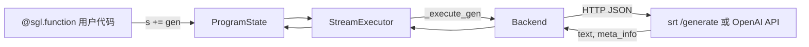
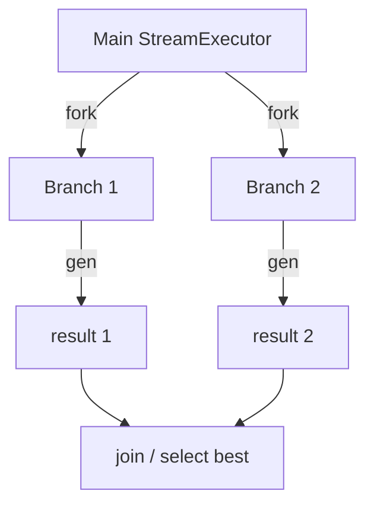

# Frontend Language：数据流与交互

---

## 1. 架构位置

**Explain：** SGL 前端位于 **用户代码与推理后端之间**，不实现 attention 或 scheduling。数据流本质是：Python IR 表达式 → 累积 prompt 状态 → HTTP/REST 请求 → 文本/meta 回写 ProgramState。



---

## 2. 输入 / 输出

| 方向 | 类型 | 说明 | 源码 |
|------|------|------|------|
| 输入 | 用户函数参数 | `SglFunction` 的 `arg_names`（除 `s` 外） | `ir.py` |
| 中间 | `StreamExecutor.text_` | 累积 prompt 字符串 | `interpreter.py` |
| 中间 | `StreamExecutor.messages_` | OpenAI 格式 chat 消息 | `interpreter.py` |
| 输出 | `variables[name]` | `gen("name")` 绑定变量 | `interpreter.py` |
| 输出 | `meta_info[name]` | logprob 等元数据 | RuntimeEndpoint JSON |

**Code：**

```python
# 来源：python/sglang/lang/backend/runtime_endpoint.py L165-L172
        data = {
            "text": s.text_,
            "sampling_params": {
                "skip_special_tokens": global_config.skip_special_tokens_in_output,
                "spaces_between_special_tokens": global_config.spaces_between_special_tokens_in_out,
                **sampling_params.to_srt_kwargs(),
            },
        }
```

**Comment：**

- Chat 模型可能发送 `messages` 而非纯 `text`（backend 内部分支）。
- 图片通过 `_add_images` 附加到同一 JSON payload。

---

## 3. 上下游连接

| 上游/下游 | 模块 | 交互方式 |
|-----------|------|----------|
| 上游 | 用户应用 / Notebook | Python 调用 `.run()` |
| 下游 | srt HTTP | `POST {base_url}/generate` |
| 下游 | OpenAI / Anthropic / LiteLLM | 各 backend REST |
| 侧向 | `global_config` | 默认 backend、verbosity、precache 开关 |

---

## 4. 典型数据流：单次 gen()

**步骤 1 — 用户代码**

```python
@sgl.function
def qa(s, question):
 s += "Q: " + question + "\nA:"
 s += gen("answer", max_tokens=64)
```

**步骤 2 — `s +=` 提交 IR**

→ 常量文本 → `_execute_fill` 追加到 `text_` 
→ `gen("answer")` → `_execute_gen`

**步骤 3 — 构造 HTTP 请求**

```python
# 来源：python/sglang/lang/backend/runtime_endpoint.py L186-L191
        res = http_request(
            self.base_url + "/generate",
            json=data,
            api_key=self.api_key,
            verify=self.verify,
        )
```

**步骤 4 — 解析响应**

→ `comp = obj["text"]` 追加到 `text_` 
→ `variables["answer"] = comp` 
→ `variable_event["answer"].set()` 唤醒等待者

**步骤 5 — 用户读取**

→ `state["answer"]` 或 `state.text()`

---

## 5. Batch + Prefix Cache 数据流

**Explain：** 多样本共享 instruction prefix 时，trace 提取 prefix → 一次 cache → 并行 run。

```
run_program_batch(batch_kwargs)
 → [optional] extract_prefix_by_tracing → cache_prefix(prefix)
 → ThreadPoolExecutor × N × run_program
 → 各样本独立 StreamExecutor，共享 backend Radix cache 命中
```

**Code：**

```python
# 来源：python/sglang/lang/interpreter.py L105-L107
    # Pre-cache the common prefix for a batch. The prefix is extracted by tracing the program.
    if global_config.enable_precache_with_tracing and len(batch_arguments) > 1:
        cache_program(program, backend)
```

**Comment：**

- 需 `global_config.enable_precache_with_tracing=True`。
- prefix 必须在第一个 `gen` 之前全部为常量文本。

---

## 6. Fork/Join 数据流

**Explain：** fork 复制 executor 状态到 N 个分支，各分支独立 gen，join 可选 concate KV 或文本。



**Code：**

```python
# 来源：python/sglang/lang/interpreter.py L375-L377
        if size > 1 and str(self.text_):
            self.submit(SglCommitLazy())

```

**Comment：**

- `SglCommitLazy` 确保 fork 点 KV 已 materialize。
- `support_concate_and_append` 时 join 可走 KV 级拼接而非重算 prefix。

---

## 7. 流式数据流

**Explain：** `stream=True` 时 `_execute_gen` 迭代 `generate_stream`，每 chunk 设置 `stream_text_event`。

**Code：**

```python
# 来源：python/sglang/lang/interpreter.py L637-L642
            for comp, meta_info in generator:
                self.text_ += comp
                self.variables[name] += comp
                self.meta_info[name] = meta_info
                self.stream_var_event[name].set()
                self.stream_text_event.set()
```

**Comment：**

- 主线程 `text_iter()` wait event → yield 增量文本。
- 与 `num_api_spec_tokens` 互斥（assert 禁止）。

---

## 8. Tracing 数据流（无网络）

**Explain：** trace 模式下 backend 可为 `BaseBackend` stub，expr 图被记录但不发起 generate。

**Code：**

```python
# 来源：python/sglang/lang/tracer.py L54-L72
def trace_program(program, arguments, backend):
    # Create dummy backend
    if backend is None:
        backend = BaseBackend()

    # Create dummy arguments
    dummy_arguments = {
        name: SglArgument(name, None)
        for name in program.arg_names
        if name not in arguments
    }
    arguments.update(dummy_arguments)
    arguments.update(program.bind_arguments)

    # Trace
    tracer = TracerProgramState(backend, arguments, only_trace_prefix=False)
    with TracingScope(tracer):
        tracer.ret_value = program.func(tracer, **arguments)
    return tracer
```

**Comment：**

- 用于静态分析、可视化 IR 图（`print_graph_dfs`）。
- `only_trace_prefix=True` 时在首个非 const expr 抛 `StopTracing`。
