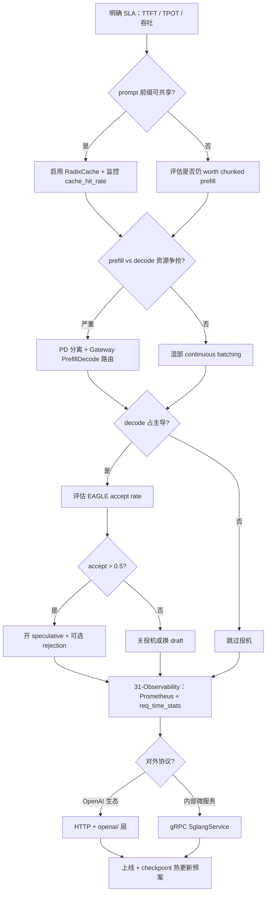

# 设计追问与框架对比

> 本节说明如何从「读懂代码」升级到「做架构决策」

---

## 一、SGLang vs vLLM vs TensorRT-LLM

| 维度 | SGLang | vLLM | TensorRT-LLM |
|------|--------|------|--------------|
| **RadixAttention / Prefix Cache** | Radix Tree 跨请求共享前缀 KV；`match_prefix` + `insert` 与 Scheduler 深度集成 | PagedAttention 块级管理；prefix caching 为后续加能力，树结构不如 Radix 灵活 | TRT engine 侧重静态优化；prefix 复用依赖 runtime 版本与 plugin，运维复杂 |
| **Continuous Batching** | `event_loop_overlap` + prefill-first；retract decode 应对 OOM | Continuous batching 成熟；PagedAttention 与 batch 合并经典组合 | In-flight batching 在 TRT-LLM executor；偏静态 batch 上限 |
| **PD Disaggregation** | 一等公民：`DisaggregationMode`、多种 KV connector、Gateway PD 路由 | 社区方案 / 外部项目；非 vLLM core 主线 | 多实例 + MPI/NCCL；PD 需自建 orchestration |
| **Speculative Decoding** | EAGLE / NGRAM / MTP / DFlash；`EAGLEWorkerV2` + reject sampling | 多种 draft 方案；生态插件多 | 强依赖 TRT draft engine 与 target 对齐；编译成本高 |
| **Structured Output** | `srt/constrained` grammar 三后端 + OpenAI json_schema | guided decoding 集成 | TRT logits processor / 外部约束 |
| **OpenAI API** | 原生 `srt/entrypoints/openai/` + gRPC pass-through | OpenAI compatible server | 通常需 Triton / 自研 gateway 包装 |
| **可观测性** | Prometheus `SchedulerStats`、req_time_stats（可观测性） | metrics 插件成熟 | NVIDIA 栈 + 自建 |
| **权重热更新** | CheckpointEngine（CheckpointEngine） | 有限支持 | engine rebuild 为主 |
| **适用场景** | 高 QPS 对话、长 system prompt、PD 生产集群 | 通用开源 serving、生态最大 | 极致单模型延迟、NVIDIA 全栈 |

**Comment：** 没有「永远选 X」——长前缀多租户对话偏向 SGLang RadixCache；单模型极致延迟且可接受编译周期选 TRT-LLM；快速试验与社区生态选 vLLM。

### 量化参考（经验区间，非 SLA 承诺）

以下数字来自生产实践与 SGLang 官方 benchmark 的量级描述，**仅供架构决策参考**，实际效果取决于模型、硬件与 workload。

| 场景 | 经验区间 | 说明 |
|------|----------|------|
| **RadixCache 命中后 TTFT** | 可降 **50–80%** | 同 system prompt、高前缀重复度对话场景；见 [[07-用户故事与场景|07-用户故事与场景]] 故事 A（420ms → 90ms 量级） |
| **Spec accept rate 阈值** | **> 0.5** 通常值得开启 | 低于此值 draft forward 成本可能超过收益；见追问 10–11 |
| **PD 分离适用条件** | prefill/decode 峰值错开 **且** KV 传输 RTT < 本地排队损失 | 短 prompt、低 QPS、跨 AZ 传 GB 级 KV 时 PD 可能更慢；见追问 1–2 |
| **cache_hit_rate 健康线** | 对话场景 7d P50 **> 0.6** | 权重热更新 flush 后骤降属预期 |
| **官方 benchmark** | 见 SGLang 官方文档 | README / benchmark 页给出吞吐与延迟对比，勿虚构精确数字 |

---

## 二、15 个设计追问（简答 + 专题指针）

### 架构与部署

**1. 什么时候该上 PD 分离？** 
Prefill 与 decode 资源争抢导致 P99 抖动，且 prompt 长度方差大（长 prefill 阻塞 decode）。Prefill 池可 CPU/网络换 GPU 专用于 extend，Decode 池专注重 KV 与带宽。见 [[22-Disaggregation-00-MOC]]。

**2. 什么时候 PD 反而更慢？** 
短 prompt、低 QPS、KV 传输 RTT **高于**本地 prefill+decode 合并成本（排队损失）。跨 AZ 传 GB 级 KV 时尤其明显。PD 适合 prefill/decode 负载峰值错开且传输 RTT 可控的场景。

**3. Gateway 还是直连 worker？** 
多 worker 负载均衡、PD 路由、统一 auth 用 [[27-model-gateway-00-MOC]]。单 worker 调试可直连 HTTP。

**4. HTTP 还是 gRPC？** 
外部 OpenAI 兼容用 HTTP/SSE；内部低延迟、多语言 client、背压可控用 gRPC + [[05-gRPC-Proto-00-MOC]]。

**5. TP / PP / DP 怎么选？** 
单卡放不下模型开 TP；层数极深开 PP；QPS 线性扩展开 DP + routing_key。见 [[23-Distributed-00-MOC]]。

### 缓存与调度

**6. RadixCache 命中率低怎么办？** 
检查 prompt 是否每请求变化、extra_key 是否隔离过度、LoRA 是否阻止共享。命中后 TTFT 在同 system prompt 场景可降 **50–80%**（经验区间）。见 [[15-RadixAttention-00-MOC]]、[[07-用户故事与场景|07-用户故事与场景]] 故事 A。

**7. 何时禁用 prefix cache？** 
`positional_embed_overrides`、安全策略要求请求级隔离、A/B 对照实验（`SGLANG_RADIX_FORCE_MISS`）。

**8. prefill 一直饿死 decode 怎么办？** 
调 `SchedulePolicy`、chunked prefill、`max_prefill_tokens`；必要时 retract decode 已在 Scheduler 内建。见 [[08-SchedulePolicy-00-MOC]]。

**9. 显存 OOM 先动哪几个旋钮？** 
`--mem-fraction-static`、`max_running_requests`、减小 `max_total_tokens`、开启 retract。见 [[16-KV-Cache-00-MOC]]。

### 投机与采样

**10. 什么时候开 speculative decoding？** 
Decode 占端到端时间主导、draft 与 target 对齐良好、accept rate 稳定 **> 0.5**（经验阈值，非承诺）。见 [[21-Speculative-00-MOC]]。

**11. 什么时候 spec 反而 hurt？** 
Accept rate 低（域偏移、top_k 过大）、draft 额外占显存、verify batch 与 draft batch 双倍 forward；accept rate **< 0.4** 时吞吐常下降。见 [[07-用户故事与场景|07-用户故事与场景]] 故事 B。

**12. rejection sampling 必须开吗？** 
非必须；开启后 reject 时 rollback KV，accept 低时减少错误 draft 污染，略增算力。

**13. grammar / json_schema 性能瓶颈在哪？** 
`num_grammar_queue_reqs` 升高说明约束解码排队；对比 xgrammar / outlines 后端。见 [[20-Sampling-00-MOC]]。

### 模型与运维

**14. 新 HuggingFace 模型如何接入？** 
`ModelRegistry.register` + 新 `srt/models/*.py`；见 [[13-Models-通用-00-MOC]]、[[03-关键概念|03-关键概念]] ModelRegistry 节。

**15. 生产如何无停机换权重？** 
CheckpointEngine + `UpdateWeightsFromDisk` gRPC；见 [[32-CheckpointEngine-00-MOC]]、[[31-Observability-00-MOC]] 验证 metrics 无尖刺。

---

## 三、生产部署决策框架

### 决策检查清单

| 阶段 | 检查项 | 通过标准 |
|------|--------|----------|
| **容量** | max_running_requests × avg_seq | 不超过 KV pool 预算 |
| **缓存** | cache_hit_rate（7d P50） | 对话场景 > 0.6 |
| **延迟** | TTFT P99 / TPOT P99 | 满足 SLA |
| **PD** | Gateway prefill+decode ready | 双池 healthy |
| **投机** | accept rate | > 0.5 或关闭 |
| **可观测** | cache_hit_rate、grammar queue、disagg 分段 | 有告警阈值 |
| **变更** | CheckpointEngine 演练 | 无请求失败 spike |

### 推荐阅读顺序（决策向）

1. [[08-设计追问与框架对比|08-设计追问与框架对比]]（本文） 
2. [[07-用户故事与场景|07-用户故事与场景]] 
3. [[03-关键概念|03-关键概念]] 
4. [[全链路请求追踪|全链路请求追踪]] 
5. 按需深入RadixAttention–KV Cache / 21–22 / 31–32

---

## 与 onboarding 的关系

| 文档 | 角色 |
|------|------|
| [[03-关键概念|03-关键概念]] | **是什么** — 12 个概念 ETC |
| [[07-用户故事与场景|07-用户故事与场景]] | **怎么跑** — 三场景叙事 |
| 本文 | **为什么 / 选什么** — 框架对比与决策树 |

三者合读，从概念定义到生产场景再到架构决策，形成完整读序。排障场景可直接跳转 [[09-生产排障速查|09-生产排障速查]]。
