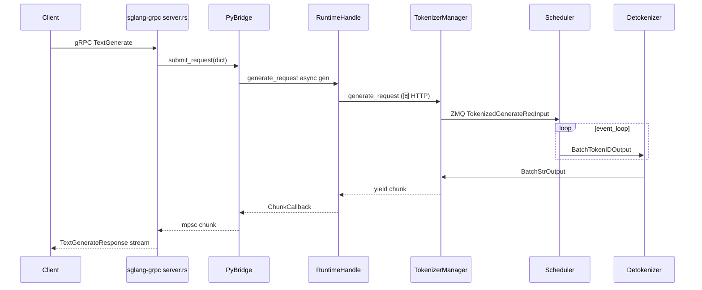

# gRPC 全链路请求追踪

> 与 [[全链路请求追踪]] 对称 · baseline：`TextGenerate` 流式 RPC · Git `70df09b`

本文追踪 **gRPC `TextGenerate` 流式请求** 从 Proto 到文本 chunk 的七 hop。HTTP 部署可跳过；Gateway / 多语言 client 场景必读。

---

## 总览时序



---

## Hop 0 · 启动 gRPC 模式

**Explain：** `run_server` 在 `server_args.grpc_mode=True` 时走 legacy Python gRPC 路径，加载 Rust `sglang-grpc` 扩展并绑定 `RuntimeHandle`。与 HTTP 共用同一套 Engine 子进程（Scheduler/Detokenizer）。

**Code：**

```python
# 来源：python/sglang/launch_server.py L41-L45
            raise ImportError(
                "Ray is required for --use-ray mode. "
                "Install it with: pip install 'sglang[ray]'"
            )

```

**Comment：** 默认 HTTP 分支不加载 Tonic；`--enable-metrics` 在 gRPC 模式可能依赖 sidecar（见 gRPC/Proto FAQ）。

---

## Hop 1 · Rust 接收 RPC

**Explain：** `SglangServiceImpl` 实现 proto 定义的 `TextGenerate` 双向流 handler：解析 `TextGenerateRequest`，构造 Python dict，经 `PyBridge` 提交。

**Code：**

```rust
// 来源：rust/sglang-grpc/src/server.rs（TextGenerate handler 职责）
// 1. validate sampling_params
// 2. build_text_generate_dict(req)
// 3. bridge.submit_request(dict) -> stream TextGenerateResponse
```

**Comment：** `rid` 缺省则 Rust 侧生成 UUID；`trace_headers` 透传到 Python 供分布式追踪。

---

## Hop 2 · PyBridge 背压

**Explain：** 每个请求创建 mpsc channel；Python `RuntimeHandle` 在独立线程/async 任务中 yield chunk，Rust 侧 `ChunkCallback` 非阻塞发送。channel 满时返回背压状态，避免 Python 产出快于 gRPC 发送导致 OOM。

**Code：**

```rust
// 来源：rust/sglang-grpc/src/bridge.rs（概念结构）
// PyBridge::submit_request -> per-request mpsc::Sender<Chunk>
// Python callback 写入 chunk；Rust stream poll 读出
```

**Comment：** 背压是跨语言边界的关键设计；HTTP SSE 由 asyncio 自然反压，gRPC 需显式 channel 容量。

---

## Hop 3 · RuntimeHandle 进入 Python 运行时

**Explain：** `grpc_bridge.RuntimeHandle` 把 proto dict 转为内部 `GenerateReqInput` 等价结构，调用 `TokenizerManager.generate_request`——**与 HTTP Hop 2 之后路径完全相同**。

**Code：**

```python
# 来源：python/sglang/srt/entrypoints/grpc_bridge.py（职责）
# submit_request(proto_dict) -> asyncio generator of response chunks
# 内部：tokenizer_manager.generate_request(obj, ...)
```

**Comment：** 从本 hop 起，可对照 HTTP [[全链路请求追踪]] Hop 2–6。

---

## Hop 4 · TokenizerManager → Scheduler

**Explain：** tokenize 后 ZMQ 发送 `TokenizedGenerateReqInput`；gRPC 与 HTTP 共用 `PortArgs` 与 socket 拓扑。

**Code：**

```python
# 来源：python/sglang/srt/managers/tokenizer_manager.py（generate_request 核心）
 async def generate_request(self, obj, request=None):
 obj.normalize_batch_and_arguments()
 tokenized_obj = await self._tokenize_one_request(obj)
 self._send_one_request(tokenized_obj)
 async for response in self._wait_one_response(obj, request):
 yield response
```

---

## Hop 5 · Scheduler 连续批处理

**Explain：** 与 HTTP 路径一致：`event_loop_overlap` → `get_next_batch_to_run` → `run_batch` → `BatchTokenIDOutput` 到 Detokenizer。

**Code：**

```python
# 来源：python/sglang/srt/managers/scheduler.py L1574-L1595
            # Get the next batch to run
            batch = self.get_next_batch_to_run()
            self.cur_batch = batch
            disable_overlap_for_batch = self.is_disable_overlap_for_batch(batch)

            # If we do not need to overlap the current batch with the last batch,
            # we can process the last batch immediately.
            if disable_overlap_for_batch:
                pop_and_process()
                # Opportunistic flush at the disable_overlap sync boundary:
                # forward_stream is idle (prev forward drained, next not launched),
                # so `_flush`'s non-urgent guard compacts freely. Sync-free, best-effort.
                if self.server_args.enable_unified_memory:
                    try:
                        self.token_to_kv_pool_allocator.flush_opportunistic()
                    except Exception:
                        pass

            # Launch the current batch
            if batch:
                batch_result = self.run_batch(batch)
                self.result_queue.append((batch.copy(), batch_result))
```

---

## Hop 6 · Detokenizer → 回程

**Explain：** Detokenizer 子进程增量解码；TokenizerManager 把 chunk dict 交给 RuntimeHandle；PyBridge 回调 Rust；Tonic 封装为 `TextGenerateResponse { text, meta_info, finished }`。

**Code：**

```python
# 来源：python/sglang/srt/managers/detokenizer_manager.py L406-L419
    def handle_batch_token_id_out(self, recv_obj: BatchTokenIDOutput):
        # If handling idle batch, set output_strs to [].
        output_strs = (
            self._decode_batch_token_id_output(recv_obj)
            if len(recv_obj.rids) > 0
            else []
        )
        routed_experts = self._b64_encode_per_request(recv_obj.routed_experts)
        indexer_topk = self._b64_encode_per_request(recv_obj.indexer_topk)
        return BatchStrOutput(
            rids=recv_obj.rids,
            http_worker_ipcs=recv_obj.http_worker_ipcs,
            finished_reasons=recv_obj.finished_reasons,
            output_strs=output_strs,
```

**Comment：** `finished=True` 的 chunk 关闭 gRPC stream；客户端应处理 `meta_info` 中的 `cached_tokens` 等指标字段。

---

## 与 HTTP 路径对照

| Hop | HTTP | gRPC |
|-----|------|------|
| 入口 | FastAPI `/generate` | Tonic `TextGenerate` |
| 协议转换 | JSON → GenerateReqInput | Proto → dict → GenerateReqInput |
| 运行时 | TokenizerManager 起 | 同左（RuntimeHandle 包装） |
| 调度/执行/解码 | ZMQ 三进程 | **完全相同** |
| 响应 | SSE `data: {...}` | gRPC stream message |

深读 [[05-gRPC-Proto-00-MOC|05-gRPC-Proto]]。
