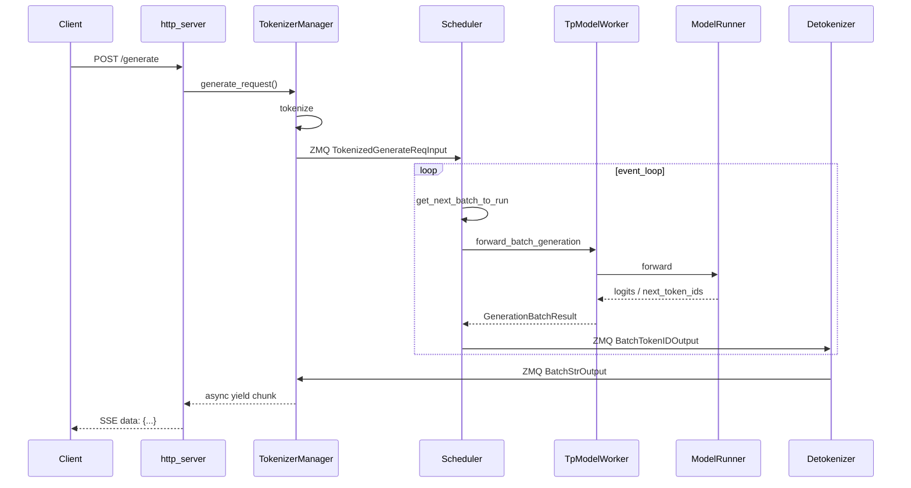

# 全链路请求追踪

> CLI → HTTP → TokenizerManager → Scheduler → ModelRunner → Detokenizer → 响应 
> 每一 hop 嵌入源码，ETC 格式

本文追踪一条 **HTTP POST `/generate` 流式请求** 的完整生命周期（非 gRPC、非 PD 分离、非投机解码的 baseline 路径）。高级特性在各 hop 标注扩展点。

---

## 总览时序



---

## Hop 0 · CLI 启动服务

用户执行 `sglang serve --model-path meta-llama/Llama-3.1-8B-Instruct`，CLI 解析参数并 spawn 引擎。

**Explain：** 此 hop 在请求到达前完成；HTTP 端口监听由 `_setup_and_run_http_server` 建立。

**Code：**

```python
# 来源：python/sglang/cli/serve.py L123-L128
            from sglang.launch_server import run_server
            from sglang.srt.server_args import prepare_server_args

            server_args = prepare_server_args(dispatch_argv)

            run_server(server_args)
```

**Comment：** `prepare_server_args` 解析 `--tp-size`、`--mem-fraction` 等全部 server 参数。

```python
# 来源：python/sglang/srt/entrypoints/http_server.py L2494-L2506
    # Launch subprocesses
    (
        tokenizer_manager,
        template_manager,
        port_args,
        scheduler_init_result,
        subprocess_watchdog,
    ) = Engine._launch_subprocesses(
        server_args=server_args,
        init_tokenizer_manager_func=init_tokenizer_manager_func,
        run_scheduler_process_func=run_scheduler_process_func,
        run_detokenizer_process_func=run_detokenizer_process_func,
    )
```

**Comment：** `_launch_subprocesses` 在此 hop 启动 Scheduler 与 Detokenizer 子进程并初始化 ZMQ 端口。

---

## Hop 1 · HTTP 接收请求

FastAPI 路由 `/generate` 接收 JSON body，反序列化为 `GenerateReqInput`。

**Explain：** 流式请求走 `StreamingResponse`；非流式则 await generator 收集全部 chunk。

**Code：**

```python
# 来源：python/sglang/srt/entrypoints/http_server.py L785-L801
@app.api_route(
    "/generate",
    methods=["POST", "PUT"],
    response_class=SGLangORJSONResponse,
)
async def generate_request(obj: GenerateReqInput, request: Request):
    """Handle a generate request."""
    if envs.SGLANG_ENABLE_REQUEST_HEADER_OVERRIDES.get():
        apply_header_overrides(obj, request.headers)
    if obj.stream:

        async def stream_results() -> AsyncIterator[bytes]:
            try:
                async for out in _global_state.tokenizer_manager.generate_request(
                    obj, request
                ):
                    yield b"data: " + dumps_json(out) + b"\n\n"
```

**Comment：** SSE 格式：`data: {json}\n\n` 结尾 `[DONE]`。客户端断开时 HTTP 层 catch ValueError 并静默结束。

---

## Hop 2 · TokenizerManager 处理

主进程中的 TokenizerManager：normalize 请求 → tokenize → ZMQ 发送到 Scheduler → 等待 Detokenizer 结果 → yield 给 HTTP。

**Explain：** `generate_request` 是 async generator；每个 decode step 产出一个 chunk dict。

**Code：**

```python
# 来源：python/sglang/srt/managers/tokenizer_manager.py L589-L633
    async def generate_request(
        self,
        obj: Union[GenerateReqInput, EmbeddingReqInput],
        request: Optional[fastapi.Request] = None,
    ):
        self.auto_create_handle_loop()

        # Normalize the request
        obj.normalize_batch_and_arguments()
        self._set_default_priority(obj)

        if isinstance(obj, GenerateReqInput) and obj.routed_dp_rank is not None:
            dp_size = self.server_args.dp_size
            if dp_size <= 1 and obj.routed_dp_rank == 0:
                logger.debug(
                    f"routed_dp_rank={obj.routed_dp_rank} is ignored because dp_size={dp_size}"
                )
            elif obj.routed_dp_rank < 0 or obj.routed_dp_rank >= dp_size:
                raise ValueError(
                    f"routed_dp_rank={obj.routed_dp_rank} out of range [0, {dp_size})"
                )

        self._init_req_state(obj, request)
        try:
            if self.server_args.language_only:
                self._handle_epd_disaggregation_encode_request(obj)

            # Log the request
            self.request_logger.log_received_request(obj, self.tokenizer, request)

            async with self.is_pause_cond:
                await self.is_pause_cond.wait_for(lambda: not self.is_pause)

            async with self.model_update_lock.reader_lock:
                await self._validate_and_resolve_lora(obj)

                # Tokenize the request and send it to the scheduler
                if obj.is_single:
                    tokenized_obj = await self._tokenize_one_request(obj)
                    state = self.rid_to_state[obj.rid]
                    if obj.return_prompt_token_ids:
                        state.prompt_token_ids = list(tokenized_obj.input_ids)
                    self._send_one_request(tokenized_obj)
                    async for response in self._wait_one_response(obj, request):
                        yield response
```

**Comment：** `_send_one_request` 通过 ZMQ push 到 Scheduler input socket；`_wait_one_response` 从 Detokenizer 返回队列 async 读取。

**扩展点：**
- LoRA：`_validate_and_resolve_lora`
- 多模态：tokenize 前调用 mm processor
- DP：`routed_dp_rank` 路由到特定 Scheduler

---

## Hop 3 · Scheduler 调度

Scheduler 子进程 event loop：收请求 → 入 waiting queue → 组 batch → run_batch → 发 token 到 Detokenizer。

**Explain：** 新请求在 `process_input_requests` 中创建 `Req` 对象，做 prefix match 后进入 waiting 或 running batch。

**Code：**

```python
# 来源：python/sglang/srt/managers/scheduler.py L1521-L1540
    def event_loop_normal(self):
        """A normal scheduler loop."""
        while True:
            if self.gracefully_exit:
                break

            # Receive requests
            recv_reqs = self.request_receiver.recv_requests()
            self.process_input_requests(recv_reqs)
            if self._engine_paused:
                continue

            # Get the next batch to run
            batch = self.get_next_batch_to_run()
            self.cur_batch = batch

            # Launch the current batch
            if batch:
                result = self.run_batch(batch)
                self.process_batch_result(batch, result)
```

**Comment：** `process_batch_result` 把 next_token_ids 打包为 `BatchTokenIDOutput` ZMQ 发给 Detokenizer。

**组 batch 核心：**

```python
# 来源：python/sglang/srt/managers/scheduler.py L2586-L2607
    def get_next_batch_to_run(self) -> Optional[ScheduleBatch]:
        self.process_pending_chunked_abort()

        if self.enable_fpm:
            self._fpm_batch_t0 = time.monotonic()
        self._abort_on_waiting_timeout()
        self._abort_on_running_timeout()
        if self.dllm_config is not None:
            self.dllm_manager.filter_finished_reqs()

        # Merge the prefill batch into the running batch
        chunked_req_to_exclude = set()

        if self.dllm_config is not None and self.dllm_manager.any_staging_reqs():
            chunked_req_to_exclude.update(self.dllm_manager.staging_queue)
            for req in self.dllm_manager.staging_queue:
                self.stash_chunked_request(req)

        if self.chunked_req is not None:
            # Move the chunked request out of the batch so that we can merge
            # only finished requests to running_batch.
            chunked_req_to_exclude.add(self.chunked_req)
```

**Comment：** 连续批处理的精髓：prefill 新请求与 decode 中请求合并为同一 ScheduleBatch。

---

## Hop 4 · TpModelWorker 物化 ForwardBatch

Scheduler 调用 TP Worker 执行 GPU 前向。

**Explain：** `ForwardBatch.init_new` 把 ScheduleBatch 的 CPU 结构转为 GPU 张量（input_ids、seq_lens、kv_indices 等）。

**Code：**

```python
# 来源：python/sglang/srt/managers/tp_worker.py L491-L510
        if batch is not None:
            # update the consumer index of hicache to the running batch
            self.set_hicache_consumer(batch.hicache_consumer_index)

            forward_batch = ForwardBatch.init_new(batch, self.model_runner)
        else:
            # FIXME(lsyin): unify the interface of forward_batch
            assert forward_batch is not None

        # Deprecated kwarg: pre-planners mark the batch themselves now.
        forward_batch.apply_deprecated_skip_attn_backend_init(skip_attn_backend_init)

        if self.is_dllm():
            return self._forward_batch_generation_dllm(forward_batch)

        if self.pp_group.is_last_rank:
            out = self.model_runner.forward(
                forward_batch,
                pp_proxy_tensors=pp_proxy_tensors,
            )
```

**Comment：** PP 非末 rank 只做 forward 不传 logits 回 Scheduler。

---

## Hop 5 · ModelRunner GPU 前向

ModelRunner 调用具体模型（如 LlamaForCausalLM），每层 RadixAttention 读写 KV cache，末层输出 logits，采样 next token。

**Explain：** EXTEND 模式计算 prompt KV 并写入 pool；DECODE 模式只算最后一个 token 的 KV。

**Code：**

```python
# 来源：python/sglang/srt/model_executor/model_runner.py L2954-L2965
    def forward(
        self,
        forward_batch: ForwardBatch,
        skip_attn_backend_init: Optional[bool] = None,  # deprecated
        pp_proxy_tensors: Optional[PPProxyTensors] = None,
        reinit_attn_backend: bool = False,
        split_forward_count: int = 1,
    ) -> ModelRunnerOutput:
        # Deprecated kwarg: pre-planners mark the batch themselves now.
        forward_batch.apply_deprecated_skip_attn_backend_init(skip_attn_backend_init)

        self.forward_pass_id += 1
```

**Comment：** CUDA Graph replay 路径跳过部分 Python 开销，条件由 `can_run_cuda_graph` 反馈。

**RadixAttention 层（KV 读写）：**

```python
# 来源：python/sglang/srt/layers/radix_attention.py L57-L60
class RadixAttention(nn.Module):
    """
    The attention layer implementation.
    """
```

**Comment：** forward 内按 `forward_batch.attn_backend` 分发 FlashInfer/Triton kernel。

---

## Hop 6 · Detokenizer 解码

Scheduler 发送 `BatchTokenIDOutput`；Detokenizer 子进程增量 decode 为 string。

**Explain：** 每个 rid 维护 DecodeStatus offset；只 decode 新增 token，处理 UTF-8 边界。

**Code：**

```python
# 来源：python/sglang/srt/managers/detokenizer_manager.py L161-L168
    def event_loop(self):
        """The event loop that handles requests"""
        while True:
            with self.soft_watchdog.disable():
                recv_obj = sock_recv(self.recv_from_scheduler)
            output = self._request_dispatcher(recv_obj)
            if output is not None:
                sock_send(self.send_to_tokenizer, output)
```

```python
# 来源：python/sglang/srt/managers/detokenizer_manager.py L406-L419
    def handle_batch_token_id_out(self, recv_obj: BatchTokenIDOutput):
        # If handling idle batch, set output_strs to [].
        output_strs = (
            self._decode_batch_token_id_output(recv_obj)
            if len(recv_obj.rids) > 0
            else []
        )
        routed_experts = self._b64_encode_per_request(recv_obj.routed_experts)
        indexer_topk = self._b64_encode_per_request(recv_obj.indexer_topk)
        return BatchStrOutput(
            rids=recv_obj.rids,
            http_worker_ipcs=recv_obj.http_worker_ipcs,
            finished_reasons=recv_obj.finished_reasons,
            output_strs=output_strs,
```

**Comment：** `output_strs[i]` 是第 i 个 rid 的本 step 增量文本（非全量）。

---

## Hop 7 · 响应返回客户端

TokenizerManager 收到 BatchStrOutput，组装 response dict，yield 到 HTTP generator，SSE 推给客户端。

**Explain：** 流式响应每 step 一个 JSON chunk，含 `text` 增量、`meta_info`（cached_tokens 等）、`finished_reason`（若结束）。

**Code：**

```python
# 来源：python/sglang/srt/entrypoints/http_server.py L797-L801
            try:
                async for out in _global_state.tokenizer_manager.generate_request(
                    obj, request
                ):
                    yield b"data: " + dumps_json(out) + b"\n\n"
```

**Comment：** 请求完成且 stream 结束后 yield `[DONE]`。

---

## 高级路径分叉表

| 特性 | 分叉 hop | 关键变化 |
|------|----------|----------|
| 投机解码 | Hop 4–5 | Worker 换 EAGLEWorkerV2；mode=TARGET_VERIFY |
| PD 分离 | Hop 3 | Prefill 节点 send KV；Decode 节点 PREBUILT batch |
| gRPC | Hop 1 | Rust SglangServiceImpl → RuntimeHandle 替代 HTTP |
| LoRA | Hop 2 | `_validate_and_resolve_lora` 加载 adapter |
| Grammar | Hop 5 | logits 乘 vocab mask |
| 前缀缓存命中 | Hop 3 | match_prefix 跳过部分 extend |

---

## 自检清单

读完本文，你应能回答：

1. 哪三个组件跑在主进程？（HTTP、TokenizerManager、?）—— 没有第三个计算组件，Scheduler/Detokenizer 是子进程
2. Scheduler 与 Detokenizer 用什么通信？（ZMQ）
3. 流式输出的文本在哪个 hop 首次变成 string？（Hop 6 Detokenizer）
4. GPU 前向在哪个 hop 触发？（Hop 5 ModelRunner）
