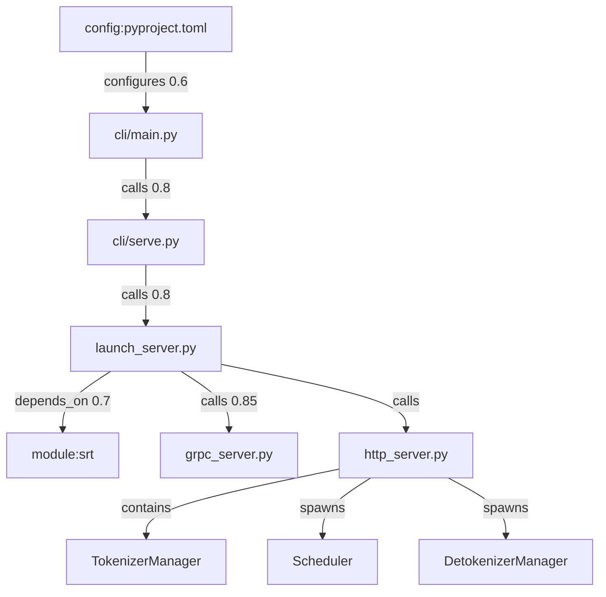
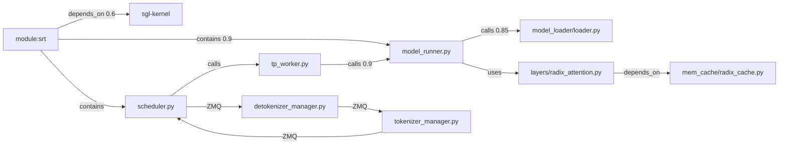
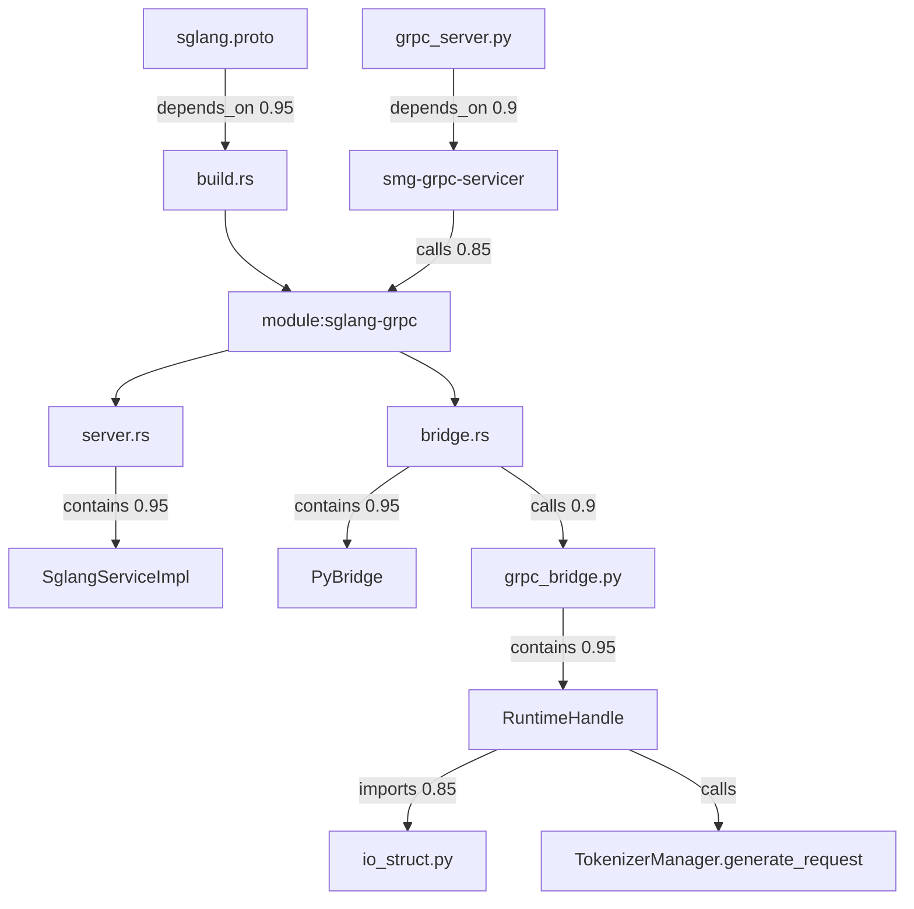
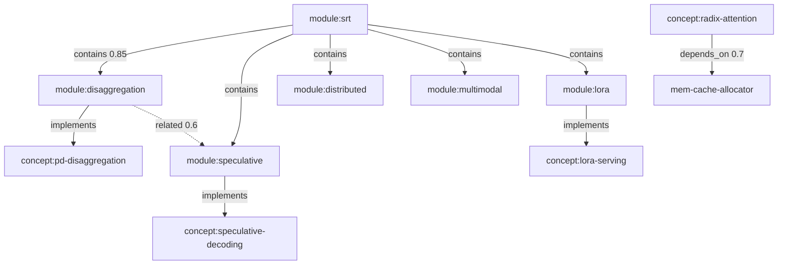
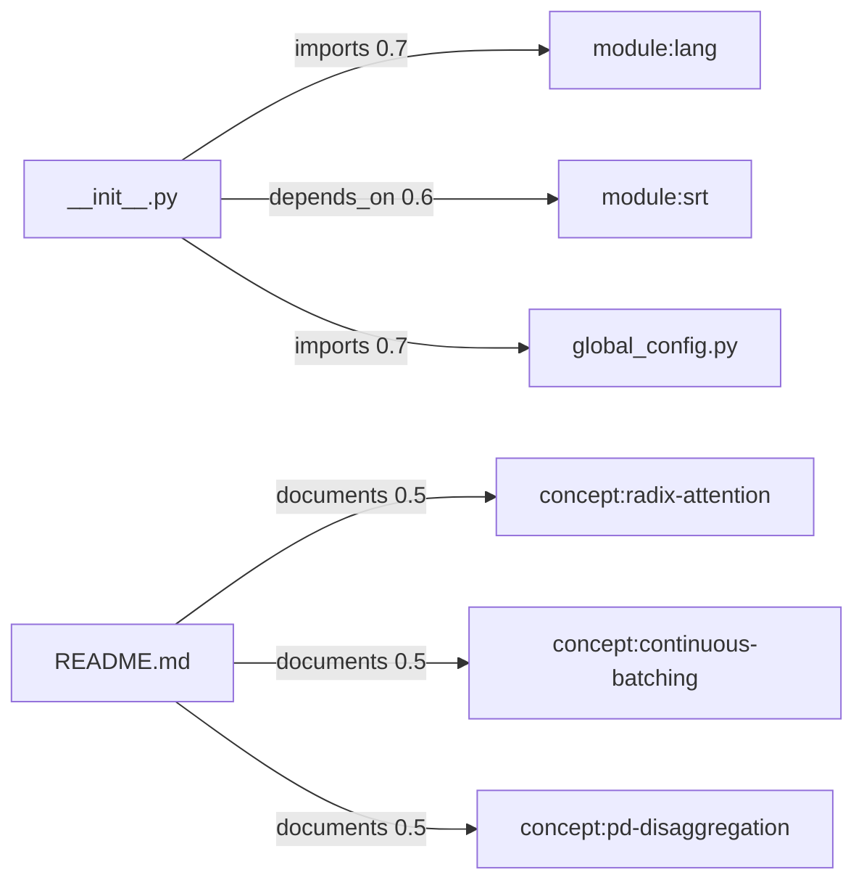

# 模块依赖图

> Mermaid 拓扑 + 关键 import/call 依赖关系

---

## 启动链依赖（CLI → SRT）

**说明：** 实线箭头表示调用或依赖关系；括号内权重表示关系强弱，仅作阅读优先级参考。HTTP 是默认路径，gRPC 为可选分支。

---

## 运行时核心依赖

---

## gRPC 跨语言依赖

**Explain：** Rust 侧不直接 import Python 模块；PyO3 在 runtime 加载 `RuntimeHandle` 实例。Proto 是 gateway 与 server 的共享契约。

---

## 高级特性模块依赖

---

## 公共 API 依赖

---

## 关键依赖表

| Source | Target | Type | Weight | 含义 |
|--------|--------|------|--------|------|
| cli/main.py | cli/serve.py | calls | 0.8 | CLI 子命令分发 |
| cli/serve.py | launch_server.py | calls | 0.8 | LLM 启动 |
| launch_server.py | grpc_server.py | calls | 0.85 | gRPC 模式 |
| detokenizer_manager.py | incremental-decoding | implements | 0.9 | 增量解码实现 |
| forward_batch_info.py | forward-mode | implements | 0.9 | ForwardMode 定义 |
| radix-attention | radix_cache.py | implements | 0.9 | 前缀 cache 后端 |
| speculative-decoding | module:speculative | implements | 0.9 | 投机模块 |
| pd-disaggregation | module:disaggregation | implements | 0.9 | PD 模块 |
| lora-serving | module:lora | implements | 0.9 | LoRA 模块 |
| ModelRunner | model_loader/loader.py | calls | 0.85 | 权重加载 |
| bridge.rs | grpc_bridge.py | calls | 0.9 | PyO3 桥 |
| grpc-py-bridge | PyBridge | related | 0.9 | 概念↔类 |
| grpc-py-bridge | RuntimeHandle | related | 0.9 | 概念↔类 |

---

## 读图建议

1. **纵向追请求：** 从 `http_server → tokenizer_manager → scheduler → tp_worker → model_runner` 沿 calls 边向下
2. **横向追特性：** 从 `concept:*` 节点沿 implements 边找到模块，再沿 contains 找文件
3. **跨语言：** gRPC 子图独立阅读，注意 Rust→Python 边方向是 runtime 动态调用而非静态 import

完整节点列表见 [[05-文件地图]]；概念释义见 [[术语表]]。
