# SGLang 源码 30 批次渐进式阅读计划

> 目标：在 `sglang_reading/` 目录中逐步建立**自包含**的中文源码讲解体系——读者**只读 sglang_reading，不读 sglang**。  
> 方法：每批次聚焦一个可验收子系统，产出「讲解 + 内嵌源码」交织的文档，并同步更新知识图谱。

> **现行版本（2026-07-02）：** 项目已由原 **30 批**扩展至 **32 批**（新增批次 31 可观测性、32 CheckpointEngine 权重热更新）。本文标题保留「30 批」历史表述；**总批次数与完成进度以 [[progress]] 为准**。下文「批次 30」仍指索引收官批，不表示总批次数。

---

## 〇、合规性说明（对照你的要求与 Skills）

### 你的要求：只读 sglang_reading，文档必须含源码

| 检查项 | 旧计划 | 修订后 |
|--------|--------|--------|
| 读者是否需要打开 `sglang/` | ❌ 隐含需要（仅「行号引用」） | ✅ **不需要**；源码内嵌在 sglang_reading 文档中 |
| 源码呈现方式 | ❌ 「至少 5 处行号引用」（可点击跳转） | ✅ **内嵌完整代码块** + 路径/行号标注 + 中文逐段讲解 |
| 概念/数据流文档是否含代码 | ❌ 未强制 | ✅ **所有 5 个标准文档**均须含内嵌源码 |
| 自包含验收 | ❌ 无 | ✅ checkpoint 含「不打开 sglang 能读懂本模块」 |

### Skills 合规（understand-anything 系列）

| Skill | 要求 | 本计划如何满足 |
|-------|------|----------------|
| `/understand` | 生成 `knowledge-graph.json`（layers、tour、nodes、edges） | 批次 0（前置）+ 每 5 批增量更新；**批次 30** 将 tour/layers 写入 sglang_reading 索引 |
| `/understand-explain` | 角色、内部结构、外部连接、数据流、面向非专家讲解 | 映射到每批 `01`–`04` 四文档的**固定章节**（见 §六） |
| `/understand-onboard` | 总览、架构层、关键概念、导览、文件地图、复杂度热点 | **批次 30** 产出对应 6 篇索引文档 |
| `/understand-domain` | 业务域流程图 | 每 5 批更新；**批次 30** 写入 `业务域流程.md` |
| 语言 | `--language zh` | 全部 sglang_reading 文档与图谱节点描述使用中文 |

**前置条件：** 开始批次 01 写作前，须对 `sglang/` 至少运行一次 `/understand --language zh`（或每 5 批增量）。图谱是**写作侧**工具，读者不直接阅读 JSON。

---

## 一、总体架构（原 30 批分 7 阶段；现行 32 批，见 progress.md）

```mermaid
flowchart TB
    subgraph P1["阶段 I：地基（批 1–5）"]
        B1[项目总览]
        B2[启动链路]
        B3[HTTP Server]
        B4[OpenAI API]
        B5[gRPC/Proto]
    end

    subgraph P2["阶段 II：调度（批 6–10）"]
        B6[TokenizerManager]
        B7[Scheduler]
        B8[SchedulePolicy]
        B9[ScheduleBatch/IO]
        B10[Detokenizer]
    end

    subgraph P3["阶段 III：执行（批 11–14）"]
        B11[ModelRunner]
        B12[ModelLoader]
        B13[Models 通用]
        B14[Models 专用]
    end

    subgraph P4["阶段 IV：内存与算子（批 15–19）"]
        B15[RadixAttention]
        B16[KV Cache]
        B17[Attention]
        B18[MoE]
        B19[Quantization]
    end

    subgraph P5["阶段 V：高级特性（批 20–23）"]
        B20[Sampling]
        B21[Speculative]
        B22[Disaggregation]
        B23[Distributed]
    end

    subgraph P6["阶段 VI：扩展（批 24–29）"]
        B24[Multimodal]
        B25[LoRA]
        B26[sgl-kernel]
        B27[model-gateway]
        B28[Frontend lang]
        B29[multimodal_gen]
    end

    subgraph P7["阶段 VII：收官（批 30）"]
        B30[全链路复盘]
    end

    P1 --> P2 --> P3 --> P4 --> P5 --> P6 --> P7
```



---

## 二、每批次标准交付物

每完成一批，必须在对应目录下产出。**五篇正文均须内嵌源码**，不得仅写路径或行号链接。

| 文件 | 内容 | 内嵌源码要求 |
|------|------|--------------|
| `README.md` | 概述、目标、衔接；含**本批最关键的一段入口代码** | ≥ 1 段（10–30 行） |
| `01-核心概念.md` | 术语、设计动机、架构位置（对齐 understand-explain「角色」） | ≥ 2 段示例代码 |
| `02-源码走读.md` | 按调用顺序精读（对齐「内部结构」） | **主文档**：≥ 8 段，覆盖本批全部关键函数/类 |
| `03-数据流与交互.md` | IO、消息、上下游（对齐「外部连接 + 数据流」） | ≥ 3 段（数据结构定义 + 调用处） |
| `04-关键问题.md` | FAQ、易错点、对比 | ≥ 2 段（用代码说明「易错写法 vs 正确写法」） |
| `checkpoint.md` | 验收清单 | — |

**每批内嵌源码总量下限：≥ 15 段代码块，合计 ≥ 200 行**（大模块如 Scheduler、Attention 可至 400+ 行）。

**checkpoint 模板：**

```markdown
- [ ] 不打开 sglang/ 目录，仅读本批 sglang_reading 文档，能说明本模块职责
- [ ] 能画出本模块在全局架构中的位置
- [ ] 能说出 3 个核心类/函数及其职责（文档中均有对应内嵌代码）
- [ ] 能追踪一条典型请求经过本模块的完整路径（文档中有逐步代码+讲解）
- [ ] 五篇正文合计 ≥ 15 段内嵌源码，且每段后有中文讲解
- [ ] 已更新 progress.md 与本批状态
```

**图谱更新节点（每 5 批）：**

- 批次 5、10、15、20、25、30 完成后，对 `sglang/.understand-anything/` 运行 `/understand` 增量更新，或手动补充对应子域节点。

---

## 三、批次详细计划（原 30 批 + 扩展 31–32）

### 阶段 I：地基 —— 从「怎么跑起来」到「请求怎么进来」（批 1–5）

| 批 | 主题 | 源码范围 | 产出目录 | 预估工时 |
|----|------|----------|----------|----------|
| **01** | 项目总览与阅读方法论 | `README.md`, `python/pyproject.toml`, `python/sglang/README.md`, 顶层目录 | `sglang_reading/00-方法论/` | 2h |
| **02** | 启动链路与 CLI | `launch_server.py`, `cli/`, `srt/server_args.py`, `srt/plugins/` | `sglang_reading/01-启动与入口/02-启动链路/` | 3h |
| **03** | HTTP Server 入口 | `srt/entrypoints/http_server.py`, `srt/entrypoints/engine.py` | `sglang_reading/01-启动与入口/03-HTTP-Server/` | 4h |
| **04** | OpenAI API 兼容层 | `srt/entrypoints/openai/`, `srt/entrypoints/ollama/` | `sglang_reading/01-启动与入口/04-OpenAI-API/` | 4h |
| **05** | gRPC 与 Proto | `srt/entrypoints/grpc_server.py`, `srt/grpc/`, `proto/`, `rust/sglang-grpc/` | `sglang_reading/01-启动与入口/05-gRPC-Proto/` | 3h |

**阶段 I 结束验收：** 能口述「用户执行 `sglang serve` 到 HTTP 收到第一个 token」的完整启动与路由路径。

---

### 阶段 II：调度 —— 请求如何变成 Batch（批 6–10）

| 批 | 主题 | 源码范围 | 产出目录 | 预估工时 |
|----|------|----------|----------|----------|
| **06** | TokenizerManager | `srt/managers/tokenizer_manager.py`, `*_mixin.py`, `srt/tokenizer/` | `sglang_reading/02-请求调度/06-TokenizerManager/` | 4h |
| **07** | Scheduler 核心 | `srt/managers/scheduler.py`, `scheduler_*_mixin.py` | `sglang_reading/02-请求调度/07-Scheduler/` | 5h |
| **08** | 调度策略 | `srt/managers/schedule_policy.py`, `prefill_delayer.py`, `min_free_slots_delayer.py` | `sglang_reading/02-请求调度/08-SchedulePolicy/` | 3h |
| **09** | Batch 与 IO 结构 | `srt/managers/schedule_batch.py`, `io_struct.py`, `embed_types.py` | `sglang_reading/02-请求调度/09-ScheduleBatch-IO/` | 4h |
| **10** | Detokenizer 与输出 | `srt/managers/detokenizer_manager.py`, `srt/managers/communicator.py` | `sglang_reading/02-请求调度/10-Detokenizer/` | 3h |

**阶段 II 结束验收：** 能画出 TokenizerManager → Scheduler → TP Worker → Detokenizer 的消息流时序图。

---

### 阶段 III：执行 —— 模型如何跑 forward（批 11–14）

| 批 | 主题 | 源码范围 | 产出目录 | 预估工时 |
|----|------|----------|----------|----------|
| **11** | ModelRunner 与执行器 | `srt/model_executor/`, `srt/managers/tp_worker.py` | `sglang_reading/03-模型执行/11-ModelRunner/` | 5h |
| **12** | 模型加载 | `srt/model_loader/`, `srt/weight_sync/` | `sglang_reading/03-模型执行/12-ModelLoader/` | 4h |
| **13** | 通用模型实现 | `srt/models/llama*.py`, `qwen*.py`, `registry` 机制 | `sglang_reading/03-模型执行/13-Models-通用/` | 5h |
| **14** | 专用模型实现 | `srt/models/deepseek*`, `mllama`, `gemma` 等 | `sglang_reading/03-模型执行/14-Models-专用/` | 5h |

**阶段 III 结束验收：** 能说明一次 decode step 从 `ScheduleBatch` 到 logits 输出的调用栈。

---

### 阶段 IV：内存与算子 —— SGLang 性能核心（批 15–19）

| 批 | 主题 | 源码范围 | 产出目录 | 预估工时 |
|----|------|----------|----------|----------|
| **15** | RadixAttention 与前缀缓存 | `srt/mem_cache/` 顶层、`radix_cache`, `unified_cache` | `sglang_reading/04-内存与Attention/15-RadixAttention/` | 5h |
| **16** | KV Cache 分配与存储 | `srt/mem_cache/allocator/`, `pool_host/`, `storage/` | `sglang_reading/04-内存与Attention/16-KV-Cache/` | 4h |
| **17** | Attention 后端 | `srt/layers/attention/`, `flashinfer`, `triton` backends | `sglang_reading/04-内存与Attention/17-Attention/` | 6h |
| **18** | MoE 层 | `srt/layers/moe/`, `srt/eplb/` | `sglang_reading/04-内存与Attention/18-MoE/` | 5h |
| **19** | 量化 | `srt/layers/quantization/` (AWQ/GPTQ/FP8/FP4) | `sglang_reading/04-内存与Attention/19-Quantization/` | 4h |

**阶段 IV 结束验收：** 能解释 RadixAttention 如何实现 prefix sharing，以及与 vLLM PagedAttention 的差异。

---

### 阶段 V：高级特性 —— 生产级能力（批 20–23）

| 批 | 主题 | 源码范围 | 产出目录 | 预估工时 |
|----|------|----------|----------|----------|
| **20** | Sampling 与约束解码 | `srt/sampling/`, `srt/constrained/`, `srt/parser/` | `sglang_reading/05-高级特性/20-Sampling/` | 4h |
| **21** | 投机解码 | `srt/speculative/` (EAGLE, NGRAM, DFlash, MTP) | `sglang_reading/05-高级特性/21-Speculative/` | 5h |
| **22** | Prefill-Decode 分离 | `srt/disaggregation/`, `srt/managers/disagg_service.py` | `sglang_reading/05-高级特性/22-Disaggregation/` | 5h |
| **23** | 分布式并行 | `srt/distributed/`, `data_parallel_controller.py`, `elastic_ep/` | `sglang_reading/05-高级特性/23-Distributed/` | 5h |

**阶段 V 结束验收：** 能对比 continuous batching、speculative decoding、PD disaggregation 三者的触发点与收益。

---

### 阶段 VI：扩展组件 —— 生态与硬件（批 24–29）

| 批 | 主题 | 源码范围 | 产出目录 | 预估工时 |
|----|------|----------|----------|----------|
| **24** | 多模态 VLM | `srt/multimodal/`, `managers/multimodal_processor.py` | `sglang_reading/06-扩展组件/24-Multimodal/` | 4h |
| **25** | LoRA | `srt/lora/` | `sglang_reading/06-扩展组件/25-LoRA/` | 3h |
| **26** | sgl-kernel | `sgl-kernel/csrc/`, `sgl-kernel/python/` | `sglang_reading/06-扩展组件/26-sgl-kernel/` | 6h |
| **27** | sgl-model-gateway | `sgl-model-gateway/src/` | `sglang_reading/06-扩展组件/27-model-gateway/` | 4h |
| **28** | Frontend 编程接口 | `python/sglang/lang/` (IR, interpreter, backend) | `sglang_reading/06-扩展组件/28-Frontend-lang/` | 4h |
| **29** | 扩散模型 runtime | `python/sglang/multimodal_gen/` | `sglang_reading/06-扩展组件/29-multimodal_gen/` | 4h |

**阶段 VI 结束验收：** 能说明 Python runtime、CUDA kernel、Rust gateway 三层的分工边界。

---

### 阶段 VII：收官（批 30）

| 批 | 主题 | 源码范围 | 产出目录 | 预估工时 |
|----|------|----------|----------|----------|
| **30** | 全链路复盘与索引 | 回顾批 1–29，整合 `.understand-anything/` 图谱 | `sglang_reading/07-总结与索引/` | 6h |

**批次 30 额外交付（全部须含内嵌源码与讲解，对齐 understand-onboard + understand-domain）：**

| 文件 | 对应 Skill | 说明 |
|------|-----------|------|
| `01-项目总览.md` | understand-onboard § Overview | 含 pyproject/launch 等关键配置代码片段 |
| `02-架构分层.md` | understand-onboard § Layers | 每层配 1 段代表代码 |
| `03-关键概念.md` | understand-onboard § Key Concepts | 每个概念配代码示例 |
| `04-导读路径.md` | understand tour | 每步含该步核心代码内嵌 |
| `05-文件地图.md` | understand-onboard § File Map | 每文件 3–5 行代码 + 一句话职责 |
| `06-复杂度热点.md` | understand-onboard § Hotspots | 热点函数完整内嵌 + 为何复杂 |
| `全链路请求追踪.md` | — | 端到端路径，**每跳**内嵌代码 |
| `模块依赖图.md` | understand layers/edges | Mermaid + 关键 import 代码 |
| `术语表.md` | — | 术语 + 首次出现处的代码片段 |
| `业务域流程.md` | understand-domain | 业务流程每步内嵌入口代码 |

---

## 四、执行节奏建议

| 节奏 | 说明 |
|------|------|
| **每周 2 批** | 约 15 周完成，适合业余精读 |
| **每周 3 批** | 约 10 周完成，适合全职阅读 |
| **每 5 批复盘** | 运行 `/understand --language zh` 增量更新知识图谱 |
| **每 10 批大复盘** | 重读 `checkpoint.md`，修正前后矛盾表述 |

---

## 五、Skills 工作流（写作侧，每批必做）

> 以下步骤由**文档维护者/Agent** 执行；**读者不参与**。

```text
0. （前置）/understand --language zh [sglang/]  → 生成知识图谱
1. /understand-explain <关键文件>               → 产出讲解草稿（角色/结构/连接/数据流）
2. 从 sglang 提取源码 → 内嵌到 sglang_reading 五篇正文  → 禁止只写「见 xxx.py:42」
3. /understand-domain（每 5 批）                → 业务域流程 → 写入本阶段 README 或 03 文档
4. 对照图谱 layers/tour 检查本批是否遗漏关键节点
5. 填写 checkpoint.md → 用「只读 sglang_reading」标准自测 → 更新 progress.md
```

**知识图谱路径：** `F:\源码阅读\sglang\.understand-anything\knowledge-graph.json`

**语言配置：** 所有文档与图谱节点描述使用中文（`--language zh`）。

---

## 六、文档写作规范（sglang_reading 自包含）

### 6.1 讲解与源码交织格式（强制）

每一小节采用 **ETC 三段式**：

1. **Explain** — 用中文说明「这段代码要解决什么问题」
2. **Code** — 内嵌源码（见 6.2）
3. **Comment** — 逐行或逐块解释；标注变量含义、分支原因、与上下游的交互

**反例（禁止）：**

```markdown
启动逻辑见 `python/sglang/launch_server.py` 第 15–51 行。
```

**正例（必须）：**

```markdown
`launch_server.py` 根据 `server_args` 选择 HTTP / gRPC / Ray / Encoder 四条启动路径：

```python
# 来源：python/sglang/launch_server.py L15-L51
def run_server(server_args):
    if server_args.encoder_only:
        ...
    elif server_args.grpc_mode:
        ...
    elif server_args.use_ray:
        ...
    else:
        from sglang.srt.entrypoints.http_server import launch_server
        launch_server(server_args)
```

**解读：** 默认走 `else` 分支，即 HTTP 模式；`grpc_mode` 与 `encoder_only` 为专用部署形态……
```

### 6.2 内嵌代码块格式

```markdown
​```python
# 来源：python/sglang/srt/managers/scheduler.py L120-L145
# 提交版本：70df09b（可选，便于维护者 diff）
def event_loop_normal(self):
    ...
​```
```

- 语言标签：`python` / `rust` / `cpp` / `protobuf` 等
- 第一行注释：**来源路径 + 行号**（维护者用，读者可忽略）
- 代码须**可独立阅读**：过长时用 `# ... 省略 ...` 标出，但**关键分支必须保留**
- 禁止只贴 1–2 行无上下文片段（除非该行本身即核心，如常量定义）

### 6.3 与 `/understand-explain` 的章节映射

| understand-explain 输出维度 | sglang_reading 文档位置 |
|----------------------------|------------------|
| 架构角色（哪一层、为何存在） | `01-核心概念.md` § 架构位置 |
| 内部结构（类/函数/contains） | `02-源码走读.md` 全文 |
| 外部连接（imports/calls/depends_on） | `03-数据流与交互.md` § 上下游 |
| 数据流（输入→处理→输出） | `03-数据流与交互.md` § 数据流 |
| 模式/idiom/复杂度 | `04-关键问题.md` |

### 6.4 与 `/understand-onboard` 的映射（批次 30）

| onboard 章节 | 批次 30 产出文件 |
|--------------|------------------|
| Project Overview | `07-总结与索引/01-项目总览.md` |
| Architecture Layers | `07-总结与索引/02-架构分层.md` |
| Key Concepts | `07-总结与索引/03-关键概念.md` |
| Guided Tour | `07-总结与索引/04-导读路径.md`（来自图谱 tour） |
| File Map | `07-总结与索引/05-文件地图.md` |
| Complexity Hotspots | `07-总结与索引/06-复杂度热点.md` |

批次 30 额外：`全链路请求追踪.md`、`模块依赖图.md`、`术语表.md`、`业务域流程.md`。

---

## 七、优先级与可裁剪说明

若时间有限，**不可跳过**的批次：01, 02, 03, 06, 07, 11, 15, 17, 30。

可**延后**的批次：14（专用模型）、26–29（扩展组件），可在掌握主链路后再读。

---

## 八、下一步

从 **[[00-方法论-00-MOC|批次 01]]** 开始。完成每批后更新 [[progress]]。
