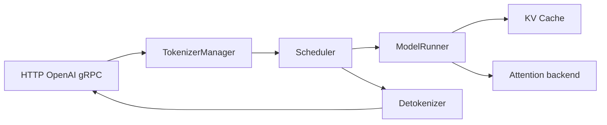

# SGLang 学习指南

## 你为什么要读

对调用方来说，推理像一次函数调用；对 SGLang 来说，它是一份不断改写的资源申请：先要 tokenization，再要调度位置、KV slot、GPU forward 和输出事件。这套文档帮助你沿同一条请求理解 Scheduler 如何组织 prefill/decode、KV Cache 如何分配和复用、ModelRunner 如何进入 GPU，以及生产特性在哪个边界改变主线。

## 第一次阅读

不要按目录读完全部专题。先走短路径：

1. [[LLM推理与Token]]
2. [[推理Serving主线]]
3. [[SGLang-项目总览]]
4. [[SGLang-HTTP请求全链路]]，只读开头模型、对象表和复盘
5. [[SGLang-Scheduler]]
6. [[SGLang-KV-Cache]]
7. [[SGLang-Attention]]
8. [[SGLang服务实验]]

## 三种使用方式

| 当前任务 | 阅读入口 |
|----------|----------|
| 首次学习 | [[SGLang-导读与总览]] · [[SGLang-学习路径]] |
| 生产排障 | [[SGLang-生产排障]] · [[knowledge_maps/排障指南.base]] |
| 准备改代码 | [[knowledge_maps/SGLang内容.base]]，筛选 walkthrough/dataflow |

## 系统地图

## 专题入口

| 领域 | 入口 |
|------|------|
| 协议与启动 | [[SGLang-启动与入口]] |
| 请求调度 | [[SGLang-请求调度]] |
| 模型执行 | [[SGLang-模型执行]] |
| KV、Attention、MoE、量化 | [[SGLang-内存与Attention]] |
| Spec、PD、分布式、可观测 | [[SGLang-高级特性]] |
| LoRA、多模态、Gateway | [[SGLang-扩展组件]] |
| 复盘与排障 | [[SGLang-总结复盘]] |

## 完成标准

- 能沿 `GenerateReqInput -> Req -> ScheduleBatch -> ForwardBatch -> output` 复述一次请求。
- 能解释 prefill、decode、overlap、retract 和 prefix cache 的关系。
- 能用 TTFT、TPOT、KV usage 和日志定位问题层级。
- 能指出修改 Scheduler、KV allocator 或 attention backend 时必须保护的不变量。

源码基线：`70df09b`。版本差异应通过 upstream 和测试重新核对。
