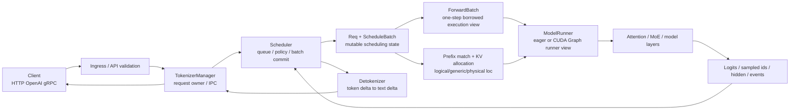

# SGLang 学习指南

## 你为什么要读

对调用方，推理像一次 API 调用；对 SGLang，它是一组跨进程、跨批次、跨 GPU step 持续演化的对象：请求先被规范化和 tokenization，再进入队列与 prefix match，获得 KV 地址与 batch 位置，变成 GPU forward view，最后以 token/text delta 和完成事件回到客户端。

真正学会 SGLang，不是记住 Scheduler、ModelRunner、RadixAttention 三个类名，而是能回答四个问题：

- 请求所有权现在在哪个进程/对象？
- 本 step 批次怎样形成，哪些状态会原地改变？
- token/KV id 怎样翻译为物理 cache 与 backend metadata？
- GPU 结果怎样安全跨 stream/process 回程并恢复为用户可见语义？

## 一张总图：四条面同时运行

这不是一条只走一次的 pipeline。Scheduler 在 prefill/decode 循环中不断改写 `Req/ScheduleBatch`；`ForwardBatch` 是某一步的执行视图；KV pool 的所有权跨多个 step；overlap/PP/PD 会让“提交本批”和“消费上批结果”交错。

## 三遍学习法

### 第一遍：沿普通请求建立主线

目标：先理解无 PD、无 speculative、无复杂并行时的一次生成请求。

1. [[LLM推理与Token]]：补 token、prefill、decode、KV cache 与 sampling 基础。
2. [[推理Serving主线]]：建立 TTFT/TPOT、continuous batching 和 backpressure。
3. [[SGLang-项目总览]]：确认进程、包与主要入口。
4. [[SGLang-HTTP请求全链路]]：沿用户请求看到首 token 与结束事件。
5. [[SGLang-TokenizerManager]]：理解 API 对象、tokenization、IPC request owner。
6. [[SGLang-Scheduler]]：理解事件循环、队列、batch 形成与结果消费。
7. [[SGLang-ScheduleBatch数据结构]]：区分长期 `Req`、可变 running batch 与一步 `ForwardBatch`。
8. [[SGLang-Detokenizer]]：理解 token delta、text delta 与 streaming chunk 的两层协议。

第一遍退出条件：不看笔记画出 `GenerateReqInput → TokenizerManager → Req → ScheduleBatch → ForwardBatch → sampled token ids → Detokenizer → API chunk`，并标出每个对象由谁持有、是否跨 step 存活。

### 第二遍：追资源与 GPU 执行

目标：解释“请求为什么能被执行”，而不只知道它被 Scheduler 选中。

1. [[SGLang-SchedulePolicy]]：排序、准入、提交和 preemption 是三个不同决策。
2. [[SGLang-RadixAttention]]：prefix match、tree ownership、lock/ref 与 eviction。
3. [[SGLang-KV-Cache]]：请求行、generic/virtual KV id、metadata 地址翻译与物理 pool。
4. [[SGLang-ModelRunner]]：borrowed `ForwardBatch` 如何变成 eager/Graph runner view。
5. [[SGLang-Attention]]：backend resolver、metadata plan 与 generic→physical KV 访问。
6. [[SGLang-通用模型]]：模型 registry、PP proxy、attention TP 与权重语义。
7. [[SGLang-ModelLoader]]：checkpoint 如何恰好一次变成 rank-local 参数。

第二遍退出条件：给定一个 decode request，能解释 token slot/KV loc 从 Scheduler 到 Attention backend 的翻译链，能区分 batch shape、runner view shape 与 CUDA Graph capture shape，并说明结果 tensor/event 的跨流存活边界。

### 第三遍：按生产特性进入分支

| 任务 | 阅读主线 | 核心边界 |
|---|---|---|
| Prefix cache/内存问题 | [[SGLang-RadixAttention]] → [[SGLang-KV-Cache]] | tree hit、private tail、lock/ref、逻辑 id、物理 pool 与释放时机 |
| Attention 性能/兼容 | [[SGLang-Attention]] → [[SGLang-ModelRunner]] | resolver、backend wrapper、metadata owner、Graph plan/replay、padding |
| MoE | [[SGLang-MoE]] → [[SGLang-专用模型]] | TopK carrier、logical/physical expert id、dispatcher ABI、placement、scaling owner |
| 量化 | [[SGLang-Quantization]] → [[SGLang-ModelLoader]] | method 决议、平台配置类、layer method、loader/postprocess、最终 kernel |
| PD 分离 | [[SGLang-PD分离]] | Gateway 双发、两套 TransferManager、handshake/metadata gate、retry |
| Gateway/多实例路由 | [[SGLang-model-gateway]] | endpoint health、routing、streaming/PD 协议，不等同 Scheduler |
| LoRA/多模态 | [[SGLang-扩展组件]] | adapter/模态状态在哪层进入，不污染普通文本基线 |
| 启动/协议 | [[SGLang-启动与入口]] | CLI/ServerArgs、HTTP/OpenAI/gRPC 是不同边界 |

第三遍没有固定顺序，但所有分支都应回到“请求对象、资源所有权、一步执行视图、回程协议”四个不变量。

## 四本账

### 请求账

记录 request id、input/output token、stream 状态、finish reason、abort、multimodal/embedding 等模式。重点不是字段列表，而是哪个对象是当前权威状态。

### 批次账

记录 waiting/running/retracted、prefill/decode、chunk、padding、PP/overlap、spec mode，以及本 step 是否新建 view、原地改写或提交结果。`ScheduleBatch` 不能被当作不可变快照。

### 资源账

记录 prefix hit、KV token loc、page/pool、host/device tier、expert/adapter/weight placement。必须区分“逻辑命中”“已分配地址”“数据已在目标设备可读”。

### 回程账

记录 sampled ids、logprobs、hidden、CPU copy、CUDA event、IPC message、detokenizer state 与 API chunk。overlap 模式下尤其要问：消费的是哪个 step 的结果，谁保证 buffer 尚未被覆盖。

## 每个专题怎样读

多数专题采用六篇结构：

| 角色 | 读者任务 |
|---|---|
| 专题入口 | 把主题放回请求全链路，确认它解决什么系统问题 |
| 核心概念 | 建立对象、所有权、不变量与失效边界 |
| 数据流 | 沿 request/batch/tensor/KV/weight 生命周期追状态 |
| 源码走读 | 用 upstream checkpoint 证明每个判断 |
| 排障指南 | 按症状→可能原因→源码入口→操作→预期缩小故障域 |
| 学习检查 | 用静态/动态实验验证能否迁移到新配置 |

推荐入口→核心概念→数据流→源码走读；排障按需使用，学习检查用于终验。方法论专题：[[SGLang-阅读方法]]。

## 按故障快速进入

| 症状 | 先查哪层 | 第一入口 |
|---|---|---|
| 请求进不来/协议错误 | ingress、ServerArgs、API validation | [[SGLang-启动与入口]] |
| 排队久/TTFT 高 | waiting queue、policy、prefill budget、prefix hit | [[SGLang-SchedulePolicy-排障指南]] |
| decode 抖动/TPOT 高 | running batch、retract、Graph eligibility、backend | [[SGLang-Scheduler-排障指南]] |
| KV OOM/命中异常 | allocation、tree lock、physical pool、HiCache/storage | [[SGLang-KV-Cache-排障指南]] |
| CUDA Graph replay 错 | live/padded/replay shape、metadata owner、capture mode | [[SGLang-ModelRunner-排障指南]] |
| Attention backend 错 | resolver、wrapper、ForwardMode、metadata plan | [[SGLang-Attention-排障指南]] |
| 输出乱码/重复/缺字 | decode window、token delta、text delta、IPC affinity | [[SGLang-Detokenizer-排障指南]] |
| 权重 shape/量化错误 | loader route、rank-local 化、post-load method | [[SGLang-ModelLoader-排障指南]] |
| PD 卡住/首包异常 | bootstrap、TM state、metadata gate、retry | [[SGLang-PD分离-排障指南]] |

生产总入口：[[SGLang-生产排障]]。先定位故障层，再进入专题；不要看到 GPU 利用率低就直接归因 Scheduler，也不要看到 OOM 就只看 KV pool。

## 实验顺序

1. 固定模型、硬件、并行配置、请求分布与版本；
2. 用单请求验证输入、输出、finish/abort 与 streaming 语义；
3. 再测并发，记录 TTFT、TPOT、ITL、吞吐、队列与 KV usage；
4. 一次只切换一个机制：prefix cache、chunked prefill、overlap、CUDA Graph、spec、PD；
5. 同时记录 Scheduler 队列/batch、KV loc、runner view、backend metadata 和事件时序；
6. 性能回归必须能指向对象或阶段，不用单一平均值掩盖长尾。

实验入口：[[SGLang服务实验]]。环境不可用时执行专题静态检查，并明确哪些动态对象/时序尚未观测。

## 毕业标准

- [ ] 能画出普通 generate 的 ingress→Scheduler→GPU→detokenizer→streaming 回路。
- [ ] 能区分 `Req`、`ScheduleBatch`、`ForwardBatch`、runner view 与 backend metadata 的生命周期。
- [ ] 能解释 prefill/decode/chunk/retract/overlap 分别改变哪个状态机边界。
- [ ] 能解释 prefix match、KV allocation、generic/virtual id、physical pool 与释放之间的关系。
- [ ] 能说明 eager/CUDA Graph 的 live、padded、capture/replay shape，以及 metadata owner。
- [ ] 能从 loader route 追到 rank-local 参数、quant method 与最终执行 kernel。
- [ ] 能把 TTFT/TPOT/KV usage/队列/事件与具体对象关联，而不是只看指标名。
- [ ] 能在 PD、MoE、LoRA、多模态等分支中保持普通请求主线不丢失。
- [ ] 能面对新 baseline 重新定位源码与测试证据，不沿用旧函数签名和性能阈值。

完成 [[SGLang-综合学习检查]] 与 [[SGLang-总结复盘]] 后，再把 serving 层与 [[FlashAttention-总结复盘]]、[[Slime学习指南]] 放进三框架总图。

## 基线边界

当前源码基线为 `70df09b`。SGLang 变化快，CLI、backend、并行模式和实验性路径尤其不能只靠本文记忆；升级 upstream 时必须重新核对入口、对象字段、实际分支、测试与运行观测。
