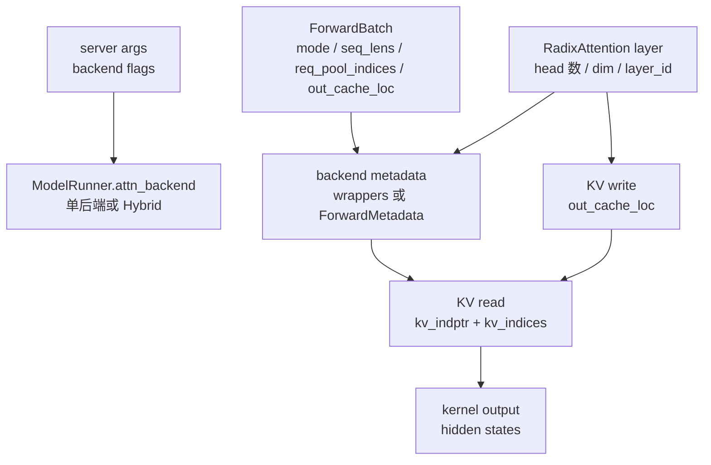

# Attention · 数据流

## 你为什么要读

这篇追踪四类对象如何流动：backend 配置、`ForwardMode`、kernel metadata、paged KV slot。把这些对象分清楚后，FlashInfer、Triton、Hybrid 的差异会变得可定位。

## 对象生命周期总览



## 配置流：一个字段进来，两个槽位出去

`attention_backend` 是默认值；prefill/decode 专用 flag 是覆盖值。最终数据形状是两个字符串。

```python
# 来源：sglang/python/sglang/srt/server_args.py L6922-L6933
    def get_attention_backends(self):
        prefill_attention_backend_str = (
            self.prefill_attention_backend
            if self.prefill_attention_backend
            else self.attention_backend
        )
        decode_attention_backend_str = (
            self.decode_attention_backend
            if self.decode_attention_backend
            else self.attention_backend
        )
        return prefill_attention_backend_str, decode_attention_backend_str
```

交互边界：`ServerArgs` 不创建 backend 对象，只产出名字；对象创建发生在 `ModelRunner`。

## 模式流：`ForwardMode` 是后端选路的运行事实

| mode | 数据形态 | 常见后端入口 |
|------|----------|--------------|
| `EXTEND` | 多个新 token，可能包含 cached prefix | `forward_extend` |
| `DECODE` | 每请求一个新 token，读全部历史 KV | `forward_decode` |
| `MIXED` | chunked prefill 中 extend/decode 混合 | 通常按 extend 处理 |
| `IDLE` | DP attention 中本 rank 无有效请求 | decode backend 空输出 |
| `TARGET_VERIFY` | speculative target verify | Hybrid 中受 `speculative_attention_mode` 控制 |

```python
# 来源：sglang/python/sglang/srt/model_executor/forward_batch_info.py L107-L141
    def is_extend(self, include_draft_extend_v2: bool = False):
        return (
            self == ForwardMode.EXTEND
            or self == ForwardMode.MIXED
            or (include_draft_extend_v2 and self == ForwardMode.DRAFT_EXTEND_V2)
            or self == ForwardMode.TARGET_VERIFY
            or self == ForwardMode.SPLIT_PREFILL
            or self == ForwardMode.DLLM_EXTEND
        )

    def is_context_parallel_extend(self, include_draft_extend_v2: bool = False):
        return (
            self == ForwardMode.EXTEND
            or self == ForwardMode.MIXED
            or (
                self == ForwardMode.DRAFT_EXTEND_V2
                if include_draft_extend_v2
                else False
            )
        )

    def is_decode(self):
        return self == ForwardMode.DECODE

    def is_mixed(self):
        return self == ForwardMode.MIXED

    def is_idle(self):
        return self == ForwardMode.IDLE

    def is_decode_or_idle(self):
        return self == ForwardMode.DECODE or self == ForwardMode.IDLE

    def is_target_verify(self):
        return self == ForwardMode.TARGET_VERIFY
```

不变量：`ForwardMode` 是运行时事实；不要用“当前是生成请求”这种外部描述替代它。

## metadata 流：FlashInfer 是 wrapper，Triton 是 dataclass

FlashInfer 后端把 batch layout 交给 wrapper updater。decode 的结果是 `DecodeMetadata`，里面保存 decode wrapper 和 SWA 写入位置。

```python
# 来源：sglang/python/sglang/srt/layers/attention/flashinfer_backend.py L739-L760
    def init_forward_metadata(self, forward_batch: ForwardBatch):
        swa_out_cache_loc = None
        if self.use_sliding_window_kv_pool and forward_batch.out_cache_loc is not None:
            assert self._swa_kv_pool is not None
            swa_out_cache_loc = self._swa_kv_pool.translate_loc_from_full_to_swa(
                forward_batch.out_cache_loc
            )

        if forward_batch.forward_mode.is_decode_or_idle():
            self.indices_updater_decode.update(
                forward_batch.req_pool_indices,
                forward_batch.seq_lens,
                forward_batch.seq_lens_cpu,
                forward_batch.seq_lens_sum,
                decode_wrappers=self.decode_wrappers,
                encoder_lens=forward_batch.encoder_lens,
                spec_info=forward_batch.spec_info,
                fixed_split_size=self.decode_split_tile_size,
                disable_split_kv=False,
            )
            self.forward_metadata = DecodeMetadata(
                self.decode_wrappers, swa_out_cache_loc=swa_out_cache_loc
```

Triton 后端把同类信息摊平成 `ForwardMetadata` 字段。

```python
# 来源：sglang/python/sglang/srt/layers/attention/triton_backend.py L81-L103
@dataclass
class ForwardMetadata:
    attn_logits: torch.Tensor
    attn_lse: torch.Tensor
    max_extend_len: int
    num_kv_splits: torch.Tensor
    kv_indptr: torch.Tensor
    kv_indices: torch.Tensor
    qo_indptr: torch.Tensor
    custom_mask: torch.Tensor
    mask_indptr: torch.Tensor
    # Sliding window
    window_kv_indptr: torch.Tensor
    window_kv_indices: torch.Tensor
    window_num_kv_splits: torch.Tensor
    window_kv_offsets: torch.Tensor
    # Separate attn_logits for SWA layers when v_head_dim differs
    swa_attn_logits: Optional[torch.Tensor] = None
    # full->SWA translated out_cache_loc (SWA KV-store write target)
    swa_out_cache_loc: Optional[torch.Tensor] = None
    # PHYSICAL full-attn write target for the unified pool (eager: translated tensor;
    # cuda-graph: capture-stable buffer view). None for non-unified pools.
    out_cache_loc_full_physical: Optional[torch.Tensor] = None
```

同一个事实的两种表达：FlashInfer 更像把 batch plan 填进第三方 wrapper，Triton 更像 SGLang 自己持有 kernel 参数包。

## KV 写入流：本步 K/V 先写到 `out_cache_loc`

decode 不是只读历史 KV。本步 token 的 K/V 也要写入 paged KV pool，下一步才能读到它。

```python
# 来源：sglang/python/sglang/srt/layers/attention/triton_backend.py L1647-L1679
        if save_kv_cache:
            if self.use_mla:
                if layer.k_scale is not None:
                    # MLATokenToKVPool doesn't accept scale parameters; k is unused
                    # after this point in decode, so scale in place.
                    k.div_(layer.k_scale)
                self.token_to_kv_pool.set_kv_buffer(
                    layer,
                    forward_batch.out_cache_loc,
                    k,
                    v,
                )
            else:
                self._set_kv_buffer(
                    forward_batch,
                    layer,
                    KVWriteLoc(
                        forward_batch.out_cache_loc,
                        self.forward_metadata.swa_out_cache_loc,
                        full_loc=self.forward_metadata.out_cache_loc_full_physical,
                    ),
                    k,
                    v,
                    layer.k_scale,
                    layer.v_scale,
                )

        if layer.sliding_window_size is not None and layer.sliding_window_size > -1:
            kv_indptr = self.forward_metadata.window_kv_indptr
            kv_indices = self.forward_metadata.window_kv_indices
        else:
            kv_indptr = self.forward_metadata.kv_indptr
            kv_indices = self.forward_metadata.kv_indices
```

读者抓手：`out_cache_loc` 是写；`kv_indices` 是读。把这两个混起来，是理解 paged KV attention 最常见的错位。

## piecewise CUDA Graph 流：先裁剪真实 token，再回 backend

piecewise graph 的 extend 路径会通过 custom op 进入 `unified_attention_with_output`。它裁掉 padded token，临时收窄 `out_cache_loc`，再调用 backend。

```python
# 来源：sglang/python/sglang/srt/layers/radix_attention.py L176-L226
    context = get_tc_piecewise_forward_context()
    forward_batch = context.forward_batch
    attention_layers = context.attention_layers
    attention_layer = attention_layers[layer_id]
    real_num_tokens = forward_batch.num_token_non_padded_cpu

    query = query[:real_num_tokens]
    if key is not None:
        key = key[:real_num_tokens]
    if value is not None:
        value = value[:real_num_tokens]

    # DeepSeek MLA has two RadixAttention instances per layer (attn_mqa and
    # attn_mha) that share the same layer_id. The attention_layers list only
    # stores attn_mqa. When the MHA path is active (save_kv_cache=False), use
    # the companion attn_mha so the backend sees correct head/dim metadata.
    if _is_hip and not save_kv_cache and hasattr(attention_layer, "_pcg_mha_companion"):
        attention_layer = attention_layer._pcg_mha_companion

    kwargs = {}
    if q_rope is not None:
        kwargs["q_rope"] = q_rope[:real_num_tokens]
    if k_rope is not None:
        kwargs["k_rope"] = k_rope[:real_num_tokens]
    if sinks is not None:
        kwargs["sinks"] = sinks
    if cos_sin_cache is not None:
        kwargs["cos_sin_cache"] = cos_sin_cache
    if is_neox is not None:
        kwargs["is_neox"] = is_neox
    if llama_4_scaling is not None:
        kwargs["llama_4_scaling"] = llama_4_scaling
    if topk_indices is not None:
        kwargs["topk_indices"] = topk_indices[:real_num_tokens]

    original_out_cache_loc = forward_batch.out_cache_loc
    # Keep the original ForwardBatch object and only narrow cache locations for
    # this backend call so model/backend state is still written to the same batch.
    forward_batch.out_cache_loc = original_out_cache_loc[:real_num_tokens]

    # Store pre-allocated output for FA backend to write directly into.
    # Must slice to real_num_tokens to match the narrowed query shape —
    # the FA kernel validates out.size(0) == q.size(0).
    forward_batch._attn_output = output[:real_num_tokens]

    ret = get_attn_backend().forward(
        query,
        key,
        value,
        attention_layer,
        forward_batch,
```

不变量：custom op 没有绕过后端，只是把 graph 友好的输出 buffer 和 token 裁剪包了一层。

## Graph buffer 流：图外刷新动态字段

Triton 的 graph 外 metadata 会在 capture 和 replay 前刷新 KV 索引、SWA 写入位置、物理地址翻译。图内不能做这些动态工作。

```python
# 来源：sglang/python/sglang/srt/layers/attention/triton_backend.py L540-L603
    def init_forward_metadata_out_graph(
        self,
        forward_batch: ForwardBatch,
        in_capture: bool = False,
    ):
        bs = forward_batch.batch_size
        req_pool_indices = forward_batch.req_pool_indices
        seq_lens = forward_batch.seq_lens
        forward_mode = forward_batch.forward_mode
        spec_info = forward_batch.spec_info

        if in_capture:
            assert forward_batch.encoder_lens is None, "Not supported"
            # Multi-step spec decode: kv buffers come from spec_info, not the
            # cuda-graph pool, so replay is not involved.
            if forward_mode.is_decode_or_idle() and spec_info is not None:
                self.forward_metadata = ForwardMetadata(
                    attn_logits=self.cuda_graph_attn_logits,
                    attn_lse=self.cuda_graph_attn_lse,
                    max_extend_len=None,
                    num_kv_splits=self.cuda_graph_num_kv_splits,
                    kv_indptr=spec_info.kv_indptr,
                    kv_indices=spec_info.kv_indices,
                    qo_indptr=None,
                    custom_mask=None,
                    mask_indptr=None,
                    window_kv_indptr=self.window_kv_indptr,
                    window_kv_indices=None,
                    window_num_kv_splits=None,
                    window_kv_offsets=None,
                    swa_attn_logits=self.cuda_graph_swa_attn_logits,
                )
                return

            self._apply_cuda_graph_metadata(
                bs=bs,
                req_pool_indices=req_pool_indices,
                seq_lens=seq_lens,
                forward_mode=forward_mode,
                spec_info=spec_info,
            )
            out_cache_loc_full_physical = self._translate_cuda_graph_shared_pool_locs(
                forward_batch, bs
            )
            swa_out_cache_loc = self._fill_cuda_graph_swa_out_cache_loc(forward_batch)
            self.forward_metadata = self._build_cuda_graph_forward_metadata(
                bs,
                forward_mode,
                spec_info,
                swa_out_cache_loc,
                out_cache_loc_full_physical,
            )
        else:
            self._apply_cuda_graph_metadata(
                bs=bs,
                req_pool_indices=req_pool_indices,
                seq_lens=seq_lens,
                forward_mode=forward_mode,
                spec_info=spec_info,
            )
            # Metadata view is reused from capture; just refill the buffers.
            self._translate_cuda_graph_shared_pool_locs(forward_batch, bs)
            self._fill_cuda_graph_swa_out_cache_loc(forward_batch)
```

排障入口：如果 replay 后读到旧 KV 或写错 slot，优先看这些 graph 外 buffer 是否按当前 batch 刷新。

## 复盘迁移

- 从 vLLM 迁移概念时，可以把 block table 对应到这里的 `kv_indptr` / `kv_indices`，但 SGLang 还多一层 radix prefix 和 backend split。
- 从 FlashAttention 迁移概念时，kernel 内部仍是 attention 计算；本专题关注的是 kernel 之前的 paged KV 参数编译。
- 从 CUDA Graph 排障迁移时，先区分 graph 外 metadata 刷新和 graph 内静态 op，再判断是不是 kernel 自身问题。
