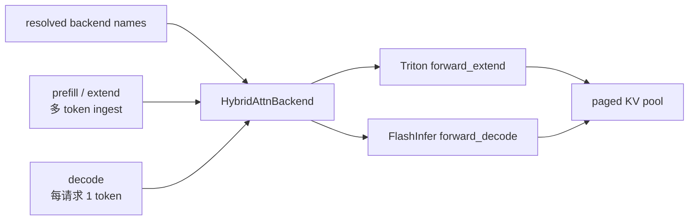

# Attention · 源码走读

这篇追踪一条真实路径：原始 flag 先被兼容性解析器收敛；registry 把 resolved 名称实例化，并按模型、阶段和并发方式套上 wrapper；`ForwardBatch` 进入模型前还可能被 padding 或专用 planner 改写；每层 `RadixAttention.forward` 最后才把 Q/K/V、metadata 与 KV 地址交给 kernel。

## 长文读法

这篇按 prefill/decode 阶段分流读：server args 先解析两个 backend 名，`ModelRunner` 选择单后端或 `HybridAttnBackend`，`ForwardMode` 决定走 prefill/decode backend，`RadixAttention` 只调用当前 backend，backend 先建 metadata 再执行 `forward_extend` / `forward_decode`。

| 你的任务 | 先读 | 抓住什么 |
|----------|------|----------|
| 第一次建立后端主线 | 贯穿场景、步骤一到三 | prefill/decode 是两个执行契约，不只是 kernel 名字 |
| 排查 backend 选择 | 步骤一到二 | 区分原始 flag、post-init 字段、resolved 名称和实际 wrapper 树 |
| 排查 Hybrid 分流 | 步骤三 | `ForwardMode` 决定 decode、target verify、prefill 分到哪个 backend |
| 排查层内调用 | 步骤四到五 | `RadixAttention` 不直接选 kernel，只调用当前 backend 的 `forward` |
| 排查 metadata | 步骤六到七 | backend 先根据 request、sequence 和 KV 索引准备 metadata，再执行 kernel |
| 排查 KV 写入或 scale | decode / extend backend 段 | K/V 写入走 `token_to_kv_pool`，scale 与 paged KV 是执行契约的一部分 |

## 贯穿场景

假设用户配置：

```text
--prefill-attention-backend triton
--decode-attention-backend flashinfer
```

一次请求先经历 prefill，再进入 decode。读源码时不要把它看成两个 kernel 名字，而要看成两个阶段的执行契约。



## 步骤一：配置先经过兼容性归一

系统压力：prefill 和 decode 的最优 kernel 往往不同。prefill 要处理 ragged/paged 多 token；decode 要在小 batch、长上下文和 CUDA Graph 下稳定吞吐。

```python
# 来源：sglang/python/sglang/srt/server_args.py L6922-L6933
    def get_attention_backends(self):
        prefill_attention_backend_str = (
            self.prefill_attention_backend
            if self.prefill_attention_backend
            else self.attention_backend
        )
        decode_attention_backend_str = (
            self.decode_attention_backend
            if self.decode_attention_backend
            else self.attention_backend
        )
        return prefill_attention_backend_str, decode_attention_backend_str
```

这段 getter 只是终点。此前 `_handle_attention_backend_compatibility()` 已可能选择默认 backend、强制 page size、禁用 Graph 或拒绝不支持的硬件/dtype/模型组合。未传 per-mode flag 时，才继承这个已经解析过的通用字段。正确的排障顺序是：原始参数 → post-init 字段 → getter 返回值，而不是拿命令行直接推导对象。

## 步骤二：`ModelRunner` 决定单后端还是 Hybrid

系统压力：模型执行时只想调用一个 `self.attn_backend`，但内部可能要按阶段分流。

```python
# 来源：sglang/python/sglang/srt/model_executor/model_runner.py L2450-L2469
    def init_attention_backend(self):
        """Init attention kernel backend."""
        if self.server_args.enable_pdmux:
            self.attn_backend = self._get_attention_backend(init_new_workspace=True)
            self.decode_attn_backend_group = []
            for _ in range(self.server_args.sm_group_num):
                self.decode_attn_backend_group.append(self._get_attention_backend())
            self.decode_attn_backend = self.decode_attn_backend_group[0]
        elif self.server_args.enable_two_batch_overlap and not self.is_draft_worker:
            self.attn_backend = TboAttnBackend.init_new(self._get_attention_backend)
        else:
            self.attn_backend = self._get_attention_backend()

        # Record resolved per-mode backends on the backend for model dispatch.
        self.attn_backend.prefill_attention_backend_str = (
            self.prefill_attention_backend_str
        )
        self.attn_backend.decode_attention_backend_str = (
            self.decode_attention_backend_str
        )
```

```python
# 来源：sglang/python/sglang/srt/model_executor/model_runner.py L2471-L2531
    def _get_attention_backend(self, init_new_workspace: bool = False):
        """Init attention kernel backend."""
        draft_attn_backend = self.server_args.speculative_draft_attention_backend
        if self.is_draft_worker and draft_attn_backend:
            logger.warning(
                f"Overriding draft attention backend to {draft_attn_backend}."
            )
            # Single backend for all draft modes (no prefill/decode split).
            self.prefill_attention_backend_str = draft_attn_backend
            self.decode_attention_backend_str = draft_attn_backend
            return self._get_attention_backend_from_str(
                draft_attn_backend,
                init_new_workspace=init_new_workspace,
            )

        (
            self.prefill_attention_backend_str,
            self.decode_attention_backend_str,
        ) = self.server_args.get_attention_backends()

        if self.decode_attention_backend_str != self.prefill_attention_backend_str:
            from sglang.srt.layers.attention.hybrid_attn_backend import (
                HybridAttnBackend,
            )

            attn_backend = HybridAttnBackend(
                self,
                decode_backend=self._get_attention_backend_from_str(
                    self.decode_attention_backend_str,
                    init_new_workspace=init_new_workspace,
                ),
                prefill_backend=self._get_attention_backend_from_str(
                    self.prefill_attention_backend_str,
                    init_new_workspace=init_new_workspace,
                ),
            )
            logger.info(
                f"Using hybrid attention backend for decode and prefill: "
                f"decode_backend={self.decode_attention_backend_str}, "
                f"prefill_backend={self.prefill_attention_backend_str}."
            )
            logger.warning(
                "Warning: Attention backend specified by --attention-backend or default backend might be overridden."
                "The feature of hybrid attention backend is experimental and unstable. Please raise an issue if you encounter any problem."
            )
        else:
            attn_backend = self._get_attention_backend_from_str(
                self.server_args.attention_backend,
                init_new_workspace=init_new_workspace,
            )

        return attn_backend

    def _get_attention_backend_from_str(
        self, backend_str: str, init_new_workspace: bool = False
    ):
        if backend_str not in ATTENTION_BACKENDS:
            raise ValueError(f"Invalid attention backend: {backend_str}")
        self.init_new_workspace = init_new_workspace
        full_attention_backend = ATTENTION_BACKENDS[backend_str](self)
        return attn_backend_wrapper(self, full_attention_backend)
```

`_get_attention_backend_from_str()` 还揭示了容易漏掉的一层：registry factory 创建 full-attention backend 后，立即经过 `attn_backend_wrapper()`；若模型含 Mamba/GDN/KDA/Lightning 等线性层，这里会变成按层分流的 `HybridLinearAttnBackend`。两个已经包装过的 per-mode 子对象不同，才再组成 `HybridAttnBackend`。最外层还可能是 TBO，或由 PDMux 维护多份 decode workspace。

```text
registry factory
  → optional HybridLinearAttnBackend
  → optional HybridAttnBackend(prefill, decode)
  → optional TboAttnBackend / PDMux group
```

不变量：driver 侧通常只暴露一个 `attn_backend` 字段，但内部可以是一棵 wrapper 树。定位方法缺失时，应沿“谁拥有这个方法、谁委托给谁”逐层下钻。

## 步骤三：Hybrid 按 `ForwardMode` 分流

系统压力：同一个 batch 可能是 decode，也可能是 target verify；target verify 的 attention 形态还受 speculative 配置影响。

```python
# 来源：sglang/python/sglang/srt/layers/attention/hybrid_attn_backend.py L28-L64
    def _select_backend(self, forward_mode: ForwardMode) -> AttentionBackend:
        """
        Select the appropriate attention backend based on the forward mode.

        Args:
            forward_mode: The current forward mode indicating the operation type

        Returns:
            The selected attention backend (prefill or decode)

        Note:
            - decode_or_idle: Always uses decode backend
            - target_verify: Uses decode backend if speculative_attention_mode is "decode", otherwise prefill backend
            - prefill: Always uses prefill backend
        """
        if forward_mode.is_decode_or_idle():
            return self.decode_backend
        elif forward_mode.is_target_verify():
            return (
                self.decode_backend
                if self.model_runner.server_args.speculative_attention_mode == "decode"
                else self.prefill_backend
            )
        else:
            return self.prefill_backend

    def init_forward_metadata_out_graph(
        self,
        forward_batch: ForwardBatch,
        in_capture: bool = False,
    ):
        backend = self._select_backend(forward_batch.forward_mode)
        backend.init_forward_metadata_out_graph(forward_batch, in_capture=in_capture)

    def init_forward_metadata(self, forward_batch: ForwardBatch):
        backend = self._select_backend(forward_batch.forward_mode)
        backend.init_forward_metadata(forward_batch)
```

执行逻辑：decode 和 idle 总走 decode backend；普通 prefill 走 prefill backend；target verify 单独由 `speculative_attention_mode` 决定。

### 源码阅读陷阱：同一个类里有两个 `forward`

`HybridAttnBackend` 当前文件先定义了一个支持 `mixed_qkv/a/b` 的 `forward`，文件末尾又定义了同名方法。Python 类体中后定义覆盖前定义，所以运行时有效的是最后一个简单委托版本；不能把搜索到的第一个方法当作真实契约。真正的 full/linear 按层路由由前一步的 `HybridLinearAttnBackend` 提供。

这类问题提醒我们：源码选择“入木三分”不等于截取更多代码，而是确认最终绑定到类字典、真正可达的实现。

## 步骤四：每层 `RadixAttention` 把 Q/K/V 交给 backend

`RadixAttention.forward` reshape K/V，然后把 `self` 作为 layer metadata 传给 backend。下面只看进入后端的分支。

```python
# 来源：sglang/python/sglang/srt/layers/radix_attention.py L127-L153
        if (
            forward_batch.forward_mode.is_extend()
            and get_tc_piecewise_forward_context() is not None
        ):
            if self.qk_head_dim != self.v_head_dim:
                output = q.new_empty((q.shape[0], self.tp_q_head_num * self.v_head_dim))
            else:
                output = torch.empty_like(q)
            if is_in_breakable_cuda_graph():
                breakable_unified_attention_with_output(
                    q, k, v, output, save_kv_cache, self.layer_id, **kwargs
                )
            else:
                unified_attention_with_output(
                    q, k, v, output, save_kv_cache, self.layer_id, **kwargs
                )
            return output
        else:
            return get_attn_backend().forward(
                q,
                k,
                v,
                self,
                forward_batch,
                save_kv_cache,
                **kwargs,
            )
```

读者抓手：`RadixAttention` 名字里有 radix，但这个 forward 不是 radix tree 查找；prefix cache 和 slot 分配已经在更上游完成。这里消费的是 `ForwardBatch` 里的位置和索引。

## 步骤五：基类把 `ForwardMode` 映射成 extend/decode 方法

系统压力：所有 backend 要共享同一个高层入口，但不同阶段的 kernel 完全不同。

```python
# 来源：sglang/python/sglang/srt/layers/attention/base_attn_backend.py L170-L201
        if forward_batch.forward_mode.is_idle():
            return q.new_empty(q.shape[0], layer.tp_q_head_num * layer.v_head_dim)
        elif forward_batch.forward_mode.is_decode():
            return self.forward_decode(
                q,
                k,
                v,
                layer,
                forward_batch,
                save_kv_cache=save_kv_cache,
                **kwargs,
            )
        elif forward_batch.forward_mode.is_mixed() and is_npu():
            return self.forward_mixed(
                q,
                k,
                v,
                layer,
                forward_batch,
                save_kv_cache=save_kv_cache,
                **kwargs,
            )
        else:
            return self.forward_extend(
                q,
                k,
                v,
                layer,
                forward_batch,
                save_kv_cache=save_kv_cache,
                **kwargs,
            )
```

注意：`TARGET_VERIFY` 在 `ForwardMode.is_extend()` 里为真，但在 Hybrid 中可能先被 `_select_backend` 导向 decode 子后端。`DRAFT_EXTEND_V2` 默认不在 `is_extend()` 内；`PREBUILT` 又是 PD worker 的过渡状态。读 speculative/PD 路径时要同时看枚举谓词、外层 wrapper 与调用点，不能只读基类这个 `else → forward_extend`。

## 步骤六：先判断 metadata 是否已经计划

metadata 不总由 `ModelRunner.forward` 临时创建。multi-step draft、Graph runner 或手工 spec batch 可能先 plan，再调用 `mark_forward_metadata_ready()`。若普通 forward 无条件重建，可能覆盖 wrapper 的专用计划；若 DP padding 改变 shape 后又盲目复用，则可能读旧 view。`needs_forward_metadata_init()` 通过 ready 标记、计划 shape 与 `replan_equivalent` 给出单一判断入口。

这里的关键不是“缓存 metadata 以提速”，而是“metadata 有所有权”：谁计划、针对哪种 shape、后续是否允许等价重建，都属于执行契约。

## 步骤七：FlashInfer 用 wrapper metadata 调 kernel

FlashInfer 的 wrapper 需要预先 plan 当前 batch 的 paged KV 布局。decode、target verify、draft extend、DLLM extend 的 wrapper 不同。

```python
# 来源：sglang/python/sglang/srt/layers/attention/flashinfer_backend.py L747-L760
        if forward_batch.forward_mode.is_decode_or_idle():
            self.indices_updater_decode.update(
                forward_batch.req_pool_indices,
                forward_batch.seq_lens,
                forward_batch.seq_lens_cpu,
                forward_batch.seq_lens_sum,
                decode_wrappers=self.decode_wrappers,
                encoder_lens=forward_batch.encoder_lens,
                spec_info=forward_batch.spec_info,
                fixed_split_size=self.decode_split_tile_size,
                disable_split_kv=False,
            )
            self.forward_metadata = DecodeMetadata(
                self.decode_wrappers, swa_out_cache_loc=swa_out_cache_loc
```

```python
# 来源：sglang/python/sglang/srt/layers/attention/flashinfer_backend.py L1095-L1127
        decode_wrapper = self.forward_metadata.decode_wrappers[
            self._get_wrapper_idx(layer)
        ]
        cache_loc = (
            forward_batch.out_cache_loc
            if not layer.is_cross_attention
            else forward_batch.encoder_out_cache_loc
        )

        if k is not None:
            assert v is not None
            if save_kv_cache:
                self.token_to_kv_pool.set_kv_buffer(
                    layer,
                    KVWriteLoc(cache_loc, self.forward_metadata.swa_out_cache_loc),
                    k,
                    v,
                    layer.k_scale,
                    layer.v_scale,
                )

        # Call the wrapped function
        o = decode_wrapper.forward(
            q.contiguous().view(-1, layer.tp_q_head_num, layer.head_dim),
            self.token_to_kv_pool.get_kv_buffer(layer.layer_id),
            sm_scale=layer.scaling,
            logits_soft_cap=layer.logit_cap,
            # Must use _float to avoid device-to-host copy that breaks cuda graph capture.
            k_scale=layer.k_scale_float,
            v_scale=layer.v_scale_float,
        )

        return o.view(-1, layer.tp_q_head_num * layer.head_dim)
```

不变量：decode 在需要保存时把本步 K/V 写入 `cache_loc`，再调用 wrapper。这里的 `cache_loc` 是 generic location，cross-attention 会改用 `encoder_out_cache_loc`；Unified/SWA 的物理落点由 pool/`KVWriteLoc` 继续解释。wrapper 读取的是本轮计划出的 KV stream，不应笼统叫“纯历史 KV”。

FlashInfer extend 还可能在“当前 query 无 prefix”时走 ragged；有 prefix 时分别计算 ragged current 与 paged prefix，再用 LSE merge 两部分状态。`_safe_merge_state()` 只在 FlashInfer merge kernel 的线程配置不安全时切到 Triton merge，并不代表整个 attention backend 已切换成 Triton。

## 步骤八：Triton 用 `ForwardMetadata` 组织同一批索引

Triton 后端自己维护 kernel 输入字段；它不依赖 FlashInfer wrapper，但仍消费同一套 batch 事实。

```python
# 来源：sglang/python/sglang/srt/layers/attention/triton_backend.py L81-L103
@dataclass
class ForwardMetadata:
    attn_logits: torch.Tensor
    attn_lse: torch.Tensor
    max_extend_len: int
    num_kv_splits: torch.Tensor
    kv_indptr: torch.Tensor
    kv_indices: torch.Tensor
    qo_indptr: torch.Tensor
    custom_mask: torch.Tensor
    mask_indptr: torch.Tensor
    # Sliding window
    window_kv_indptr: torch.Tensor
    window_kv_indices: torch.Tensor
    window_num_kv_splits: torch.Tensor
    window_kv_offsets: torch.Tensor
    # Separate attn_logits for SWA layers when v_head_dim differs
    swa_attn_logits: Optional[torch.Tensor] = None
    # full->SWA translated out_cache_loc (SWA KV-store write target)
    swa_out_cache_loc: Optional[torch.Tensor] = None
    # PHYSICAL full-attn write target for the unified pool (eager: translated tensor;
    # cuda-graph: capture-stable buffer view). None for non-unified pools.
    out_cache_loc_full_physical: Optional[torch.Tensor] = None
```

这就是 SGLang 与 kernel 之间的数据契约：`ForwardBatch` 是可变的调度执行视图，`ForwardMetadata` 是 Triton planner 对它的 kernel 侧解释。`out_cache_loc_full_physical` 的存在也直接证明：generic 写入位置与 Unified full pool 的物理落点不能混为一谈。

## 运行验证

| 验证目标 | 操作 | 预期现象 |
|----------|------|----------|
| 确认是否 Hybrid | 同时设置不同的 prefill/decode backend 并观察启动日志 | 日志出现 hybrid attention backend，并打印 decode/prefill backend 名 |
| 排查 decode Graph | 固定模型、backend、batch/context 后对比 Graph on/off | 判断错误是否从 capture/replay 转到 eager、输出是否改变；吞吐只报告实测方向 |
| 检查 target verify 选路 | 改 `speculative_attention_mode` | `TARGET_VERIFY` 在 Hybrid 中走 prefill 或 decode 子后端 |
| 检查 KV 写入 | 同时观测 generic `out_cache_loc`、pool 类型与翻译后位置 | Unified/SWA/cross-attention 使用正确落点；读取索引流与 planner 一致 |

## 复盘

- Attention 后端的主线不是文件顺序，而是配置名、batch mode、layer call、metadata、kernel call 五层因果链。
- `ForwardBatch` 是本轮运行事实的可变视图；预计划 metadata 还有明确的 shape 与所有权契约。
- CUDA Graph 问题通常先查 metadata 生命周期，再查 kernel 数学。
- Hybrid 是对象组合，不是全局 if；这让模型层保持单一 `get_attn_backend().forward` 入口。
