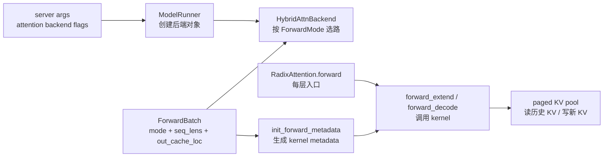

# Attention

## 你为什么要读

这组文档讲 SGLang 如何把每层 `RadixAttention.forward` 转成具体 GPU attention kernel 调用。读完后，你应该能解释三类问题：为什么 prefill 和 decode 可以走不同 backend；为什么 CUDA Graph 要把 metadata 分成 graph 外和 graph 内；为什么同一个 paged KV cache 会被 FlashInfer、Triton、Hybrid 后端以不同方式消费。

## 主线地图

把 Attention 后端当成“kernel 入口编译器”：它不决定请求调度，也不维护 radix tree；它接收 `ForwardBatch` 和每层 Q/K/V，把请求级的 paged KV 布局编译成 FlashInfer 或 Triton kernel 能消费的 metadata。

## 阅读顺序

| 文档 | 读者任务 |
|------|----------|
| [[SGLang-Attention-核心概念]] | 建立 backend、ForwardMode、metadata、paged KV 四层模型 |
| [[SGLang-Attention-源码走读]] | 沿配置解析到 kernel 调用读源码 |
| [[SGLang-Attention-数据流]] | 看 `ForwardBatch`、metadata、KV slot、CUDA Graph buffer 如何流动 |
| [[SGLang-Attention-排障指南]] | 按后端选错、Graph capture 失败、DP merge fallback、spec verify 选路排障 |
| [[SGLang-Attention-学习检查]] | 用场景题验证是否能解释并修改 attention 后端 |

## 源码范围

| 源码入口 | 本专题关注点 |
|----------|--------------|
| `sglang/python/sglang/srt/server_args.py` L6922-L6933 | prefill/decode backend flag 如何合成最终后端名 |
| `sglang/python/sglang/srt/model_executor/model_runner.py` L2450-L2531 | 创建单后端、Hybrid 后端、TBO/PDMux 包装 |
| `sglang/python/sglang/srt/model_executor/forward_batch_info.py` L78-L146 | `ForwardMode` 如何区分 extend、decode、mixed、target verify |
| `sglang/python/sglang/srt/layers/radix_attention.py` L109-L153 | 每层 Q/K/V 如何进入全局 attention backend |
| `sglang/python/sglang/srt/layers/attention/base_attn_backend.py` L18-L87 | metadata 三阶段契约与 CUDA Graph 边界 |
| `sglang/python/sglang/srt/layers/attention/base_attn_backend.py` L158-L200 | `forward_mode` 如何路由到 decode 或 extend |
| `sglang/python/sglang/srt/layers/attention/hybrid_attn_backend.py` L28-L64 | Hybrid 后端按 `ForwardMode` 选择 prefill 或 decode 子后端 |
| `sglang/python/sglang/srt/layers/attention/flashinfer_backend.py` L634-L760 | FlashInfer 如何更新 wrapper metadata |
| `sglang/python/sglang/srt/layers/attention/triton_backend.py` L81-L109 | Triton `ForwardMetadata` 的核心字段 |
| `sglang/python/sglang/srt/layers/attention/triton_backend.py` L1185-L1265 | Triton extend 如何写 KV 并选择 kernel |
| `sglang/python/sglang/srt/layers/attention/triton_backend.py` L1625-L1695 | Triton decode 如何写本步 KV 并读历史 KV |

## 不变量

| 不变量 | 破坏后现象 |
|--------|------------|
| `prefill_attention_backend` 和 `decode_attention_backend` 先解析成两个最终 backend 名 | 以为改了 prefill，实际 decode 仍走默认后端 |
| `ForwardMode` 是 backend 选路的语义来源 | target verify、mixed、idle 被误判后会走错 kernel 或错配 metadata |
| graph 外 metadata 可以做 host/dynamic 操作，graph 内不能做 host sync | CUDA Graph capture/replay 失败或吞吐异常 |
| `out_cache_loc` 是本轮新 KV 写入位置，`kv_indices` 是历史 KV 读取索引 | 写错 slot 会污染后续 decode |
| backend 子类必须同时实现 metadata 准备和 kernel 调用 | 只改 kernel 不改 metadata 会 shape 对不上或读错 KV |

下一跳：如果你还没读 KV slot 分配，先看 [[SGLang-KV-Cache]]；如果你要理解 prefix 复用，再看 [[SGLang-RadixAttention]]。
