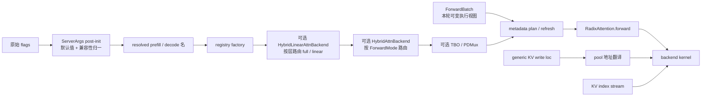

# Attention

## 你为什么要读

这组文档讲 SGLang 如何把“用户想用哪个后端”逐层收敛成一次可执行的 attention 调用。读完后，你应能从启动参数一路追到 kernel：参数如何被硬件、模型与功能约束归一；后端对象如何被 registry 创建并套上多层 wrapper；一份可变的 `ForwardBatch` 如何被编译成 metadata；generic KV id 又如何在真正访问显存前翻译成对应 pool 的物理位置。

## 主线地图

把 Attention 后端当成“kernel 调用编译器”最合适：调度器决定这轮有哪些请求，RadixCache 与内存池决定逻辑位置和所有权，backend 则把这些运行事实降成某个 kernel 能吃的索引、边界、mask、workspace 与稳定缓冲区。FlashInfer 和 Triton 只是两种有代表性的 metadata 风格，不是当前 SGLang 的全部后端。

## 阅读顺序

| 文档 | 读者任务 |
|------|----------|
| [[SGLang-Attention-核心概念]] | 建立 resolver、wrapper、ForwardMode、metadata、KV 地址五层模型 |
| [[SGLang-Attention-源码走读]] | 沿配置解析到 kernel 调用读源码 |
| [[SGLang-Attention-数据流]] | 看 `ForwardBatch`、metadata、KV slot、CUDA Graph buffer 如何流动 |
| [[SGLang-Attention-排障指南]] | 按后端选错、Graph capture 失败、DP merge fallback、spec verify 选路排障 |
| [[SGLang-Attention-学习检查]] | 用场景题验证是否能解释并修改 attention 后端 |

## 源码范围

| 源码入口 | 本专题关注点 |
|----------|--------------|
| `sglang/python/sglang/srt/server_args.py` L182-L209、L4666 起、L6922-L6933 | 候选集合、兼容性归一与最终 per-mode 名称 |
| `sglang/python/sglang/srt/model_executor/model_runner.py` L2450-L2531 | 创建单后端、Hybrid 后端、TBO/PDMux 包装 |
| `sglang/python/sglang/srt/layers/attention/attention_registry.py` | 名称如何映射到硬件/模型特定 factory |
| `sglang/python/sglang/srt/model_executor/forward_batch_info.py` L78-L165、L525-L610 | 完整 `ForwardMode` 与 metadata 预计划契约 |
| `sglang/python/sglang/srt/layers/radix_attention.py` L109-L153 | 每层 Q/K/V 如何进入全局 attention backend |
| `sglang/python/sglang/srt/layers/attention/base_attn_backend.py` L18-L87 | metadata 三阶段契约与 CUDA Graph 边界 |
| `sglang/python/sglang/srt/layers/attention/base_attn_backend.py` L158-L200 | `forward_mode` 如何路由到 decode 或 extend |
| `sglang/python/sglang/srt/layers/attention/hybrid_attn_backend.py` L28-L64 | Hybrid 后端按 `ForwardMode` 选择 prefill 或 decode 子后端 |
| `sglang/python/sglang/srt/layers/attention/hybrid_linear_attn_backend.py` | full attention 与 Mamba/linear attention 如何按层组合 |
| `sglang/python/sglang/srt/layers/attention/flashinfer_backend.py` L634-L760 | FlashInfer 如何更新 wrapper metadata |
| `sglang/python/sglang/srt/layers/attention/triton_backend.py` L81-L109 | Triton `ForwardMetadata` 的核心字段 |
| `sglang/python/sglang/srt/layers/attention/triton_backend.py` L1185-L1265 | Triton extend 如何写 KV 并选择 kernel |
| `sglang/python/sglang/srt/layers/attention/triton_backend.py` L1625-L1695 | Triton decode 如何写本步 KV 并消费计划出的 KV index stream |

## 不变量

| 不变量 | 破坏后现象 |
|--------|------------|
| 区分原始 flag、post-init 归一结果和最终 per-mode 名称 | 日志与命令行看似矛盾，或误判真正运行的 backend |
| `ForwardMode` 是 backend 选路的语义来源，但并非所有 mode 都能机械送入普通 `forward` | verify、draft、PD 与 dLLM 路径错配 metadata |
| capture 记录的是对象地址与静态 GPU 操作；replay 前只能原地刷新约定的动态内容 | Graph replay 读到旧索引、旧 slot 或直接 capture 失败 |
| `out_cache_loc` 是 generic write location；Unified/SWA 下还需翻译成对应物理地址 | 把 virtual id 当物理 slot，写坏另一页或错误 pool |
| `kv_indices` 是 kernel 本轮读取的 KV index stream，不保证只含“历史 token” | 对 prefill、decode wrapper 的读写先后建立错误模型 |
| backend 能力取决于模型、硬件、page size、dtype、Graph、spec 与 cross-attention 等约束 | 用“生产选 A、定制选 B”的口号代替兼容性验证 |

下一跳：如果你还没读 KV slot 分配，先看 [[SGLang-KV-Cache]]；如果你要理解 prefix 复用，再看 [[SGLang-RadixAttention]]。
