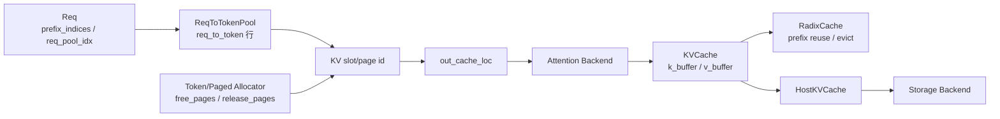

# KV-Cache · 学习检查

## 读者能做什么

- [ ] 能画出 `ReqToTokenPool → allocator → KVCache` 三层模型。
- [ ] 能解释 `req_pool_idx`、`req_to_token`、`prefix_indices`、`out_cache_loc` 各自指什么。
- [ ] 能沿 `ModelRunner._init_pools → build_kv_cache → alloc_for_extend → req_to_token.write → attention set_kv_buffer` 追踪一次 prefill。
- [ ] 能沿 `prepare_for_decode → alloc_for_decode → alloc_decode → req_to_token.write → set_kv_buffer` 追踪一次 decode。
- [ ] 能区分请求行不足、KV slot/page 不足、物理写入越界、HiCache 主机内存不足。
- [ ] 能说明 token allocator 与 paged allocator 的分配/释放差异。
- [ ] 能解释 decode KV 紧张时为什么先 evict，再 retract，而不是直接继续 forward。
- [ ] 能指出 HiCache Host Pool 和 Storage Backend 的边界。

## 状态图复画

先不看正文，自己画这张图：



验收标准：

- 能说明 `ReqToTokenPool` 存索引，不存 K/V 内容。
- 能说明 allocator 管理空闲 slot/page，不决定 prefix 语义。
- 能说明 `KVCache` 才是真正的 K/V 张量存储。
- 能说明 `out_cache_loc` 只表示本轮新写入位置，不等于请求完整上下文。

## 源码定位练习

1. 找到请求行和 allocator 建立的位置。

目标：说明请求行容量与 KV token 容量为什么是两件事。

证据入口：

```python
# 来源：python/sglang/srt/model_executor/model_runner_kv_cache_mixin.py L531-L620
self.req_to_token_pool = req_to_token_pool_cls(
    size=max_num_reqs,
    max_context_len=self.model_config.context_len
    + extra_max_context_len,
    device=self.device,
    enable_memory_saver=self.server_args.enable_memory_saver,
)
```

```python
# 来源：python/sglang/srt/model_executor/model_runner_kv_cache_mixin.py L1035-L1148
elif self.page_size == 1 and self.dcp_size == 1:
    self.token_to_kv_pool_allocator = TokenToKVPoolAllocator(...)
else:
    self.token_to_kv_pool_allocator = PagedTokenToKVPoolAllocator(...)
```

2. 找到 RadixCache 如何拿到两级池。

目标：说明 prefix cache 为什么必须持有 `req_to_token_pool` 和 allocator。

证据入口：

```python
# 来源：python/sglang/srt/mem_cache/kv_cache_builder.py L170-L263
req_to_token_pool, token_to_kv_pool_allocator = tp_worker.get_memory_pool()
...
params = CacheInitParams(
    disable=disable_radix_cache,
    req_to_token_pool=req_to_token_pool,
    token_to_kv_pool_allocator=token_to_kv_pool_allocator,
    ...
)
...
return KVCacheBuildResult(
    req_to_token_pool=req_to_token_pool,
    token_to_kv_pool_allocator=token_to_kv_pool_allocator,
    tree_cache=tree_cache,
)
```

3. 找到 prefill 的分配和写表。

目标：指出 prefix hit 与新分配 slot 如何同时写入 `req_to_token`。

证据入口：

```python
# 来源：python/sglang/srt/mem_cache/common.py L450-L524
prefix_tensors = [r.prefix_indices for r in batch.reqs]
...
req_pool_indices = alloc_req_slots(
    batch.req_to_token_pool, batch.reqs, batch.tree_cache
)
...
out_cache_loc = alloc_paged_token_slots_extend(...)
...
write_cache_indices(
    out_cache_loc,
    req_pool_indices_device,
    req_pool_indices_cpu,
    ...
    prefix_tensors,
    batch.req_to_token_pool,
)
```

4. 找到 decode 的追加写表。

目标：说明 decode 如何从上一 token 的 slot 推导下一步，并把新 slot 写回请求行。

证据入口：

```python
# 来源：python/sglang/srt/mem_cache/common.py L579-L620
last_loc = batch.req_to_token_pool.req_to_token[
    batch.req_pool_indices, seq_lens_gpu - 1
]
seq_lens_next = seq_lens_gpu + token_per_req
out_cache_loc = alloc_paged_token_slots_decode(...)
...
batch.req_to_token_pool.write(
    (batch.req_pool_indices, locs), out_cache_loc.to(torch.int32)
)
```

5. 找到物理 K/V 写入。

目标：说明 allocator 返回 slot 后，attention backend 才真正把 K/V 写进 tensor。

证据入口：

```python
# 来源：python/sglang/srt/layers/attention/triton_backend.py L1152-L1244
loc_info = KVWriteLoc(
    forward_batch.out_cache_loc,
    self.forward_metadata.swa_out_cache_loc,
    full_loc=self.forward_metadata.out_cache_loc_full_physical,
)
self._set_kv_buffer(forward_batch, layer, loc_info, k, v)
```

```python
# 来源：python/sglang/srt/mem_cache/memory_pool.py L1669-L1730
loc, _, _ = unwrap_write_loc(loc_info)
maybe_detect_oob(loc, 0, self.size + self.page_size, "set_kv_buffer (MHA)")
...
self._store_kv_layer(layer_id - self.start_layer, loc, cache_k, cache_v)
```

6. 找到 decode 容量保护和 retract。

目标：说明 KV 不足时先 evict，再释放部分 running 请求。

证据入口：

```python
# 来源：python/sglang/srt/managers/schedule_batch.py L2453-L2532
def check_decode_mem(self, selected_indices: Optional[List[int]] = None):
    num_tokens = self.new_tokens_required_next_decode(selected_indices)
    evict_from_tree_cache(self.tree_cache, num_tokens)
    return self.token_to_kv_pool_allocator.available_size() >= num_tokens
...
retracted_reqs.append(req)
self.release_req(idx, len(sorted_indices), server_args)
```

7. 找到 HiCache 和 storage 边界。

目标：说明 L2 host pool 与 L3 storage backend 各自负责什么。

证据入口：

```python
# 来源：python/sglang/srt/mem_cache/pool_host/base.py L79-L143
host_mem = psutil.virtual_memory()
requested_bytes = self.size * self.size_per_token
available_bytes = host_mem.available - HICACHE_HOST_MEMORY_RESERVE_BYTES
if requested_bytes > available_bytes:
    raise ValueError(...)
...
self.kv_buffer = self.init_kv_buffer()
```

```python
# 来源：python/sglang/srt/mem_cache/storage/backend_factory.py L66-L96
if backend_name in cls._registry:
    registry_entry = cls._registry[backend_name]
    backend_class = registry_entry["loader"]()
    ...
    return cls._create_builtin_backend(
        backend_name, backend_class, storage_config, mem_pool_host
    )
```

## 静态排障演练

| 输入现象 | 先看哪里 | 预期判断 |
|----------|----------|----------|
| `alloc_req_slots runs out of memory` | `ReqToTokenPool.alloc`、`max_running_requests` | 请求行不足，不是 K/V 物理 slot 先不足 |
| `Decode out of memory` | `alloc_paged_token_slots_decode`、`check_decode_mem` | KV slot/page 不足，先看 evict/retract 是否生效 |
| 输出异常且怀疑 KV 写错 | `out_cache_loc`、`set_kv_buffer` | 检查 slot 是否越界、layout 是否需要 page/off 写入 |
| 相同 prompt 第二次请求延迟异常 | `PagedTokenToKVPoolAllocator.free` | ROCm 上 `torch.unique` 路径可能有 JIT 或 page 去重成本 |
| HiCache 启动失败 | `HostKVCache.__init__` | 主机内存预算不足，调低 ratio 或 size |
| storage backend 不识别 | `StorageBackendFactory` | 名称未注册或 dynamic 配置缺字段 |

## 可执行验证

文档静态检查：

```powershell
node maintenance\audit_source_evidence.mjs --note 'sglang_reading\内存与Attention\KV-Cache\SGLang-KV-Cache-源码走读.md'
node maintenance\audit_wikilinks.mjs
```

运行观察建议：

```powershell
python -m sglang.launch_server --model-path <model> --page-size 1
python -m sglang.launch_server --model-path <model> --page-size 16
```

对比观察：

- 启动日志中的 KV cache token 数、K/V size。
- 高并发长输出时是否出现 retract。
- page size 变化后，decode 延迟和 KV pool 使用率是否变化。

HiCache 观察：

```powershell
python -m sglang.launch_server --model-path <model> --enable-hierarchical-cache --hicache-ratio <ratio>
```

预期：

- ratio 过大时，启动阶段可能因 host memory budget 失败。
- ratio 太小时，host pool 小于 device pool 的 warning 表示 L2 命中收益有限。

## 复述练习

用三分钟讲清楚：

> 一个新请求 prefix 命中 100 个 token，还需要 prefill 20 个 token。SGLang 如何给请求分配 `req_pool_idx`，如何把 100 个 prefix slot 和 20 个新 slot 写入 `req_to_token`，attention backend 如何用 `out_cache_loc` 把新 K/V 写进物理 pool，后续 decode 又如何追加一个 token？如果 decode 前发现 KV 不够，为什么会 retract？

能讲完这段，再进入 [[SGLang-Attention]] 或 [[SGLang-ModelRunner]]。
