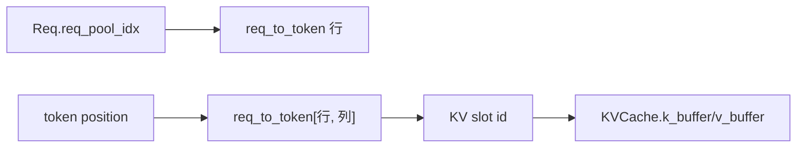
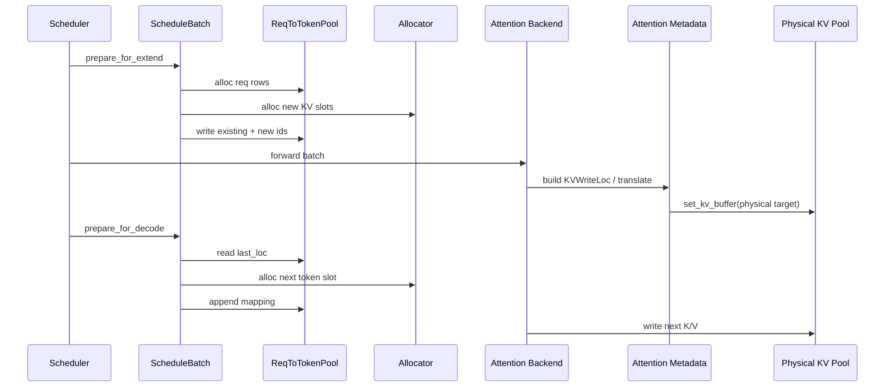

# KV-Cache · 数据流

## 读者任务

这一篇不再按文件讲，而是按对象流动讲。你需要看清一条 KV 信息经过哪些边界：

- `Req` 保存请求级 KV 状态。
- `ScheduleBatch` 把多个请求变成一次 forward 的张量输入。
- `ReqToTokenPool` 保存请求行到 KV slot 的映射。
- allocator 发放或回收 slot/page。
- attention metadata/backend 把通用 `out_cache_loc` 解析为当前 pool 的物理目标，再写 K/V。
- RadixCache/HiCache 决定复用、迁移和释放。

## 对象地图

| 对象 | 所在层 | 生命周期 | 关键字段 |
|------|--------|----------|----------|
| `Req` | Scheduler 请求状态 | 从入队到 finish/retract | `req_pool_idx`、`prefix_indices`、`cache_protected_len`、`kv_committed_len`、`kv_allocated_len` |
| `ScheduleBatch` | 本轮 forward 输入 | 每轮调度生成或更新 | `req_pool_indices`、`seq_lens`、`out_cache_loc` |
| `ReqToTokenPool` | 请求行映射 | ModelRunner 生命周期 | `req_to_token`、`free_slots` |
| `TokenToKVPoolAllocator` | KV slot/page 管理 | ModelRunner 生命周期 | `free_pages`、`release_pages`、`page_size` |
| `KVCache` | 设备侧物理内容 | ModelRunner 生命周期 | 普通 K/V、combined KV、index/scale 或子池 buffer |
| `HostKVCache` | HiCache L2 | 开启 HiCache 后存在 | `free_slots`、`slot_used`、`kv_buffer` |

## `Req`：请求级 KV 状态

一个请求进入 Scheduler 后，不会立刻拥有 KV slot。它先保存 prefix match 结果和未来需要写入的位置元信息。

```python
# 定位骨架（非逐行摘录）：来源 python/sglang/srt/managers/schedule_batch.py L792-L881
# Memory pool info
self.req_pool_idx: Optional[int] = None
...
# Prefix info
# The indices to kv cache for the shared prefix.
self.prefix_indices: torch.Tensor = torch.empty((0,), dtype=torch.int64)
...
# The prefix length that is inserted into the tree cache
self.cache_protected_len: int = 0
...
# For retraction
self.is_retracted = False
self.retracted_stain = False
```

读这些字段时要分开：

- `prefix_indices`：请求下一轮继续计算前所需的一组 KV 索引。刚 match 后它是 device tree hit；chunk commit 后可能是 tree canonical indices 加请求私有 tail。
- `cache_protected_len`：tree 已真正接管并保护到的长度；它和 `len(prefix_indices)` 是两个问题。
- `req_pool_idx`：请求在 `ReqToTokenPool` 中的行号。
- `kv_committed_len`：请求视角下已经纳入 KV 状态的 token 长度。
- `is_retracted`：请求是否曾因 decode KV 不足被撤回。

## `ReqToTokenPool`：请求行到 slot 的二维表

`ReqToTokenPool` 的核心是二维表 `req_to_token[req_pool_idx, token_pos] = kv_id`。它不存 K/V 内容，只存索引。在普通池中这个 id 可直接是物理 slot；在 Unified pool 中它可以先是 virtual id，之后由 attention metadata 翻译。

```python
# 定位骨架（非逐行摘录）：来源 python/sglang/srt/mem_cache/memory_pool.py L242-L301
class ReqToTokenPool:
    """A memory pool that maps a request to its token locations."""
    ...
    self.req_to_token = torch.zeros(
        (self._alloc_size, max_context_len), dtype=torch.int32, device=device
    )
    self.free_slots = list(range(1, self._alloc_size))
    ...
    def write(self, indices, values):
        self.req_to_token[indices] = values
```

这张表是 attention 读历史 KV 的桥梁：



## prefill 数据流：prefix + new slot 写入同一行

prefill/extend 时，`prefix_indices` 提供本轮计算起点之前所需的已有索引，extend 区间才需要新分配。`alloc_for_extend` 把二者合并写回 `req_to_token`。第一次 match 时已有部分通常来自 Radix device hit；chunked prefill 续跑时则不能再把它全部称为“刚命中的 tree prefix”。

```python
# 定位骨架（非逐行摘录）：来源 python/sglang/srt/mem_cache/common.py L450-L524
prefix_tensors = [r.prefix_indices for r in batch.reqs]
...
req_pool_indices = alloc_req_slots(
    batch.req_to_token_pool, batch.reqs, batch.tree_cache
)
...
out_cache_loc = alloc_paged_token_slots_extend(...)
...
write_cache_indices(
    out_cache_loc,
    req_pool_indices_device,
    req_pool_indices_cpu,
    ...
    prefix_tensors,
    batch.req_to_token_pool,
)
```

数据形状可以这样理解：

```text
req A: [已有 id, 已有 id, new id, new id, new id]
req B: [已有 id, new id]

out_cache_loc 只包含本轮新增 token 的通用写入 id。
req_to_token 行包含已有 id + new id。
```

所以 prefix hit 并不意味着“本轮没有 `out_cache_loc`”。它只意味着命中部分不再重新分配。

## decode 数据流：普通 decode 每行追加一个新位置

非推测的普通 decode 每轮给每个活跃请求追加一个 token。`prepare_for_decode` 显式以 `token_per_req=1` 调 `alloc_for_decode`；后者从 `req_to_token` 里读出当前最后位置，计算下一步位置，再把新 `out_cache_loc` 写回同一行。

```python
# 定位骨架（非逐行摘录）：来源 python/sglang/srt/mem_cache/common.py L579-L620
last_loc = batch.req_to_token_pool.req_to_token[
    batch.req_pool_indices, seq_lens_gpu - 1
]
seq_lens_next = seq_lens_gpu + token_per_req
out_cache_loc = alloc_paged_token_slots_decode(...)
...
locs = seq_lens_gpu.clone()

batch.req_to_token_pool.write(
    (batch.req_pool_indices, locs), out_cache_loc.to(torch.int32)
)
```

关键点：

- `last_loc` 来自历史映射表，不是重新推导。
- `locs = seq_lens_gpu` 表示新 token 写到逻辑序列末尾。
- paged allocator 会判断这一步是否跨 page，只有跨 page 才消耗新 page。
- 这里不能外推为“所有 decode 的 `out_cache_loc` 长度都等于 batch size”。推测解码在 `spec_prepare_for_decode` 中接管分配与长度记账；DSV4 allocator 还会返回包含多个子池位置的 bundle，主线仅取 `out_full_loc` 作为通用返回值。

## allocator：发号、回收、整理

allocator 输出的是 slot/page index，不输出 K/V 张量。token allocator 直接切 `free_pages` 前缀；paged allocator 先拿 page id，再展开成 token index。

```python
# 来源：python/sglang/srt/mem_cache/allocator/token.py L55-L64
def alloc(self, need_size: int):
    if self.need_sort and need_size > len(self.free_pages):
        self.merge_and_sort_free()

    if need_size > len(self.free_pages):
        return None

    select_index = self.free_pages[:need_size]
    self.free_pages = self.free_pages[need_size:]
    return select_index
```

```python
# 定位骨架（非逐行摘录）：来源 python/sglang/srt/mem_cache/allocator/paged.py L222-L259
out_indices = torch.empty((bs,), dtype=torch.int64, device=self.device)
alloc_decode_kernel[(bs,)](
    seq_lens,
    last_loc,
    self.free_pages,
    out_indices,
    next_power_of_2(bs),
    self.page_size,
)
...
self.free_pages = self.free_pages[num_new_pages:]
return out_indices
```

释放路径也只回收索引：

```python
# 来源：python/sglang/srt/mem_cache/allocator/paged.py L266-L270
free_page_indices = torch.unique(free_index // self.page_size)
if self.need_sort:
    self.release_pages = torch.cat((free_page_indices, self.release_pages))
else:
    self.free_pages = torch.cat((free_page_indices, self.free_pages))
```

## `ScheduleBatch`：把分配结果带进 forward

分配完成后，`ScheduleBatch` 持有本轮 forward 所需的三类索引：请求行、序列长度、本轮写入位置。

```python
# 定位骨架（非逐行摘录）：来源 python/sglang/srt/managers/schedule_batch.py L2035-L2220
self.prefix_lens = prefix_lens
self.extend_lens = extend_lens
self.seq_lens = seq_lens_tensor
self.seq_lens_cpu = seq_lens_cpu
self.extend_num_tokens = extend_num_tokens
...
out_cache_loc, req_pool_indices_tensor, req_pool_indices_cpu = alloc_for_extend(
    self
)
...
self.req_pool_indices = req_pool_indices_tensor
self.req_pool_indices_cpu = req_pool_indices_cpu
self.out_cache_loc = out_cache_loc
```

普通 decode 更新同样发生在 `ScheduleBatch` 上；推测解码会在前面的分支提前返回：

```python
# 定位骨架（非逐行摘录）：来源 python/sglang/srt/managers/schedule_batch.py L2618-L2665
def prepare_for_decode(self):
    self.forward_mode = ForwardMode.DECODE
    ...
    self.out_cache_loc = alloc_for_decode(self, token_per_req=1)
    ...
    for req in self.reqs:
        req.decode_batch_idx += 1
        req.kv_committed_len += 1
        req.kv_allocated_len += 1
```

## attention backend：消费者和写入者

`ForwardBatch` 进入 attention backend 后，backend 既要读历史 KV，也要把新 K/V 写进去。Triton backend 的 `forward_extend` 在有新 K/V 时先保存 KV cache。

```python
# 定位骨架（非逐行摘录）：来源 python/sglang/srt/layers/attention/triton_backend.py L1204-L1224
if k is None and v is None:
    pool = self.token_to_kv_pool
    cache_loc = forward_batch.out_cache_loc
    ...
    k_buffer, v_buffer = pool.get_kv_buffer(layer.layer_id)
    k = k_buffer[cache_loc]
    v = v_buffer[cache_loc]
elif k is None or v is None:
    raise ValueError("Both k and v should be None or not None")
else:
    # Save KV cache first (must do this before unified kernel)
    if save_kv_cache:
        loc_info = KVWriteLoc(
            forward_batch.out_cache_loc,
            self.forward_metadata.swa_out_cache_loc,
            full_loc=self.forward_metadata.out_cache_loc_full_physical,
        )
        self._set_kv_buffer(forward_batch, layer, loc_info, k, v)
```

这段代码体现了三种地址角色：`loc` 是通用位置，Unified 下可能仍是 virtual；`swa_loc` 是 SWA 子池 physical；`full_loc` 是 Unified full 子池 physical。metadata 在 forward 前完成翻译，pool 最终只负责按自己的 layout 落盘。`KVCache.set_kv_buffer` 才是物理写入边界：

```python
# 定位骨架（非逐行摘录）：来源 python/sglang/srt/mem_cache/memory_pool.py L1669-L1730
loc, _, _ = unwrap_write_loc(loc_info)
maybe_detect_oob(loc, 0, self.size + self.page_size, "set_kv_buffer (MHA)")
...
if self.use_hnd:
    pages = loc // self.page_size
    offs = loc % self.page_size
    k_buf[pages, :, offs, :] = cache_k
    v_buf[pages, :, offs, :] = cache_v
    return

self._store_kv_layer(layer_id - self.start_layer, loc, cache_k, cache_v)
```

## HiCache 与 Storage：冷 KV 的外层路径

Host pool 是 L2，它的接口和设备 pool 类似，但更强调并发一致性。

```python
# 来源：python/sglang/srt/mem_cache/pool_host/base.py L174-L189
def load_to_device_per_layer(
    self, device_pool, host_indices, device_indices, layer_id, io_backend
) -> None:
    """
    Load KV data from the host memory pool to the device memory pool for a specific layer.
    """
    raise NotImplementedError()

@abc.abstractmethod
def backup_from_device_all_layer(
    self, device_pool, host_indices, device_indices, io_backend
) -> None:
    """
    Backup KV data from the device memory pool to the host memory pool for all layers.
    """
    raise NotImplementedError()
```

Storage backend 是 L3，由工厂根据名称或 dynamic 配置创建：

```python
# 来源：python/sglang/srt/mem_cache/storage/backend_factory.py L87-L96
if backend_name in cls._registry:
    registry_entry = cls._registry[backend_name]
    backend_class = registry_entry["loader"]()
    logger.info(
        f"Creating storage backend '{backend_name}' "
        f"({registry_entry['module_path']}.{registry_entry['class_name']})"
    )
    return cls._create_builtin_backend(
        backend_name, backend_class, storage_config, mem_pool_host
    )
```

内置注册项走 lazy loader，并由 `_create_builtin_backend` 按 backend 分派不同构造契约。dynamic 路径则要求三个字段，且当前不会通用地传入 host pool：

```python
# 来源：python/sglang/srt/mem_cache/storage/backend_factory.py L121-L145
"""Create a backend dynamically from configuration."""
required_fields = ["backend_name", "module_path", "class_name"]
for field in required_fields:
    if field not in backend_config:
        raise ValueError(
            f"Missing required field '{field}' in backend config for 'dynamic' backend"
        )

backend_name = backend_config["backend_name"]
module_path = backend_config["module_path"]
class_name = backend_config["class_name"]

try:
    # Import the backend class
    backend_class = cls._load_backend_class(
        module_path, class_name, backend_name
    )

    logger.info(
        f"Creating dynamic storage backend '{backend_name}' "
        f"({module_path}.{class_name})"
    )

    # Create the backend instance with storage_config
    return backend_class(storage_config, kwargs)
```

## 复盘图



如果你能沿这张图指出每个对象的源码位置，就已经掌握 KV Cache 主线。
