# KV-Cache · 源码走读

## 读者任务

这一篇沿一个“逻辑 token 最终落到物理 KV”的生命周期读源码：ModelRunner 先建请求映射和设备池；Scheduler/tree cache 共享 allocator；prefill 为 extend 区间分配通用 `out_cache_loc` 并写 `req_to_token`；attention metadata 把 virtual/full/SWA 等地址关系落实为 `KVWriteLoc`；pool 才真正写物理内容；普通 decode 每步追加一个 token，空间不足时先 evict，再由 Scheduler retract 或终止最后一个无法继续的请求。

读完后，你应该能定位：

- `req_pool_idx` 是哪里分配的。
- `out_cache_loc` 是哪里生成的。
- `req_to_token` 是哪里写入的。
- 通用、virtual 与 physical 写入位置在哪里分界。
- K/V 或压缩状态是哪里真正被写入物理 pool 的。
- page allocator 为什么需要 `alloc_extend/alloc_decode` 两条路径。
- `alloc None` 为什么会变成 evict、RuntimeError 或 decode retract。

## 长文读法

这篇按“一个 KV slot 从分配到写入再到释放”读：ModelRunner 先建 `ReqToTokenPool` 和物理 KV pool；tree cache 持有 allocator；prefill/extend 分配请求行与 token slot 并写 `req_to_token`；attention backend 把 K/V 写入物理张量；decode 继续追加 token；空间不足时先 evict prefix cache，再进入 decode retract 或 abort。

| 读者任务 | 先读 | 要抓住的判断 |
|----------|------|--------------|
| 第一次建立 KV 生命周期 | 读者任务、主线图、第一步到第二步 | 请求行池和物理 KV slot 池是两级资源，不是同一个容量 |
| 排查 pool 初始化 | 第一步、第二步 | allocator 类型由 page size、DCP、SWA/Mamba/平台特性决定 |
| 排查 prefill 分配 | 第三步到第五步 | `alloc_for_extend` 同时分配 req slot、token slot，并写 `req_to_token` |
| 排查 K/V 写入位置 | 第六步到第七步 | metadata 先构造 `KVWriteLoc`，pool 再按 layout 写 physical buffer |
| 排查 paged allocator | 第四步、第八步 | extend 需要处理 prefix/last_loc，decode 每步追加新 token，路径不同 |
| 排查 OOM/retract | 第八步 | decode 先 evict tree cache，再判断是否 retract，最后才 abort 无法容纳的唯一请求 |

读的时候先把三个下标分清：`req_pool_idx` 是请求行，`out_cache_loc` 是新写 token 的通用位置，`req_to_token` 是请求 token 位置到 KV id 的映射。普通池里 id 常可直接视作 physical slot；Unified pool 里它可能仍是 virtual id，不能提前当作 tensor 下标。

## 主线图

```mermaid
flowchart LR
    Init["ModelRunner._init_pools"] --> Pools["ReqToTokenPool<br/>KVCache<br/>Allocator"]
    Pools --> Builder["build_kv_cache"]
    Builder --> Tree["Radix / tree_cache"]
    Tree --> Extend["alloc_for_extend"]
    Extend --> ReqMap["req_to_token.write"]
    Extend --> Loc["out_cache_loc<br/>generic / maybe virtual"]
    Loc --> Meta["attention metadata<br/>translate physical targets"]
    Meta --> Fwd["attention forward_extend"]
    Fwd --> Store["KVCache.set_kv_buffer"]
    Store --> Tensor["K/V physical buffers"]
    Tensor --> Decode["alloc_for_decode"]
    Decode --> Check["check_decode_mem"]
    Check --> Retract["retract_decode / release_req"]
```



## 第一步：ModelRunner 先建两级池

**系统压力：** serving 里同时有“请求数量上限”和“KV token 上限”。这两个上限不是同一个维度：前者决定 `ReqToTokenPool` 有多少行，后者决定 K/V 物理 slot 有多少。

**设计选择：** `_init_pools` 先创建 `ReqToTokenPool`，再根据模型、平台、page size、SWA/Mamba/DSV4 等条件创建 `token_to_kv_pool` 和 `token_to_kv_pool_allocator`。

```python
# 定位骨架（非逐行摘录）：来源 python/sglang/srt/model_executor/model_runner_kv_cache_mixin.py L531-L620
if self.req_to_token_pool is None:
    ...
    self.req_to_token_pool = req_to_token_pool_cls(
        size=max_num_reqs,
        max_context_len=self.model_config.context_len
        + extra_max_context_len,
        device=self.device,
        enable_memory_saver=self.server_args.enable_memory_saver,
    )
```

```python
# 定位骨架（非逐行摘录）：来源 python/sglang/srt/model_executor/model_runner_kv_cache_mixin.py L1035-L1148
need_sort = self.server_args.disaggregation_mode in ("decode", "prefill")
if self.token_to_kv_pool_allocator is None:
    ...
    elif self.page_size == 1 and self.dcp_size == 1:
        self.token_to_kv_pool_allocator = TokenToKVPoolAllocator(
            self.max_total_num_tokens,
            dtype=self.kv_cache_dtype,
            device=self.device,
            kvcache=self.token_to_kv_pool,
            need_sort=need_sort,
        )
    else:
        self.token_to_kv_pool_allocator = PagedTokenToKVPoolAllocator(
            self.max_total_num_tokens * self.dcp_size,
            page_size=self.page_size * self.dcp_size,
            dtype=self.kv_cache_dtype,
            device=self.device,
            kvcache=self.token_to_kv_pool,
            need_sort=need_sort,
        )
```

**执行逻辑：**

- `max_running_requests` 进入 `ReqToTokenPool(size=...)`，决定请求行数量。
- `max_total_num_tokens` 进入 allocator，决定 KV slot/page 数量。
- `page_size == 1 && dcp_size == 1` 走 token allocator；否则走 paged allocator 或平台专用 allocator。
- PD prefill/decode 会让 `need_sort=True`，释放先进入延迟队列，再按需合并排序。

**失败模式：**

- 请求行不足会在 `alloc_req_slots` 报 `alloc_req_slots runs out of memory`，提示调小 `--max-running-requests`。
- KV slot 不足则由 allocator 返回 `None`，上层会尝试 evict 或进入 decode retract。

## 第二步：Scheduler 构造 tree cache 时把 allocator 交给 Radix

**系统压力：** RadixCache 知道 prefix 是否命中，但它不能自己凭空写 K/V；它必须和请求行、KV allocator 绑定，才能复用 canonical indices、插入新缓存并在 evict 时归还容量。

**设计选择：** `build_kv_cache` 从 TP worker 取出 `req_to_token_pool` 和 `token_to_kv_pool_allocator`，放进 `CacheInitParams`，再交给 `create_tree_cache`。

```python
# 定位骨架（非逐行摘录）：来源 python/sglang/srt/mem_cache/kv_cache_builder.py L170-L263
req_to_token_pool, token_to_kv_pool_allocator = tp_worker.get_memory_pool()
...
params = CacheInitParams(
    disable=disable_radix_cache,
    req_to_token_pool=req_to_token_pool,
    token_to_kv_pool_allocator=token_to_kv_pool_allocator,
    page_size=(
        page_size if not dcp_enabled() else token_to_kv_pool_allocator.page_size
    ),
    ...
)

tree_cache = create_tree_cache(...)
...
return KVCacheBuildResult(
    req_to_token_pool=req_to_token_pool,
    token_to_kv_pool_allocator=token_to_kv_pool_allocator,
    tree_cache=tree_cache,
)
```

```python
# 来源：python/sglang/srt/mem_cache/cache_init_params.py L17-L22
@dataclasses.dataclass
class CacheInitParams:
    disable: bool
    req_to_token_pool: ReqToTokenPool
    token_to_kv_pool_allocator: BaseTokenToKVPoolAllocator
    page_size: int
```

**执行逻辑：**

- `tree_cache.page_size` 必须和真实 allocator page size 对齐，DCP 会改变 allocator 的 effective page size。
- RadixCache 后续 match/insert/evict 都通过这些共享对象更新索引和释放 slot。
- Scheduler 拿到同一组对象，才能在 `PrefillAdder` 和 `update_running_batch` 里做容量判断。

## 第三步：prefill 分配先拿请求行，再拿 KV slot

**系统压力：** prefill 的请求长度不一样，且本轮计算起点之前可能已有 KV 索引。extend token 要写入新位置，已有 `prefix_indices` 要保留，所以分配不只是“拿一段连续内存”。第一次 match 后这些索引是 device tree hit；chunk commit 后则可能同时含 tree canonical indices 与请求私有 tail。

**设计选择：** `alloc_for_extend` 先调用 `alloc_req_slots` 分配请求行，再按 token/page 路径分配 `out_cache_loc`，最后调用 `write_cache_indices` 把 prefix 和新 slot 写进 `req_to_token`。

```python
# 定位骨架（非逐行摘录）：来源 python/sglang/srt/mem_cache/common.py L450-L524
def alloc_for_extend(
    batch: ScheduleBatch,
) -> tuple[torch.Tensor, torch.Tensor, torch.Tensor]:
    """
    Allocate KV cache for extend batch and write to req_to_token_pool.
    """
    batch.maybe_evict_swa()

    prefix_tensors = [r.prefix_indices for r in batch.reqs]
    ...
    req_pool_indices = alloc_req_slots(
        batch.req_to_token_pool, batch.reqs, batch.tree_cache
    )
    ...
    if _alloc_page_size(batch) == 1:
        out_cache_loc = alloc_token_slots(batch.tree_cache, batch.extend_num_tokens)
    else:
        last_loc = [
            (t[-1:] if len(t) > 0 else torch.tensor([-1], device=batch.device))
            for t in prefix_tensors
        ]
        out_cache_loc = alloc_paged_token_slots_extend(...)

    write_cache_indices(
        out_cache_loc,
        req_pool_indices_device,
        req_pool_indices_cpu,
        ...
        prefix_tensors,
        batch.req_to_token_pool,
    )
```

**执行逻辑：**

- `prefix_tensors` 来自每个 `Req.prefix_indices`，表示本轮 extend 前需要接回请求行的已有 KV id；它不保证全部仍是“刚匹配出的 tree hit”。
- `req_pool_indices` 是请求行号。
- `out_cache_loc` 是本轮新增 token 的通用写入位置，Unified 下可能是 virtual。
- `write_cache_indices` 把旧 prefix 和新 slot 拼进请求行，attention 后续按这张表读历史 KV。
- `len(prefix_indices)` 决定下一轮从哪里继续算；`cache_protected_len` 才描述 tree ownership，不能用前者代替后者。

## 第四步：paged prefill 用 kernel 处理跨 page 边界

**系统压力：** 如果 prefix 已经占用了某个 page 的前半部分，新 token 可能先填满这个 page，再申请新 page。每个请求的 prefix offset 不同，CPU 逐请求处理会拖慢大 batch。

**设计选择：** `PagedTokenToKVPoolAllocator.alloc_extend` 把 `prefix_lens`、`seq_lens`、`last_loc` 和 `free_pages` 交给 Triton kernel，输出 token 级 `out_indices`。Python 侧只负责容量检查和推进 `free_pages`。

```python
# 定位骨架（非逐行摘录）：来源 python/sglang/srt/mem_cache/allocator/paged.py L172-L215
def alloc_extend(
    self,
    prefix_lens: torch.Tensor,
    prefix_lens_cpu: torch.Tensor,
    seq_lens: torch.Tensor,
    seq_lens_cpu: torch.Tensor,
    last_loc: torch.Tensor,
    extend_num_tokens: int,
    num_new_pages: int = None,
):
    if self.debug_mode:
        assert torch.all(
            (last_loc + 1) % self.page_size == prefix_lens % self.page_size
        )
    ...
    out_indices = torch.empty(
        (extend_num_tokens,), dtype=torch.int64, device=self.device
    )

    alloc_extend_kernel[(bs,)](
        prefix_lens,
        seq_lens,
        last_loc,
        self.free_pages,
        out_indices,
        next_power_of_2(bs),
        self.page_size,
    )
```

**不变量：**

- `last_loc + 1` 的 page offset 必须等于 prefix length 的 page offset。
- `extend_num_tokens` 必须等于本轮所有请求新增 token 数。
- 分配成功后返回的是 token index，不是 page id。

## 第五步：ScheduleBatch 把分配结果变成 forward 输入

**系统压力：** 分配结果只有进入 `ScheduleBatch`，attention backend 才能在 forward 时使用。与此同时，请求自身也要更新 `kv_committed_len/kv_allocated_len`，否则后续 decode 和 retract 会算错。

**设计选择：** `prepare_for_extend` 先调用 `alloc_for_extend`，随后更新请求级 KV 长度，把 `out_cache_loc`、`req_pool_indices` 等字段挂到 batch 上。

```python
# 定位骨架（非逐行摘录）：来源 python/sglang/srt/managers/schedule_batch.py L2035-L2220
# Set batch fields needed by alloc_for_extend
self.prefix_lens = prefix_lens
self.extend_lens = extend_lens
self.seq_lens = seq_lens_tensor
self.seq_lens_cpu = seq_lens_cpu
self.extend_num_tokens = extend_num_tokens

# Allocate memory
out_cache_loc, req_pool_indices_tensor, req_pool_indices_cpu = alloc_for_extend(
    self
)
...
for i, (req, seq_len, pre_len) in enumerate(zip(reqs, seq_lens, prefix_lens)):
    ...
    req.kv_committed_len = seq_len
    req.kv_allocated_len = seq_len
...
self.req_pool_indices = req_pool_indices_tensor
self.req_pool_indices_cpu = req_pool_indices_cpu
self.out_cache_loc = out_cache_loc
```

**执行逻辑：**

- `kv_committed_len` 表示已经纳入请求 KV 状态的长度。
- `kv_allocated_len` 表示 allocator 已经为该请求预留到哪个长度。
- `out_cache_loc` 是本轮 forward 的通用写入目标；是否已是 physical 取决于 pool。
- 普通 prefill 中 committed 与 allocated 往往一起推进；推测解码可以预留尚未 committed 的位置，因此两个字段必须长期分开维护。

## 第六步：attention backend 先写 KV，再做 attention

**系统压力：** forward 计算出的 K/V 必须在 attention kernel 读取历史上下文前写入 KV pool。SWA、DCP、MLA、量化和统一内存都可能改变写入位置或 dtype。

**设计选择：** Triton attention backend 在 `forward_extend` 中构造 `KVWriteLoc`，再调用 `_set_kv_buffer`；后者处理 DCP 的 local shard 与 mask，最终委托 `token_to_kv_pool.set_kv_buffer`。Unified 的 virtual→physical、SWA 子池目标已在 attention metadata 阶段准备好，不由每层 pool 临时猜测。

```python
# 定位骨架（非逐行摘录）：来源 python/sglang/srt/layers/attention/triton_backend.py L1152-L1244
def _set_kv_buffer(
    self,
    forward_batch: ForwardBatch,
    layer: RadixAttention,
    loc_info,
    k: torch.Tensor,
    v: torch.Tensor,
    k_scale=None,
    v_scale=None,
) -> None:
    if self.dcp_size > 1:
        loc = forward_batch.out_cache_loc // self.dcp_size
        ...
        kwargs = {"dcp_kv_mask": dcp_kv_mask}
    else:
        loc = loc_info
        kwargs = {}
    ...
    self.token_to_kv_pool.set_kv_buffer(layer, loc, k, v, **kwargs)
...
loc_info = KVWriteLoc(
    forward_batch.out_cache_loc,
    self.forward_metadata.swa_out_cache_loc,
    full_loc=self.forward_metadata.out_cache_loc_full_physical,
)
self._set_kv_buffer(forward_batch, layer, loc_info, k, v)
```

MHA KV pool 里真正写物理张量的位置在 `set_kv_buffer`：

```python
# 定位骨架（非逐行摘录）：来源 python/sglang/srt/mem_cache/memory_pool.py L1669-L1730
def set_kv_buffer(
    self,
    layer: RadixAttention,
    loc_info,
    cache_k: torch.Tensor,
    cache_v: torch.Tensor,
    ...
):
    loc, _, _ = unwrap_write_loc(loc_info)
    maybe_detect_oob(loc, 0, self.size + self.page_size, "set_kv_buffer (MHA)")
    ...
    if self.use_hnd:
        pages = loc // self.page_size
        offs = loc % self.page_size
        k_buf[pages, :, offs, :] = cache_k
        v_buf[pages, :, offs, :] = cache_v
        return

    self._store_kv_layer(layer_id - self.start_layer, loc, cache_k, cache_v)
```

**不变量：**

- 真正交给该 pool 的 physical loc 越界，会在 async assert 开启时尽早暴露。
- HND layout 不能当成一维 slot 行写，必须拆成 page 和 offset。
- dtype 转换发生在 pool 写入前，避免物理 pool 存储 dtype 与计算 dtype 混淆。
- 默认 NHD、HND、ROCm AITER `vectorized_5d`、PageMajor、MLA/DSA 与 NoOp pool 的 buffer 身份和写 kernel 不同；“每层一对普通 K/V tensor”只能用作 MHA 基线。

## 第七步：普通 decode 每请求追加一个 token，但 page 可能新增

**系统压力：** 非推测普通 decode 每个请求新增一个 token，但如果新 token 跨过 page 边界，就需要消耗新 page。因此容量判断不能把“逻辑新增 token 数”和“实际新增 page 容量”混为一谈。

**设计选择：** `alloc_for_decode` 取每个请求当前最后一个 KV slot 作为 `last_loc`，构造下一步 `seq_lens_next`，再调用 paged decode 分配；分配成功后把新位置写入 `req_to_token`。

```python
# 定位骨架（非逐行摘录）：来源 python/sglang/srt/mem_cache/common.py L579-L620
def alloc_for_decode(batch: ScheduleBatch, token_per_req: int) -> torch.Tensor:
    ...
    if _alloc_page_size(batch) == 1:
        out_cache_loc = alloc_token_slots(batch.tree_cache, bs * token_per_req)
    else:
        last_loc = batch.req_to_token_pool.req_to_token[
            batch.req_pool_indices, seq_lens_gpu - 1
        ]
        seq_lens_next = seq_lens_gpu + token_per_req
        out_cache_loc = alloc_paged_token_slots_decode(...)

    if batch.model_config.is_encoder_decoder:
        locs = batch.encoder_lens + seq_lens_gpu
    else:
        locs = seq_lens_gpu.clone()

    batch.req_to_token_pool.write(
        (batch.req_pool_indices, locs), out_cache_loc.to(torch.int32)
    )
```

```python
# 定位骨架（非逐行摘录）：来源 python/sglang/srt/mem_cache/allocator/paged.py L222-L259
def alloc_decode(
    self,
    seq_lens: torch.Tensor,
    seq_lens_cpu: torch.Tensor,
    last_loc: torch.Tensor,
):
    if self.debug_mode:
        assert torch.all(
            (last_loc + 2) % self.page_size == seq_lens % self.page_size
        )
    ...
    out_indices = torch.empty((bs,), dtype=torch.int64, device=self.device)
    alloc_decode_kernel[(bs,)](...)

    num_new_pages = get_num_new_pages(
        seq_lens=seq_lens_cpu,
        page_size=self.page_size,
        decode=True,
    )
    if num_new_pages > len(self.free_pages):
        return None

    self.free_pages = self.free_pages[num_new_pages:]
    return out_indices
```

**执行逻辑：**

- 在 `prepare_for_decode(... token_per_req=1)` 的普通路径，`out_cache_loc` 长度是 batch size。
- 只有跨 page 边界的请求会消耗新 page。
- `req_to_token.write((req_pool_indices, locs), out_cache_loc)` 把新 token 的 slot 写到对应请求行。
- 推测解码由 `spec_prepare_for_decode` 接管，不能套用这个长度结论；DSV4 allocator 还可能先返回多子池 bundle，再以 `out_full_loc` 作为主通用位置。

## 第八步：decode 前先检查容量，不够就 retract

**系统压力：** decode 如果等到写 KV 时才发现空间不足，风险是 OOM 或状态半写。SGLang 在 Scheduler 侧先做容量检查，空间不足时释放部分请求。

**设计选择：** `check_decode_mem` 先根据下一轮 decode 估算需要的 token/page 数，并尝试从 tree cache evict；仍不足时 `retract_decode` 选择部分请求释放，保证剩下 batch 可以继续跑。

```python
# 定位骨架（非逐行摘录）：来源 python/sglang/srt/managers/schedule_batch.py L2453-L2532
def check_decode_mem(self, selected_indices: Optional[List[int]] = None):
    num_tokens = self.new_tokens_required_next_decode(selected_indices)
    evict_from_tree_cache(self.tree_cache, num_tokens)
    return self.token_to_kv_pool_allocator.available_size() >= num_tokens

def retract_decode(
    self, server_args: ServerArgs
) -> Tuple[List[Req], float, List[Req]]:
    ...
    while first_iter or (
        not self.check_decode_mem(selected_indices=sorted_indices)
    ):
        if len(sorted_indices) == 1:
            break
        ...
        req = self.reqs[idx]
        retracted_reqs.append(req)
        self.release_req(idx, len(sorted_indices), server_args)
```

**不变量：**

- 先 evict prefix cache，再 retract running decode。
- retract 不是删除请求，而是释放其当前 KV 占用，后续重新入队调度。
- 如果只剩最后一个请求仍放不下，代码会 abort 该请求，而不是让 scheduler 崩溃。

最后一个请求的处理不是旧版本传闻，而是当前函数内的显式终止协议：

```python
# 来源：python/sglang/srt/managers/schedule_batch.py L2506-L2523
reqs_to_abort: List[Req] = []
if len(sorted_indices) <= 1 and not self.check_decode_mem(
    selected_indices=sorted_indices
):
    # Even the last remaining request cannot fit in memory.
    # Instead of crashing the scheduler, gracefully abort it.
    last_idx = sorted_indices.pop()
    last_req = self.reqs[last_idx]
    last_req.to_finish = FINISH_ABORT(
        "Out of memory even after retracting all other requests "
        "in the decode batch. Aborting the last request.",
        status_code=HTTPStatus.INTERNAL_SERVER_ERROR,
    )
    reqs_to_abort.append(last_req)
    self.release_req(last_idx, 0, server_args)
    logger.warning(
        "retract_decode: aborted last request %s due to OOM", last_req.rid
    )
```

这里同时完成四件事：设置 finish reason、把请求放入 `reqs_to_abort` 返回值、释放 KV/请求行资源、从保留索引中移除。它不是普通 retract；普通 retract 会 `reset_for_retract()` 并等待重新调度。

## 第九步：HiCache host pool 有自己的并发一致性

**系统压力：** 开启 HiCache 后，设备 KV 可以下沉到 host pool。host pool 被 prefetch、backup、evict 多条路径访问，不能只靠普通 list 管理。

**设计选择：** `HostKVCache` 用锁保护 `alloc/free`，并用 `slot_used` 检测 double alloc/free。

```python
# 来源：python/sglang/srt/mem_cache/pool_host/base.py L240-L257
@synchronized
def alloc(self, need_size: int) -> Optional[torch.Tensor]:
    assert (
        need_size % self.page_size == 0
    ), "The requested size should be a multiple of the page size."
    if need_size > self.available_size():
        return None

    select_index = self.free_slots[:need_size]
    self.free_slots = self.free_slots[need_size:]

    assert not self.slot_used[select_index].any(), (
        f"Double-alloc detected: slots already allocated: "
        f"{select_index[self.slot_used[select_index]].tolist()}."
    )
    self.slot_used[select_index] = True

    return select_index
```

**执行逻辑：**

- host 分配同样要求 page 对齐。
- `slot_used` 是一致性检查，不是性能优化。
- host pool 小于 device pool 时仍能启动，但源码会 warning L2 命中收益较低。
- fixed-GB 容量会跨 PP ranks 同步到最小 token capacity，并按 page 向上对齐；主机预算还会预留 10 GiB。
- `destroy()` 必须 unregister pinned host buffers；长期反复初始化/销毁时也要检查这条资源清理路径。

## 运行验证

先用只读命令确认 KV 主线的五个边界：

```powershell
rg -n "init_memory_pool|req_to_token|token_to_kv|RadixCache" sglang/python/sglang/srt/model_executor/model_runner_kv_cache_mixin.py sglang/python/sglang/srt/mem_cache/kv_cache_builder.py
rg -n "prepare_for_extend|alloc_extend|out_cache_loc|req_to_token_pool.write" sglang/python/sglang/srt/managers/schedule_batch.py
rg -n "alloc_decode|free_pages|get_num_new_pages" sglang/python/sglang/srt/mem_cache/allocator/paged.py
rg -n "out_cache_loc|store_cache|forward_extend" sglang/python/sglang/srt/layers/attention/triton_backend.py
rg -n "check_decode_mem|retract_decode|HostKVCache|slot_used" sglang/python/sglang/srt/managers/schedule_batch.py sglang/python/sglang/srt/mem_cache/pool_host/base.py
```

预期现象：

- ModelRunner 和 builder 命中建池入口，说明 KV pool 的生命周期早于单个请求。
- `prepare_for_extend` 与 `alloc_decode` 分别命中 prefill 和 decode 分配路径，说明两者不是同一种分配账。
- attention backend 命中 `out_cache_loc`、`KVWriteLoc` 和 cache 写入，说明 Scheduler 只分配通用位置，真正的地址翻译与物理写入在 forward 侧。
- `check_decode_mem`、`retract_decode` 和 `slot_used` 同时命中，说明容量保护和 HiCache 一致性检查是两层机制。

## 复盘

- 建池在 ModelRunner，RadixCache 只是拿到池的引用。
- prefill 分配同时处理请求行、已有 KV indices 与新 KV id；tree ownership 另看 `cache_protected_len`。
- 普通 decode 看似每请求一个 token，实际按 page 边界消耗空间；推测/DSV4 另有分配契约。
- attention metadata/backend 才把通用位置变成物理写目标，具体 pool 再执行真实写入。
- `available_size()` 是 allocator 视角的剩余 slot/page，不是完整显存监控。
- retract 是 decode 侧容量保护，HiCache 是层级缓存扩展，两者解决的问题不同。
