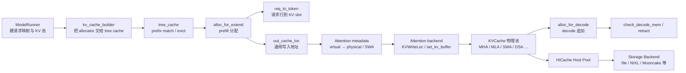

# KV-Cache

## 读者为什么要读

如果你只知道“KV Cache 能减少重复计算”，排查 serving 问题时会很快卡住：`KV cache pool is full` 到底是物理显存不够，还是请求行不够，还是 page 边界导致的额外分配？prefix cache 命中后，哪些 token 真的不用写 KV？decode 每步为什么还可能触发 retract？

这一组文档回答一个更具体的问题：

> 一个请求里的 token，如何拿到请求行与 KV 地址、把 K/V 写进真正的物理池、被 prefix tree 接管或复用，并在空间紧张时释放、抢占或下沉到 HiCache？

读完后，你应该能把 `req_pool_idx`、`req_to_token`、`prefix_indices`、`cache_protected_len`、`out_cache_loc`、`KVWriteLoc`、allocator、物理 `KVCache` 与 RadixCache 的边界分清。

## 主线图



最容易误解的是把整条链压扁成“一个 allocator 加一个大 tensor”。用于首次学习的基线其实是三层契约：

- `ReqToTokenPool`：给每个请求一行，记录这个请求每个逻辑 token 对应哪个 KV slot。
- `TokenToKVPoolAllocator`：管理 KV slot 或 page 的空闲与释放。
- `KVCache`：真正持有设备侧物理内容；attention metadata 会在必要时把通用位置翻译成 full/SWA 等物理目标，再由 backend 写入。

这只是基线，不是所有配置下的字面对象图。Hybrid 请求池还要管理 Mamba state；Unified pool 中 `out_cache_loc` 可以是 virtual id；SWA 同一 token 可能有 full 与 window 两个物理位置；MLA/DSA、PageMajor、HND、ROCm `vectorized_5d` 与严格 prefill-only 的 NoOp pool 也不服从“每层一对普通 K/V tensor”这个简化形状。后续文档会始终先讲基线，再标出这些失效边界。

源码入口：

```python
# 定位骨架（非逐行摘录）：来源 python/sglang/srt/mem_cache/memory_pool.py L242-L268
class ReqToTokenPool:
    """A memory pool that maps a request to its token locations."""
    ...
    self.req_to_token = torch.zeros(
        (self._alloc_size, max_context_len), dtype=torch.int32, device=device
    )
    self.free_slots = list(range(1, self._alloc_size))
```

```python
# 定位骨架（非逐行摘录）：来源 python/sglang/srt/mem_cache/allocator/base.py L27-L110
class BaseTokenToKVPoolAllocator(abc.ABC):
    ...
    def available_size(self):
        return (len(self.free_pages) + len(self.release_pages)) * self.page_size
```

## 首次阅读路径

| 文件 | 读完要能回答 |
| ------ | -------------- |
| [[SGLang-KV-Cache-核心概念]] | 三层基线如何扩展到 virtual/physical、多物理目标与特殊池？ |
| [[SGLang-KV-Cache-源码走读]] | 一次 prefill/decode 如何分配 `out_cache_loc` 并写入 K/V？ |
| [[SGLang-KV-Cache-数据流]] | `Req`、`ScheduleBatch`、allocator、attention backend 之间传什么对象？ |
| [[SGLang-KV-Cache-排障指南]] | `alloc None`、page 对齐、retract、HiCache 启动失败分别查哪里？ |
| [[SGLang-KV-Cache-学习检查]] | 能否独立画出 KV slot 生命周期并做静态/运行验收？ |

## 源码范围

主要阅读：

- `python/sglang/srt/model_executor/model_runner_kv_cache_mixin.py`
- `python/sglang/srt/mem_cache/kv_cache_builder.py`
- `python/sglang/srt/mem_cache/common.py`
- `python/sglang/srt/mem_cache/memory_pool.py`
- `python/sglang/srt/mem_cache/allocator/base.py`
- `python/sglang/srt/mem_cache/allocator/token.py`
- `python/sglang/srt/mem_cache/allocator/paged.py`
- `python/sglang/srt/mem_cache/pool_host/base.py`
- `python/sglang/srt/mem_cache/storage/backend_factory.py`
- `python/sglang/srt/layers/attention/triton_backend.py`

## 相邻专题

- 上游调度压力来自 [[SGLang-Scheduler]]：Scheduler 决定何时 prefill/decode，以及 decode 前何时 retract。
- prefix 复用逻辑见 [[SGLang-RadixAttention]]：RadixCache 决定哪些 prefix token 可以复用。
- Attention backend 如何消费 KV slot 见 [[SGLang-Attention]]。
- GPU forward 入口见 [[SGLang-ModelRunner]]。
