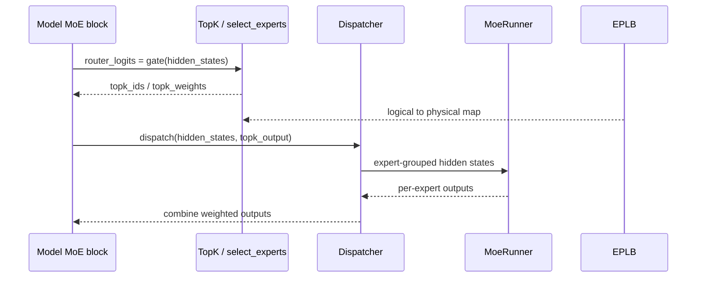

# MoE · 源码走读

## 读者任务

这篇沿一个 decode step 的 MoE 层读源码：一个 token 的 hidden state 先被 gate 打分，再选 top-k expert，随后被 dispatcher 送到本地或远端 expert，完成 GEMM 后再 combine 回原 token 顺序。读完后你应该能把 MoE 延迟拆成 router、dispatch、expert GEMM、combine、rebalance 五个可排查阶段。

## 长文读法

这篇按“一个 token 在 MoE 层里如何被路由、搬运、计算、合并”读：模型层只做 gate/top-k/experts 调用；router 和 `select_experts` 产出 expert id 与权重；`FusedMoE.forward_impl` 固定执行 dispatch、runner、combine；DeepEP 把 dispatch/combine 拆成阶段状态机；EPLB 再周期性根据 expert 分布重排位置。

| 读者任务 | 先读 | 要抓住的判断 |
|----------|------|--------------|
| 第一次建立 MoE 主线 | 读者任务、主线总览、1 | 模型层不直接 all-to-all 或 GEMM，只串起 gate、top-k 和 experts |
| 排查 router/top-k | 2 到 4 | router logits、top-k ids/weights、expert location 映射共同决定 token 去哪里 |
| 排查 dispatch/combine | 5 到 6 | dispatcher 负责 token 搬运和回填顺序，MoE core 只消费 dispatch 后的 expert 分组输入 |
| 排查 expert GEMM | 5 | `quant_method.apply` 是 expert 计算入口，具体 runner/量化路径在量化和 MoE runner 内部 |
| 排查 DeepEP 阶段 | 6 | DeepEP 将 dispatch 和 combine 分成 A/B 阶段，状态机错误会表现为阶段不匹配 |
| 排查负载不均 | 7 | EPLB 看 expert 分布统计并更新 expert location，不是每个 token 临时重排 |

读的时候按五段定位延迟：router/top-k、dispatch、expert GEMM、combine、EPLB rebalance。每段的对象和排障入口不同。

## 主线总览



## 1. 模型层先做 gate，再交给 top-k 和 experts

模型实现里最小主线很清楚：`gate` 产出 `router_logits`，`topk` 产出路由结果，`experts` 消费 hidden states 和 top-k 输出。

```python
# 来源：sglang/python/sglang/srt/models/bailing_moe.py L337-L341
    def _forward_router_experts(self, hidden_states: torch.Tensor):
        # router_logits: (num_tokens, n_experts)
        router_logits = self.gate(hidden_states)
        topk_output = self.topk(hidden_states, router_logits)
        return self.experts(hidden_states, topk_output)
```

DeepEP 路径仍保留同一主线，只是把 `forward_batch.num_token_non_padded` 和 `ExpertLocationDispatchInfo` 传给 top-k，用于 padding mask 和 expert location 映射。

```python
# 来源：sglang/python/sglang/srt/models/bailing_moe.py L389-L413
    def forward_deepep(
        self, hidden_states: torch.Tensor, forward_batch: ForwardBatch
    ) -> torch.Tensor:
        shared_output = None
        forward_mode = forward_batch.forward_mode
        if is_non_idle_and_non_empty(forward_mode, hidden_states):
            router_logits = self.gate(hidden_states)
            if self.num_shared_experts > 0:
                shared_output = self.shared_experts(hidden_states)

            topk_output = self.topk(
                hidden_states,
                router_logits,
                num_token_non_padded=forward_batch.num_token_non_padded,
                expert_location_dispatch_info=ExpertLocationDispatchInfo.init_new(
                    layer_id=self.layer_id,
                ),
            )
        else:
            topk_output = self.topk.empty_topk_output(hidden_states.device)

        final_hidden_states = self.experts(
            hidden_states=hidden_states,
            topk_output=topk_output,
        )
```

这里先确认一个边界：模型层不直接做 all-to-all，也不直接做 expert GEMM，它只组装 MoE 层需要的输入。

## 2. fused router 把每个 token 打到所有 expert 上

router kernel 的每个 program 处理一个 token。它加载该 token 的 hidden state 和所有 expert 的 router weight，然后做 dot product 得到 logits。

```python
# 来源：sglang/python/sglang/srt/layers/moe/router.py L28-L45
    pid = tl.program_id(axis=0)

    offsets = tl.arange(0, BLOCK_SIZE)
    mask = offsets < hidden_dim

    # moe_router_weight is k major
    expert_offsets = tl.arange(0, num_experts)[:, None]
    router_mask = mask[None, :]
    w_router = tl.load(
        moe_router_weight_ptr + expert_offsets * hidden_dim + offsets[None, :],
        mask=router_mask,
        other=0.0,
    )

    x = tl.load(input_ptr + pid * hidden_dim + offsets, mask=mask, other=0.0)

    # todo: tl.dot?
    logits = tl.sum((w_router.to(tl.float32) * x[None, :].to(tl.float32)), axis=-1)
```

随后 softcap 和 correction bias 只改 router logits，不改 expert 权重。

```python
# 来源：sglang/python/sglang/srt/layers/moe/router.py L47-L60
    # logit softcap
    if moe_softcapping == 0:
        logits_softcapped = logits
    else:
        logits_scaled = logits / moe_softcapping
        exped = tl.exp(2 * logits_scaled)
        top = exped - 1
        bottom = exped + 1
        logits_softcapped = top / bottom * moe_softcapping

    # Add bias after softcapping
    if is_correction_bias:
        bias = tl.load(correction_bias_ptr + tl.arange(0, num_experts))
        logits_softcapped = logits_softcapped + bias
```

## 3. top-k 输出转诊单：expert id 和权重

top-k 的最小输出是 `topk_ids` 和 `topk_weights`。top-1 直接取 argmax；top-2 会 mask 已选 expert 再选第二个。

```python
# 来源：sglang/python/sglang/srt/layers/moe/router.py L67-L90
    top1 = tl.argmax(logits_softcapped, axis=0)
    tl.store(topk_ids_ptr + pid * topk + 0, top1)  # 5.63 us

    top1_v = tl.max(logits_softcapped, axis=0)
    invsumexp = 1.0 / tl.sum(tl.exp(logits_softcapped - top1_v), axis=0)

    tl.store(
        topk_weights_ptr + pid * topk + 0,
        invsumexp,
    )  # 5.73 us

    if topk >= 2:
        top2 = tl.argmax(
            tl.where(
                tl.arange(0, num_experts) != top1, logits_softcapped, float("-inf")
            ),
            axis=0,
        )
        tl.store(topk_ids_ptr + pid * topk + 1, top2)
        top2_v = tl.sum(logits_softcapped * (tl.arange(0, num_experts) == top2), axis=0)
        tl.store(
            topk_weights_ptr + pid * topk + 1,
            tl.exp(top2_v - top1_v) * invsumexp,
        )  # 5.95us
```

如果你排查“某个 token 被送错专家”，先看 top-k 输出，再看后续 logical-to-physical 映射，不要直接跳到 GEMM kernel。

## 4. `select_experts` 是通用 top-k 分发器

不同模型和硬件可能走 grouped top-k、biased top-k、torch native、FlashInfer routed 或自定义 routing，但 `select_experts` 先把配置拆成统一变量，并允许 expert location dispatch 改写输入。

```python
# 来源：sglang/python/sglang/srt/layers/moe/topk.py L1876-L1911
def select_experts(
    hidden_states: torch.Tensor,
    router_logits: torch.Tensor,
    topk_config: TopKConfig,
    *,
    layer_id: Optional[int] = None,
    num_token_non_padded: Optional[torch.Tensor] = None,
    expert_location_dispatch_info: Optional[ExpertLocationDispatchInfo] = None,
) -> StandardTopKOutput:
    top_k = topk_config.top_k
    use_grouped_topk = topk_config.use_grouped_topk
    topk_group = topk_config.topk_group
    num_expert_group = topk_config.num_expert_group
    renormalize = topk_config.renormalize
    num_fused_shared_experts = topk_config.num_fused_shared_experts
    custom_routing_function = topk_config.custom_routing_function
    correction_bias = topk_config.correction_bias
    torch_native = topk_config.torch_native
    routed_scaling_factor = topk_config.routed_scaling_factor
    apply_routed_scaling_factor_on_output = (
        topk_config.apply_routed_scaling_factor_on_output
    )

    scoring_func = topk_config.scoring_func

    # Set by the fused-gating+pack branch below; None everywhere else.
    packed_topk = None

    (
        router_logits,
        correction_bias,
    ) = expert_location_dispatch.transform_select_experts_inputs(
        router_logits=router_logits,
        correction_bias=correction_bias,
        info=expert_location_dispatch_info,
    )
```

函数尾部再做 post process、记录 expert 分布，并返回标准 top-k 输出。

```python
# 来源：sglang/python/sglang/srt/layers/moe/topk.py L2091-L2111
    topk_ids, topk_weights, recorder_topk_ids = _post_process_topk_ids(
        topk_ids=topk_ids,
        topk_weights=topk_weights,
        topk_config=topk_config,
        router_logits=router_logits,
        num_token_non_padded=num_token_non_padded,
        layer_id=layer_id,
        expert_location_dispatch_info=expert_location_dispatch_info,
    )

    get_global_expert_distribution_recorder().on_select_experts(
        topk_ids=recorder_topk_ids
    )

    # ===== TO BE REFACTORED ====
    if packed_topk is not None:
        return StandardTopKOutputPacked(
            topk_weights, topk_ids, router_logits, packed_topk
        )
    # ===== END TO BE REFACTORED ====
    return StandardTopKOutput(topk_weights, topk_ids, router_logits)
```

这段解释了 EPLB 统计的入口：不是 dispatch 后才统计，而是在 top-k post process 之后记录用于统计的 expert ids。

## 5. `FusedMoE.forward_impl` 固定执行三段

到了 expert 层，执行顺序稳定：dispatch、`run_moe_core`、combine。量化、EP、DeepEP、FlashInfer 等只改变这些阶段内部怎么实现。

```python
# 来源：sglang/python/sglang/srt/layers/moe/fused_moe_triton/layer.py L1134-L1150
    def forward_impl(self, hidden_states: torch.Tensor, topk_output: TopKOutput):
        origin_hidden_states_dim = hidden_states.shape[-1]
        assert self.quant_method is not None

        dispatch_output = self.dispatcher.dispatch(
            hidden_states=hidden_states, topk_output=topk_output
        )

        combine_input = self.run_moe_core(
            dispatch_output=dispatch_output,
        )

        with use_symmetric_memory(
            get_tp_group(), disabled=not is_allocation_symmetric()
        ):
            final_hidden_states = self.dispatcher.combine(combine_input=combine_input)
```

```python
# 来源：sglang/python/sglang/srt/layers/moe/fused_moe_triton/layer.py L1156-L1159
        if self.reduce_results and (self.moe_tp_size > 1 or self.moe_ep_size > 1):
            final_hidden_states = tensor_model_parallel_all_reduce(final_hidden_states)

        return final_hidden_states
```

`run_moe_core` 是量化方法接管的位置。无量化、FP8、INT4、FlashInfer routed 等差异，主要在 `quant_method.apply` 里展开。

```python
# 来源：sglang/python/sglang/srt/layers/moe/fused_moe_triton/layer.py L1178-L1183
    def run_moe_core(self, dispatch_output: DispatchOutput) -> CombineInput:
        # TODO: consider using symmetric memory
        return self.quant_method.apply(
            layer=self,
            dispatch_output=dispatch_output,
        )
```

## 6. DeepEP 把搬运拆成阶段状态机

DeepEP 的 dispatcher 不是新的 MoE 数学，而是把 dispatch 和 combine 拆成 A/B 阶段。`_stage` 断言保证顺序。

```python
# 来源：sglang/python/sglang/srt/layers/moe/token_dispatcher/deepep.py L897-L951
    def dispatch(
        self,
        hidden_states: torch.Tensor,
        topk_output: TopKOutput,
    ) -> DispatchOutput:
        self.dispatch_a(hidden_states, topk_output)
        if self._deepep_dispatch_hooks is not None:
            self._deepep_dispatch_hooks(self)
        ret = self.dispatch_b()
        return ret

    def dispatch_a(
        self,
        hidden_states: torch.Tensor,
        topk_output: TopKOutput,
    ):
        self._update_stage(_Stage.INITIAL, _Stage.AFTER_DISPATCH_A)
        inner_state = self._get_impl().dispatch_a(
            hidden_states=hidden_states,
            topk_output=topk_output,
        )
        self._dispatch_intermediate_state = inner_state

    def dispatch_b(self):
        self._update_stage(_Stage.AFTER_DISPATCH_A, _Stage.AFTER_DISPATCH_B)
        inner_state = self._dispatch_intermediate_state
        del self._dispatch_intermediate_state
        return self._get_impl().dispatch_b(*inner_state)

    def combine(
        self,
        combine_input: CombineInput,
    ) -> torch.Tensor:
        self.combine_a(combine_input)
        ret = self.combine_b()
        return ret

    def combine_a(
        self,
        combine_input: CombineInput,
    ):
        hidden_states, topk_ids, topk_weights = combine_input
        self._update_stage(_Stage.AFTER_DISPATCH_B, _Stage.AFTER_COMBINE_A)
        inner_state = self._get_impl().combine_a(
            hidden_states=hidden_states,
            topk_ids=topk_ids,
            topk_weights=topk_weights,
        )
        self._combine_intermediate_state = inner_state

    def combine_b(self):
        self._update_stage(_Stage.AFTER_COMBINE_A, _Stage.INITIAL)
        inner_state = self._combine_intermediate_state
        del self._combine_intermediate_state
        return self._get_impl().combine_b(*inner_state)
```

排查 DeepEP 时要看阶段是否按 `INITIAL → AFTER_DISPATCH_A → AFTER_DISPATCH_B → AFTER_COMBINE_A → INITIAL` 回到起点。

## 7. EPLB 周期性重排 expert location

EPLB 不在每个 token 上动态调度。它每隔固定 forward pass 数 dump 统计，判断是否需要 rebalance，然后更新 model runner 里的 expert location metadata。

```python
# 来源：sglang/python/sglang/srt/eplb/eplb_manager.py L47-L87
    # can be more complex if needed
    def _entrypoint(self):
        while True:
            for _ in range(self._rebalance_num_iterations):
                yield

            yield from self.rebalance()

    def rebalance(self):
        logger.info("[EPLBManager] rebalance start")

        enable_timing = self._rebalance_layers_per_chunk is None

        if enable_timing:
            torch.get_device_module().synchronize()
            time_start = time.time()

        dump_record_output = get_global_expert_distribution_recorder().dump_record(
            output_mode="object"
        )
        logical_count = dump_record_output["logical_count"]
        average_utilization_rate_over_window = dump_record_output[
            "average_utilization_rate_over_window"
        ]

        # Check whether rebalancing is needed
        if not self._check_rebalance_needed(average_utilization_rate_over_window):
            return

        expert_location_metadata = ExpertLocationMetadata.init_by_eplb(
            self._server_args, self._model_runner.model_config, logical_count
        )

        update_layer_ids_chunks = self._compute_update_layer_ids_chunks()
        for chunk_index, update_layer_ids in enumerate(update_layer_ids_chunks):
            if len(update_layer_ids_chunks) > 1:
                yield
            self._model_runner.update_expert_location(
                expert_location_metadata,
                update_layer_ids=update_layer_ids,
            )
```

因此看到短暂停顿不一定是 bug；如果刚好到 rebalance 周期，它可能正在更新 expert placement。

## 运行验证

最小断点链：

1. `models/bailing_moe.py:_forward_router_experts`：确认 `router_logits` 和 `topk_output` 的 shape。
2. `layers/moe/topk.py:select_experts`：确认 top-k 分支、padding mask、EPLB remap 是否参与。
3. `layers/moe/fused_moe_triton/layer.py:forward_impl`：确认 dispatch、core、combine 顺序。
4. `token_dispatcher/deepep.py:dispatch_a/dispatch_b/combine_a/combine_b`：确认 A2A 阶段和 `_stage`。
5. `eplb/eplb_manager.py:rebalance`：确认 `logical_count`、是否触发 update。

对照实验：

- 关闭 EP 或换成非 DeepEP dispatcher，观察 dispatch/combine 阶段是否消失或缩短。
- 关闭 EPLB，观察 `topk_ids` 是否仍 logical-to-physical remap。
- 切换量化 runner，观察 `run_moe_core` 内部耗时变化，而 dispatch/combine 顺序不变。

## 复盘

- router/top-k 选择专家，dispatcher 只搬运 token。
- `FusedMoE.forward_impl` 是读 MoE 的总闸口，很多 backend 差异都能归到 dispatch、core、combine 三段。
- EPLB 改 physical placement，不改 gate 的基本语义。
- DeepEP 的性能问题常在搬运阶段，不在 top-k 本身。
