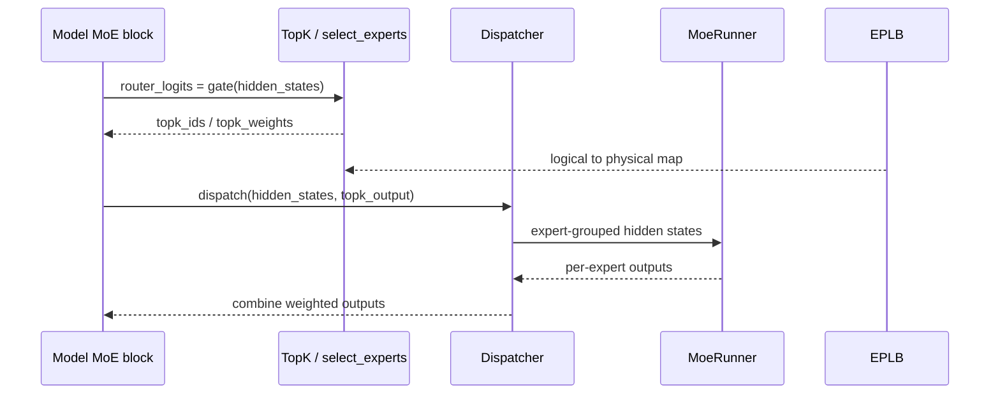

# MoE · 源码走读

## 读者任务

这篇沿一个 decode step 的 MoE 层读源码。读完后你不仅能拆 router、dispatch、expert GEMM、combine、rebalance 延迟，还能回答：top-k 在哪里 materialize、哪份 id 是 logical/physical/recorder、scaling 在 top-k 还是输出端应用、DeepEP 本轮使用哪种 ABI。

## 长文读法

这篇沿一个 token 的身份变化读：logit → format-specific top-k carrier → logical id → physical replica id → dispatcher ABI → expert core → combine。外层是 gate/top-k/experts 与 dispatch/core/combine，真正容易出错的是中间 carrier、id 视图、通信 dtype 和 routed scaling 的所有权。

| 读者任务 | 先读 | 要抓住的判断 |
|----------|------|--------------|
| 第一次建立 MoE 主线 | 读者任务、主线总览、1 | 模型层不直接 all-to-all 或 GEMM，只串起 gate、top-k 和 experts |
| 排查 router/top-k | 2 到 4 | router logits、top-k ids/weights、expert location 映射共同决定 token 去哪里 |
| 排查 format/remap | 3 到 5 | runner 决定 carrier，post-process 决定 ids、shared slot 与 scaling |
| 排查 dispatch/combine | 6 到 7 | dispatcher 管理搬运、通信格式、状态与回填，hook 可改写阶段对象 |
| 排查 expert GEMM | 6 | `quant_method.apply` 是 core 入口，但量化影响面还延伸到 TopK 与 dispatcher |
| 排查 DeepEP 阶段 | 7 | A/B 状态机之外还要核 normal/LL ABI、dtype、event/hook |
| 排查负载不均 | 8 | 分开看 placement rebalance 与逐 token replica dispatch |

读的时候按七段定位：scoring、format/materialization、post-process/remap、dispatch、expert core、combine、placement rebalance。每段的对象和排障入口不同。

## 主线总览



## 1. 模型层先做 gate，再交给 top-k 和 experts

模型实现里最小主线很清楚：`gate` 产出 `router_logits`，`topk` 产出路由结果，`experts` 消费 hidden states 和 top-k 输出。

```python
# 来源：sglang/python/sglang/srt/models/bailing_moe.py L337-L341
    def _forward_router_experts(self, hidden_states: torch.Tensor):
        # router_logits: (num_tokens, n_experts)
        router_logits = self.gate(hidden_states)
        topk_output = self.topk(hidden_states, router_logits)
        return self.experts(hidden_states, topk_output)
```

DeepEP 路径仍保留同一主线，只是把 `forward_batch.num_token_non_padded` 和 `ExpertLocationDispatchInfo` 传给 top-k，用于 padding mask 和 expert location 映射。

```python
# 来源：sglang/python/sglang/srt/models/bailing_moe.py L389-L413
    def forward_deepep(
        self, hidden_states: torch.Tensor, forward_batch: ForwardBatch
    ) -> torch.Tensor:
        shared_output = None
        forward_mode = forward_batch.forward_mode
        if is_non_idle_and_non_empty(forward_mode, hidden_states):
            router_logits = self.gate(hidden_states)
            if self.num_shared_experts > 0:
                shared_output = self.shared_experts(hidden_states)

            topk_output = self.topk(
                hidden_states,
                router_logits,
                num_token_non_padded=forward_batch.num_token_non_padded,
                expert_location_dispatch_info=ExpertLocationDispatchInfo.init_new(
                    layer_id=self.layer_id,
                ),
            )
        else:
            topk_output = self.topk.empty_topk_output(hidden_states.device)

        final_hidden_states = self.experts(
            hidden_states=hidden_states,
            topk_output=topk_output,
        )
```

这里先确认一个边界：模型层不直接做 all-to-all，也不直接做 expert GEMM，它只组装 MoE 层需要的输入。

## 2. fused router 把每个 token 打到所有 expert 上

router kernel 的每个 program 处理一个 token。它加载该 token 的 hidden state 和所有 expert 的 router weight，然后做 dot product 得到 logits。

```python
# 来源：sglang/python/sglang/srt/layers/moe/router.py L28-L45
    pid = tl.program_id(axis=0)

    offsets = tl.arange(0, BLOCK_SIZE)
    mask = offsets < hidden_dim

    # moe_router_weight is k major
    expert_offsets = tl.arange(0, num_experts)[:, None]
    router_mask = mask[None, :]
    w_router = tl.load(
        moe_router_weight_ptr + expert_offsets * hidden_dim + offsets[None, :],
        mask=router_mask,
        other=0.0,
    )

    x = tl.load(input_ptr + pid * hidden_dim + offsets, mask=mask, other=0.0)

    # todo: tl.dot?
    logits = tl.sum((w_router.to(tl.float32) * x[None, :].to(tl.float32)), axis=-1)
```

随后 softcap 和 correction bias 只改 router logits，不改 expert 权重。

```python
# 来源：sglang/python/sglang/srt/layers/moe/router.py L47-L60
    # logit softcap
    if moe_softcapping == 0:
        logits_softcapped = logits
    else:
        logits_scaled = logits / moe_softcapping
        exped = tl.exp(2 * logits_scaled)
        top = exped - 1
        bottom = exped + 1
        logits_softcapped = top / bottom * moe_softcapping

    # Add bias after softcapping
    if is_correction_bias:
        bias = tl.load(correction_bias_ptr + tl.arange(0, num_experts))
        logits_softcapped = logits_softcapped + bias
```

## 3. top-k 不总是立即产出 ids 和 weights

fused router 的显式输出是 `topk_ids/topk_weights`：top-1 取 argmax，top-2 mask 已选 expert 后再选。但这是某个 router kernel 的实现，不是 `TopK` 对所有 runner 的统一 ABI；Triton runner 可直接拿 routing/gather/scatter data，FlashInfer/TRTLLM 类 runner 可拿 bypassed carrier 延迟 materialize。

```python
# 来源：sglang/python/sglang/srt/layers/moe/router.py L67-L90
    top1 = tl.argmax(logits_softcapped, axis=0)
    tl.store(topk_ids_ptr + pid * topk + 0, top1)  # 5.63 us

    top1_v = tl.max(logits_softcapped, axis=0)
    invsumexp = 1.0 / tl.sum(tl.exp(logits_softcapped - top1_v), axis=0)

    tl.store(
        topk_weights_ptr + pid * topk + 0,
        invsumexp,
    )  # 5.73 us

    if topk >= 2:
        top2 = tl.argmax(
            tl.where(
                tl.arange(0, num_experts) != top1, logits_softcapped, float("-inf")
            ),
            axis=0,
        )
        tl.store(topk_ids_ptr + pid * topk + 1, top2)
        top2_v = tl.sum(logits_softcapped * (tl.arange(0, num_experts) == top2), axis=0)
        tl.store(
            topk_weights_ptr + pid * topk + 1,
            tl.exp(top2_v - top1_v) * invsumexp,
        )  # 5.95us
```

如果你排查“某个 token 被送错专家”，先确认当前 carrier 是否已经 materialize，再追 logical→physical→DeepEP interleaved 的 id 演化，不要直接跳到 GEMM kernel。

## 4. `select_experts` 是通用 top-k 分发器

不同模型和硬件可能走 grouped top-k、biased top-k、torch native 或自定义 routing；只有需要 standard carrier 时才进入 `select_experts`。bypassed 与 Triton-kernel 路径可以绕过这里的即时 materialization。

```python
# 来源：sglang/python/sglang/srt/layers/moe/topk.py L1876-L1911
def select_experts(
    hidden_states: torch.Tensor,
    router_logits: torch.Tensor,
    topk_config: TopKConfig,
    *,
    layer_id: Optional[int] = None,
    num_token_non_padded: Optional[torch.Tensor] = None,
    expert_location_dispatch_info: Optional[ExpertLocationDispatchInfo] = None,
) -> StandardTopKOutput:
    top_k = topk_config.top_k
    use_grouped_topk = topk_config.use_grouped_topk
    topk_group = topk_config.topk_group
    num_expert_group = topk_config.num_expert_group
    renormalize = topk_config.renormalize
    num_fused_shared_experts = topk_config.num_fused_shared_experts
    custom_routing_function = topk_config.custom_routing_function
    correction_bias = topk_config.correction_bias
    torch_native = topk_config.torch_native
    routed_scaling_factor = topk_config.routed_scaling_factor
    apply_routed_scaling_factor_on_output = (
        topk_config.apply_routed_scaling_factor_on_output
    )

    scoring_func = topk_config.scoring_func

    # Set by the fused-gating+pack branch below; None everywhere else.
    packed_topk = None

    (
        router_logits,
        correction_bias,
    ) = expert_location_dispatch.transform_select_experts_inputs(
        router_logits=router_logits,
        correction_bias=correction_bias,
        info=expert_location_dispatch_info,
    )
```

函数尾部做 post-process、记录 expert 分布，并返回 standard 或实验性 packed-standard 输出。这里的 `recorder_topk_ids` 是专门的数据视图，不保证等于最终 dispatch ids。

```python
# 来源：sglang/python/sglang/srt/layers/moe/topk.py L2091-L2111
    topk_ids, topk_weights, recorder_topk_ids = _post_process_topk_ids(
        topk_ids=topk_ids,
        topk_weights=topk_weights,
        topk_config=topk_config,
        router_logits=router_logits,
        num_token_non_padded=num_token_non_padded,
        layer_id=layer_id,
        expert_location_dispatch_info=expert_location_dispatch_info,
    )

    get_global_expert_distribution_recorder().on_select_experts(
        topk_ids=recorder_topk_ids
    )

    # ===== TO BE REFACTORED ====
    if packed_topk is not None:
        return StandardTopKOutputPacked(
            topk_weights, topk_ids, router_logits, packed_topk
        )
    # ===== END TO BE REFACTORED ====
    return StandardTopKOutput(topk_weights, topk_ids, router_logits)
```

这段解释了统计入口：不是 dispatch 后才统计，而是 post-process 返回专门的 recorder ids 后记录。shared slot 与 DeepEP interleaved remap 可能发生在 recorder 视图固定之后。

## 5. TopK format 与 post-process 决定中间 ABI

CUDA 路径先根据显式 `output_format`、runner backend、LoRA 和 FP4 条件选择 carrier。Triton-kernel 直接返回 routing data；bypassed 保存 hidden、logits 与 config；standard 才调用 `select_experts`。

```python
# 来源：sglang/python/sglang/srt/layers/moe/topk.py L472-L475
        if self.topk_config.output_format is not None:
            output_format = self.topk_config.output_format
        elif get_moe_runner_backend().is_triton_kernels():
            output_format = TopKOutputFormat.TRITON_KERNEL
```

```python
# 来源：sglang/python/sglang/srt/layers/moe/topk.py L490-L512
        elif get_moe_runner_backend().is_flashinfer_trtllm() or (
            get_moe_runner_backend().is_flashinfer_mxfp4() and not self.is_fp4_experts
        ):
            output_format = TopKOutputFormat.BYPASSED
        else:
            output_format = TopKOutputFormat.STANDARD

        if output_format == TopKOutputFormat.TRITON_KERNEL:
            # renormalize=True is equivalent to sm_first=False
            routing_data, gather_idx, scatter_idx = routing(
                router_logits,
                self.topk_config.top_k,
                sm_first=not self.topk_config.renormalize,
            )
            return TritonKernelTopKOutput(routing_data, gather_idx, scatter_idx)
        elif output_format == TopKOutputFormat.BYPASSED:
            return BypassedTopKOutput(
                hidden_states=hidden_states,
                router_logits=router_logits,
                topk_config=self.topk_config,
                num_token_non_padded=num_token_non_padded,
                expert_location_dispatch_info=expert_location_dispatch_info,
            )
```

standard 路径的 post-process 顺序很关键：先捕获 logical routed ids；LP 求解与 logical→physical；padding id；确定 recorder ids；追加 shared expert；DeepEP interleaved remap；最后在 HIP 上按环境开关清零 padded weights。于是“gate 选中的 id”“recorder 看到的 id”“dispatcher 收到的 id”可以不同。

routed scaling 也在这里参与数据契约。Aiter 已把 scaling 折入 routed weights，所以 shared weight 用 `1.0`；默认 post-MoE scaling 路径用 `1/routed_scaling_factor`。源码注释还明确指出其他预折叠 backend 理论上也需要 `1.0`，但当前修复只覆盖 Aiter，这是应保留的 correctness 风险，而不是可以泛化掉的实现细节。

```python
# 来源：sglang/python/sglang/srt/layers/moe/topk.py L1685-L1689
    routed_scaling_factor = topk_config.routed_scaling_factor
    if _use_aiter:
        topk_weights[:, -num_fused_shared_experts:] = 1.0
    elif routed_scaling_factor is not None and routed_scaling_factor != 0:
        topk_weights[:, -num_fused_shared_experts:] = 1.0 / routed_scaling_factor
```

## 6. `FusedMoE.forward_impl` 固定外层三段

到了 expert 层，外层顺序稳定：dispatch、`run_moe_core`、combine。但量化、runner 与 DeepEP 会改变 TopK carrier、dispatch output format、通信 dtype、scale tensor、core 的输入语义和 scaling 位置，不能缩写成“只替换 core kernel”。

```python
# 来源：sglang/python/sglang/srt/layers/moe/fused_moe_triton/layer.py L1134-L1150
    def forward_impl(self, hidden_states: torch.Tensor, topk_output: TopKOutput):
        origin_hidden_states_dim = hidden_states.shape[-1]
        assert self.quant_method is not None

        dispatch_output = self.dispatcher.dispatch(
            hidden_states=hidden_states, topk_output=topk_output
        )

        combine_input = self.run_moe_core(
            dispatch_output=dispatch_output,
        )

        with use_symmetric_memory(
            get_tp_group(), disabled=not is_allocation_symmetric()
        ):
            final_hidden_states = self.dispatcher.combine(combine_input=combine_input)
```

```python
# 来源：sglang/python/sglang/srt/layers/moe/fused_moe_triton/layer.py L1156-L1159
        if self.reduce_results and (self.moe_tp_size > 1 or self.moe_ep_size > 1):
            final_hidden_states = tensor_model_parallel_all_reduce(final_hidden_states)

        return final_hidden_states
```

`run_moe_core` 是量化 method 接管 expert core 的位置；在到达这里之前，method 还可能已经给 dispatcher 写入 quant config，runner 也可能决定 TopK format。因此它是核心计算入口，却不是全部量化影响面的边界。

```python
# 来源：sglang/python/sglang/srt/layers/moe/fused_moe_triton/layer.py L1178-L1183
    def run_moe_core(self, dispatch_output: DispatchOutput) -> CombineInput:
        # TODO: consider using symmetric memory
        return self.quant_method.apply(
            layer=self,
            dispatch_output=dispatch_output,
        )
```

## 7. DeepEP 把不同通信 ABI 包进同一阶段状态机

DeepEP 的 dispatcher 把 dispatch 和 combine 拆成 A/B 阶段，`_stage` 断言保证顺序；但 normal 与 low-latency 不是同一数据结构的快慢档。normal output 带 `num_recv_tokens_per_expert`，low-latency output 带 `masked_m/expected_m`；后者还维护 packed receive count，并可用 recv hook 与 overlap stream 同步。

```python
# 来源：sglang/python/sglang/srt/layers/moe/token_dispatcher/deepep.py L897-L951
    def dispatch(
        self,
        hidden_states: torch.Tensor,
        topk_output: TopKOutput,
    ) -> DispatchOutput:
        self.dispatch_a(hidden_states, topk_output)
        if self._deepep_dispatch_hooks is not None:
            self._deepep_dispatch_hooks(self)
        ret = self.dispatch_b()
        return ret

    def dispatch_a(
        self,
        hidden_states: torch.Tensor,
        topk_output: TopKOutput,
    ):
        self._update_stage(_Stage.INITIAL, _Stage.AFTER_DISPATCH_A)
        inner_state = self._get_impl().dispatch_a(
            hidden_states=hidden_states,
            topk_output=topk_output,
        )
        self._dispatch_intermediate_state = inner_state

    def dispatch_b(self):
        self._update_stage(_Stage.AFTER_DISPATCH_A, _Stage.AFTER_DISPATCH_B)
        inner_state = self._dispatch_intermediate_state
        del self._dispatch_intermediate_state
        return self._get_impl().dispatch_b(*inner_state)

    def combine(
        self,
        combine_input: CombineInput,
    ) -> torch.Tensor:
        self.combine_a(combine_input)
        ret = self.combine_b()
        return ret

    def combine_a(
        self,
        combine_input: CombineInput,
    ):
        hidden_states, topk_ids, topk_weights = combine_input
        self._update_stage(_Stage.AFTER_DISPATCH_B, _Stage.AFTER_COMBINE_A)
        inner_state = self._get_impl().combine_a(
            hidden_states=hidden_states,
            topk_ids=topk_ids,
            topk_weights=topk_weights,
        )
        self._combine_intermediate_state = inner_state

    def combine_b(self):
        self._update_stage(_Stage.AFTER_COMBINE_A, _Stage.INITIAL)
        inner_state = self._combine_intermediate_state
        del self._combine_intermediate_state
        return self._get_impl().combine_b(*inner_state)
```

排查 DeepEP 时既要看 `INITIAL → AFTER_DISPATCH_A → AFTER_DISPATCH_B → AFTER_COMBINE_A → INITIAL`，也要记录本轮 `deepep_mode.resolve(is_extend_in_batch)` 选了 normal 还是 low-latency、output dtype 是否被硬件校正、event/hook 是否完成等待。normal 的 handle 暂存在成员变量，源码还留有“随 token 传 handle 会出现未知同步错误”的待解决注释，这说明跨轮或重入尤其需要谨慎。

## 8. EPLB placement 与逐 token dispatch 分层运行

EPLBManager 每隔固定 forward 数 dump 统计并重算 placement metadata；这部分不逐 token 运行。随后 `static/dynamic/fake/lp` dispatch algorithm 才为 logical ids 选择 physical ids，其中后三者可以逐 token 选择 replica。两层都叫“负载均衡”，时间尺度却不同。

```python
# 来源：sglang/python/sglang/srt/eplb/eplb_manager.py L47-L87
    # can be more complex if needed
    def _entrypoint(self):
        while True:
            for _ in range(self._rebalance_num_iterations):
                yield

            yield from self.rebalance()

    def rebalance(self):
        logger.info("[EPLBManager] rebalance start")

        enable_timing = self._rebalance_layers_per_chunk is None

        if enable_timing:
            torch.get_device_module().synchronize()
            time_start = time.time()

        dump_record_output = get_global_expert_distribution_recorder().dump_record(
            output_mode="object"
        )
        logical_count = dump_record_output["logical_count"]
        average_utilization_rate_over_window = dump_record_output[
            "average_utilization_rate_over_window"
        ]

        # Check whether rebalancing is needed
        if not self._check_rebalance_needed(average_utilization_rate_over_window):
            return

        expert_location_metadata = ExpertLocationMetadata.init_by_eplb(
            self._server_args, self._model_runner.model_config, logical_count
        )

        update_layer_ids_chunks = self._compute_update_layer_ids_chunks()
        for chunk_index, update_layer_ids in enumerate(update_layer_ids_chunks):
            if len(update_layer_ids_chunks) > 1:
                yield
            self._model_runner.update_expert_location(
                expert_location_metadata,
                update_layer_ids=update_layer_ids,
            )
```

若设置 `eplb_rebalance_layers_per_chunk`，循环会在每个 chunk 更新前 `yield`，一次 rebalance 跨多个 forward 才结束。因此 `rebalance start/end` 之间可能是一段多轮时间窗，不能直接把整段都解释成一次 latency spike。

## 9. 两个不能被教程替你“脑补修好”的源码边界

DeepEP waterfill 会主动改写 TopK contract：从 `top_k` 中扣掉 fused shared expert 数，把 fused shared count 清零，并强制 `STANDARD`，最后由 balancer 再扩展 top-k。它不是 ordinary TopK 后多一个负载均衡 pass。

```python
# 来源：sglang/python/sglang/srt/layers/moe/topk.py L401-L443
        self.enable_deepep_waterfill = (
            num_fused_shared_experts > 0
            and get_global_server_args().enable_deepep_waterfill
        )

        self.deepep_waterfill_balancer = None
        if self.enable_deepep_waterfill:
            # TODO(ch-wan): Refactor shared-expert fusion and routed TopK fusion.
            top_k -= num_fused_shared_experts
            num_fused_shared_experts = 0
            output_format = TopKOutputFormat.STANDARD

        # flashinfer_mxfp4 backend only: True -> STANDARD (Mxfp4FlashinferTrtllmMoEMethod
        # consumes), False -> BYPASSED (flashinfer's own mxfp4 kernel). No-op otherwise.
        self.is_fp4_experts = is_fp4_experts
        self.topk_config = TopKConfig(
            top_k=top_k,
            use_grouped_topk=use_grouped_topk,
            renormalize=renormalize,
            topk_group=topk_group,
            num_expert_group=num_expert_group,
            num_fused_shared_experts=num_fused_shared_experts,
            custom_routing_function=custom_routing_function,
            correction_bias=correction_bias,
            routed_scaling_factor=routed_scaling_factor,
            apply_routed_scaling_factor_on_output=apply_routed_scaling_factor_on_output,
            fused_shared_experts_scaling_factor=fused_shared_experts_scaling_factor,
            output_format=output_format,
            scoring_func=scoring_func,
            allow_routed_experts_capture=allow_routed_experts_capture,
        )

    def _apply_deepep_waterfill(
        self, topk_output: TopKOutput, num_tokens: int
    ) -> TopKOutput:
        if self.enable_deepep_waterfill and self.deepep_waterfill_balancer is None:
            raise RuntimeError(
                "DeepEP waterfill TopK must be prepared by ModelRunner before forward."
            )
        if self.deepep_waterfill_balancer is None:
            return topk_output
        assert TopKOutputChecker.format_is_standard(topk_output)
        return self.deepep_waterfill_balancer.expand_topk(topk_output, num_tokens)
```

`FusedMoeRouter` 也有静态疑点：CUDA 分支把名为 `residual` 的第二实参传给 `forward_cuda` 的 `autotune` 形参，而函数体不使用它；非 CUDA 分支调用类中没有定义的 `forward_vllm`。这只能得出“接口命名和平台可达性需要核验”，不能在没有运行证据时断言线上必然故障。

```python
# 来源：sglang/python/sglang/srt/layers/moe/router.py L401-L418
    def forward(
        self, x: torch.Tensor, residual: torch.Tensor
    ) -> Tuple[torch.Tensor, torch.Tensor]:
        if x.is_cuda:
            return self.forward_cuda(x, residual)
        else:
            return self.forward_vllm(x, residual)

    def forward_cuda(
        self, x: torch.Tensor, autotune=False
    ) -> Tuple[torch.Tensor, torch.Tensor]:
        return fused_moe_router_shim(
            moe_softcapping=self.moe_softcapping,
            hidden_states=x,
            gating_output=self.router_linear.weight,
            topk=self.topk,
            renormalize=False,
        )
```

BailingMoE 还有一个值得动态核对的连接点：构造函数创建 `self.deepep_dispatcher`，但本文件的 `forward_deepep` 只调用 `self.experts(hidden_states, topk_output)`，没有直接引用这个属性。它可能由外层约定、hook 或具体 expert 实现接管，也可能是遗留字段；在追踪对象所有权前，不应凭变量名假定实际调用链。

## 运行验证

最小断点链：

1. `models/bailing_moe.py:_forward_router_experts`：确认 `router_logits` 和 `topk_output` 的 shape。
2. `layers/moe/topk.py:TopK.forward_cuda/select_experts/_post_process_topk_ids`：确认 carrier、materialization、ids 与 scaling。
3. `layers/moe/fused_moe_triton/layer.py:forward_impl`：确认 dispatch、core、combine 顺序。
4. `token_dispatcher/deepep.py:dispatch_a/dispatch_b/combine_a/combine_b`：确认 A2A 阶段和 `_stage`。
5. `eplb/eplb_manager.py:rebalance`：确认 `logical_count`、是否触发 update、是否跨 chunk。
6. `models/bailing_moe.py` 与具体 `get_moe_impl_class`：确认真正被调用的 dispatcher 属于谁。

对照实验：

- 关闭 EP 或换成非 DeepEP dispatcher，观察 dispatch/combine 阶段是否消失或缩短。
- 关闭 EPLB，观察 `topk_ids` 是否仍 logical-to-physical remap。
- 切换量化 runner，同时观察 TopK format、dispatcher output dtype、scale tensor、shared weight 与 core 耗时；外层顺序不变不代表 ABI 不变。

## 复盘

- gate 决定 logical preference；post-process 与 dispatch algorithm 决定最终 physical task，dispatcher hook 还能改写承载对象。
- `FusedMoE.forward_impl` 是读 MoE 的总闸口，很多 backend 差异都能归到 dispatch、core、combine 三段。
- EPLB placement 不改 gate 数学，但 dynamic/fake/lp dispatch 可以逐 token 选择 replica。
- DeepEP 的性能与正确性边界横跨 top-k remap、通信量化、stage state、expert core 和 combine 同步。
