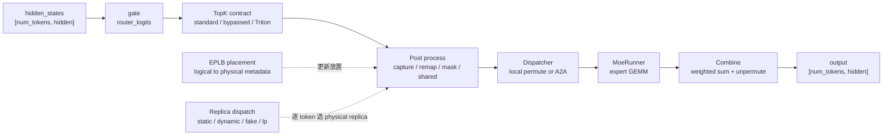

# MoE

> **SGLang 内存与 Attention** | 源码基线：`70df09b83363e0127b43c83a6007d3938f815b2d`
> **核心范围：** `models/*moe.py`、`layers/moe/topk.py`、`layers/moe/fused_moe_triton/layer.py`、`layers/moe/token_dispatcher/`、`eplb/`

## 读者为什么要读

MoE 层的难点不是“多了几个专家”，而是同一个 token 在一层里会变成多份路由任务：先由 gate 选择 top-k 专家，再按 expert id 被 dispatch 到本地或远端 rank，经过专家 GEMM 后再 combine 回原 token 顺序。吞吐下降、all-to-all 变慢、某个 rank 成为 straggler、CUDA Graph 断开，通常都发生在这条链上。

读完本专题后，你应该能做三件事：

- 解释一个 token 在 MoE 层内如何经历 `gate → topk → dispatch → expert GEMM → combine`。
- 判断瓶颈在 router、expert GEMM、EP all-to-all、EPLB 迁移，还是 TP all-reduce。
- 按源码入口排查 expert 不均、DeepEP 状态错误、top-k ABI 不匹配、scaling 重复/漏乘、量化 runner 选错和 piecewise CUDA Graph 分支变化。

## 主线地图

把 MoE 想成“分诊和转运系统”：gate 是分诊台，top-k 输出是转诊单，dispatcher 是转运车，expert GEMM 是专科诊室，combine 是把多份处方按权重合并回原病历。这个类比只覆盖 token 到专家的生命周期，不解释每个 GEMM kernel 内部 tile。

## 一条 token 穿过它

场景：BailingMoE 的一个 decode step 中，`gate(hidden_states)` 先生成对 logical experts 的 logits。此后并不是一条永远相同的直线：`TopK` 会按 runner backend、LoRA、FP4、DeepEP waterfill 等条件产出 standard、bypassed 或 Triton-kernel 等不同格式；post-process 依次处理 logical id 记录、physical replica 选择、padding、shared expert 和 DeepEP remap。`FusedMoE` 外层仍保持 dispatch → core → combine，但 dispatcher hook、通信量化格式以及 routed scaling 的归属都可能改变中间 ABI。EPLB 的 placement 按统计窗口更新；若启用 redundant experts，`dynamic`、`fake` 或 `lp` dispatch 还可为每个 token 选择 physical replica。

| 阶段 | 输入 | 输出 | 常见瓶颈 |
|------|------|------|----------|
| gate | `hidden_states` | `router_logits` | 轻量矩阵乘或 fused router |
| top-k/materialize | logits 或 hidden + runner contract | 多种 `TopKOutput` | grouped top-k、waterfill、format 选择 |
| post-process | logical ids/weights | dispatch ids、recorder ids | replica 选择、padding、shared expert、DeepEP remap |
| dispatch | hidden + top-k | expert 分组后的 hidden | EP all-to-all |
| GEMM | expert 分组 hidden + runner ABI | expert 输出 | 量化 runner、local expert GEMM、scaling ownership |
| combine | expert 输出 + weights | 原 token 顺序 hidden | A2A 回收、weighted sum、stream/hook 同步 |
| placement rebalance | expert 计数 | 新 physical map | 分 chunk 更新，可能跨多轮 forward |

## 五篇怎么读

| 文件 | 读完能解决什么 |
| ------ | ---------------- |
| [[SGLang-MoE-核心概念]] | 建立 gate、top-k、dispatcher、expert GEMM、combine、EPLB 的边界 |
| [[SGLang-MoE-源码走读]] | 沿一个 token 的 MoE 层生命周期读源码证据 |
| [[SGLang-MoE-数据流]] | 追踪 `topk_ids`、`topk_weights`、logical/physical expert id、dispatch state |
| [[SGLang-MoE-排障指南]] | 按症状排查 A2A、EPLB、top-k、量化和 CUDA Graph |
| [[SGLang-MoE-学习检查]] | 验收自己是否能画图、复述、排障、改配置 |

## 源码范围

| 文件 | 重点范围 | 用途 |
|------|----------|------|
| `sglang/python/sglang/srt/models/bailing_moe.py` | `_forward_router_experts`、`forward_deepep` | 模型侧如何调用 gate/top-k/experts |
| `sglang/python/sglang/srt/layers/moe/topk.py` | `TopKOutput`、`select_experts`、post process | top-k 输出契约、logical to physical 映射、统计记录 |
| `sglang/python/sglang/srt/layers/moe/fused_moe_triton/layer.py` | `FusedMoE.forward`、`forward_impl`、`run_moe_core` | MoE 层执行骨架和量化 runner 注入点 |
| `sglang/python/sglang/srt/layers/moe/token_dispatcher/base.py` | `BaseDispatcher` hook | dispatch/combine 扩展协议 |
| `sglang/python/sglang/srt/layers/moe/token_dispatcher/deepep.py` | `DeepEPDispatcher` | 跨 rank A2A 的阶段状态机 |
| `sglang/python/sglang/srt/eplb/` | `EPLBManager`、expert location dispatch | 负载统计、重排、logical/physical expert 映射 |

## 不变量

- logical `topk_ids` 表示 gate 的专家选择；送入 dispatcher 的 physical ids 可能已经过 replica 选择、padding、shared expert 和 DeepEP remap，recorder ids 也不保证等于最终 dispatch ids。
- `FusedMoE.forward_impl` 的外层骨架是 dispatch → `run_moe_core` → combine；量化和 runner 不只替换 GEMM，也会改变 top-k 格式、通信 dtype、dispatcher 配置与 routed scaling 的应用位置。
- EP 场景下，logical expert id 可能在 dispatch 前被映射成 physical expert id。
- DeepEP 的 dispatch/combine 有内部阶段状态；阶段顺序错了就是逻辑错误，不是单纯性能下降。
- EPLB placement 通过统计窗口更新映射；这不等于 replica dispatch 静态不变，`dynamic`、`fake`、`lp` 模式可以逐 token 选择 physical expert。

## 验证入口

- 查看模型层断点：`gate(hidden_states)` 后 `router_logits.shape`，`topk` 后 `topk_ids.shape`。
- 查看 MoE 执行骨架：`FusedMoE.forward_impl` 中 dispatch、`run_moe_core`、combine 是否按顺序执行。
- 查看 EP 瓶颈：在 DeepEP dispatcher 的 `dispatch_a/dispatch_b/combine_a/combine_b` 处断点，确认 A2A 发生在哪一段。
- 查看负载不均：开启 expert distribution recorder 或 EPLB 日志，观察 `logical_count` 与 rebalance 日志。
- 图编译问题：检查 `TopKOutput` 格式和 piecewise context。standard、bypassed 有专门图路径，其他格式调用 `forward_impl`；仅凭这个调用不能断言发生 eager graph break。

## 阅读路径

← [[SGLang-Attention|Attention]]
→ [[SGLang-Quantization|Quantization：量化]]
