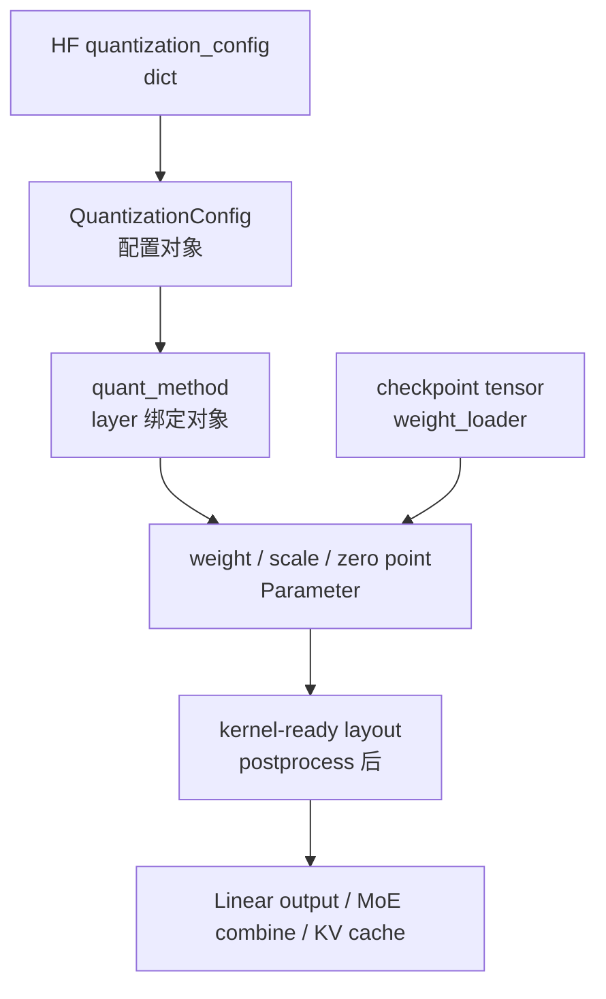
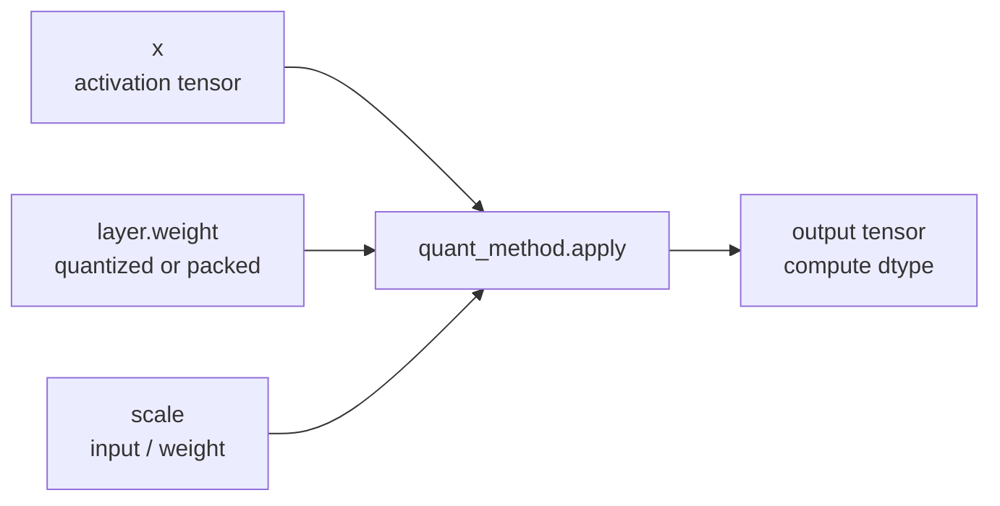

# Quantization · 数据流

## 读者任务

这篇回答“对象在每个边界长什么样”。如果源码走读解决调用顺序，这篇解决数据形态：配置是 dict，method 是 Python 对象，weight/scale 是 layer 参数，activation 是 runtime tensor，MoE quant info 是 runner 输入，KV scale 是 Attention backend 的元数据。

读完后你应该能画出一次量化模型从 checkpoint 到 forward 的对象生命周期，并能判断一个错误是配置错、shape 错、layout 错，还是 consumer 用错。

## 对象生命周期



## 数据账本

| 阶段 | 对象 | 持有者 | 主要字段 | 下一跳 |
|------|------|--------|----------|--------|
| 配置 | HF dict | `ModelConfig.hf_config` | `quantization_config`、`compression_config` | `get_quant_config` |
| 配置对象 | `QuantizationConfig` | model / loader | `packed_modules_mapping`、scheme 字段 | layer 构造 |
| method | `QuantizeMethodBase` 子类 | layer | `quant_config`、backend flags | `create_weights` |
| 权重槽位 | `Parameter` | layer | `weight`、`weight_scale`、`input_scale`、`k_scale` | `model.load_weights` |
| 整形结果 | kernel-ready 参数 | layer | packed layout、scale float、workspace | forward |
| Linear 输入 | activation tensor | forward | `[tokens, hidden]` 或 `(input, input_scale)` | GEMM |
| MoE 输入 | `DispatchOutput` | dispatcher | routed token/expert batch | MoeRunner |
| KV 输入 | `k_scale_float/v_scale_float` | Attention layer | per-tensor scale | Attention backend |

## 配置流：`packed_modules_mapping` 会进入 quant config

模型类会暴露 packed module 映射，loader 把它传进 quant config。这样 QKV、gate/up 等 fused 参数才能和 checkpoint 名字对齐。

```python
# 来源：python/sglang/srt/model_loader/loader.py L198-L205
def _get_quantization_config(
    model_config: ModelConfig,
    load_config: LoadConfig,
) -> Optional[QuantizationConfig]:
    """Get the quantization config."""
    model_class, _ = get_model_architecture(model_config)
    packed_modules_mapping = getattr(model_class, "packed_modules_mapping", {})
    remap_prefix = getattr(model_class, "remap_prefix", None)
```

这个阶段的错误常表现为权重名对不上、fused 参数没有正确拆装、ignored layer 前缀不生效。它还没有进入 kernel。

## 绑定流：同一个配置对象在不同 layer 上生成不同 method

`QuantizationConfig` 的抽象接口只规定“给一个 layer 和 prefix，返回 method 或 None”。具体配置类才决定 Linear、MoE、Attention 怎么分流。

```python
# 来源：python/sglang/srt/layers/quantization/base_config.py L225-L228
    @abstractmethod
    def get_quant_method(
        self, layer: torch.nn.Module, prefix: str
    ) -> Optional[QuantizeMethodBase]:
```

这就是读数据流的第一个分叉口：同样是 `quant_config`，到 Linear 是 GEMM method，到 MoE 是 runner method，到 RadixAttention 是 KV scale method。

## Linear 数据流

### 形态变化



FP8 的 activation 侧可能在 runtime 动态量化。`scaled_fp8_quant` 说明了两种 dynamic scale 和一种 static scale 的形态差异。

```python
# 来源：python/sglang/srt/layers/quantization/fp8_kernel.py L1790-L1836
    def scaled_fp8_quant(
        input: torch.Tensor,
        scale: Optional[torch.Tensor] = None,
        num_token_padding: Optional[int] = None,
        use_per_token_if_dynamic: bool = False,
    ) -> tuple[torch.Tensor, torch.Tensor]:
        assert input.ndim == 2, f"Expected 2D input tensor, got {input.ndim}D"
        shape = input.shape
        if num_token_padding:
            shape = (max(num_token_padding, input.shape[0]), shape[1])
        output = torch.empty(shape, device=input.device, dtype=fp8_dtype)

        if scale is None:
            # Dynamic scaling
            if use_per_token_if_dynamic:
                scale = torch.empty(
                    (shape[0], 1), device=input.device, dtype=torch.float32
                )
                if _use_aiter:
                    dynamic_per_token_scaled_quant(output, input, scale)
                elif _has_vllm:
                    torch.ops._C.dynamic_per_token_scaled_fp8_quant(
                        output, input.contiguous(), scale, None
                    )
                else:
                    _native_dynamic_per_token_quant_fp8(output, input, scale)
            else:
                scale = torch.zeros(1, device=input.device, dtype=torch.float32)
                if _use_aiter:
                    dynamic_per_tensor_quant(output, input, scale)
                elif _has_vllm:
                    torch.ops._C.dynamic_scaled_fp8_quant(output, input, scale)
                else:
                    _native_dynamic_per_tensor_quant_fp8(output, input, scale)
        else:
            # Static scaling
            assert (
                scale.numel() == 1
            ), f"Expected scalar scale, got numel={scale.numel()}"
            if _use_aiter:
                static_per_tensor_quant(output, input, scale)
            elif _has_vllm:
                torch.ops._C.static_scaled_fp8_quant(output, input, scale)
            else:
                _native_static_quant_fp8(output, input, scale)

        return output, scale
```

关键不变量：

- 输入必须是二维 `[tokens, hidden]`。
- static scale 必须是标量。
- dynamic per-token scale 的第一维要跟 padded token 数一致。

如果输出乱码但没有 load 报错，排查 activation scale 形态比只看 weight 更有效。

## GPTQ 数据流

GPTQ 的 `dynamic` 字段是配置层面的 per-module 规则，真正到 layer 时仍要通过 `get_quant_method` 生成 Linear method。普通 GPTQ 明确不支持 MoE，错误会在绑定阶段出现。

```python
# 来源：python/sglang/srt/layers/quantization/gptq/gptq.py L146-L181
    def from_config(cls, config: Dict[str, Any]) -> GPTQConfig:
        dynamic = cls.get_from_keys_or(config, ["dynamic"], default={})
        dynamic = {} if dynamic is None else dynamic

        weight_bits = cls.get_from_keys(config, ["bits"])
        group_size = cls.get_from_keys(config, ["group_size"])
        desc_act = cls.get_from_keys(config, ["desc_act"])
        lm_head_quantized = cls.get_from_keys_or(config, ["lm_head"], default=False)
        checkpoint_format = cls.get_from_keys_or(
            config, ["checkpoint_format"], default=""
        )
        true_sequential = cls.get_from_keys_or(
            config, ["true_sequential"], default=False
        )
        static_groups = cls.get_from_keys_or(config, ["static_groups"], default=False)
        return cls(
            weight_bits,
            group_size,
            desc_act,
            lm_head_quantized,
            dynamic,
            checkpoint_format,
            true_sequential,
            static_groups,
        )

    def get_quant_method(
        self, layer: torch.nn.Module, prefix: str
    ) -> Optional[LinearMethodBase]:
        from sglang.srt.layers.moe.fused_moe_triton import FusedMoE

        if isinstance(layer, FusedMoE):
            raise TypeError("GPTQ Method does not support MoE, please use gptq_marlin")
        return get_linear_quant_method(
            self, layer, prefix=prefix, linear_method_cls=GPTQLinearMethod
        )
```

GPTQ 的 shape 不变量在 scheme 的 `create_weights` 开头体现：输入分片要能被 group size 整除，输出分片要能被 pack factor 整除。

```python
# 来源：python/sglang/srt/layers/quantization/gptq/schemes/gptq_linear.py L25-L60
class GPTQLinearScheme(GPTQLinearSchemeBase):
    def __init__(self, quant_config: GPTQConfig):
        self.quant_config = quant_config
        self.use_v2_format = quant_config.checkpoint_format == "gptq_v2"
        self.kernel = self._init_kernel(quant_config)

    def _init_kernel(self, quant_config: GPTQConfig):
        from sglang.srt.hardware_backend.gpu.quantization.gptq_kernels import (
            GPTQLinearKernel,
        )

        return GPTQLinearKernel(quant_config)

    def create_weights(
        self,
        layer: torch.nn.Module,
        input_size_per_partition: int,
        output_partition_sizes: list[int],
        input_size: int,
        params_dtype: torch.dtype,
        weight_loader,
        **kwargs,
    ):
        if input_size_per_partition % self.quant_config.group_size != 0:
            raise ValueError(
                "The input size is not aligned with the quantized "
                "weight shape. This can be caused by too large "
                "tensor parallel size."
            )
        output_size_per_partition = sum(output_partition_sizes)
        if output_size_per_partition % self.quant_config.pack_factor.numerator != 0:
            raise ValueError(
                "The output size is not aligned with the quantized "
                "weight shape. This can be caused by too large "
                "tensor parallel size."
            )
```

这类错误不应该归到 forward kernel。它是权重槽位创建阶段发现的格式和 TP 分片不兼容。

## AWQ 数据流

AWQ 的关键不是“4bit weight-only”这句话，而是它在 layer 绑定阶段会检查 Marlin 支持。不支持的 Linear 回退到未优化 AWQ kernel，不支持的 MoE 回退到 Moe WNA16。

```python
# 来源：python/sglang/srt/layers/quantization/awq/awq.py L325-L362
    def get_quant_method(
        self, layer: torch.nn.Module, prefix: str
    ) -> Optional[QuantizeMethodBase]:
        from sglang.srt.layers.moe.fused_moe_triton import FusedMoE
        from sglang.srt.layers.vocab_parallel_embedding import ParallelLMHead

        if isinstance(layer, LinearBase) or (
            isinstance(layer, ParallelLMHead) and self.lm_head_quantized
        ):
            if is_layer_skipped_awq(prefix, self.modules_to_not_convert):
                return UnquantizedLinearMethod()
            # Check if the layer is supported by AWQMarlin.
            if not check_marlin_supports_layer(layer, self.group_size):
                logger.warning_once(
                    "Layer '%s' is not supported by AWQMarlin. Falling back to unoptimized AWQ kernels.",  # noqa: E501
                    prefix,
                )
                return AWQConfig.from_config(self.full_config).get_quant_method(
                    layer, prefix
                )
            layer.scheme = self.get_linear_scheme(layer)
            return AWQLinearMethod(self)
        elif isinstance(layer, FusedMoE):
            if is_layer_skipped_awq(prefix, self.modules_to_not_convert):
                return None
            from sglang.srt.layers.quantization.moe_wna16 import MoeWNA16Config

            if not check_moe_marlin_supports_layer(layer, self.group_size):
                logger.warning_once(
                    f"Layer '{prefix}' is not supported by AWQMoeMarlin. "
                    "Falling back to Moe WNA16 kernels."
                )
                return MoeWNA16Config.from_config(self.full_config).get_quant_method(
                    layer, prefix
                )
            layer.scheme = self.get_moe_scheme(layer)
            return AWQMoEMethod(self)
        return None
```

这段对排障很重要：看到 AWQ MoE 没走 Marlin，不一定是配置没生效，也可能是 layer/group size 不满足 support check。

## MoE 数据流

MoE 的 runtime 输入不是普通 activation tensor，而是 dispatcher 产出的 `DispatchOutput`。量化 method 返回 `CombineInput`，再交给 dispatcher combine。

```python
# 来源：python/sglang/srt/layers/moe/fused_moe_triton/layer.py L1169-L1176
        dispatch_output = self.dispatcher.dispatch(
            hidden_states=hidden_states, topk_output=topk_output
        )

        with flashinfer_trtllm_deferred_finalize_context():
            combine_input = self.run_moe_core(dispatch_output=dispatch_output)

        return self.dispatcher.combine(combine_input=combine_input)
```

无量化 MoE 也会构造 quant info，因为 runner 需要统一的数据结构。这里的 `quant_type="bf16"` 说明“unquant”不是绕过 MoE runner，而是用 bf16 权重描述 runner 输入。

```python
# 来源：python/sglang/srt/layers/quantization/unquant.py L488-L513
            # otherwise use_fp8=True for FP8 dispatch path
            use_fp8 = not envs.SGLANG_DEEPEP_BF16_DISPATCH.get()
            quant_info = DeepGemmMoeQuantInfo(
                w13_weight=w13_weight,
                w2_weight=w2_weight,
                use_fp8=use_fp8,
            )
            return self.runner.run(dispatch_output, quant_info)
        elif self.use_flashinfer_cutlass:
            from sglang.srt.layers.moe.moe_runner.flashinfer_cutlass import (
                FlashInferCutlassMoeQuantInfo,
            )

            quant_info = FlashInferCutlassMoeQuantInfo(
                quant_type="bf16",
                w13_weight=layer.w13_weight,
                w2_weight=layer.w2_weight,
                output_dtype=x.dtype,
                moe_ep_size=layer.moe_ep_size,
                moe_ep_rank=layer.moe_ep_rank,
                moe_tp_size=layer.moe_tp_size,
                moe_tp_rank=layer.moe_tp_rank,
                apply_routed_scaling_factor=not layer.should_fuse_routed_scaling_factor_in_topk,
            )
            return self.runner.run(dispatch_output, quant_info)
        elif self.use_flashinfer_trtllm_moe:
```

因此 MoE 数据流要同时看两条线：dispatcher 的 token/expert 形态，以及 runner 的 quant info 形态。

## KV cache 数据流

KV cache 量化只维护 scale。加载后处理分三种情况：checkpoint 有独立 k/v scale、没有 scale、只有单个 kv scale 被映射到一路后需要复制。

```python
# 来源：python/sglang/srt/layers/quantization/kv_cache.py L51-L85
    def process_weights_after_loading(self, layer) -> None:
        if layer.k_scale > 0.0 and layer.v_scale > 0.0:
            # We prefer to use separate k_scale and v_scale if present
            k_scale = layer.k_scale.to("cpu").tolist()
            v_scale = layer.v_scale.to("cpu").tolist()
            if is_fp8_fnuz():
                k_scale *= 2
                v_scale *= 2
        elif layer.k_scale < 0.0 and layer.v_scale < 0.0:
            # If no scales were loaded (both scales are invalid negative
            # values), use the default value of 1.0
            k_scale = 1.0
            v_scale = 1.0
        else:
            # If we find a single kv_scale in the checkpoint, we remap
            # kv_scale to k_scale during weight loading, and duplicate
            # k_scale to v_scale here
            assert layer.k_scale > 0.0
            scale_to_duplicate = max(layer.k_scale, layer.v_scale)
            k_scale = scale_to_duplicate.to("cpu").tolist()
            v_scale = scale_to_duplicate.to("cpu").tolist()
            if is_fp8_fnuz():
                k_scale *= 2
                v_scale *= 2

        if not isinstance(k_scale, float) or not isinstance(v_scale, float):
            raise ValueError(
                "Only support per-tensor scaling factor " "for fp8 KV cache"
            )

        # These are used in the final Attention.forward()
        layer.k_scale.copy_(k_scale)
        layer.v_scale.copy_(v_scale)
        layer.k_scale_float = k_scale
        layer.v_scale_float = v_scale
```

不变量：

- `k_scale_float/v_scale_float` 是 Attention.forward 的最终消费字段。
- 只支持 per-tensor scale。
- FNUZ dtype 需要 scale 修正。
- 单 scale checkpoint 需要复制到 K/V 两路。

## 交互边界

| 相邻模块 | 本专题交互对象 | 不负责什么 |
|----------|----------------|------------|
| ModelLoader | `quant_config`、`quant_method.process_weights_after_loading` | 不负责每种 kernel 内部数学 |
| Linear layer | `quant_method.apply(self, x, bias)` | 不负责选择请求调度 |
| MoE | `DispatchOutput`、`CombineInput`、runner quant info | 不负责 router top-k 数学 |
| RadixAttention | `k_scale/v_scale`、`k_scale_float/v_scale_float` | 不负责 prefix cache 树 |
| backend kernel | FP8/GPTQ/AWQ packed weight 与 scale | 不负责 HF config 解析 |

## 可观测验证

| 对象 | 断点或日志入口 | 预期 |
|------|----------------|------|
| `quant_config` | `_get_quantization_config` 返回前 | 类型与 `model_config.quantization` 对齐，HF 字段已注入 |
| `quant_method` | `LinearBase.__init__` 或 `FusedMoE.__init__` | Linear/MoE/KV 返回不同 method |
| weight slot | `create_weights` 之后 | layer 上已有 weight/scale 参数 |
| postprocess | `load_weights_and_postprocess` 遍历 module 时 | 每个带 method 的 module 都被处理 |
| Linear runtime | method `apply` | 输入 shape 为 `[tokens, hidden]` 或 tuple |
| MoE runtime | `run_moe_core` | 输入为 `DispatchOutput` |
| KV runtime | `BaseKVCacheMethod.process_weights_after_loading` 后 | `k_scale_float/v_scale_float` 为 float |

## 复盘迁移

量化数据流的核心不是“低 bit 权重”。更准确的说法是：一组配置事实被编译成 layer-local method，method 创建一组可加载的参数槽位，loader 把 checkpoint tensor 和 layout 整形收敛到 kernel-ready 状态，最终由 Linear、MoE、Attention 三类消费者按不同 ABI 使用。
