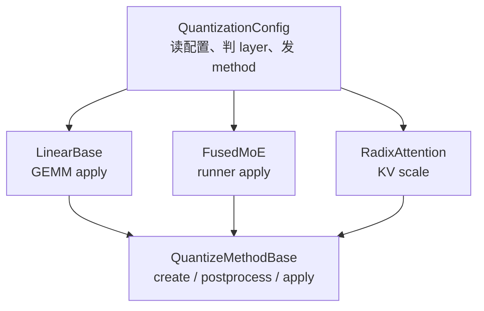

# Quantization · 核心概念

## 读者任务

这篇先不比较“FP8 比 GPTQ 快多少”。读者真正需要的是一张能排障和改代码的地图：同一个量化模型从配置到执行，会穿过哪些对象，每个对象保存什么事实，哪些阶段允许 fallback，哪些阶段必须 fail fast。

读完后你应该能回答：

- `QuantizationConfig` 和 `QuantizeMethodBase` 谁负责决策，谁负责执行。
- 为什么 Linear、MoE、KV cache 不能共用同一个 `apply`。
- 为什么很多量化错误在加载期暴露，而不是到第一条请求才暴露。

## 先建立模型：配置发工单，method 干活

`QuantizationConfig` 像调度单：它根据 layer 类型和 prefix 决定该层用哪个 method。`QuantizeMethodBase` 像工位工具：它在 layer 上创建参数、加载后整理参数、forward 时执行或提供 scale。



这张图有一个容易漏掉的点：KV cache 量化也走 method 体系，但它的 `apply` 明确不该被调用。它只把 `k_scale/v_scale` 挂到 Attention layer，后续由 Attention backend 消费。

## 源码证据：共同骨架有三阶段，消费者还有专属 ABI

`QuantizeMethodBase` 规定创建参数、执行、加载后处理三段共同生命周期；这只是最小骨架，不是全部契约。`LinearMethodBase` 收紧为 `(layer, x, bias)`，`FusedMoEMethodBase` 还增加 `create_moe_runner`、`DispatchOutput → CombineInput` 和 `get_triton_quant_info`。KV method 则保留生命周期接口，却故意让 `apply` 抛错。

```python
# 来源：python/sglang/srt/layers/quantization/base_config.py L20-L43
class QuantizeMethodBase(ABC):
    """Base class for different quantized methods."""

    def create_weights(
        self, layer: torch.nn.Module, *weight_args, **extra_weight_attrs
    ):
        """Create weights for a layer.

        The weights will be set as attributes of the layer."""
        raise NotImplementedError()

    @abstractmethod
    def apply(self, layer: torch.nn.Module, *args, **kwargs) -> torch.Tensor:
        """Apply the weights in layer to the input tensor.

        Expects create_weights to have been called before on the layer."""
        raise NotImplementedError()

    def process_weights_after_loading(self, layer: nn.Module) -> None:
        """Process the weight after loading.

        This can be used for example, to transpose weights for computation.
        """
        return
```

执行逻辑不是“看到量化就调用 kernel”。顺序必须是：

1. layer 构造时先拿到 method。
2. method 在 layer 上注册 weight、scale、zero point 或 KV scale。
3. loader 把 checkpoint tensor 灌到这些参数里。
4. method 做一次加载后整形。
5. forward 才调用 `apply` 或让 Attention backend 使用 scale。

不变量：`apply` 之前必须已经 `create_weights`，并且 checkpoint 加载与 postprocess 已完成。破坏这个顺序，常见现象是 layer 缺字段、scale shape 不对、packed weight layout 与 kernel 不匹配。

## 三类消费者：Linear、MoE、KV

### Linear：输入是 activation tensor，输出还是 dense tensor

Linear 层构造时绑定 `quant_method`。没有量化配置时也会走 `UnquantizedLinearMethod`，所以 forward 侧可以统一调用 method。

```python
# 来源：python/sglang/srt/layers/linear.py L176-L188
        if quant_config is None:
            from sglang.srt.layers.quantization.unquant import UnquantizedLinearMethod

            self.quant_method: Optional[QuantizeMethodBase] = UnquantizedLinearMethod()
        else:
            self.quant_method = quant_config.get_quant_method(self, prefix=prefix)

        if self.quant_method is not None:
            wrap_method_with_debug_kernel_once(
                self.quant_method,
                "apply",
                op_name=f"sglang.quant_method.{self.quant_method.__class__.__name__}.apply",
            )
```

这里的 mental hook 是“Linear 不知道自己是不是 FP8/GPTQ/AWQ”。它只知道自己有一个 method，method 决定权重格式和 GEMM 路径。`wrap_method_with_debug_kernel_once` 还让实际 `apply` 变成可观测的 kernel 名称，排查 fallback 时很有用。

但“配置类返回什么”还不是最终事实。多数 Linear 构造器要求 method 非空；ROCm 的 QKV/RowParallel 又可在环境开关下主动丢弃 `quant_config`，改绑 unquant method。MoE 则会把 `None` 转成 `UnquantizedFusedMoEMethod`，还可能再套 KTEP wrapper。因此 `None`、fallback 与 wrapper 的语义由 consumer 决定，不能只读 `get_quant_method`。

### MoE：输入不是普通 `x`，而是 dispatch 后的 expert batch

MoE method 的 `create_weights` 多了 `num_experts` 和 expert 中间维度，`apply` 接收的是 `DispatchOutput`，返回的是 `CombineInput`。这说明量化只接管 expert GEMM，不接管 token 路由本身。

```python
# 来源：python/sglang/srt/layers/quantization/base_config.py L86-L120
class FusedMoEMethodBase(QuantizeMethodBase):

    def create_weights(
        self,
        layer: torch.nn.Module,
        num_experts: int,
        hidden_size: int,
        intermediate_size_per_partition: int,
        params_dtype: torch.dtype,
        **extra_weight_attrs,
    ):
        raise NotImplementedError

    def create_moe_runner(
        self, layer: torch.nn.Module, moe_runner_config: MoeRunnerConfig
    ):
        raise NotImplementedError

    @abstractmethod
    def apply(
        self,
        layer: torch.nn.Module,
        dispatch_output: DispatchOutput,
    ) -> CombineInput:
        raise NotImplementedError

    def get_triton_quant_info(self, layer: torch.nn.Module) -> TritonMoeQuantInfo:
        """Return a ``TritonMoeQuantInfo`` describing the quantisation state
        stored on *layer*.

        The LoRA MoE runner calls this so that ``invoke_fused_moe_kernel``
        receives the correct flags / scales / block-shape for the base
        weights.  Each quantisation method must override this with the
        same construction it already uses inside ``apply()``.
        """
```

MoE 的关键边界：router 和 dispatcher 决定 token 去哪个 expert，quant method 决定 expert GEMM 怎样读权重和 scale。把这两个问题混在一起，会误判“量化改变了路由”。

### KV cache：它是 scale 生命周期，不是 GEMM method

Attention layer 初始化时也会问 `quant_config` 要 method，并让 method 注册 scale。

```python
# 来源：python/sglang/srt/layers/radix_attention.py L93-L102
        self.k_scale = None
        self.v_scale = None
        self.k_scale_float = None
        self.v_scale_float = None
        self.quant_method = None

        if quant_config is not None:
            self.quant_method = quant_config.get_quant_method(self, prefix=prefix)
        if self.quant_method is not None:
            self.quant_method.create_weights(self)
```

这里不是 dense linear 的 `apply`。KV scale 会在加载后被规范化成 float 字段，Attention backend 在读写 KV cache 时使用。

## FP8、GPTQ、AWQ 的正确比较维度

不要只按 bit 数比较。对 SGLang 读码更有用的维度是生命周期差异：

| 维度 | FP8 | GPTQ | AWQ |
|------|-----|------|-----|
| 配置来源 | HF `quantization_config` 或在线量化配置 | GPTQ config，可能含 `dynamic` per-module 规则 | AWQ config，可能走 Marlin |
| activation | 可 static 或 dynamic 量化 | 通常 weight-only | 通常 weight-only |
| Linear 执行 | Marlin、mxfp8、block FP8、默认 FP8 分支 | GPTQ packed weight kernel | AWQ 或 AWQ Marlin kernel |
| MoE | 有 `Fp8MoEMethod` 和 FP4 expert 特殊分支 | 默认 `GPTQConfig` 拒绝 MoE；GPTQ Marlin、NPU `GPTQAscendConfig`、CPU AMX `CPUGPTQConfig` 有各自 MoE 路径 | CUDA/HIP 的普通 `AWQConfig` 只给 Linear 发 method；`AWQMarlinConfig` 才会为 MoE 检查 Marlin 并回退 Moe WNA16，NPU/CPU 又是独立实现 |
| KV cache | FP8 KV scale method | 不由普通 GPTQ Linear method 处理 | 不由普通 AWQ Linear method 处理 |

## 配置账：配置来源是一条有优先级的解析链

这里其实有两次解析。第一次在 `ModelConfig`：从 HF/ModelSlim 元数据得到候选 method，逐类尝试 `override_quantization_method`，再处理 CLI、checkpoint 与 draft model 的兼容关系；AWQ/GPTQ 转 Marlin等自动选择发生在这里。第二次才是 `get_quant_config`：拿最终方法名对应的平台相关配置类，GGUF 直接用空配置，其余路径优先读 HF `quantization_config`、`text_config.quantization_config` 或 `compression_config`。若这些字段都没有，bitsandbytes 可转向 QLoRA adapter，普通 checkpoint 会在本地目录或 Hub snapshot 中搜索 JSON；没有配置文件名的在线量化方法还可能走专用默认构造。下面的源码卡只证明第二次解析中优先级最高的 HF-config 分支，不代表完整链路。

```python
# 来源：python/sglang/srt/model_loader/weight_utils.py L237-L263
def get_quant_config(
    model_config: ModelConfig,
    load_config: LoadConfig,
    packed_modules_mapping: Dict[str, List[str]],
    remap_prefix: Dict[str, str] | None = None,
) -> QuantizationConfig:
    quant_cls = get_quantization_config(model_config.quantization)

    # GGUF doesn't have config file
    if model_config.quantization == "gguf":
        return quant_cls.from_config({})

    # Read the quantization config from the HF model config, if available.
    hf_quant_config = getattr(model_config.hf_config, "quantization_config", None)
    # some vision model may keep quantization_config in their text_config
    hf_text_config = getattr(model_config.hf_config, "text_config", None)
    if hf_quant_config is None and hf_text_config is not None:
        hf_quant_config = getattr(hf_text_config, "quantization_config", None)
    if hf_quant_config is None:
        # compressed-tensors uses a compressions_config
        hf_quant_config = getattr(model_config.hf_config, "compression_config", None)
    if hf_quant_config is not None:
        if not isinstance(hf_quant_config, dict):
            hf_quant_config = hf_quant_config.to_dict()
        hf_quant_config["packed_modules_mapping"] = packed_modules_mapping
        return quant_cls.from_config(hf_quant_config)
```

这解释了一个常见现象：CLI 上只有 `--quantization fp8` 不足以说明全部行为，checkpoint 的 HF config 可能还携带 activation scheme、block size、ignored layers、Marlin format 等细节。

## 运行验证入口

| 验证目标 | 方法 | 预期现象 |
|----------|------|----------|
| 确认配置类被选中 | 启动量化模型，观察是否出现 invalid quantization、capability、dtype 报错 | 错误会在模型初始化或 load 前暴露 |
| 确认 Linear method 实际执行 | 设置 `SGLANG_KERNEL_API_LOGLEVEL=1`，请求一次 generate | 日志中能看到 `sglang.quant_method.*.apply` 或实际 backend |
| 确认 MoE 量化不改变路由 | 对照 [[SGLang-MoE]] 的 `topk_ids` 路径和本专题的 `quant_method.apply` | 路由证据和 expert GEMM 证据分属不同源码 |
| 确认 KV scale 已规范化 | 在 Attention layer 上检查 `k_scale_float/v_scale_float` | 加载后应是 float，不应保持初始 `-1.0` |

## 复盘迁移

以后读新的量化实现，先问五个问题：

- 它的 `QuantizationConfig.from_config` 读了哪些字段。
- 它对 Linear、MoE、Attention 分别返回什么 method。
- 它的 `create_weights` 在 layer 上挂了哪些参数。
- 它的 `process_weights_after_loading` 是否改变 layout 或 scale。
- 它的 forward 最终是普通 Linear `apply`、MoE runner，还是 KV scale 消费。
