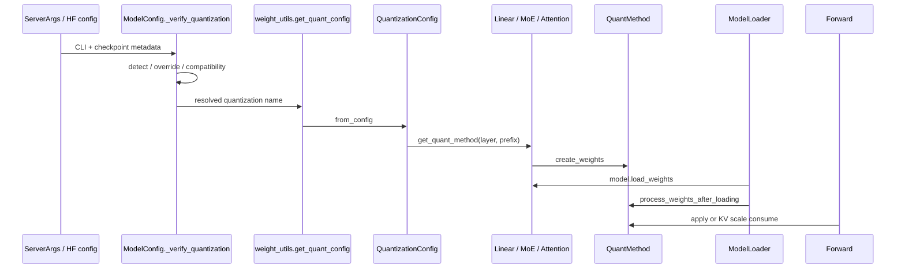

# Quantization · 源码走读

## 读者任务

这篇沿一次量化模型启动到一次 forward 的主线读源码。读完后你应该能把任何错误归到六个阶段之一：配置解析、layer 绑定、权重注册、checkpoint 装载、加载后整形、执行消费。

贯穿场景：用户启动一个带 HF `quantization_config` 的 FP8 模型，模型里同时有 dense Linear、MoE 和 Attention。SGLang 要做到三件事：

- Linear 层走 FP8/GPTQ/AWQ 等对应 GEMM。
- MoE 层把 expert 权重和 scale 接入 MoeRunner。
- Attention 层只拿 KV scale，不误走 Linear GEMM。

## 长文读法

这篇按“量化不是一个 kernel，而是一串账本”读：配置账先选 `QuantizationConfig`，兼容账在模型初始化前拦截硬件和 dtype，绑定账按 layer 类型挂 method，权重账注册参数，装载账触发 postprocess，执行账再让 Linear、MoE、Attention 各自消费自己的量化状态。

| 读者任务 | 先读 | 要抓住的判断 |
|----------|------|--------------|
| 第一次建立量化主线 | 读者任务、主线图、1 到 3 | 先有配置类，再按 layer 类型绑定 quant method，不是 forward 时临时判断 |
| 排查启动兼容错误 | 1 到 2 | config、GPU capability、activation dtype 的错误都发生在模型初始化前 |
| 排查 Linear 权重或 GEMM | 4 到 8 | Linear 构造时注册量化参数，forward 只调用 method，FP8 backend 再分显式选择和 auto |
| 排查 MoE 量化 | 3、9 | MoE method 接在 dispatcher / MoeRunner 上，不等同于 dense Linear |
| 排查 Attention KV scale | 3、10 | Attention 只注册并消费 k/v scale，`Fp8KVCacheMethod.apply` 不是执行入口 |
| 排查 checkpoint 装载后形态 | 5 | loader 统一调用 `process_weights_after_loading`，很多 repack/scale 整理发生在这里 |

读的时候把报错归到阶段：配置解析、兼容检查、method 绑定、权重注册、checkpoint 装载、postprocess、执行消费。阶段错了，排障方向通常也会错。

## 主线图



## 0. 决议账：checkpoint method 不等于最终 method

`ModelConfig._verify_quantization` 先从 HF/ModelSlim 元数据得到候选 method，然后按 `QUANTIZATION_METHODS` 的迭代顺序调用每个配置类的 `override_quantization_method`；第一个返回值胜出。AWQ/GPTQ 自动切 Marlin、ModelOpt 细分类等决策发生在这里。之后才处理 CLI 与 checkpoint 的一致性：兼容别名可保留 CLI，draft model 可改用自身检测结果，普通主模型不一致则报错。

```python
# 定位骨架（非逐行摘录）：来源 python/sglang/srt/configs/model_config.py L1346-L1393
        if quant_cfg is not None:
            quant_method = quant_cfg.get(
                "quant_method", "" if not self.quantization else self.quantization
            ).lower()

            # Detect which checkpoint is it
            for _, method in QUANTIZATION_METHODS.items():
                quantization_override = method.override_quantization_method(
                    quant_cfg, self.quantization
                )
                if quantization_override:
                    quant_method = quantization_override
                    self.quantization = quantization_override
                    break

            # Verify quantization configurations.
            if self.quantization is None:
                self.quantization = quant_method
            elif self.quantization != quant_method:
                # Check if the CLI-specified quantization is compatible with HF config's quant_method
                is_compatible = (
                    self.quantization in compatible_quantization_methods
                    and quant_method
                    in compatible_quantization_methods[self.quantization]
                )
                if is_compatible:
                    logger.info(
                        f"Using CLI-specified quantization ({self.quantization}) which is "
                        f"compatible with HF config quant_method ({quant_method})."
                    )
                elif self.is_draft_model:
                    self.quantization = quant_method
                else:
                    raise ValueError(
                        "Quantization method specified in the model config "
                        f"({quant_method}) does not match the quantization "
                        f"method specified in the `quantization` argument "
                        f"({self.quantization})."
                    )
```

这一步解释了两个常见反直觉现象：checkpoint 写 `awq`，最终可能变成 `awq_marlin`；但用户显式写 `--quantization awq` 时，`AWQMarlinConfig.override_quantization_method` 会尊重该选择而不自动转换。诊断时必须同时记录 checkpoint method、CLI method、override winner 和最终 `model_config.quantization`。

## 1. 配置账：用最终方法名实例化配置类

第一步不是直接打开 FP8 kernel，而是把 `model_config.quantization` 映射成平台相关配置类，再解析量化元数据。`get_quant_config` 优先读 HF `quantization_config`；vision/text 模型可能放在 `text_config`，compressed tensors 可能使用 `compression_config`。若都没有，函数还会处理 QLoRA adapter、本地或 Hub JSON 搜索，以及无配置文件的在线量化默认构造。下面这张卡只是第一条高优先级分支，不能据此把“HF 字段为空”直接诊断成缺配置。

```python
# 来源：python/sglang/srt/model_loader/weight_utils.py L237-L263
def get_quant_config(
    model_config: ModelConfig,
    load_config: LoadConfig,
    packed_modules_mapping: Dict[str, List[str]],
    remap_prefix: Dict[str, str] | None = None,
) -> QuantizationConfig:
    quant_cls = get_quantization_config(model_config.quantization)

    # GGUF doesn't have config file
    if model_config.quantization == "gguf":
        return quant_cls.from_config({})

    # Read the quantization config from the HF model config, if available.
    hf_quant_config = getattr(model_config.hf_config, "quantization_config", None)
    # some vision model may keep quantization_config in their text_config
    hf_text_config = getattr(model_config.hf_config, "text_config", None)
    if hf_quant_config is None and hf_text_config is not None:
        hf_quant_config = getattr(hf_text_config, "quantization_config", None)
    if hf_quant_config is None:
        # compressed-tensors uses a compressions_config
        hf_quant_config = getattr(model_config.hf_config, "compression_config", None)
    if hf_quant_config is not None:
        if not isinstance(hf_quant_config, dict):
            hf_quant_config = hf_quant_config.to_dict()
        hf_quant_config["packed_modules_mapping"] = packed_modules_mapping
        return quant_cls.from_config(hf_quant_config)
```

判断点：`quantization` 字符串非法发生在配置类解析前；“找不到 config file”则说明 HF 内嵌字段和专用默认分支都没有提前返回，已经进入目录/Hub JSON 搜索。两者都还没进入 layer 或 kernel，但所处的配置子阶段不同。

## 2. 兼容账：硬件能力和 dtype 在模型初始化前拦截

`loader.py` 拿到 `quant_config` 后，会把 DeepSeek-V4 FP4 expert 等模型布局信息补进 FP8 config，然后做 GPU capability 和 activation dtype 校验。

```python
# 来源：python/sglang/srt/model_loader/loader.py L237-L294
    if model_config.quantization is not None:
        quant_config = get_quant_config(
            model_config, load_config, packed_modules_mapping, remap_prefix
        )
        # (yizhang2077) workaround for nvidia/Llama-4-Maverick-17B-128E-Eagle3
        if quant_config is None:
            return None
        # Carry DSV4 expert layout into Fp8Config so downstream readers don't read env.
        from sglang.srt.layers.quantization.fp8 import Fp8Config

        if isinstance(quant_config, Fp8Config):
            quant_config.is_fp4_experts = model_config.is_fp4_experts
            # Handle hybrid NVFP4 moe (nvidia/DeepSeek-V4-Pro-NVFP4)
            nvfp4_meta = model_config.nvfp4_moe_meta
            if nvfp4_meta is not None:
                from sglang.srt.layers.quantization.modelopt_quant import (
                    HybridFp8NvFp4Config,
                    ModelOptFp4Config,
                )

                # MTP MoE layers (model.decoder.*) are not NVFP4 quantized.
                nvfp4_exclude_modules = list(
                    nvfp4_meta.get("exclude_modules") or []
                ) + ["model.decoder.*"]
                nvfp4_config = ModelOptFp4Config(
                    is_checkpoint_nvfp4_serialized=True,
                    group_size=int(nvfp4_meta["group_size"]),
                    exclude_modules=nvfp4_exclude_modules,
                    packed_modules_mapping=quant_config.packed_modules_mapping,
                )
                quant_config = HybridFp8NvFp4Config(
                    fp8_config=quant_config, nvfp4_config=nvfp4_config
                )
        if not _is_npu:
            major, minor = get_device_capability()

            if major is not None and minor is not None:
                assert 0 <= minor < 10
                capability = major * 10 + minor
                if capability < quant_config.get_min_capability():
                    raise ValueError(
                        f"The quantization method {model_config.quantization} "
                        "is not supported for the current GPU. "
                        f"Minimum capability: {quant_config.get_min_capability()}. "
                        f"Current capability: {capability}."
                    )
        supported_dtypes = quant_config.get_supported_act_dtypes()
        if model_config.dtype not in supported_dtypes:
            raise ValueError(
                f"{model_config.dtype} is not supported for quantization "
                f"method {model_config.quantization}. Supported dtypes: "
                f"{supported_dtypes}"
            )
        hf_to_sglang_mapper = getattr(model_class, "hf_to_sglang_mapper", None)
        # pass mappings by reference to quant_config
        if hf_to_sglang_mapper is not None and quant_config is not None:
            quant_config.apply_weight_name_mapper(hf_to_sglang_mapper)
        return quant_config
```

设计选择：不支持的硬件和 dtype 早失败，避免模型构造一半后才在 kernel 里炸。这里也是读“为什么启动失败”的第一入口。

## 3. 绑定账：FP8 按 layer 类型发不同 method

`Fp8Config.get_quant_method` 是本专题最重要的分叉样例。Linear、MoE、RadixAttention 在同一个配置下拿到不同 method，ignored layer 还能在绑定期回退。

```python
# 来源：python/sglang/srt/layers/quantization/fp8.py L256-L310
    def get_quant_method(
        self, layer: torch.nn.Module, prefix: str
    ) -> Optional[QuantizeMethodBase]:
        from sglang.srt.layers.linear import LinearBase
        from sglang.srt.layers.moe.fused_moe_triton import FusedMoE
        from sglang.srt.layers.radix_attention import RadixAttention

        if isinstance(layer, LinearBase):
            if is_layer_skipped(
                prefix, self.ignored_layers, fused_mapping=self.packed_modules_mapping
            ):
                return UnquantizedLinearMethod()
            if is_npu() and self.use_mxfp8:
                from sglang.srt.hardware_backend.npu.quantization.linear_method_npu import (
                    NPUMXFP8LinearMethod,
                )

                return NPUMXFP8LinearMethod(self)
            return Fp8LinearMethod(self)
        elif isinstance(layer, FusedMoE):
            if is_layer_skipped(
                prefix, self.ignored_layers, fused_mapping=self.packed_modules_mapping
            ):
                return UnquantizedFusedMoEMethod(
                    layer.use_triton_kernels, layer.use_flashinfer_trtllm_moe
                )

            fp8_method = Fp8MoEMethod(self)

            if self.is_fp4_experts and get_moe_runner_backend().is_marlin():
                from sglang.srt.layers.quantization.mxfp4_marlin_moe import (
                    Mxfp4MarlinMoEMethod,
                )

                return Mxfp4MarlinMoEMethod(fp8_method, prefix=prefix)

            if self.is_fp4_experts and get_moe_runner_backend().is_flashinfer_mxfp4():
                # SM100 (Blackwell) -> trtllm-gen path.
                # SM90  (Hopper)    -> cutlass mixed-input path (FlashInfer #3084).
                if is_sm90_supported() and not is_sm100_supported():
                    from sglang.srt.layers.quantization.mxfp4_flashinfer_cutlass_moe import (
                        Mxfp4FlashinferCutlassMoEMethod,
                    )

                    return Mxfp4FlashinferCutlassMoEMethod(fp8_method, prefix=prefix)

                from sglang.srt.layers.quantization.mxfp4_flashinfer_trtllm_moe import (
                    Mxfp4FlashinferTrtllmMoEMethod,
                )

                return Mxfp4FlashinferTrtllmMoEMethod(fp8_method, prefix=prefix)
            return fp8_method
        elif isinstance(layer, RadixAttention):
            return Fp8KVCacheMethod(self)
        return None
```

执行含义：

- Linear 的 ignored layer 不进入 FP8 `apply`，直接使用无量化 method。
- MoE 的 ignored layer 不是 dense Linear fallback，而是 `UnquantizedFusedMoEMethod`，仍保留 MoE runner 结构。
- Attention 返回 `Fp8KVCacheMethod`，只管理 KV scale。

但配置类返回值还会被 consumer 二次解释。`FusedMoE` 在 KTEP 模式下把 GPU method 包进 `KTEPWrapperMethod`；普通模式下若返回 `None`，会补成 `UnquantizedFusedMoEMethod`。因此 MoE 的最终 method 类型不一定等于配置类直接返回的类型。

```python
# 来源：python/sglang/srt/layers/moe/fused_moe_triton/layer.py L272-L289
        self.quant_method: Optional[FusedMoEMethodBase] = None
        server_args = get_global_server_args()
        kt_config = create_kt_config_from_server_args(server_args, layer_id)
        if kt_config is not None:
            if quant_config is not None:
                gpu_method = quant_config.get_quant_method(self, prefix)
            else:
                gpu_method = UnquantizedFusedMoEMethod(self.use_triton_kernels)
            self.quant_method = KTEPWrapperMethod(gpu_method, kt_config)
        else:
            if quant_config is not None:
                self.quant_method = quant_config.get_quant_method(self, prefix)
            if self.quant_method is None:
                self.quant_method = UnquantizedFusedMoEMethod(
                    self.use_triton_kernels,
                    self.use_flashinfer_trtllm_moe,
                    self.use_deep_gemm,
                )
```

Linear 还有相反方向的覆盖：ROCm 环境变量可让 QKV 与 RowParallel 在进入 `LinearBase` 前直接清掉 quant config，最终绑定无量化 method。全局量化方法已解析成功，并不能证明每层都量化。

```python
# 来源：python/sglang/srt/layers/linear.py L965-L980
        self.output_sizes = [
            self.num_heads * self.head_size * tp_size,  # q_proj
            self.num_kv_heads * self.head_size * tp_size,  # k_proj
            self.num_kv_heads * self.v_head_size * tp_size,  # v_proj
        ]
        self.use_presharded_weights = load_presharded_attn
        quant_config = None if _disable_hip_linear_quant else quant_config

        super().__init__(
            input_size=input_size,
            output_size=output_size,
            bias=bias,
            gather_output=False,
            skip_bias_add=skip_bias_add,
            params_dtype=params_dtype,
            quant_config=quant_config,
```

同样的覆盖在 `RowParallelLinear` 再出现一次。运行验证应记录 layer class、prefix、进入 consumer 前后的 config 和最终 method，而不是只打印 model-level config。

## 4. 权重账：Linear 构造时注册参数

以 `ReplicatedLinear` 为例，layer 构造时立即调用 `create_weights`，把输入输出尺寸、dtype 和 `weight_loader` 交给 method。此时还没有 checkpoint tensor，只有参数槽位和加载规则。

```python
# 来源：python/sglang/srt/layers/linear.py L227-L237
        # All the linear layer supports quant method.
        assert self.quant_method is not None
        self.quant_method.create_weights(
            self,
            self.input_size,
            [self.output_size],
            self.input_size,
            self.output_size,
            self.params_dtype,
            weight_loader=self.weight_loader,
        )
```

这是很多 shape 错误的发生地。GPTQ 的 group size、pack factor 和 TP 分片是否对齐，也是在 `create_weights` 阶段检查，而不是 forward 阶段。

## 5. 装载账和整形账：默认 loader 在全量加载后触发 postprocess

下面是 `DefaultModelLoader` 基线：checkpoint 被 `model.load_weights(weights)` 灌入 layer 后，再遍历所有 module，找出带 `quant_method` 的 layer，并在 `device_loading_context` 里调用 `process_weights_after_loading`。

```python
# 来源：python/sglang/srt/model_loader/loader.py L773-L821
    def load_weights_and_postprocess(model, weights, target_device):
        # Used in tests to verify memory savings when using online quantization.
        if is_cuda_alike():
            peak_memory = torch.cuda.max_memory_allocated()
            logger.debug(
                "Peak GPU memory before loading weights: %s GiB",
                f"{peak_memory / GIB_BYTES:.3f}",
            )
            memory_start = get_available_gpu_memory(
                target_device.type, gpu_id=torch.cuda.current_device()
            )

        quant_config = getattr(model, "quant_config", None)
        is_nvfp4_online = getattr(quant_config, "is_nvfp4_online", False)

        if is_nvfp4_online:
            # Scope exact FP4 quantization math to load-time conversion only;
            # restore the original environment before serving starts.
            with temp_set_env(
                TRTLLM_DISABLE_FP4_QUANT_FAST_MATH="1",
                FLASHINFER_DISABLE_FP4_QUANT_FAST_MATH="1",
            ):
                model.load_weights(weights)
            if target_device.type == "cuda":
                torch.cuda.synchronize()
                torch.cuda.empty_cache()
        else:
            model.load_weights(weights)

        # Used in tests to verify memory savings when using online quantization.
        if is_cuda_alike():
            memory_end = get_available_gpu_memory(
                target_device.type, gpu_id=torch.cuda.current_device()
            )
            logger.debug(
                "Memory increase during load_weights: %s GiB",
                f"{memory_start - memory_end:.3f}",
            )

        for _, module in model.named_modules():
            quant_method = getattr(module, "quant_method", None)
            if quant_method is not None:
                # When quant methods need to process weights after loading
                # (for repacking, quantizing, etc), they expect parameters
                # to be on the global target device. This scope is for the
                # case where cpu offloading is used, where we will move the
                # parameters onto device for processing and back off after.
                with device_loading_context(module, target_device):
                    quant_method.process_weights_after_loading(module)
```

这里的系统压力是加载期显存和权重 layout。默认路线把重排、在线量化、KV scale 规范化压到加载完成后的 postprocess，而不是每次 decode 的热路径。它不是所有 loader 的统一时序：`LayeredModelLoader` 会按层加载并处理以缩小峰值内存，ModelOpt 与其他特殊 loader 也有自己的处理循环。排查时先确认实际 loader 类，再判断 postprocess 应在“全模型之后”还是“本层之后”发生。

## 6. 执行账之一：Linear forward 只认 method

forward 阶段，Linear 不关心权重是 FP8 还是 GPTQ。它只把输入和 bias 交给 method。

```python
# 来源：python/sglang/srt/layers/linear.py L277-L282
    def forward(self, x: torch.Tensor) -> Tuple[torch.Tensor, Optional[torch.Tensor]]:
        bias = self.bias if not self.skip_bias_add else None
        assert self.quant_method is not None
        output = self.quant_method.apply(self, x, bias)
        output_bias = self.bias if self.skip_bias_add else None
        return output, output_bias
```

如果你要确认某个 dense layer 实际用了哪个 kernel，应该沿 `quant_method.apply` 查，而不是从模型 forward 继续猜。

## 7. 执行账之二：FP8 Linear 的真实分叉

`Fp8LinearMethod.apply` 不是一条路。它按初始化时的 flags 选择 Marlin、mxfp8、block FP8 或默认 `apply_fp8_linear`。

```python
# 来源：python/sglang/srt/layers/quantization/fp8.py L760-L840
    def apply(
        self,
        layer: torch.nn.Module,
        x: torch.Tensor,
        bias: Optional[torch.Tensor] = None,
    ) -> torch.Tensor:
        if self.use_marlin:
            return torch.ops.sglang.apply_fp8_marlin_linear(
                input=x,
                weight=layer.weight,
                weight_scale=layer.weight_scale,
                workspace=layer.workspace,
                size_n=layer.output_size_per_partition,
                size_k=layer.input_size_per_partition,
                bias=bias,
            )

        if self.use_mxfp8:
            backend = get_fp8_gemm_runner_backend()
            if backend.is_flashinfer_cutlass():
                weight_scale = layer.weight_scale_inv_swizzled
            elif backend.is_flashinfer_trtllm():
                weight_scale = layer.weight_scale_inv_shuffled
            else:
                weight_scale = layer.weight_scale_inv
            if isinstance(x, tuple):
                return self.w8a8_mxfp8_linear(
                    input=x[0],
                    weight=layer.weight,
                    weight_scale=weight_scale,
                    input_scale=x[1],
                    bias=bias,
                )
            return self.w8a8_mxfp8_linear(
                input=x,
                weight=layer.weight,
                weight_scale=weight_scale,
                input_scale=None,
                bias=bias,
            )

        if self.block_quant:
            if use_intel_amx_backend(layer):
                return torch.ops.sgl_kernel.fp8_scaled_mm_cpu(
                    x,
                    layer.weight,
                    layer.weight_scale_inv,
                    self.quant_config.weight_block_size,
                    bias,
                    x.dtype,
                    True,  # is_vnni
                )

            if isinstance(x, tuple):
                return self.w8a8_block_fp8_linear(
                    input=x[0],
                    weight=layer.weight,
                    block_size=self.quant_config.weight_block_size,
                    weight_scale=layer.weight_scale_inv,
                    input_scale=x[1],
                    bias=bias,
                )

            return self.w8a8_block_fp8_linear(
                input=x,
                weight=layer.weight,
                block_size=self.quant_config.weight_block_size,
                weight_scale=layer.weight_scale_inv,
                input_scale=None,
                bias=bias,
            )

        return apply_fp8_linear(
            input=x,
            weight=layer.weight,
            weight_scale=layer.weight_scale,
            input_scale=layer.input_scale,
            bias=bias,
            cutlass_fp8_supported=self.cutlass_fp8_supported,
            use_per_token_if_dynamic=self.use_per_token_if_dynamic,
        )
```

读这段时要看三个边界：

- Marlin 分支依赖 packed layout 和 workspace。
- block/mxfp8 分支可能从 tuple 输入拿 activation scale，也可能让 backend 内部处理。
- 默认 FP8 分支把 `input_scale` 和 `weight_scale` 交给 `apply_fp8_linear`。

## 8. backend 分发：server arg、规范化、callable、最终 kernel 是四层

block FP8 GEMM 不是只读一次 server arg。`initialize_fp8_gemm_config` 会先规范化全局 backend：SM120 的 `auto` 当前被改成 Triton；MXFP8 在 SM100 且 FlashInfer 可用时会把 `auto` 改成 FlashInfer CUTLASS。随后 `dispatch_w8a8_block_fp8_linear` 才区分显式值与仍然保留的 auto。

```python
# 来源：python/sglang/srt/layers/quantization/fp8_utils.py L503-L520
def initialize_fp8_gemm_config(server_args: ServerArgs) -> None:
    """Initialize FP8 GEMM configuration."""
    global FP8_GEMM_RUNNER_BACKEND

    backend = server_args.fp8_gemm_runner_backend
    if backend == "auto" and is_sm120_supported():
        # TODO(brayden): Verify if CUTLASS can be set by default once SwapAB is supported
        backend = "triton"

    backend = Fp8GemmRunnerBackend(backend)

    if (
        backend.is_auto()
        and server_args.quantization == "mxfp8"
        and _is_sm100_supported
        and is_flashinfer_available()
    ):
        backend = Fp8GemmRunnerBackend.FLASHINFER_CUTLASS
```

```python
# 来源：python/sglang/srt/layers/quantization/fp8_utils.py L394-L409
def dispatch_w8a8_block_fp8_linear() -> Callable:
    """
    Dispatch to the appropriate FP8 block linear implementation.

    This function selects the backend based on:
    1. The --fp8-gemm-backend server argument (preferred)
    2. Auto-detection based on hardware capabilities
    """
    backend = get_fp8_gemm_runner_backend()

    # Handle explicit backend selection via --fp8-gemm-backend
    if not backend.is_auto():
        return _dispatch_explicit_backend(backend)

    # Auto mode: Select based purely on hardware/backend availability
    return _dispatch_auto_backend()
```

这里要分两层理解“显式”：dispatcher 不会改走 auto 优先级，后端依赖或硬件门禁不满足时会直接报错；但成功选中的 callable 可能本身就是 `*_with_fallback`，在具体 weight shape、输入 dtype 或格式不满足时仍会回退 Triton。显式选择约束的是首选 backend，不保证每一次 GEMM 都必然执行该 kernel。

当前基线还有一个值得单独验证的可疑点：ROCm 的 unrolled-x4 选择 helper 计算了比较式，却没有 `return`，因此调用方收到 `None`，静态上看该优化分支不可达。不能把这直接写成性能损失数字，但做 ROCm kernel 选择实验时应记录它的返回值与最终 kernel。

```python
# 定位骨架（非逐行摘录）：来源 python/sglang/srt/layers/quantization/fp8_kernel.py L1214-L1229
if _is_hip:

    def use_w8a8_block_fp8_matmul_unrolledx4(M, N, META):
        # Use manually unrolledx4 kernel on AMD GPU when the grid size is small.
        num_workgroups = triton.cdiv(M, META["BLOCK_SIZE_M"]) * triton.cdiv(
            N, META["BLOCK_SIZE_N"]
        )
        num_workgroups <= get_device_core_count()

    def select_w8a8_block_fp8_matmul_kernel(M, N, META):
        if use_w8a8_block_fp8_matmul_unrolledx4(M, N, META):
            return _w8a8_block_fp8_matmul_unrolledx4
        else:
            return _w8a8_block_fp8_matmul
```

## 9. MoE 执行：量化 method 接在 dispatcher 之后

FusedMoE 构造阶段会创建 expert 权重，再创建 MoeRunner。真正执行 expert GEMM 时，`run_moe_core` 把 dispatcher 输出交给 `quant_method.apply`。

```python
# 来源：python/sglang/srt/layers/moe/fused_moe_triton/layer.py L302-L318
        self.quant_method.create_weights(
            layer=self,
            num_experts=self.num_local_experts,
            hidden_size=hidden_size,
            intermediate_size_per_partition=self.intermediate_size_per_partition,
            params_dtype=params_dtype,
            weight_loader=(
                self.weight_loader
                if not use_weight_loader_fused
                else self.weight_loader_fused
            ),
            with_bias=with_bias,
            moe_intermediate_size=intermediate_size,
        )

        self.quant_method.create_moe_runner(self, self.moe_runner_config)
        self.dispatcher = create_moe_dispatcher(self.moe_runner_config)
```

```python
# 来源：python/sglang/srt/layers/moe/fused_moe_triton/layer.py L1178-L1183
    def run_moe_core(self, dispatch_output: DispatchOutput) -> CombineInput:
        # TODO: consider using symmetric memory
        return self.quant_method.apply(
            layer=self,
            dispatch_output=dispatch_output,
        )
```

这两段把边界说清楚：MoE 量化 method 不负责 top-k 路由，也不负责 dispatcher 搬 token；它负责 expert GEMM 需要的权重、scale、quant info 和 runner 连接。

## 10. KV 执行：scale 被 Attention 使用，method.apply 是错误入口

KV cache 量化方法创建 `k_scale/v_scale`，加载后把 checkpoint scale 或默认值规范化成 float。它的 `apply` 明确抛错。

```python
# 来源：python/sglang/srt/layers/quantization/kv_cache.py L32-L49
    def create_weights(self, layer: torch.nn.Module):
        """
        Create "weight" (aka k_scale and v_scale) for an attention layer.
        """
        # Initialize the KV cache scales to -1.0, which is an invalid value.
        # If the k/v_scale appears in the checkpoint, it will be
        # overwritten when loading weights.
        layer.k_scale = torch.nn.Parameter(
            torch.tensor(-1.0, dtype=torch.float32), requires_grad=False
        )
        layer.v_scale = torch.nn.Parameter(
            torch.tensor(-1.0, dtype=torch.float32), requires_grad=False
        )
        layer.k_scale._skip_weight_check = True
        layer.v_scale._skip_weight_check = True

    def apply(self, layer: torch.nn.Module) -> torch.Tensor:
        raise RuntimeError(f"{self.__class__.__name__}.apply should not be called.")
```

因此 KV 问题不要沿 Linear `apply` 查。应该查 scale 是否加载、是否被 postprocess 成 float，以及 Attention backend 是否按对应 dtype 使用。

## 运行验证

| 验证目标 | 操作 | 预期现象 |
|----------|------|----------|
| 配置解析 | 用同一模型分别设置正确和错误的 `--quantization` | 错误配置在 load 前或初始化时失败 |
| FP8 backend | 记录原始 server arg、初始化后的 enum、selected callable 和逐层最终 kernel | SM120/MXFP8 可改写 auto；显式模式不走 auto；依赖/硬件不满足时失败，shape/dtype 不满足时某些路径仍转 Triton |
| ROCm unrolled-x4 | 在 HIP 环境直接记录 `use_w8a8_block_fp8_matmul_unrolledx4(...)` 返回值 | 当前基线静态上返回 `None`；若运行结果不同，说明代码基线或 monkey patch 已变化 |
| Linear apply | 设置 `SGLANG_KERNEL_API_LOGLEVEL=1` 后发一条 generate | 能观察到 method apply 或具体 kernel |
| MoE 量化边界 | 对照 dispatcher 日志和 expert GEMM kernel | token 路由与 quant method 是两个阶段 |
| KV scale | 在加载后断点查看 `k_scale_float/v_scale_float` | scale 不应保持 `None` 或初始无效值 |

## 复盘迁移

这篇的核心结论：

- `ModelConfig` 先综合 CLI 与 checkpoint metadata 决议最终方法名，`get_quant_config` 再实例化平台相关配置类并补齐具体字段。
- `get_quant_method` 是 Linear、MoE、KV 三条线的分叉点。
- `create_weights` 注册槽位，`model.load_weights` 灌 tensor，`process_weights_after_loading` 让权重变成 kernel-ready。
- forward 侧只剩消费：Linear 调 `apply`，MoE runner 调 `apply`，KV scale 被 Attention backend 使用。
