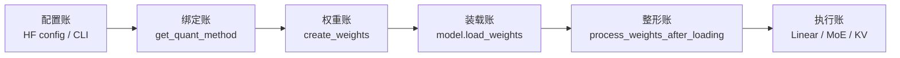

# Quantization

> **SGLang 内存与 Attention** | Git：`70df09b83363e0127b43c83a6007d3938f815b2d`

## 读者任务

这组笔记解决三个实际问题：

- 你要上线 FP8、GPTQ、AWQ 或 KV cache 量化模型时，能判断配置在哪个阶段生效。
- 你看到 scale shape、backend 不支持、MoE fallback、TP 对齐错误时，能找到源码入口。
- 你准备改一个量化 method 时，能知道必须同时维护配置、权重注册、加载后整形和执行路径。

量化不是一个 kernel，也不是一个配置字符串。它更像一次入库、上架、复核、出库的仓储流程：HF 配置决定货物类型，layer 构造时生成货架位，checkpoint 把货物放进去，postprocess 重新打包，forward 才把它交给 Linear、MoE 或 Attention backend 消费。

## 先建立模型：六本账



这六本账对应一条主线：

`HF config / ServerArgs → ModelConfig 检测、override 与一致性校验 → get_quant_config 实例化平台相关配置类 → QuantizationConfig.get_quant_method → LinearBase/FusedMoE/RadixAttention 绑定 method → create_weights → model.load_weights → process_weights_after_loading → Linear.apply / MoE runner / Attention KV scale`

读量化代码时不要先按 FP8、GPTQ、AWQ 横向扫文件。更稳的读法是先沿生命周期纵向走一遍，再回头比较不同量化格式在每个阶段改了什么。

## 阅读顺序

| 文件 | 读完能解决什么 |
| ------ | ---------------- |
| [[SGLang-Quantization-核心概念]] | 建立六本账模型，区分配置、method、权重、执行三类边界 |
| [[SGLang-Quantization-源码走读]] | 沿一次量化模型加载到 forward 的真实调用链读源码 |
| [[SGLang-Quantization-数据流]] | 看清 Linear、MoE、KV cache 三条消费路径的数据形态 |
| [[SGLang-Quantization-排障指南]] | 按症状定位 backend、scale、TP、MoE fallback 等问题 |
| [[SGLang-Quantization-学习检查]] | 自测是否能画主线、解释分叉、设计验证实验 |

## 源码范围

| 账本 | 关键源码 |
|------|----------|
| 配置账 | `python/sglang/srt/layers/quantization/__init__.py`、`python/sglang/srt/model_loader/weight_utils.py`、`python/sglang/srt/model_loader/loader.py` |
| 抽象契约 | `python/sglang/srt/layers/quantization/base_config.py` |
| Linear 消费者 | `python/sglang/srt/layers/linear.py`、`python/sglang/srt/layers/quantization/fp8.py`、`python/sglang/srt/layers/quantization/gptq/`、`python/sglang/srt/layers/quantization/awq/` |
| MoE 消费者 | `python/sglang/srt/layers/moe/fused_moe_triton/layer.py`、`python/sglang/srt/layers/quantization/unquant.py` |
| KV 消费者 | `python/sglang/srt/layers/radix_attention.py`、`python/sglang/srt/layers/quantization/kv_cache.py` |
| backend 分发 | `python/sglang/srt/layers/quantization/fp8_utils.py`、`python/sglang/srt/layers/quantization/fp8_kernel.py` |

## 第一张证据卡：量化方法注册表

SGLang 先把配置字符串映射成 `QuantizationConfig` 类。这个表说明 `--quantization fp8`、`gptq`、`awq` 不是直接绑定 kernel，而是进入一套配置类工厂。

```python
# 来源：python/sglang/srt/layers/quantization/__init__.py L72-L101
BASE_QUANTIZATION_METHODS: Dict[str, Type[QuantizationConfig]] = {
    "fp8": Fp8Config,
    "mxfp8": Fp8Config,
    "blockwise_int8": BlockInt8Config,
    "modelopt": ModelOptFp8Config,  # Auto-detect, defaults to FP8
    "modelopt_fp8": ModelOptFp8Config,
    "modelopt_fp4": ModelOptFp4Config,
    "nvfp4_online": NvFp4OnlineConfig,
    "modelopt_mixed": ModelOptMixedPrecisionConfig,
    "w8a8_int8": W8A8Int8Config,
    "w8a8_fp8": W8A8Fp8Config,
    "awq": AWQConfig,
    "awq_marlin": AWQMarlinConfig,
    "bitsandbytes": BitsAndBytesConfig,
    "gguf": GGUFConfig,
    "gptq": GPTQConfig,
    "gptq_marlin": GPTQMarlinConfig,
    "moe_wna16": MoeWNA16Config,
    "compressed-tensors": CompressedTensorsConfig,
    "qoq": QoQConfig,
    "w4afp8": W4AFp8Config,
    "petit_nvfp4": PetitNvFp4Config,
    "fbgemm_fp8": FBGEMMFp8Config,
    "quark": QuarkConfig,
    "quark_mxfp4": QuarkConfig,
    "auto-round": AutoRoundConfig,
    "auto-round-int8": W8A8Int8Config,
    "modelslim": ModelSlimConfig,
    "quark_int4fp8_moe": QuarkInt4Fp8Config,
}
```

这张表只回答“当前平台有哪些候选配置类”。在它之前，`ModelConfig` 还会从 checkpoint 元数据检测 quant method、遍历候选类执行 `override_quantization_method`，并校验 CLI 与 checkpoint 是否兼容；在它之后，CPU/NPU/out-of-tree 平台还可能替换同名配置类。真正的问题是：最终方法名怎样确定、配置类怎样读元数据、怎样给每层发 method、method 怎样注册参数、loader 何时 postprocess、forward 最后调谁。后面四篇正文按这条链路展开。

## 快速判断入口

| 你遇到的问题 | 先读 |
|--------------|------|
| 启动时报 invalid quantization 或 dtype 不支持 | [[SGLang-Quantization-排障指南]] 的配置与硬件症状 |
| FP8 backend 与预期不一致 | [[SGLang-Quantization-源码走读]] 的 FP8 dispatch，配合 [[SGLang-Quantization-排障指南]] |
| GPTQ TP size 报 shape alignment | [[SGLang-Quantization-排障指南]] 的 GPTQ 分片对齐 |
| AWQ MoE 没走 Marlin | [[SGLang-Quantization-排障指南]] 的 AWQ 配置类矩阵与 Marlin fallback |
| KV cache 量化输出异常 | [[SGLang-Quantization-数据流]] 的 KV scale 生命周期 |
| 想新增一种 quant method | [[SGLang-Quantization-学习检查]] 的改代码检查表 |

## 与相邻专题的边界

| 相邻专题 | 分工 |
|----------|------|
| [[SGLang-ModelLoader]] | 权重文件如何发现、下载、迭代、灌入参数；本专题只看量化配置和 postprocess 接口 |
| [[SGLang-RadixAttention]] | Attention layer 怎样接 backend；本专题只看 KV scale 如何挂到 Attention layer |
| [[SGLang-MoE]] | token 如何路由到 expert；本专题只看 expert GEMM 的 quant method 和 runner quant info |
| [[SGLang-Sampling]] | logits 之后如何采样；量化在 logits 产生前完成 |

## 复盘迁移

读完本专题后，应能把任意量化实现放进六本账里问问题：

- 配置从 HF config、CLI 还是额外 JSON 来。
- `get_quant_method` 对 Linear、MoE、Attention 是否返回不同 method。
- `create_weights` 在 layer 上注册了哪些参数和 scale。
- checkpoint 是否需要加载后重排、转置、量化或 scale 修正。
- forward 消费的是 Linear GEMM、MoE runner，还是 Attention KV scale。

← [[SGLang-MoE|MoE]]
→ [[SGLang-Sampling|Sampling]]
