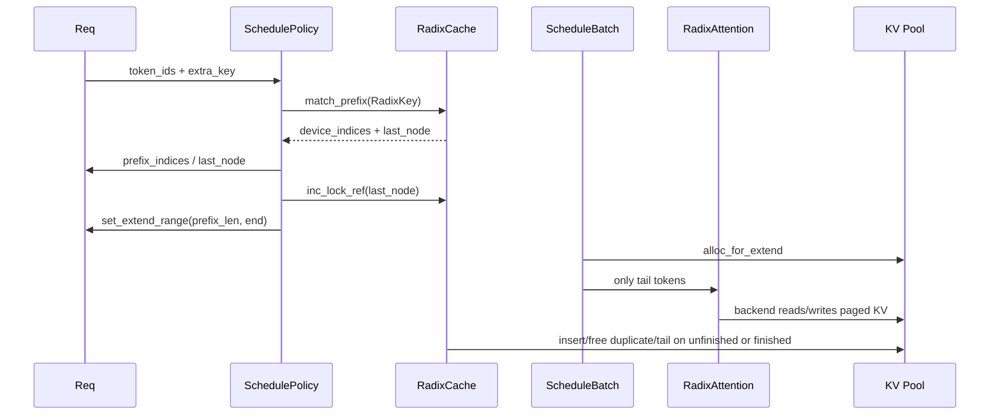

# RadixAttention · 源码走读

## 读者任务

这篇沿一条真实主线读：服务有固定 2k token system prompt，请求 A 先把前缀写入 cache，请求 B 命中前缀后只计算用户消息 tail。你要从源码中确认五件事：

- 命中是如何写回 `Req` 的。
- prefill 为什么从 `len(req.prefix_indices)` 开始。
- chunked prefill 中途为什么要 insert 后再 match 一次。
- finished 请求为什么要释放 duplicate 和 unaligned tail。
- `RadixAttention.forward` 为什么只是 backend adapter。

## 长文读法

这篇按“命中、少算、写回、释放”四件事读：调度先用 `RadixKey(token_ids, extra_key)` 做 prefix match，把 `prefix_indices` 和 `last_node` 写回 `Req`；admission 阶段临时锁住命中节点并决定本轮 extend 范围；`prepare_for_extend` 只取本轮尚未计算的 tail 进入 batch；chunked prefill 和 finished 请求再把 KV 插回树，并释放重复 KV、未对齐 tail 或可驱逐 leaf。

| 读者任务 | 先读 | 要抓住的判断 |
|----------|------|--------------|
| 第一次建立 RadixAttention 主线 | 主线总览、1 到 2 | cache 命中不是 kernel 行为，而是调度阶段把可复用 KV indices 写回 `Req` |
| 排查为什么没有命中前缀 | 1 到 3 | `RadixKey` 同时包含 token ids 和 `extra_key`，还会受 EAGLE bigram、page 对齐和节点切分影响 |
| 排查 prefill 为什么只算 tail | 4 到 5 | admission 锁住 `last_node` 后设置 extend range，`prepare_for_extend` 从 `len(prefix_indices)` 开始取输入 |
| 排查 chunked prefill 复用异常 | 6 | 中途 chunk 要先 insert，再重新 match，让下一段能复用已经写入的 KV |
| 排查 finished 后显存没释放 | 7 到 8 | finished 请求会释放 duplicate、unaligned tail；内存紧张时 classic cache 从可驱逐 leaf 开始 evict |
| 理解 attention 层的职责 | 9 | `RadixAttention.forward` 只是把组织好的 batch 交给 attention backend，Radix 逻辑不在这里做树操作 |

读的时候把三层分开：调度层决定“哪些 KV 可复用”，batch 层决定“本轮哪些 token 要算”，attention backend 只消费已经排好的 KV pool 和 batch 元信息。

## 主线总览



## 1. 调度先把 token 序列变成 `RadixKey`

入口在 `match_prefix_for_req`。它默认用 `origin_input_ids + output_ids` 作为查找 key，并把 `req.extra_key` 一起放进 `RadixKey`。返回值不会直接进入 kernel，而是先写回 `Req`。

```python
# 来源：sglang/python/sglang/srt/managers/schedule_policy.py L91-L136
def match_prefix_for_req(
    tree_cache: BasePrefixCache,
    req: Req,
    token_ids: Optional[array[int]] = None,
    *,
    cow_mamba: bool = False,
    include_req: bool = False,
):
    if token_ids is None:
        token_ids = req.origin_input_ids + req.output_ids

    match_result = tree_cache.match_prefix(
        MatchPrefixParams(
            key=RadixKey(token_ids=token_ids, extra_key=req.extra_key),
            cow_mamba=cow_mamba,
            req=req if include_req else None,
        )
    )
    if envs.SGLANG_RADIX_FORCE_MISS.get():
        match_result = zero_match_result(tree_cache, match_result)
    (
        req.prefix_indices,
        req.last_node,
        req.last_host_node,
        req.best_match_node,
        req.host_hit_length,
        req.swa_host_hit_length,
        req.mamba_host_hit_length,
    ) = (
        match_result.device_indices,
        match_result.last_device_node,
        match_result.last_host_node,
        match_result.best_match_node,
        match_result.host_hit_length,
        match_result.swa_host_hit_length,
        match_result.mamba_host_hit_length,
    )
    max_len = req._compute_max_prefix_len(len(token_ids))
    req.num_matched_prefix_tokens = min(
        len(req.prefix_indices) + req.host_hit_length, max_len
    )
    if match_result.mamba_branching_seqlen is not None:
        req.mamba_branching_seqlen = match_result.mamba_branching_seqlen
    if match_result.cache_protected_len is not None:
        req.cache_protected_len = match_result.cache_protected_len
    return match_result
```

这里的关键不是函数名，而是写回字段：admission 用 `len(req.prefix_indices)` 决定从哪里继续算。此刻它确实等于 device tree hit；但 chunked commit 之后同一字段可能附带请求私有 tail，届时要用 `cache_protected_len` 区分 tree ownership。`SGLANG_RADIX_FORCE_MISS` 是最直接的 A/B 验证开关。

## 2. tree match 会先处理 EAGLE 与 page 边界

classic `match_prefix` 的执行顺序很短：bigram 视图、空树短路、page 对齐、helper 查找、拼接 KV indices。返回的是 `MatchResult`，其中 `device_indices` 是可以复用的 KV pool 位置。

```python
# 来源：sglang/python/sglang/srt/mem_cache/radix_cache.py L392-L413
        key = params.key
        key, _ = key.maybe_to_bigram_view(self.is_eagle)

        if self.disable or len(key) == 0:
            return self._empty_match_result

        key = key.page_aligned(self.page_size)

        if len(key) == 0:
            return self._empty_match_result

        value, last_node = self._match_prefix_helper(self.root_node, key)
        if value:
            value = torch.cat(value)
        else:
            value = self._empty_match_result.device_indices
        return MatchResult(
            device_indices=value,
            last_device_node=last_node,
            last_host_node=last_node,
            best_match_node=last_node,
        )
```

如果 page size 是 16，命中 2047 个 token 并不会把 2047 全部写进 tree 命中；tree 接管的是完整页面。这个设计让 prefix cache 与 paged KV allocator 保持一致。

## 3. helper 可以在节点中间切开边界

radix tree 的节点不是一个 token 一个节点，而是一段 key 一个节点。命中停在某个 segment 中间时，helper 会 split 出精确边界，之后这个边界可被锁和复用。

```python
# 来源：sglang/python/sglang/srt/mem_cache/radix_cache.py L648-L694
    def _match_prefix_helper(self, node: TreeNode, key: RadixKey):
        access_time = time.monotonic()
        node.last_access_time = access_time

        child_key = key.child_key(self.page_size)

        value = []
        while len(key) > 0 and child_key in node.children.keys():
            child = node.children[child_key]
            child.last_access_time = access_time
            prefix_len = child.key.match(key, page_size=self.page_size)
            if prefix_len < len(child.key):
                new_node = self._split_node(child.key, child, prefix_len)
                value.append(new_node.value)
                node = new_node
                break
            else:
                value.append(child.value)
                node = child
                key = key[prefix_len:]

                if len(key):
                    child_key = key.child_key(self.page_size)

        return value, node

    def _split_node(self, key: RadixKey, child: TreeNode, split_len: int):
        # new_node -> child
        # New node inherits child's priority (represents shared prefix)
        new_node = TreeNode(priority=child.priority)
        new_node.hit_count = child.hit_count
        new_node.children = {key[split_len:].child_key(self.page_size): child}
        new_node.parent = child.parent
        new_node.lock_ref = child.lock_ref
        new_node.key = child.key[:split_len]
        new_node.value = child.value[:split_len].clone()
        child.parent = new_node
        child.key = child.key[split_len:]
        child.value = child.value[split_len:].clone()
        new_node.parent.children[key.child_key(self.page_size)] = new_node

        # Split hash_value if it was already computed, otherwise leave as None
        new_node.hash_value, child.hash_value = split_node_hash_value(
            child.hash_value, split_len, self.page_size
        )

        return new_node
```

split 不是复制一份完整 KV cache。它把原节点的 key/value 切成前后两段，让后续路径有准确的共享前缀节点。

## 4. admission 阶段先临时加锁，再决定 extend 范围

`PrefillAdder.add_one_req` 在关键区里处理 host load-back、重新计算 prefix 长度，然后按 `len(req.prefix_indices)` 设置 extend 的 start。非 chunked prefill 会把整段剩余输入放进本轮；chunked prefill 只放入一个对齐后的 chunk。

```python
# 来源：sglang/python/sglang/srt/managers/schedule_policy.py L1033-L1088
        with self._lock_node(req.last_node):
            # self.rem_total_tokens may decrease after the lock acquisition
            if total_tokens >= self.rem_total_tokens:
                return AddReqResult.NO_TOKEN

            if self.is_hybrid_swa:
                swa_needed = self._swa_budget_for_req(
                    cand_extend_input_len, swa_host_hit_length=req.swa_host_hit_length
                )
                if swa_needed >= self.rem_swa_tokens:
                    return AddReqResult.NO_TOKEN

            if req.needs_host_load_back():
                new_indices, req.last_node = self.tree_cache.init_load_back(
                    InitLoadBackParams(
                        best_match_node=req.best_match_node,
                        host_hit_length=req.host_hit_length,
                        req=req,
                    )
                )
                req.prefix_indices = torch.cat([req.prefix_indices, new_indices])
                prefix_len = len(req.prefix_indices)
                req.cache_protected_len = prefix_len

            input_tokens = self.ceil_paged_tokens(
                len(req.full_untruncated_fill_ids) - len(req.prefix_indices)
            )

            if (
                self.rem_chunk_tokens is None
                and len(self.can_run_list) != 0
                and input_tokens >= self.rem_input_tokens
            ):
                # If without chunked prefill:
                # - if the can_run_list is not empty, we satisfy the constraint of (max_prefill_tokens)
                # - if the can_run_list is empty, always accept the first prefill request
                return AddReqResult.OTHER

            if self.dllm_config is not None:
                if self.rem_dllm_tokens <= 0:
                    return AddReqResult.OTHER

                assert (
                    truncation_align_size is None
                ), "truncation_align_size is not supported for dllm prefill"

                self._add_dllm_req(req, prefix_len)
                self._req_inc_lock_ref(req)
            elif self.rem_chunk_tokens is None or input_tokens <= self.rem_chunk_tokens:
                # Non-chunked prefill — the whole sequence is committed this iter.
                req.set_extend_range(
                    len(req.prefix_indices), len(req.full_untruncated_fill_ids)
                )
                self.can_run_list.append(req)

                self._req_inc_lock_ref(req)
```

读到这里，潜在的 TTFT 收益已经能落到字段级：如果 2k system prompt 命中，`len(req.prefix_indices)` 就接近 2k，`set_extend_range` 的 start 也会跳过这段。端到端 TTFT 是否实际改善仍取决于并发、排队、host load-back、batch 组成和 backend，不由这一行源码单独保证。

## 5. `prepare_for_extend` 只取本轮尚未计算的 tail

到了 batch 组装阶段，`input_ids` 明确从 `len(r.prefix_indices)` 之后开始取。随后 `alloc_for_extend` 只给这些 extend token 分配 `out_cache_loc`。

```python
# 来源：sglang/python/sglang/srt/managers/schedule_batch.py L2018-L2058
        # Init tensors
        reqs = self.reqs
        input_ids = [r.get_fill_ids()[len(r.prefix_indices) :] for r in reqs]
        extend_num_tokens = sum(len(ids) for ids in input_ids)
        seq_lens = [r.extend_range.end for r in reqs]
        orig_seq_lens = [max(r.extend_range.end, len(r.origin_input_ids)) for r in reqs]
        prefix_lens = [len(r.prefix_indices) for r in reqs]
        extend_lens = [r.extend_range.length for r in reqs]
        extend_logprob_start_lens = [
            compute_extend_logprob_start_len(
                logprob_start_len=r.logprob_start_len,
                prefix_len=prefix_lens[i],
                extend_len=extend_lens[i],
                full_untruncated_fill_len=len(r.full_untruncated_fill_ids),
            )
            for i, r in enumerate(reqs)
        ]

        _pin = is_pin_memory_available(self.device)
        # Stay on pinned CPU; H2D is deferred to forward stream via
        # resolve_forward_inputs.
        pinned_input_ids = flatten_arrays_to_pinned_cpu(input_ids, _pin)
        seq_lens_tensor = torch.tensor(seq_lens, dtype=torch.int64, pin_memory=_pin).to(
            self.device, non_blocking=True
        )
        seq_lens_cpu = torch.tensor(seq_lens, dtype=torch.int64)
        orig_seq_lens_tensor = torch.tensor(
            orig_seq_lens, dtype=torch.int32, pin_memory=_pin
        ).to(self.device, non_blocking=True)

        # Set batch fields needed by alloc_for_extend
        self.prefix_lens = prefix_lens
        self.extend_lens = extend_lens
        self.seq_lens = seq_lens_tensor
        self.seq_lens_cpu = seq_lens_cpu
        self.extend_num_tokens = extend_num_tokens

        # Allocate memory
        out_cache_loc, req_pool_indices_tensor, req_pool_indices_cpu = alloc_for_extend(
            self
        )
```

这里能区分两个长度：`seq_lens` 是请求到本轮结束的逻辑长度，`extend_num_tokens` 是本轮真正要进入模型计算的新 token 总数。

## 6. chunked prefill 中途缓存要 insert 后再 match

中途缓存不是简单把刚算的 KV append 到 tree。`insert` 可能 split 已有节点，也可能发现一部分前缀已在 tree 中。因此 `cache_unfinished_req` 插入后会释放 duplicate，再 `match_prefix` 一次，把请求绑定到 tree 的规范副本。

```python
# 来源：sglang/python/sglang/srt/mem_cache/common.py L115-L119
def maybe_cache_unfinished_req(req: Req, tree_cache: BasePrefixCache, **kwargs):
    if getattr(req, "skip_radix_cache_insert", False):
        return

    tree_cache.cache_unfinished_req(req, **kwargs)
```

```python
# 来源：sglang/python/sglang/srt/mem_cache/radix_cache.py L488-L553
    def cache_unfinished_req(self, req: Req, chunked=False):
        """Cache request when it is unfinished."""
        if self.disable:
            return

        token_ids = req.get_fill_ids()
        kv_indices = self.req_to_token_pool.req_to_token[
            req.req_pool_idx, : len(token_ids)
        ]

        radix_key = RadixKey(
            token_ids, req.extra_key, is_bigram=self.is_eagle
        ).page_aligned(self.page_size)
        values = kv_indices[: len(radix_key)].to(dtype=torch.int64, copy=True)

        # Radix Cache takes one ref in memory pool
        result = self.insert(
            InsertParams(
                key=radix_key,
                value=values,
                chunked=chunked,
                priority=getattr(req, "priority", 0) or 0,
            )
        )
        new_prefix_len = result.prefix_len

        self.token_to_kv_pool_allocator.free(
            kv_indices[req.cache_protected_len : new_prefix_len]
        )

        # The prefix indices could be updated, reuse it
        match_result = self.match_prefix(MatchPrefixParams(key=radix_key))
        new_indices, new_last_node = (
            match_result.device_indices,
            match_result.last_device_node,
        )
        assert len(new_indices) == len(
            radix_key
        ), f"{len(new_indices)=}, {len(radix_key)=}"

        self.req_to_token_pool.write(
            (req.req_pool_idx, slice(req.cache_protected_len, len(new_indices))),
            new_indices[req.cache_protected_len :],
        )

        # The cache_protected_len is not always equal to len(req.prefix_indices)
        # since for page_size > 1, the partial part is added to req.prefix_indices, but that part of kv indices is not added to the tree.
        # It should be freed in the next cache_unfinished_req and final cache_finished_req to avoid memory leak.
        # So we introduce this `cache_protected_len` field to make sure the partial part can be freed correctly.
        req.cache_protected_len = len(new_indices)

        self.dec_lock_ref(req.last_node)
        self.inc_lock_ref(new_last_node)

        # `req.prefix_indices` will be used in `PrefillAdder::add_chunked_req` later
        # - page_size != 1: there is a partial page at the end, keep the full kv_indices
        # - eagle case: bigram keys will only cache len - 1 kv indices
        if len(new_indices) < len(kv_indices):
            req.prefix_indices = torch.cat(
                [new_indices, kv_indices[len(new_indices) :]]
            )
        else:
            req.prefix_indices = new_indices

        req.last_node = new_last_node
```

这段是整个专题最容易读夹生的地方。正确心理模型是：请求手里原本有一批 KV slot；写树后，tree 可能选择复用已有 slot，所以请求必须丢掉重复 slot，并把 req pool 中 tree-owned 的一段改写成 canonical indices。若 page/EAGLE 留下 tail，`prefix_indices` 继续保留它供下一 chunk 跳过，但 `cache_protected_len` 不会把这段冒认成 tree-owned。

## 7. finished 请求释放重复和未对齐 tail

请求结束时，源码先取已提交的 KV 长度，再按 `origin_input_ids + output_ids` 构造 key。page 对齐后的部分可进入 tree；重复部分和未对齐 tail 都要释放。

```python
# 来源：sglang/python/sglang/srt/mem_cache/common.py L647-L650
    tree_cache.cache_finished_req(
        req,
        is_insert=is_insert and not getattr(req, "skip_radix_cache_insert", False),
    )
```

```python
# 来源：sglang/python/sglang/srt/mem_cache/radix_cache.py L437-L486
    def cache_finished_req(self, req: Req, is_insert: bool = True):
        """Cache request when it finishes."""
        # In deterministic mode, disable finished request insertion to radix cache
        if self.disable_finished_insert:
            is_insert = False

        kv_committed_len = req.pop_committed_kv_cache()
        if self.disable:
            kv_indices = self.req_to_token_pool.req_to_token[
                req.req_pool_idx, :kv_committed_len
            ]
            self.token_to_kv_pool_allocator.free(kv_indices)
            return

        token_ids = (req.origin_input_ids + req.output_ids)[:kv_committed_len]
        kv_indices = self.req_to_token_pool.req_to_token[
            req.req_pool_idx, : len(token_ids)
        ]

        radix_key = RadixKey(
            token_ids, req.extra_key, is_bigram=self.is_eagle
        ).page_aligned(self.page_size)
        key_len = len(radix_key)
        values = kv_indices[:key_len].to(dtype=torch.int64, copy=True)

        # Radix Cache takes one ref in memory pool
        if is_insert:
            priority = getattr(req, "priority", 0) or 0
            result = self.insert(
                InsertParams(key=radix_key, value=values, priority=priority)
            )
            session_leaf = result.last_device_node
            # Free the duplicates that were already in the tree
            self.token_to_kv_pool_allocator.free(
                kv_indices[req.cache_protected_len : result.prefix_len]
            )
        else:
            session_leaf = None
            self.token_to_kv_pool_allocator.free(
                kv_indices[req.cache_protected_len : key_len]
            )

        # free the unaligned tail
        self.token_to_kv_pool_allocator.free(kv_indices[key_len:])

        self._tag_session_leaf(req, radix_key, node=session_leaf)

        # Remove req slot release the cache lock
        if req.last_node is not None:
            self.dec_lock_ref(req.last_node)
```

如果你怀疑显存泄漏，这段里有三个检查点：`kv_committed_len` 是否正确、duplicate slice 是否从 `cache_protected_len` 开始、tail 是否从 `key_len` 开始释放。

## 8. 内存紧张时，classic cache 从可驱逐 leaf 开始

classic `evict` 把可驱逐 leaf 放进 heap，释放 leaf 的 `value`，删除 leaf，再看 parent 是否也变成可驱逐 leaf。它不是按单 token 精准释放，而是按节点释放，最终释放数可能超过请求的目标数。

```python
# 来源：sglang/python/sglang/srt/mem_cache/radix_cache.py L563-L590
    def evict(self, params: EvictParams) -> EvictResult:
        if self.disable:
            return EvictResult()

        start_time = time.perf_counter()
        num_tokens = params.num_tokens
        leaves = list(self.evictable_leaves)
        eviction_heap = [
            (self.eviction_strategy.get_priority(node), node) for node in leaves
        ]
        heapq.heapify(eviction_heap)

        num_evicted = 0
        while num_evicted < num_tokens and len(eviction_heap):
            _priority, x = heapq.heappop(eviction_heap)

            self.token_to_kv_pool_allocator.free(x.value)
            num_evicted += len(x.value)
            self._delete_leaf(x)

            if len(x.parent.children) == 0 and x.parent.lock_ref == 0:
                new_priority = self.eviction_strategy.get_priority(x.parent)
                heapq.heappush(eviction_heap, (new_priority, x.parent))

            self._record_remove_event(x)

        self.update_eviction_metrics(num_evicted, start_time)
        return EvictResult(num_tokens_evicted=num_evicted)
```

这解释了为什么 admission 侧通常问“可用加可驱逐是否足够”，而不是假设 evict 一定精确释放某个 token 数。

## 9. attention 层只消费已经组织好的 batch

当 `ScheduleBatch` 已经把 tail token、`out_cache_loc` 和 prefix metadata 准备好后，模型层的 `RadixAttention.forward` 做 shape 适配并调用 backend。tree lookup 到这里已经结束。

```python
# 来源：sglang/python/sglang/srt/layers/radix_attention.py L109-L153
    def forward(
        self,
        q,
        k,
        v,
        forward_batch: ForwardBatch,
        save_kv_cache: bool = True,
        **kwargs,
    ):
        if k is not None:
            # For cross-layer sharing, kv can be None
            assert v is not None
            if "k_rope" not in kwargs:
                k = k.view(-1, self.tp_k_head_num, self.qk_head_dim)
                v = v.view(-1, self.tp_v_head_num, self.v_head_dim)
            else:
                k = k.view(-1, self.tp_k_head_num, self.v_head_dim)

        if (
            forward_batch.forward_mode.is_extend()
            and get_tc_piecewise_forward_context() is not None
        ):
            if self.qk_head_dim != self.v_head_dim:
                output = q.new_empty((q.shape[0], self.tp_q_head_num * self.v_head_dim))
            else:
                output = torch.empty_like(q)
            if is_in_breakable_cuda_graph():
                breakable_unified_attention_with_output(
                    q, k, v, output, save_kv_cache, self.layer_id, **kwargs
                )
            else:
                unified_attention_with_output(
                    q, k, v, output, save_kv_cache, self.layer_id, **kwargs
                )
            return output
        else:
            return get_attn_backend().forward(
                q,
                k,
                v,
                self,
                forward_batch,
                save_kv_cache,
                **kwargs,
            )
```

这一步的排障方式也不同：prefix 命中问题看 scheduler 和 tree；backend 写错 KV slot 看 `ForwardBatch.out_cache_loc` 和 attention backend。

## 运行验证

最小验证不需要改源码：

1. 用相同 system prompt 连续发两次请求，记录 TTFT、prefill token 数和 cache hit 指标。
2. 设置 `SGLANG_RADIX_FORCE_MISS=1` 后重复实验，第二次请求不应再因为 prefix hit 明显加速。
3. 启动时使用 `--disable-radix-cache` 做全局关闭对照，验证性能差异来自 prefix cache，而不是 batch size 或模型 warmup。

断点验证顺序：

1. `schedule_policy.py:match_prefix_for_req`：看 `req.extra_key`、`len(req.prefix_indices)`。
2. `radix_cache.py:match_prefix`：看 page 对齐后的 key 长度。
3. `schedule_policy.py:add_one_req`：看 `set_extend_range` 的 start。
4. `schedule_batch.py:prepare_for_extend`：看 `input_ids` 是否只剩 tail。
5. `radix_attention.py:RadixAttention.forward`：确认此处没有 tree lookup。

## 复盘

- prefix cache 的性能收益来自调度阶段缩短 extend 输入，而不是 attention kernel 自己跳过 token。
- tree 节点保存的是 KV pool indices；真正的 K/V tensor 生命周期仍由 allocator 和 backend 管。
- chunked/finished 两条路径都要同时处理“写 tree”和“释放请求私有 slot”，否则容易出现重复占用或 tail 泄漏。
- `RadixAttention` 这个名字不能当作架构边界，实际边界要沿 `Req` 和 `ForwardBatch` 的字段流动来画。
