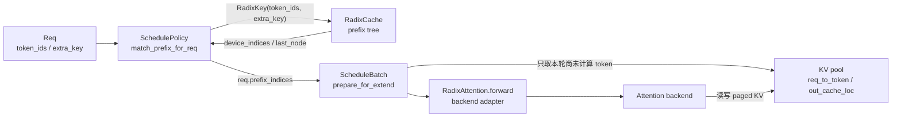

# RadixAttention

> **SGLang 内存与 Attention** | 源码基线：`70df09b83363e0127b43c83a6007d3938f815b2d`
> **核心范围：** `mem_cache/radix_cache.py`、`managers/schedule_policy.py`、`managers/schedule_batch.py`、`layers/radix_attention.py`

## 读者为什么要读

如果一个服务的 system prompt 很长，第二个请求为什么可以少算几千个 token？如果同样的 token 序列换了 LoRA adapter，为什么又不能共享？如果显存紧张，哪些 KV 可以被驱逐，哪些必须保住？本专题回答这三个问题。

读完之后，你应该能做三件事：

- 解释 `req.prefix_indices` 如何让 prefill 跳过已经可复用的 KV，并区分 tree-owned prefix 与请求私有 tail。
- 区分 `RadixCache` 和 `RadixAttention`：前者是 CPU 侧前缀索引，后者是模型层 attention 入口。
- 按源码入口排查 cache miss、显存泄漏、SWA tail 驱逐和 piecewise CUDA Graph 相关问题。

## 主线地图

把它想成一套取货系统：`RadixCache` 是目录，KV pool 是仓库货架，`req.prefix_indices` 是已经找到的货架编号，`RadixAttention.forward` 是真正把新货放进货架并让 kernel 读取货架的工位。目录本身不算 attention，工位也不负责查目录。

## 一条请求穿过它

场景：客服系统有 2k token 的固定 system prompt。用户 A 第一次请求时，tree 里还没有这段前缀，prefill 先计算输入；在 unfinished/finished cache commit 时，page-aligned 部分才可能进入 tree。用户 B 随后进入，同样 namespace 下的 system prompt 命中 tree，调度侧把 device indices 写入 `req.prefix_indices`，本轮 extend 只为其余 tail 分配新 KV slot。若 A 是 chunked prefill，commit 后的 `prefix_indices` 还可能在 `cache_protected_len` 之后携带未进 tree 的请求私有 tail。

这个场景有四条边界：

| 边界 | 负责对象 | 关键问题 |
|------|----------|----------|
| namespace | `RadixKey(token_ids, extra_key)` | 同 token 不同 LoRA/cache salt 不能共享 |
| tree match | `RadixCache.match_prefix` | 返回已缓存的 KV pool indices 和 `last_node` |
| admission | `PrefillAdder` / `ScheduleBatch` | 用命中长度决定本轮 extend 范围 |
| attention | `RadixAttention.forward` | 调用 backend 读写已分配的 paged KV |

## 五篇怎么读

| 文件 | 读完能解决什么 |
| ------ | ---------------- |
| [[SGLang-RadixAttention-核心概念]] | 建立对象边界：请求、key、tree node、lock、attention adapter |
| [[SGLang-RadixAttention-源码走读]] | 沿共享 system prompt 的请求主线读源码证据 |
| [[SGLang-RadixAttention-数据流]] | 追踪 `prefix_indices`、`cache_protected_len`、`out_cache_loc` 的生命周期 |
| [[SGLang-RadixAttention-排障指南]] | 按症状排查 miss、tail、evict、EAGLE、Unified、piecewise graph |
| [[SGLang-RadixAttention-学习检查]] | 验收自己是否能画图、复述、排障、改代码 |

## 源码范围

| 文件 | 重点范围 | 用途 |
|------|----------|------|
| `sglang/python/sglang/srt/managers/schedule_policy.py` | `match_prefix_for_req`、`PrefillAdder.add_one_req` | 调度侧如何查 tree、加锁、设置 extend 范围 |
| `sglang/python/sglang/srt/managers/schedule_batch.py` | `Req` prefix 字段、`prepare_for_extend` | 命中结果如何变成 forward batch |
| `sglang/python/sglang/srt/mem_cache/radix_cache.py` | `RadixKey`、`match_prefix`、`insert`、`cache_unfinished_req`、`cache_finished_req`、`evict` | classic prefix tree 的主实现 |
| `sglang/python/sglang/srt/mem_cache/unified_radix_cache.py` | `UnifiedTreeNode`、component lock | 多 component、SWA、Mamba、HiCache 分叉 |
| `sglang/python/sglang/srt/layers/radix_attention.py` | `RadixAttention.forward`、`unified_attention_with_output` | attention backend 入口和 piecewise graph 分叉 |

## 不变量

- `RadixCache` 存的是 token 前缀到 KV pool indices 的映射，不存 QKV tensor 本体。
- `len(req.prefix_indices)` 决定下一轮 extend 跳过多少已计算 token；只有前 `cache_protected_len` 能断言已由 tree 接管。
- `page_size > 1` 时，未对齐 tail 可以留在请求侧，但不能作为完整 page 进入 tree。
- classic cache 中活跃请求持有 `last_node` 到 root 的 lock；Unified 还可能按 component/host 分层持锁，SWA 可在满足窗口条件后提前释放其部分锁。
- `RadixAttention.forward` 不调用 `match_prefix`，它只做 shape 适配和 backend 转发。

## 验证入口

- 强制 miss：设置 `SGLANG_RADIX_FORCE_MISS=1`，相同 prompt 的第二次请求应不再享受 prefix hit。
- 对照配置：启动时打开或关闭 `--disable-radix-cache`，先比较 prefix hit 与 extend token 数，再在固定硬件、并发和输出长度下解释 TTFT。
- 断点顺序：`match_prefix_for_req` → `RadixCache.match_prefix` → `PrefillAdder.add_one_req` → `ScheduleBatch.prepare_for_extend` → `RadixAttention.forward`。
- 显存问题：从 `cache_unfinished_req` 的 duplicate free、`cache_finished_req` 的 unaligned tail free、`evict` 的 leaf free 三处查起。

## 阅读路径

← [[SGLang-专用模型|Models 专用]]
→ [[SGLang-KV-Cache|KV Cache 分配]]
