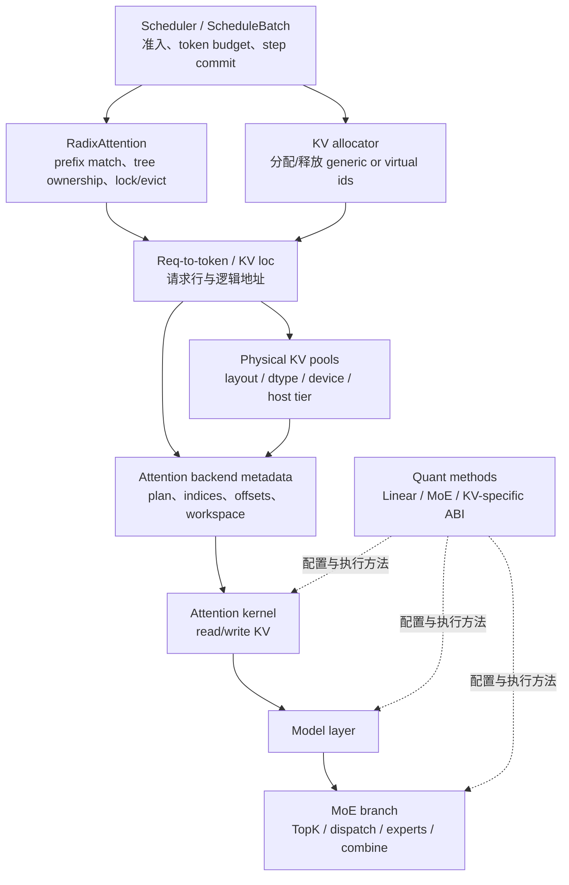

# SGLang 内存与 Attention

> 本分区不把五个专题平铺成“省显存技巧”，而是回答：请求怎样获得可复用前缀、KV 地址怎样分配与翻译、Attention backend 怎样消费这些地址，以及 MoE/量化怎样正交改变模型层执行。

## 本目录解决什么问题

Scheduler 选中请求，只代表“本 step 计划执行”；真正进入模型前还要解决四层契约：

1. 语义复用：哪些 token 前缀已经有可复用 KV；
2. 地址所有权：新增 token 获得哪些 request-row/generic KV loc；
3. 物理存储：这些 loc 最终对应哪种 KV pool/layout/tier；
4. backend 消费：Attention metadata 怎样把 batch 语义翻译成 kernel 可读地址。

MoE 与量化不是这条 KV 链的“下一站”。它们在模型层中与 Attention 并列或包裹不同算子：MoE 改变 token→expert→通信→combine，量化改变配置、权重表示、layer method 与最终 kernel。

## 一张分层图



图中最重要的不是箭头数量，而是三种“有了”：prefix match 表示语义上可复用；allocator 返回 loc 表示地址已归请求所有；backend metadata 与 pool 就绪才表示当前 kernel 能正确访问。三者不能互换。

## 五个专题的责任边界

| 专题 | 主要对象 | 它决定什么 | 它不单独决定什么 |
|---|---|---|---|
| [[SGLang-RadixAttention]] | tree node、key、lock/ref、leaf、eviction state | prefix 如何匹配、共享、提交、锁定和淘汰 | 物理 KV tensor layout 与 kernel 实现 |
| [[SGLang-KV-Cache]] | req-to-token row、allocator、generic/virtual loc、KV pool | token 到 KV 地址的分配、翻译、写入和释放 | prefix 语义是否等价、最终 backend 选择 |
| [[SGLang-Attention]] | resolver、wrapper、ForwardMode、metadata、backend | 本 step 用哪个 backend，如何 plan/forward 与读写 KV | Scheduler 的请求排序与全局 KV ownership |
| [[SGLang-MoE]] | TopK carrier、expert ids、dispatcher、placement、scale | token 如何路由、通信、执行专家并 combine | attention KV cache 的地址语义 |
| [[SGLang-Quantization]] | method name、platform config、layer method、loader state | 权重/激活/KV 的量化 ABI 与最终执行方法 | 所有平台都使用同一 kernel、任意量化都节省同样显存 |

## 主线一：从 prefix hit 到可读 KV

按对象生命周期阅读：

```text
request input ids
  → RadixAttention.match_prefix 的匹配结果与 tree lock
  → ScheduleBatch 保留 prefix len / last node / private tail
  → allocator 为未缓存 token 分配 loc
  → req-to-token row 写入 token→loc 映射
  → ForwardBatch/metadata 携带本 step indices
  → backend 将 generic loc 翻译为具体 pool/layout 地址
  → model attention 写新 KV、读历史 KV
  → 完成/abort/retract/evict 时按所有权释放或转交
```

学习时必须区分 match-time hit 与 device-ready data。启用 HiCache/storage 时，host/storage component 命中可能还需要 load-back/transfer；命中统计不能自动证明当前 GPU 已可读。

推荐顺序：[[SGLang-RadixAttention-核心概念]] → [[SGLang-RadixAttention-数据流]] → [[SGLang-KV-Cache-数据流]] → [[SGLang-Attention-数据流]]。

## 主线二：从 ForwardBatch 到 backend kernel

`ForwardBatch` 是一步执行视图，不是长期请求权威状态。ModelRunner 可能对它做 DP/MLP padding、构造 eager/Graph runner view，并让 Attention backend 在特定 plan stream/metadata owner 下准备索引与 workspace。

阅读时依次问：

1. 当前 `ForwardMode` 是 extend、decode、idle、draft 还是其他模式？
2. live batch、padded batch、capture/replay shape 是否一致？
3. backend metadata 由谁创建、何时失效、是否能跨 step 复用？
4. 输入 loc 是 generic/virtual 还是已经是物理 pool offset？
5. kernel 写入哪个 KV layout，读取普通/MLA/SWA/Mamba/cross-attention 哪一类存储？

推荐：[[SGLang-ModelRunner-数据流]] → [[SGLang-Attention-核心概念]] → [[SGLang-Attention-源码走读]]。

## 主线三：MoE 是 token 路由与通信系统

MoE 不应被压成 `gate→topk→expert` 三步。完整主线还包括：

- TopK 输出采用 standard、packed、bypassed 或 Triton carrier；
- logical expert id、physical slot id、recorder id、final dispatch id 可能在不同阶段变化；
- dispatcher 的 normal/low-latency ABI、通信 dtype/scale 与 combine handle；
- EPLB/placement 在较慢时间尺度调整 expert replica 与路由映射；
- 量化可能改变 expert core、通信或 scaling owner，但不会自动保持所有 backend ABI 相同。

推荐：[[SGLang-MoE-核心概念]] → [[SGLang-MoE-数据流]] → [[SGLang-MoE-源码走读]]。

## 主线四：量化是一条生命周期，不是一个 CLI 名称

从 checkpoint/CLI 到 kernel 至少经过：

```text
checkpoint metadata / CLI override
  → ModelConfig method 决议
  → platform-specific config class
  → layer consumer 创建 raw quant method
  → loader 写入量化参数/scale
  → post-load / consumer 二次最终化
  → wrapped/fallback/final method
  → backend-specific kernel
```

Linear、MoE、KV cache 共享“配置→加载→最终执行”的生命周期骨架，但 ABI 与 fallback 规则并不统一。不要从 `--quantization fp8` 直接推断某个固定 kernel，也不要把普通 GPTQ/AWQ 的平台结论外推到所有设备。

推荐：[[SGLang-Quantization-核心概念]] → [[SGLang-Quantization-数据流]] → [[SGLang-Quantization-源码走读]]。

## 按问题选择路线

| 问题 | 第一入口 | 关键观测 |
|---|---|---|
| prefix hit 不符合预期 | [[SGLang-RadixAttention-排障指南]] | key、matched indices、last node、private tail、lock/ref、tree type |
| KV OOM/泄漏/提前释放 | [[SGLang-KV-Cache-排障指南]] | req row、alloc/free loc、pool capacity、abort/retract/last request |
| backend plan/replay 错 | [[SGLang-Attention-排障指南]] | resolver、ForwardMode、metadata owner、plan/live/replay shape |
| CUDA Graph 下才错 | [[SGLang-ModelRunner-排障指南]] | actual/capture mode、padding、recapture、buffer address、event |
| MoE token 丢失/数值错 | [[SGLang-MoE-排障指南]] | carrier、四类 id、dispatch output、scale owner、combine handle |
| 量化启动或 kernel 错 | [[SGLang-Quantization-排障指南]] | method 决议、平台类、raw/final method、loader/postprocess、fallback |

## 可执行验证

### Prefix/KV 状态实验

固定相同 system prefix，发送两次请求，同时记录 prefix match、队列、分配 loc、KV usage 与 TTFT。预期：若配置、cache 状态和请求 key 均允许复用，第二次可能出现更长 prefix hit 与更少新分配 token；TTFT 是否改善以及改善多少必须由目标 workload 实测，不能预先承诺“显著降低”。

### 内存压力实验

在可控测试环境逐步提高并发或降低静态内存预算，记录 admission、retract、alloc/free、pool usage 和请求完成/abort。预期：能把 OOM 前后的每个 loc 所有权对上；不要只搜索某条固定日志字符串。

### 量化路径实验

记录 checkpoint quant metadata、CLI、平台、最终 config class、逐层 raw/final method 与实际 kernel。预期：能证明最终路径；若发生 wrapper/fallback，应记录触发条件，不能仅凭 CLI 判定成功。

环境不足时，使用各专题学习检查中的静态 `rg` 与对象表替代，并明确未观测的 GPU/多 rank 行为。

## 本分区完成标准

- [ ] 能画出 prefix match→alloc→req row→metadata→physical pool→kernel 的地址链。
- [ ] 能区分语义命中、地址所有权与 device-ready data。
- [ ] 能解释 Radix tree lock/ref/evict 与 KV allocator free 的协作边界。
- [ ] 能区分 `Req/ScheduleBatch/ForwardBatch/runner view/backend metadata`。
- [ ] 能说明 MoE 的 carrier、id 演化、dispatch/combine 与 placement 时间尺度。
- [ ] 能从 quant method 决议追到 loader/post-load 与最终 kernel。
- [ ] 能为性能结论附硬件、版本、并行配置、workload 与最终路径证据。

← [[SGLang-模型执行]] · → [[SGLang-高级特性]] · 总入口 [[SGLang学习指南]]
