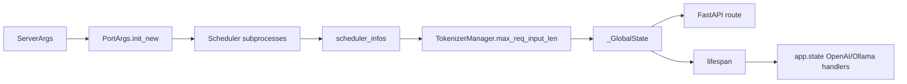
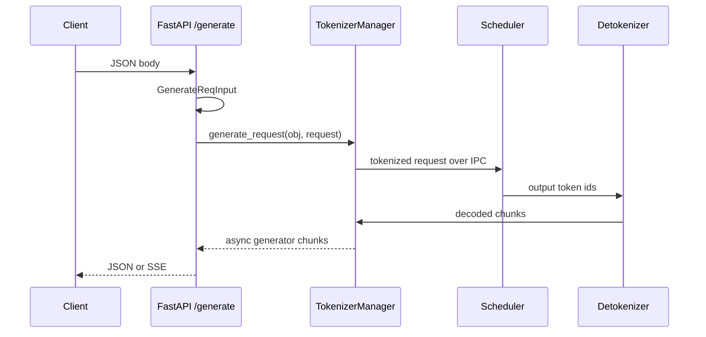
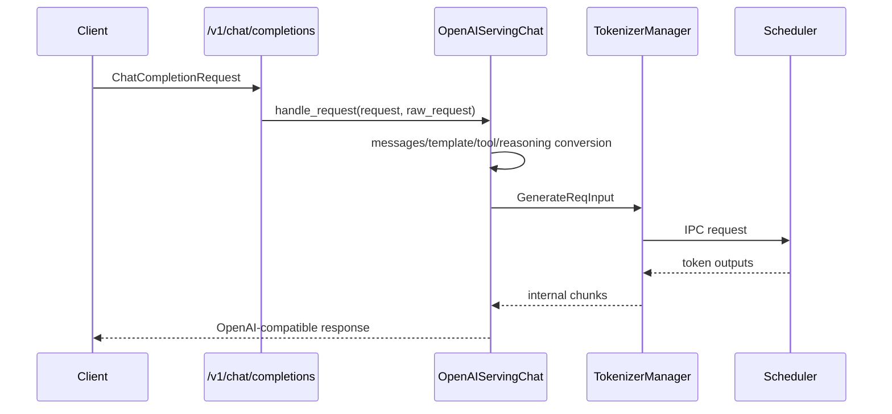
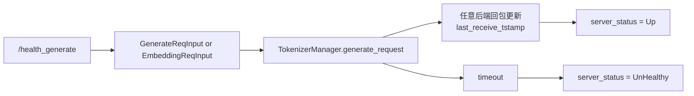

# HTTP-Server · 数据流

## 你为什么要读

这篇不按函数顺序读，而是跟踪四类对象如何跨边界流动：

- 启动对象：`ServerArgs → PortArgs → scheduler_infos → _GlobalState`
- 协议对象：HTTP body → `GenerateReqInput` 或 OpenAI request → handler
- 运行对象：`TokenizerManager`、`TemplateManager`、`SubprocessWatchdog`
- readiness 对象：`ServerStatus`、`last_receive_tstamp`、health `rid`、warmup HTTP 响应

## 1. 启动数据流



| 阶段 | 对象形态 | 谁生产 | 谁消费 |
|------|----------|--------|--------|
| CLI 后 | `ServerArgs` | `prepare_server_args` | `run_server`、`Engine._launch_subprocesses` |
| IPC 分配 | `PortArgs` | `PortArgs.init_new` | Scheduler、Detokenizer、TokenizerManager |
| 模型 ready | `scheduler_infos` | scheduler init pipe | TokenizerManager、HTTP global state |
| HTTP 可访问 | `_GlobalState` | `_setup_and_run_http_server` 或 `init_multi_tokenizer` | native routes、lifespan、model info routes |

不变量：HTTP route 读 `_global_state` 时，`tokenizer_manager` 必须已经存在；否则 import 了 `app` 但没有真正启动服务，会在请求时出错。

## 2. native 请求数据流

native `/generate` 是最短路径：



`/encode` 和 `/classify` 也复用 `generate_request`，只是请求对象是 `EmbeddingReqInput`。

```python
# 来源：python/sglang/srt/entrypoints/http_server.py L838-L859
@app.api_route("/encode", methods=["POST", "PUT"])
async def encode_request(obj: EmbeddingReqInput, request: Request):
    """Handle an embedding request."""
    try:
        ret = await _global_state.tokenizer_manager.generate_request(
            obj, request
        ).__anext__()
        return ret
    except ValueError as e:
        return _create_error_response(e)


@app.api_route("/classify", methods=["POST", "PUT"])
async def classify_request(obj: EmbeddingReqInput, request: Request):
    """Handle a reward model request. Now the arguments and return values are the same as embedding models."""
    try:
        ret = await _global_state.tokenizer_manager.generate_request(
            obj, request
        ).__anext__()
        return ret
    except ValueError as e:
        return _create_error_response(e)
```

这说明 HTTP 层的协议差异很浅：route 选择请求 dataclass，后续统一交给 tokenizer manager 的 async generator。

## 3. OpenAI 请求数据流

OpenAI 路径多了一层 handler：



`/v1/models` 是另一类 OpenAI endpoint：它只读 tokenizer manager 的模型名、context length 和 LoRA registry，不进入推理链路。

```python
# 来源：python/sglang/srt/entrypoints/http_server.py L1727-L1756
@app.get("/v1/models", response_class=ORJSONResponse)
async def available_models():
    """Show available models. OpenAI-compatible endpoint."""
    served_model_names = [_global_state.tokenizer_manager.served_model_name]
    model_cards = []

    # Add base model
    for served_model_name in served_model_names:
        model_cards.append(
            ModelCard(
                id=served_model_name,
                root=served_model_name,
                max_model_len=_global_state.tokenizer_manager.model_config.context_len,
            )
        )

    # Add loaded LoRA adapters
    if _global_state.tokenizer_manager.server_args.enable_lora:
        lora_registry = _global_state.tokenizer_manager.lora_registry
        for _, lora_ref in lora_registry.get_all_adapters().items():
            model_cards.append(
                ModelCard(
                    id=lora_ref.lora_name,
                    root=lora_ref.lora_path,
                    parent=served_model_names[0],
                    max_model_len=None,
                )
            )

    return ModelList(data=model_cards)
```

排查 OpenAI 请求时先判断 endpoint 类型：chat/completions 是推理路径，models 是元信息路径。

## 4. Python `Engine.generate` 与 HTTP 的汇合点

HTTP `/generate` 和 Python `Engine.generate` 都构造或接收 `GenerateReqInput`，然后调用同一个 `TokenizerManager.generate_request`。

```python
# 来源：python/sglang/srt/entrypoints/engine.py L366-L415
        routed_dp_rank = self._resolve_routed_dp_rank(
            routed_dp_rank, data_parallel_rank
        )

        obj = GenerateReqInput(
            text=prompt,
            input_ids=input_ids,
            sampling_params=sampling_params,
            image_data=image_data,
            audio_data=audio_data,
            video_data=video_data,
            mm_hashes=mm_hashes,
            return_logprob=return_logprob,
            logprob_start_len=logprob_start_len,
            top_logprobs_num=top_logprobs_num,
            token_ids_logprob=token_ids_logprob,
            lora_path=lora_path,
            custom_logit_processor=custom_logit_processor,
            require_reasoning=require_reasoning,
            return_hidden_states=return_hidden_states,
            return_routed_experts=return_routed_experts,
            routed_experts_start_len=routed_experts_start_len,
            stream=stream,
            bootstrap_host=bootstrap_host,
            bootstrap_port=bootstrap_port,
            bootstrap_room=bootstrap_room,
            routed_dp_rank=routed_dp_rank,
            disagg_prefill_dp_rank=disagg_prefill_dp_rank,
            external_trace_header=external_trace_header,
            rid=rid,
            session_id=session_id,
            session_params=session_params,
            priority=priority,
        )
        generator = self.tokenizer_manager.generate_request(obj, None)

        if stream:

            def generator_wrapper():
                while True:
                    try:
                        chunk = self.loop.run_until_complete(generator.__anext__())
                        yield chunk
                    except StopAsyncIteration:
                        break

            return generator_wrapper()
        else:
            ret = self.loop.run_until_complete(generator.__anext__())
            return ret
```

差异只在边界：

| 维度 | HTTP `/generate` | Python `Engine.generate` |
|------|------------------|--------------------------|
| 输入 | FastAPI body 解析成 `GenerateReqInput` | kwargs 构造 `GenerateReqInput` |
| request 对象 | Starlette `Request`，用于 headers、disconnect、abort | `None` |
| stream 输出 | `StreamingResponse` | Python iterator |
| non-stream 输出 | ORJSON response | Python dict |

如果两个入口在 tokenizer manager 之后表现不同，应去下游查；如果只在 HTTP 入口不同，优先查 header override、FastAPI validation、disconnect、SSE 包装。

## 5. multi tokenizer worker 数据流

multi tokenizer worker 不能共享主进程里的 Python 对象。主进程写 shared memory，worker lifespan 里调用 `init_multi_tokenizer` 重建 `TokenizerWorker`。

```python
# 来源：python/sglang/srt/entrypoints/http_server.py L216-L256
    # Read configuration from shared memory
    main_pid = get_main_process_id()
    port_args, server_args, scheduler_info = read_from_shared_memory(
        f"multi_tokenizer_args_{main_pid}"
    )
    server_args: ServerArgs
    port_args: PortArgs

    # API key authentication is not supported in multi-tokenizer mode
    assert (
        server_args.api_key is None
    ), "API key is not supported in multi-tokenizer mode"

    # Create a new ipc name for the current process
    port_args.tokenizer_ipc_name = (
        f"ipc://{tempfile.NamedTemporaryFile(delete=False).name}"
    )
    logger.info(
        f"Start multi-tokenizer worker process {os.getpid()}, "
        f"ipc_name={port_args.tokenizer_ipc_name}"
    )

    # Launch multi-tokenizer manager process
    tokenizer_manager = TokenizerWorker(server_args, port_args)
    template_manager = TemplateManager()
    template_manager.initialize_templates(
        tokenizer_manager=tokenizer_manager,
        model_path=server_args.model_path,
        chat_template=server_args.chat_template,
        completion_template=server_args.completion_template,
    )

    tokenizer_manager.max_req_input_len = scheduler_info["max_req_input_len"]

    set_global_state(
        _GlobalState(
            tokenizer_manager=tokenizer_manager,
            template_manager=template_manager,
            scheduler_info=scheduler_info,
        )
    )
```

这个分支的关键不变量：

- shared memory 名称来自主进程 pid。
- 每个 worker 创建自己的 tokenizer IPC name。
- API key 不支持 multi-tokenizer 模式。
- worker 自己初始化 template manager，并重新设置 `_GlobalState`。

## 6. readiness 数据流

health 请求不是普通用户请求，但深度探活会构造内部请求对象，并尝试通过 tokenizer manager 发起后端往返。它用独立 `rid`；成功或超时后都会从 `rid_to_state` 清理，但成功条件并不要求这个 `rid` 自身完成。



因此，`/health` 适合低成本 liveness，但它不会拒绝既有 `UnHealthy`；`/health_generate` 适合确认后端仍有响应，却不保证 health `rid` 自己完成。集群在高负载下探活异常时，要同时看正常流量是否更新了共享时间戳，以及探针是否误把它当成 request-specific 测试。

## 7. 对象归属表

| 对象 | 所属层 | 生命周期 | 排障入口 |
|------|--------|----------|----------|
| `ServerArgs` | 启动配置 | CLI 解析后贯穿启动 | 参数是否进入正确分支 |
| `PortArgs` | IPC 坐标 | 子进程启动前分配 | ZMQ socket、worker IPC name |
| `scheduler_infos[0]` | scheduler ready 结果 | 模型 ready 后返回 | `max_req_input_len`、模型信息 |
| `_GlobalState` | HTTP 进程内状态 | HTTP setup 或 worker lifespan 设置 | import `app` 后未初始化 |
| `app.state.openai_serving_*` | 协议 handler | lifespan 初始化 | OpenAI route AttributeError |
| `ServerStatus` | readiness 状态 | warmup/health 更新 | `/health` 只特判 Starting；深度探活才会改 Up/UnHealthy |
| `rid_to_state` | 请求状态 | TokenizerManager 管理 | health rid 清理、abort |

## 复盘

HTTP Server 的数据流可以压缩成一句话：启动时把 engine 事实写进 HTTP 可访问状态，请求时把协议对象转交给 tokenizer manager，readiness 时用状态、HTTP warmup 与共享回包时间戳组合判断后端是否仍有响应。

下一篇 [[SGLang-HTTP-Server-排障指南]] 按症状展开这些边界。
