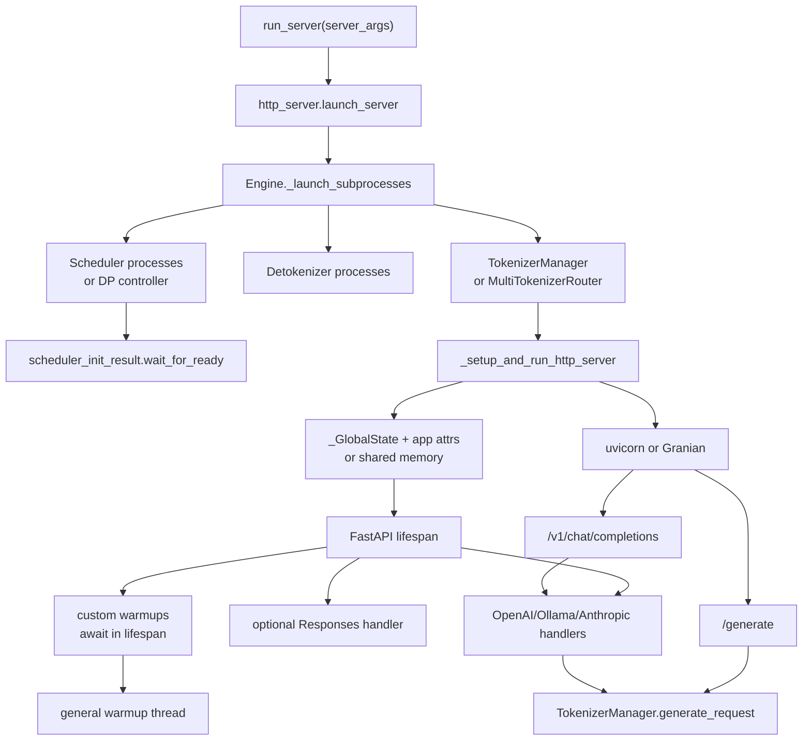

# HTTP-Server · 源码走读

这篇沿一条真实主线读源码：一次 `sglang serve` 如何从 CLI 参数变成一个能接收 `/generate` 和 `/v1/chat/completions` 的服务。

读完你应该能解释：

- HTTP 入口为什么必须先等 SRT engine 子进程 ready。
- single tokenizer 与 multi tokenizer worker 的启动状态为什么不同。
- native route 和 OpenAI route 为什么都不直接碰 Scheduler。
- warmup 和 health 如何把“端口监听”区分为“服务可用”。

## 长文读法

这篇按 HTTP 服务生命周期读：CLI 先选中默认 HTTP 分支，`launch_server` 再启动 Engine 子进程和 `TokenizerManager`，HTTP setup 把这些运行时对象挂到 FastAPI 可访问状态，route 层只把请求转交给协议 handler 或 `TokenizerManager.generate_request`，最后由 health 与 warmup 判断服务是否真的可用。

| 读者任务 | 先读 | 要抓住的判断 |
|----------|------|--------------|
| 首次建立启动全景 | 主线图、第 1 到 3 节 | HTTP server 不是孤立进程；它必须等 SRT engine 子进程和 tokenizer 入口就绪 |
| 排查服务卡在启动阶段 | 第 3 到 5 节 | 单 DP 直接起 scheduler，multi DP 先起 controller；ready 等待要能发现子进程早死 |
| 理解 single / multi tokenizer 差异 | 第 6 到 8 节 | single tokenizer 把对象挂在当前 app 上，multi tokenizer 通过共享状态和多 worker 重新初始化 |
| 追踪 `/generate` 请求 | 第 9 节 | native route 只做 stream / non-stream 响应包装，真正请求仍交给 `TokenizerManager.generate_request` |
| 追踪 OpenAI 兼容入口 | 第 7、10 节 | OpenAI route 先经 lifespan 初始化的 serving handler，再由 handler 复用 runtime 主线 |
| 判断“端口已开”和“服务可用” | 第 11、12 节、运行验证 | `/health` 可以是轻量探活，warmup 会按模型类型发送真实请求，压通生成或 embedding 的对应后端回程 |

读的时候保持三层分离：`launch_server` 管生命周期，FastAPI route 管协议入口，`TokenizerManager` 才是 HTTP 进入 SRT runtime 的核心边界。

## 主线图



## 1. CLI 默认进入 HTTP 分支

`run_server` 先处理 encoder-only、legacy gRPC 和 Ray 分支。没有这些特殊配置时，默认导入 `srt.entrypoints.http_server.launch_server`。

```python
# 来源：python/sglang/launch_server.py L47-L51
    else:
        # Default mode: HTTP mode.
        from sglang.srt.entrypoints.http_server import launch_server

        launch_server(server_args)
```

这一段证明：本专题覆盖的是默认 HTTP mode，不覆盖 encoder disaggregation server、legacy gRPC server 或 Ray HTTP server 的内部实现。

## 2. `launch_server` 先点火 engine，再启动 HTTP

`launch_server` 不直接创建 FastAPI 监听。它先调用 `Engine._launch_subprocesses`，拿到运行时对象，再交给 `_setup_and_run_http_server`。

```python
# 来源：python/sglang/srt/entrypoints/http_server.py L2471-L2517
def launch_server(
    server_args: ServerArgs,
    init_tokenizer_manager_func: Callable = init_tokenizer_manager,
    run_scheduler_process_func: Callable = run_scheduler_process,
    run_detokenizer_process_func: Callable = run_detokenizer_process,
    execute_warmup_func: Callable = _execute_server_warmup,
    launch_callback: Optional[Callable[[], None]] = None,
):
    """
    Launch SRT (SGLang Runtime) Server.

    The SRT server consists of an HTTP server and an SRT engine.

    - HTTP server: A FastAPI server that routes requests to the engine.
    - The engine consists of three components:
        1. TokenizerManager: Tokenizes the requests and sends them to the scheduler.
        2. Scheduler (subprocess): Receives requests from the Tokenizer Manager, schedules batches, forwards them, and sends the output tokens to the Detokenizer Manager.
        3. DetokenizerManager (subprocess): Detokenizes the output tokens and sends the result back to the Tokenizer Manager.

    Note:
    1. The HTTP server, Engine, and TokenizerManager all run in the main process.
    2. Inter-process communication is done through IPC (each process uses a different port) via the ZMQ library.
    """
    # Launch subprocesses
    (
        tokenizer_manager,
        template_manager,
        port_args,
        scheduler_init_result,
        subprocess_watchdog,
    ) = Engine._launch_subprocesses(
        server_args=server_args,
        init_tokenizer_manager_func=init_tokenizer_manager_func,
        run_scheduler_process_func=run_scheduler_process_func,
        run_detokenizer_process_func=run_detokenizer_process_func,
    )

    _setup_and_run_http_server(
        server_args,
        tokenizer_manager,
        template_manager,
        port_args,
        scheduler_init_result.scheduler_infos,
        subprocess_watchdog,
        execute_warmup_func=execute_warmup_func,
        launch_callback=launch_callback,
    )
```

这里有两个设计选择：

- engine 子进程启动和 HTTP 监听解耦，方便 `Engine()` Python API 复用前半段。
- warmup 函数可注入，说明 readiness 属于 HTTP 生命周期，但不属于 route 业务逻辑。

## 3. Engine 启动决定进程拓扑

`_launch_subprocesses` 是 SRT 拓扑总控。它先配置日志、环境、插件和端口，再启动 scheduler，rank 0 才继续启动 detokenizer 和 tokenizer manager。

```python
# 来源：python/sglang/srt/entrypoints/engine.py L821-L889
        # Launch scheduler processes
        scheduler_init_result, scheduler_procs = cls._launch_scheduler_processes(
            server_args, port_args, run_scheduler_process_func
        )
        scheduler_init_result.engine_info_bootstrap_server = (
            engine_info_bootstrap_server
        )

        if (
            server_args.enable_elastic_expert_backup
            and server_args.elastic_ep_backend is not None
        ):
            run_expert_backup_manager(server_args, port_args)

        if server_args.node_rank >= 1:
            # In multi-node cases, non-zero rank nodes do not need to run tokenizer or detokenizer,
            # so they can just wait here.
            scheduler_init_result.wait_for_ready()

            if os.getenv("SGLANG_BLOCK_NONZERO_RANK_CHILDREN") == "0":
                # When using `Engine` as a Python API, we don't want to block here.
                return (
                    None,
                    None,
                    port_args,
                    scheduler_init_result,
                    None,
                )

            launch_dummy_health_check_server(
                server_args.host, server_args.port, server_args.enable_metrics
            )

            scheduler_init_result.wait_for_completion()
            return (
                None,
                None,
                port_args,
                scheduler_init_result,
                None,
            )

        # Launch detokenizer process(es) — optionally fronted by a router when
        # detokenizer_worker_num > 1.
        detoken_procs, detoken_names = cls._launch_detokenizer_subprocesses(
            server_args=server_args,
            port_args=port_args,
            run_detokenizer_process_func=run_detokenizer_process_func,
        )
        for p in detoken_procs:
            scheduler_init_result.all_child_pids.append(p.pid)

        # Init tokenizer manager first, as the bootstrap server is initialized here
        if server_args.tokenizer_worker_num == 1:
            tokenizer_manager, template_manager = init_tokenizer_manager_func(
                server_args, port_args
            )
        else:
            # Launch multi-tokenizer router
            tokenizer_manager = MultiTokenizerRouter(server_args, port_args)
            template_manager = None

        # Wait for the model to finish loading
        scheduler_init_result.wait_for_ready()

        # Get back some info from scheduler to tokenizer_manager
        tokenizer_manager.max_req_input_len = scheduler_init_result.scheduler_infos[0][
            "max_req_input_len"
        ]
```

这段能解释三个常见现象：

- 多机非 rank 0 节点不提供完整推理 HTTP API，只可能挂 dummy health server。
- `tokenizer_worker_num > 1` 时，主进程拿到的是 `MultiTokenizerRouter`，不是普通 `TokenizerManager`。
- `max_req_input_len` 来自 scheduler ready 返回的信息，所以 HTTP 不能早于 scheduler ready 接真实流量。

## 4. Scheduler 启动分单 DP 和多 DP

单 DP 模式直接按 TP/PP rank 启动 scheduler 进程；多 DP 模式启动 `DataParallelController`，由 controller 管理 scheduler。

```python
# 来源：python/sglang/srt/entrypoints/engine.py L607-L673
        if server_args.dp_size == 1:
            # Launch tensor parallel scheduler processes
            memory_saver_adapter = TorchMemorySaverAdapter.create(
                enable=server_args.enable_memory_saver
            )
            scheduler_pipe_readers = []

            pp_rank_range, tp_rank_range, pp_size_per_node, tp_size_per_node = (
                _calculate_rank_ranges(
                    server_args.nnodes,
                    server_args.pp_size,
                    server_args.tp_size,
                    server_args.node_rank,
                )
            )

            for pp_rank in pp_rank_range:
                for tp_rank in tp_rank_range:
                    reader, writer = mp.Pipe(duplex=False)
                    gpu_id = (
                        server_args.base_gpu_id
                        + ((pp_rank % pp_size_per_node) * tp_size_per_node)
                        + (tp_rank % tp_size_per_node) * server_args.gpu_id_step
                    )
                    attn_cp_rank, moe_dp_rank, moe_ep_rank = _compute_parallelism_ranks(
                        server_args, tp_rank
                    )

                    with maybe_reindex_device_id(gpu_id) as gpu_id:
                        proc = mp.Process(
                            target=run_scheduler_process_func,
                            args=(
                                server_args,
                                port_args,
                                gpu_id,
                                tp_rank,
                                attn_cp_rank,
                                moe_dp_rank,
                                moe_ep_rank,
                                pp_rank,
                                None,
                                writer,
                            ),
                        )
                        with (
                            memory_saver_adapter.configure_subprocess(),
                            numa_utils.configure_subprocess(server_args, gpu_id),
                        ):
                            proc.start()

                    scheduler_procs.append(proc)
                    scheduler_pipe_readers.append(reader)
        else:
            # Launch the data parallel controller
            reader, writer = mp.Pipe(duplex=False)
            scheduler_pipe_readers = [reader]
            proc = mp.Process(
                target=run_data_parallel_controller_process,
                kwargs=dict(
                    server_args=server_args,
                    port_args=port_args,
                    pipe_writer=writer,
                    run_scheduler_process_func=run_scheduler_process_func,
                ),
            )
            proc.start()
            scheduler_procs.append(proc)
```

读这段时不要把 scheduler 数量简单等同于 GPU 数量。TP、PP、DP controller、node rank 都会改变看到的子进程形态。

## 5. Ready 等待不能阻塞到死

模型加载失败、OOM 或子进程被系统杀掉时，如果主进程只阻塞在 Pipe `recv()`，服务会卡住。`_wait_for_scheduler_ready` 用 `poll` 循环等 ready，同时检查 scheduler 进程是否还活着。

```python
# 来源：python/sglang/srt/entrypoints/engine.py L1368-L1397
def _wait_for_scheduler_ready(
    scheduler_pipe_readers: List,
    scheduler_procs: List,
) -> List[Dict]:
    """Wait for the model to finish loading and return scheduler infos.

    Uses poll() with timeout instead of blocking recv(), so that child process
    death (e.g. OOM SIGKILL) is detected promptly instead of hanging forever.
    """
    scheduler_infos = []
    for i in range(len(scheduler_pipe_readers)):
        while True:
            if scheduler_pipe_readers[i].poll(timeout=5.0):
                try:
                    data = scheduler_pipe_readers[i].recv()
                except EOFError:
                    raise _scheduler_died_error(i, scheduler_procs[i])
                if data["status"] != "ready":
                    raise RuntimeError(
                        "Initialization failed. Please see the error messages above."
                    )
                scheduler_infos.append(data)
                break

            # Poll timed out — check all processes for early death
            for j in range(len(scheduler_procs)):
                if not scheduler_procs[j].is_alive():
                    raise _scheduler_died_error(j, scheduler_procs[j])

    return scheduler_infos
```

这个分支解释了为什么有些启动失败会在主进程报出 scheduler died，而不是让 HTTP 层继续启动。

## 6. HTTP setup 把 engine 产物写进 FastAPI 可访问状态

`_setup_and_run_http_server` 把 `tokenizer_manager`、`template_manager`、`scheduler_infos[0]` 写进 `_GlobalState`。single tokenizer 模式直接把参数挂到 `app` 属性；multi tokenizer 模式把参数写入 shared memory。

```python
# 来源：python/sglang/srt/entrypoints/http_server.py L2281-L2334
    # Set global states
    set_global_state(
        _GlobalState(
            tokenizer_manager=tokenizer_manager,
            template_manager=template_manager,
            scheduler_info=scheduler_infos[0],
        )
    )

    # Store watchdog on tokenizer_manager (single source of truth for SIGQUIT handler)
    if tokenizer_manager is not None:
        tokenizer_manager._subprocess_watchdog = subprocess_watchdog

    if server_args.enable_metrics:
        add_prometheus_track_response_middleware(app)

    # Pass additional arguments to the lifespan function.
    # They will be used for additional initialization setups.
    if server_args.tokenizer_worker_num == 1:
        # If it is single tokenizer mode, we can pass the arguments by attributes of the app object.
        app.is_single_tokenizer_mode = True
        app.server_args = server_args
        app.warmup_thread_kwargs = dict(
            server_args=server_args,
            launch_callback=launch_callback,
            execute_warmup_func=execute_warmup_func,
        )

        # Add api key authorization
        # This is only supported in single tokenizer mode.
        #
        # Backward compatibility:
        # - api_key only: behavior matches legacy (all endpoints require api_key)
        # - no keys: legacy had no restriction; ADMIN_FORCE endpoints must still be rejected when
        #   admin_api_key is not configured.
        if (
            server_args.api_key
            or server_args.admin_api_key
            or app_has_admin_force_endpoints(app)
        ):
            from sglang.srt.utils.auth import add_api_key_middleware

            add_api_key_middleware(
                app,
                api_key=server_args.api_key,
                admin_api_key=server_args.admin_api_key,
            )
    else:
        # If it is multi-tokenizer mode, we need to write the arguments to shared memory
        # for other worker processes to read.
        app.is_single_tokenizer_mode = False
        multi_tokenizer_args_shm = write_data_for_multi_tokenizer(
            port_args, server_args, scheduler_infos[0]
        )
```

这段是单 worker 和多 worker 的分水岭：

- single tokenizer：当前进程持有完整对象，API key middleware 可以直接挂上。
- multi tokenizer：worker 之后通过 import string 启动，必须靠 shared memory 重建状态。

## 7. FastAPI lifespan 初始化协议层和 warmup

`lifespan` 先区分 single/multi tokenizer，再初始化 metrics、tracing 和协议 handler。Responses handler 是 optional：初始化异常只 warning，不阻断其他端点。随后 custom warmups 直接 await；全部结束后才启动 general warmup thread，并在应用退出时关闭 tool server、join warmup thread。

```python
# 来源：python/sglang/srt/entrypoints/http_server.py L262-L323
async def lifespan(fast_api_app: FastAPI):
    if getattr(fast_api_app, "is_single_tokenizer_mode", False):
        server_args = fast_api_app.server_args
        warmup_thread_kwargs = fast_api_app.warmup_thread_kwargs
        thread_label = "Tokenizer"
    else:
        # Initialize multi-tokenizer support for worker processes
        server_args = await init_multi_tokenizer()
        warmup_thread_kwargs = dict(server_args=server_args)
        thread_label = f"MultiTokenizer-{_global_state.tokenizer_manager.worker_id}"

    # Add prometheus middleware
    if server_args.enable_metrics:
        add_prometheus_middleware(app)
        enable_func_timer()

    # Init tracing
    if server_args.enable_trace:
        process_tracing_init(
            server_args.otlp_traces_endpoint,
            "sglang",
            trace_modules=server_args.trace_modules,
        )
        if server_args.disaggregation_mode == "prefill":
            thread_label = "Prefill" + thread_label
        elif server_args.disaggregation_mode == "decode":
            thread_label = "Decode" + thread_label
        trace_set_thread_info(thread_label)

    # Initialize OpenAI serving handlers
    fast_api_app.state.openai_serving_completion = OpenAIServingCompletion(
        _global_state.tokenizer_manager, _global_state.template_manager
    )
    fast_api_app.state.openai_serving_chat = (
        _global_state.tokenizer_manager.serving_chat_class(
            _global_state.tokenizer_manager, _global_state.template_manager
        )
    )
    fast_api_app.state.openai_serving_embedding = OpenAIServingEmbedding(
        _global_state.tokenizer_manager, _global_state.template_manager
    )
    fast_api_app.state.openai_serving_classify = OpenAIServingClassify(
        _global_state.tokenizer_manager, _global_state.template_manager
    )
    fast_api_app.state.openai_serving_score = OpenAIServingScore(
        _global_state.tokenizer_manager
    )
    fast_api_app.state.openai_serving_rerank = OpenAIServingRerank(
        _global_state.tokenizer_manager, _global_state.template_manager
    )
    fast_api_app.state.openai_serving_tokenize = OpenAIServingTokenize(
        _global_state.tokenizer_manager, _global_state.template_manager
    )
    fast_api_app.state.openai_serving_detokenize = OpenAIServingDetokenize(
        _global_state.tokenizer_manager
    )
    fast_api_app.state.openai_serving_transcription = OpenAIServingTranscription(
        _global_state.tokenizer_manager
    )

    # Initialize Ollama-compatible serving handler
    fast_api_app.state.ollama_serving = OllamaServing(_global_state.tokenizer_manager)
```

```python
# 来源：python/sglang/srt/entrypoints/http_server.py L369-L391
    # Execute custom warmups
    if server_args.warmups is not None:
        await execute_warmups(
            server_args.disaggregation_mode,
            server_args.warmups.split(","),
            _global_state.tokenizer_manager,
        )
        logger.info("Warmup ended")

    # Execute the general warmup
    warmup_thread = threading.Thread(
        target=_wait_and_warmup,
        kwargs=warmup_thread_kwargs,
    )
    warmup_thread.start()

    # Start the HTTP server
    try:
        yield
    finally:
        if tool_server is not None and hasattr(tool_server, "aclose"):
            await tool_server.aclose()
        warmup_thread.join()
```

这解释了 OpenAI route 为什么可以很薄：handler 已经在 lifespan 中拿到了 tokenizer manager 和 template manager。

## 8. ASGI server 分支决定怎么监听端口

single tokenizer 模式可直接把内存中的 `app` 对象交给 uvicorn 或 Granian。multi tokenizer 模式需要让 worker import `"sglang.srt.entrypoints.http_server:app"`，再在 worker lifespan 中初始化自己的 tokenizer worker。

```python
# 来源：python/sglang/srt/entrypoints/http_server.py L2401-L2462
                # Default case, one tokenizer process
                uvicorn.run(
                    app,
                    host=server_args.host,
                    port=server_args.port,
                    root_path=server_args.fastapi_root_path,
                    log_level=server_args.log_level_http or server_args.log_level,
                    timeout_keep_alive=envs.SGLANG_TIMEOUT_KEEP_ALIVE.get(),
                    loop="uvloop",
                    ssl_keyfile=server_args.ssl_keyfile,
                    ssl_certfile=server_args.ssl_certfile,
                    ssl_ca_certs=server_args.ssl_ca_certs,
                    ssl_keyfile_password=server_args.ssl_keyfile_password,
                )
        else:
            # Multiple tokenizer and http processes
            from uvicorn.config import LOGGING_CONFIG

            LOGGING_CONFIG["loggers"]["sglang.srt.entrypoints.http_server"] = {
                "handlers": ["default"],
                "level": "INFO",
                "propagate": False,
            }

            if server_args.enable_ssl_refresh:
                logger.warning(
                    "--enable-ssl-refresh is not supported with multiple "
                    "tokenizer workers (--tokenizer-worker-num > 1). "
                    "SSL refresh will be disabled."
                )

            if server_args.enable_http2:
                logger.info(
                    f"Starting embedded Granian HTTP/2 server on "
                    f"{server_args.host}:{server_args.port}"
                )
                _run_granian_server(
                    host=server_args.host,
                    port=server_args.port,
                    log_level=server_args.log_level_http or server_args.log_level,
                    tokenizer_worker_num=server_args.tokenizer_worker_num,
                    ssl_certfile=server_args.ssl_certfile,
                    ssl_keyfile=server_args.ssl_keyfile,
                    ssl_ca_certs=server_args.ssl_ca_certs,
                    ssl_keyfile_password=server_args.ssl_keyfile_password,
                )
            else:
                uvicorn.run(
                    "sglang.srt.entrypoints.http_server:app",
                    host=server_args.host,
                    port=server_args.port,
                    root_path=server_args.fastapi_root_path,
                    log_level=server_args.log_level_http or server_args.log_level,
                    timeout_keep_alive=envs.SGLANG_TIMEOUT_KEEP_ALIVE.get(),
                    timeout_worker_healthcheck=envs.SGLANG_UVICORN_WORKER_HEALTHCHECK_TIMEOUT.get(),
                    loop="uvloop",
                    workers=server_args.tokenizer_worker_num,
                    ssl_keyfile=server_args.ssl_keyfile,
                    ssl_certfile=server_args.ssl_certfile,
                    ssl_ca_certs=server_args.ssl_ca_certs,
                    ssl_keyfile_password=server_args.ssl_keyfile_password,
                )
```

如果看到多 worker 下 state 初始化问题，应先查 shared memory 和 `init_multi_tokenizer`，不是查 route 函数本身。

## 9. native `/generate` 只负责转交请求

FastAPI 把请求 body 转成 `GenerateReqInput`。stream 模式包装 async iterator，non-stream 模式取第一块结果。route 本身不做分词、不做调度。

```python
# 来源：python/sglang/srt/entrypoints/http_server.py L822-L835
        return StreamingResponse(
            stream_results(),
            media_type="text/event-stream",
            background=_global_state.tokenizer_manager.create_abort_task(obj),
        )
    else:
        try:
            ret = await _global_state.tokenizer_manager.generate_request(
                obj, request
            ).__anext__()
            return orjson_response(ret)
        except ValueError as e:
            logger.error(f"[http_server] Error: {e}")
            return _create_error_response(e)
```

这段同时证明了两件事：

- streaming 需要 background abort task，客户端断开后上游请求要被清理。
- non-stream 取 `generate_request` 的第一块结果，完整响应语义由 TokenizerManager 保证。

## 10. OpenAI route 只委托 handler

OpenAI route 的职责比 native route 更薄：它只声明 typed request 和 JSON 校验依赖，然后调用 `app.state` 里的 handler。

```python
# 来源：python/sglang/srt/entrypoints/http_server.py L1598-L1613
@app.post("/v1/completions", dependencies=[Depends(validate_json_request)])
async def openai_v1_completions(request: CompletionRequest, raw_request: Request):
    """OpenAI-compatible text completion endpoint."""
    return await raw_request.app.state.openai_serving_completion.handle_request(
        request, raw_request
    )


@app.post("/v1/chat/completions", dependencies=[Depends(validate_json_request)])
async def openai_v1_chat_completions(
    request: ChatCompletionRequest, raw_request: Request
):
    """OpenAI-compatible chat completion endpoint."""
    return await raw_request.app.state.openai_serving_chat.handle_request(
        request, raw_request
    )
```

所以 `/v1/chat/completions` 的问题要分两层定位：route 是否到达 handler，handler 是否把 OpenAI 请求转成内部 `GenerateReqInput`。后半段在 [[SGLang-OpenAI-API]]。

## 11. health 分轻量探活和真实后端往返

`/health` 默认轻量返回。只有访问 `/health_generate` 或打开环境变量时，才会发送一次 1-token 生成或 embedding 探测。

```python
# 来源：python/sglang/srt/entrypoints/http_server.py L588-L599
    if _global_state.tokenizer_manager.gracefully_exit:
        logger.info("Health check request received during shutdown. Returning 503.")
        return Response(status_code=503)

    if _global_state.tokenizer_manager.server_status == ServerStatus.Starting:
        return Response(status_code=503)

    if (
        not envs.SGLANG_ENABLE_HEALTH_ENDPOINT_GENERATION.get()
        and request.url.path == "/health"
    ):
        return Response(status_code=200)
```

深度探活的成功条件不是 health task 完成，而是在 timeout 内 tokenizer manager 的 `last_receive_tstamp` 晚于探测起点。

```python
# 来源：python/sglang/srt/entrypoints/http_server.py L624-L638
    async def gen():
        async for _ in _global_state.tokenizer_manager.generate_request(gri, request):
            break

    task = asyncio.create_task(gen())

    # As long as we receive any response from the detokenizer/scheduler, we consider the server is healthy.
    tic = time.time()
    while time.time() < tic + HEALTH_CHECK_TIMEOUT:
        await asyncio.sleep(1)
        if _global_state.tokenizer_manager.last_receive_tstamp > tic:
            task.cancel()
            _global_state.tokenizer_manager.rid_to_state.pop(rid, None)
            _global_state.tokenizer_manager.server_status = ServerStatus.Up
            return Response(status_code=200)
```

这解释了为什么 readiness probe 要谨慎选择：轻量 `/health` 低成本，甚至不会拒绝既有 `UnHealthy`；`/health_generate` 更强，但它证明的是“探测开始后后端仍有回包”，繁忙服务中的其他请求也可能更新同一个时间戳。它不是 request-specific correctness test。

## 12. warmup 把“监听中”推进到“可服务”

general warmup 先轮询 `/model_info`。这一阶段失败会杀进程树，避免留下端口可达但内部不可用的服务。

```python
# 来源：python/sglang/srt/entrypoints/http_server.py L1992-L2010
    # Wait until the server is launched
    success = False
    for _ in range(120):
        time.sleep(1)
        try:
            res = requests.get(
                url + "/model_info", timeout=5, headers=headers, verify=ssl_verify
            )
            assert res.status_code == 200, f"{res=}, {res.text=}"
            success = True
            break
        except (AssertionError, requests.exceptions.RequestException):
            last_traceback = get_exception_traceback()
            pass

    if not success:
        logger.error(f"Initialization failed. warmup error: {last_traceback}")
        kill_process_tree(os.getpid())
        return success
```

拿到模型信息后，warmup 再决定打 `/generate`、`/encode` 或 VLM chat completions。

```python
# 来源：python/sglang/srt/entrypoints/http_server.py L2012-L2023
    model_info = res.json()

    # Construct a warmup request (MLX: text warmup for VLM-advertising models; TODO: enable image warmup).
    is_vlm = bool(model_info.get("has_image_understanding", False)) and not is_mps()
    if model_info["is_generation"]:
        if is_vlm and not server_args.skip_tokenizer_init:
            request_name = "/v1/chat/completions"
        else:
            request_name = "/generate"
    else:
        request_name = "/encode"
    max_new_tokens = 8 if model_info["is_generation"] else 1
```

warmup 不是简单性能预热，而是按模型类型选择 `/generate`、VLM chat completions 或 `/encode` 的可用性检查。生成路径会覆盖生成回程；embedding 路径证明的是 embedding 后端回包，不能笼统声称一定经过相同 Detokenizer 语义。

PD disaggregation 的非 200 是另一种失败语义：它只写 `UnHealthy`，随后函数仍返回 `/model_info` 阶段留下的 `success=True`。

```python
# 来源：python/sglang/srt/entrypoints/http_server.py L2120-L2142
            if res.status_code == 200:
                logger.info(
                    f"Disaggregation warmup request completed with status {res.status_code}, resp: {res.json()}"
                )
                logger.info("End of disaggregation warmup")
                _global_state.tokenizer_manager.server_status = ServerStatus.Up
            else:
                logger.info(
                    "Disaggregation warmup failed (mode=%s), status code: %s",
                    server_args.disaggregation_mode,
                    res.status_code,
                )
                _global_state.tokenizer_manager.server_status = ServerStatus.UnHealthy

    except Exception:
        last_traceback = get_exception_traceback()
        logger.error(f"Initialization failed. warmup error: {last_traceback}")
        kill_process_tree(os.getpid())
        return False

    # Debug print
    # logger.info(f"warmup request returns: {res.json()=}")
    return success
```

如果启用 `checkpoint_engine_wait_weights_before_ready`，权重等待超时也只记录 error，不抛异常；控制流随后仍进入 general warmup。线上门禁应结合 warmup 响应和 `initial_weights_loaded`，不能把等待日志当成硬停止条件。

## 运行验证

不用 GPU 也能验证部分结构：

```powershell
rg -n "Default mode: HTTP mode|def launch_server|_setup_and_run_http_server" sglang/python/sglang/launch_server.py sglang/python/sglang/srt/entrypoints/http_server.py
```

预期：能看到默认 HTTP 分支、`launch_server` 定义和 HTTP setup 定义。

```powershell
rg -n "api_key is not supported in multi-tokenizer|enable_ssl_refresh is not supported|health_generate" sglang/python/sglang/srt/entrypoints/http_server.py
```

预期：能看到 multi-tokenizer 的 API key 断言、multi-worker SSL refresh warning、health route。

需要服务运行时再验证：

```powershell
curl.exe -s -o NUL -w "%{http_code}" http://127.0.0.1:30000/health
```

预期：默认轻量 health 在服务非 Starting 且未 graceful exit 时返回 `200`。如果要确认探测开始后后端仍有回包，可用 `/health_generate`；不要把它解释成 health `rid` 自身完整往返成功。

## 复盘

- HTTP Server 的主任务是生命周期编排和协议分发，不是调度。
- `_GlobalState` 解决 route 访问运行时对象，`app.state` 解决协议 handler 挂载。
- `ServerStatus.Up` 与端口监听不是同一个事件，warmup 和 health 才是 readiness 主线。
- 轻量 health、深度 health、custom warmup、general warmup 和 checkpoint wait 的失败强度不同。
- multi tokenizer worker 改变的是 HTTP worker 内部的 tokenizer manager 形态，不改变后端 Scheduler/Detokenizer 的基本职责。

下一篇 [[SGLang-HTTP-Server-数据流]] 从对象生命周期角度重画这条链路。
