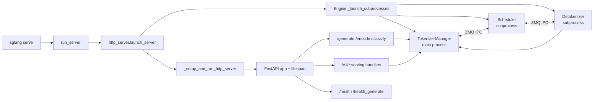

# HTTP-Server

## 你为什么要读

HTTP Server 是 SGLang 对外服务的门面，也是启动生命周期的门禁。读这一组文档，不是为了记住 FastAPI 路由表，而是为了回答三个实际问题：

1. 服务从 `sglang serve` 到监听端口，中间哪些进程必须先就绪？
2. 一个 `/generate` 或 `/v1/chat/completions` 请求为什么最后都会进入 `TokenizerManager`？
3. `/health`、warmup、多 tokenizer worker、API key 这些部署现象应该从哪个源码分支解释？

读完后，你应该能在排查“端口已开但请求不通”“warmup 状态与 ready 日志矛盾”“多 worker 鉴权不生效”“OpenAI 路由和 native 路由行为不一致”时，快速定位到启动链、FastAPI 生命周期、路由委托或 TokenizerManager 下游。

## 一句话模型

HTTP Server 不调度 token，也不做模型 forward。它做的是六件事：选择 HTTP 入口，拉起 SRT engine 子进程，保存进程内状态，初始化协议 handler，启动 ASGI server，再把请求转交给 `TokenizerManager`。



这个模型的关键边界是：HTTP 层只拿到 Python 对象和 JSON/SSE 响应，真正的请求状态、ZMQ、调度和 detokenize 回程都在 [[SGLang-TokenizerManager]] 之后。

readiness 不是一个布尔开关：轻量 `/health`、深度 `/health_generate`、general warmup、custom warmup 和 `ServerStatus` 各自证明不同事实，不能互相替代。

## 阅读顺序

| 顺序 | 文件 | 适合解决的问题 |
|------|------|----------------|
| 1 | [[SGLang-HTTP-Server-核心概念]] | 先建立 HTTP 门面、生命周期门禁、`_GlobalState`、`app.state` 的心理模型 |
| 2 | [[SGLang-HTTP-Server-源码走读]] | 沿 `sglang serve → Engine → FastAPI → route → TokenizerManager` 看源码证据 |
| 3 | [[SGLang-HTTP-Server-数据流]] | 看 `ServerArgs`、`PortArgs`、`scheduler_info`、请求对象如何跨边界流动 |
| 4 | [[SGLang-HTTP-Server-排障指南]] | 按症状排查 health、warmup、multi-worker、client disconnect、HTTP/2 |
| 5 | [[SGLang-HTTP-Server-学习检查]] | 用命令、日志和源码入口检查自己是否真的能复述链路 |

如果你只想先跑通一条请求，读 01 的模型图和 02 的 `/generate` 主线即可。如果你在改部署参数或排障，优先读 03 和 04。

## 源码范围

| 文件 | 本专题关注点 |
|------|--------------|
| `python/sglang/launch_server.py` | CLI 参数准备之后如何选择 HTTP、gRPC、Ray 或 encoder-only 入口 |
| `python/sglang/srt/entrypoints/engine.py` | engine 子进程拓扑、scheduler ready 握手、`Engine.generate` 复用请求入口 |
| `python/sglang/srt/entrypoints/http_server.py` | FastAPI app、lifespan、native/OpenAI 路由、health、warmup、ASGI server 分支 |

相关下游专题：

| 下游 | 为什么相关 |
|------|------------|
| [[SGLang-OpenAI-API]] | `/v1/chat/completions` 的 handler 如何把 OpenAI 协议转成内部请求 |
| [[SGLang-TokenizerManager]] | `/generate` 之后的请求状态、分词、ZMQ 发送、回包聚合 |
| [[SGLang-ScheduleBatch数据结构]] | 请求进入 Scheduler 后变成 `Req`、`ScheduleBatch`、`ForwardBatch` 的形态 |
| [[SGLang-Detokenizer]] | output token ids 如何回到字符串响应 |

## 最小源码主线

`run_server` 的默认分支把服务交给 HTTP Server：

```python
# 来源：python/sglang/launch_server.py L47-L51
    else:
        # Default mode: HTTP mode.
        from sglang.srt.entrypoints.http_server import launch_server

        launch_server(server_args)
```

`launch_server` 先启动 engine 子进程，再进入 HTTP setup：

```python
# 来源：python/sglang/srt/entrypoints/http_server.py L2494-L2517
    # Launch subprocesses
    (
        tokenizer_manager,
        template_manager,
        port_args,
        scheduler_init_result,
        subprocess_watchdog,
    ) = Engine._launch_subprocesses(
        server_args=server_args,
        init_tokenizer_manager_func=init_tokenizer_manager_func,
        run_scheduler_process_func=run_scheduler_process_func,
        run_detokenizer_process_func=run_detokenizer_process_func,
    )

    _setup_and_run_http_server(
        server_args,
        tokenizer_manager,
        template_manager,
        port_args,
        scheduler_init_result.scheduler_infos,
        subprocess_watchdog,
        execute_warmup_func=execute_warmup_func,
        launch_callback=launch_callback,
    )
```

读这一段时先记住两个判断：

- `Engine._launch_subprocesses` 是运行时拓扑的核心，HTTP Server 只接收它产出的 `tokenizer_manager`、`template_manager`、`port_args`、`scheduler_infos`。
- `_setup_and_run_http_server` 是对外监听的阻塞点，它把 engine 产物写进 `_GlobalState` 和 FastAPI `app`，然后选择 uvicorn 或 Granian。

## 读完后的复盘问题

- 如果 `/health` 返回 503，是端口没监听、`ServerStatus.Starting`、graceful exit，还是深度探活没有收到后端响应？
- 为什么轻量 `/health` 返回 200 仍不能证明 `ServerStatus.Up`，而 `/health_generate` 成功也不等于它自己的探测请求完整结束？
- 如果 `--tokenizer-worker-num 4 --api-key <key>` 启动失败，为什么这是 HTTP worker 初始化问题，不是 OpenAI handler 问题？
- 如果 Python `Engine().generate()` 和 HTTP `/generate` 输出不同，应该在 HTTP route 之前查，还是在 `TokenizerManager.generate_request` 之后查？

下一篇先读 [[SGLang-HTTP-Server-核心概念]]。
