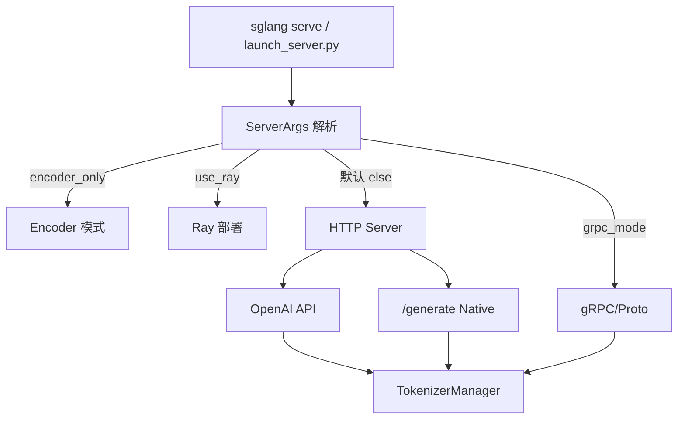

# 启动与入口

> **你只需阅读本目录，不必打开 `sglang/` 源码。** 
> 内嵌代码对应 sglang Git commit `70df09b`。

---

## 本目录解决什么问题

用户执行 `sglang serve` 或调用 `Engine()` 之后，**进程如何拉起、HTTP/gRPC 请求从哪条路由进入 TokenizerManager？** 四个模块从 CLI 到 API 兼容层完整覆盖。

| 专题 | 角色 | 一句话 |
|------|------|--------|
| [[SGLang-启动链路|启动链路]] | CLI + ServerArgs | `run_server` 四条分支、子进程拓扑 |
| [[SGLang-HTTP-Server|HTTP Server]] | FastAPI 入口 | `/generate`、lifespan、`_global_state` |
| [[SGLang-OpenAI-API|OpenAI API]] | 兼容层 | `/v1/chat/completions`、模板与格式转换 |
| [[SGLang-gRPC-Proto|gRPC/Proto]] | gRPC 模式 | Rust servicer、Proto、与 HTTP 互斥/并存 |

---

## 端到端启动与路由

这张图的读法是：绝大多数部署走 HTTP 默认分支；OpenAI 兼容路由与 Native `/generate` **共用**底层 `tokenizer_manager.generate_request`，Scheduler 无感知差异。

---

## 学习检查

能口述：**用户执行 `sglang serve` → HTTP 收到第一个 token** 的完整路径：

1. `launch_server.py` / CLI 解析 `ServerArgs`
2. `_launch_subprocesses` 拉起 Scheduler、Detokenizer 等子进程
3. FastAPI `lifespan` 初始化 TokenizerManager
4. POST `/v1/chat/completions` → Serving 层 → `generate_request`
5. 流式 SSE 首 chunk 返回（详见 [[SGLang-HTTP请求全链路|全链路请求追踪]]）

---

## 推荐阅读顺序

| 专题 | 必读内容 |
|------|----------|
| 启动链路 | [[SGLang-启动链路-源码走读]] |
| HTTP Server | [[SGLang-HTTP-Server-核心概念]] + [[SGLang-HTTP-Server-源码走读]] |
| OpenAI API | 需要 OpenAI SDK 兼容时阅读 |
| gRPC/Proto | 需要 gRPC 网关或多语言客户端时阅读 |

零基础读者可先读 [[SGLang-零基础先修]]，再读启动链路与 HTTP Server。

---

## 模块导航

| 专题 | 入口 |
|------|------|
| 启动链路 | [[SGLang-启动链路]] |
| HTTP Server | [[SGLang-HTTP-Server]] |
| OpenAI API | [[SGLang-OpenAI-API]] |
| gRPC/Proto | [[SGLang-gRPC-Proto]] |

← [[SGLang-阅读方法]] · → [[SGLang-请求调度]]
