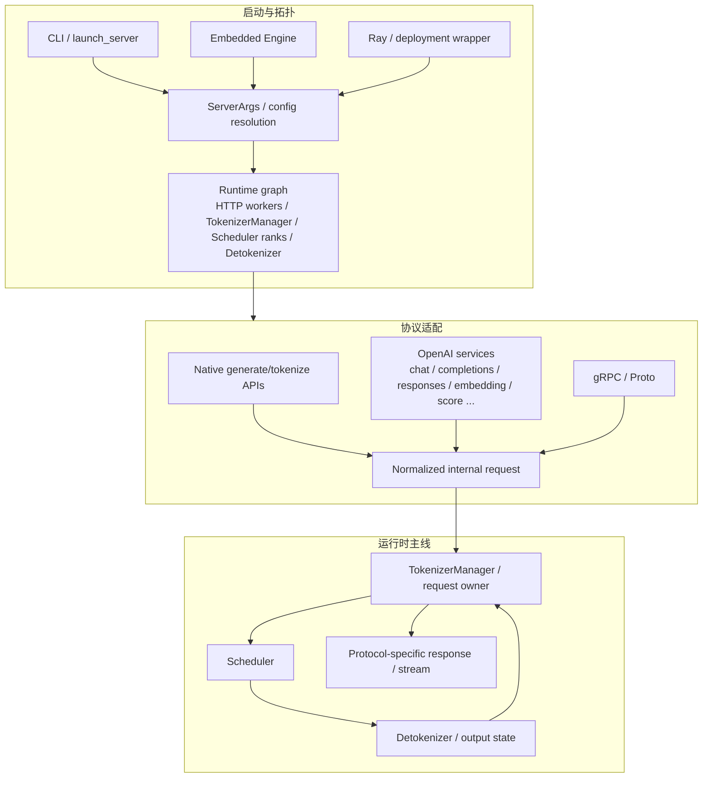

# SGLang 启动与入口

> 启动不是“运行一个 FastAPI 文件”，入口也不只有 `/generate`：配置先决定运行拓扑，协议适配再把不同用户语义归一化为内部请求，只有之后才进入 TokenizerManager/Scheduler 主线。

## 本目录解决什么问题

本分区回答三个边界：

1. 启动边界：CLI、嵌入式 Engine、Ray/其他部署如何形成 ServerArgs 与进程/IPC 拓扑；
2. 协议边界：native HTTP、OpenAI-compatible services、gRPC/Proto 各自校验和转换什么；
3. 生命周期边界：组件何时 ready，失败如何暴露，stream/abort/health 怎样穿过入口层。

“请求最终都做推理”不代表入口差异对下游无影响。chat template、multimodal input、embedding/score/rerank/transcription、skip-tokenizer、streaming response 等模式会生成不同内部对象或返回契约。

## 三层总图



实际拓扑会随模型类型、并行配置、HTTP worker 数、PD/PP、skip-tokenizer、Ray 等变化。入口页的任务是教你识别边界，不把某次默认部署画成永恒进程图。

## 四个专题的责任边界

| 专题 | 主要责任 | 关键对象 | 不应外推 |
|---|---|---|---|
| [[SGLang-启动链路]] | 配置解析、端口/IPC、进程或线程拉起、ready/teardown | CLI args、ServerArgs、process handles、bootstrap signals | 所有模式都走同一分支/同一进程数 |
| [[SGLang-HTTP-Server]] | Web app lifecycle、native routes、health、stream/abort glue | app state、TokenizerManager handle、request context | HTTP route 自己完成 Scheduler/GPU 执行 |
| [[SGLang-OpenAI-API]] | OpenAI schema、模板/工具/多服务转换、SSE/usage/error contract | protocol model、serving class、request/response adapter | 与 native `/generate` 只有 URL 不同 |
| [[SGLang-gRPC-Proto]] | Proto contract、RPC service、streaming/bridge、多语言边界 | protobuf message、servicer/bridge、RPC status | 必然与 HTTP 互斥，或必然共享同一 adapter |

## 主线一：启动配置怎样冻结运行图

按生命周期阅读：

```text
CLI / Engine kwargs / deployment config
  → ServerArgs 与派生默认值
  → model/platform/parallel/mode validation
  → port / IPC / rank / worker topology
  → 各组件启动与连接
  → tokenizer/model/scheduler initialization
  → readiness 对外可见
  → serve loop
  → shutdown / child failure propagation
```

重点不是背 `if/else` 数量，而是区分：

- 用户显式参数与平台/模型派生值；
- 主进程拥有的 handle 与子进程内部权威对象；
- “端口已监听”“组件已启动”“模型已加载”“服务可接受目标请求”四种 readiness；
- 启动失败、请求失败与 worker 后续崩溃的传播路径。

阅读顺序：[[SGLang-启动链路-核心概念]] → [[SGLang-启动链路-数据流]] → [[SGLang-启动链路-源码走读]]。

## 主线二：协议请求何时变成内部请求

入口层的共同目标不是简单调用同一个函数，而是产出下游能理解的内部请求与返回上下文：

```text
transport request
  → schema / auth / size / mode validation
  → chat template / prompt / multimodal / tool conversion
  → sampling / return / stream options
  → normalized request id and internal input
  → TokenizerManager request lifecycle
  → internal token/logprob/embedding/etc result
  → protocol-specific chunk / usage / error / finish reason
```

Native、OpenAI 与 gRPC 可以在某个下游阶段汇合，但它们的输入/输出合同仍然不同。排障时必须保留“哪一个 adapter 创建了这个内部对象”的证据。

## 主线三：流式回程与取消

streaming 不是把最终 JSON 拆块：

- Scheduler/Detokenizer 产生的是内部 token/text/metadata 事件；
- TokenizerManager 或 serving adapter 决定如何形成 API chunk；
- OpenAI SSE 还要维护 role、delta、usage、finish/error contract；
- client disconnect/abort 必须反向传播到请求 owner，最终释放队列与 KV 资源；
- 多 HTTP worker 时，IPC/request affinity 影响谁能消费对应结果。

因此“收到首 chunk”只能证明一条回程已建立，不能单独证明所有 worker/rank、abort 与 finish 路径正确。

## 按任务选择阅读路线

| 任务 | 路线 | 最终产物 |
|---|---|---|
| 理解普通 server 启动 | [[SGLang-启动链路]] → [[SGLang-HTTP-Server]] | 配置→拓扑→ready→route 的对象图 |
| 接 OpenAI SDK | [[SGLang-OpenAI-API]] → [[SGLang-HTTP请求全链路]] | schema/template→internal request→SSE/usage 映射 |
| 使用 native API | [[SGLang-HTTP-Server]] → [[SGLang-TokenizerManager]] | native request、tokenization 与 stream/abort 路径 |
| 多语言/RPC | [[SGLang-gRPC-Proto]] → [[SGLang-gRPC请求全链路]] | Proto field、RPC stream 与内部对象映射 |
| 嵌入应用进程 | [[SGLang-启动链路]] → Engine 相关入口 | Engine handle、子进程/IPC、生命周期与异常传播 |
| 启动故障 | 各专题排障指南 | 最早失败层、操作与预期，而非盲目重启 |

## 静态定位

```powershell
rg -n 'class ServerArgs|def __post_init__|from_cli_args' sglang/python/sglang/srt/server_args.py
rg -n 'def launch_server|def run_server|def _launch' sglang/python/sglang/launch_server.py sglang/python/sglang/srt/entrypoints/http_server.py
rg -n 'class Engine|TokenizerManager' sglang/python/sglang/srt/entrypoints/engine.py sglang/python/sglang/srt/entrypoints/http_server_engine.py
rg -n 'serving_chat|serving_completions|serving_responses|serving_embedding|serving_score' sglang/python/sglang/srt/entrypoints/http_server.py
rg -n 'grpc|Proto|Servicer|bridge' sglang/python/sglang/srt/entrypoints/grpc_server.py sglang/python/sglang/srt/entrypoints/grpc_bridge.py
```

预期：依次命中配置对象、server 启动入口、嵌入式 Engine/TokenizerManager、OpenAI 多服务装配和 gRPC 边界。命中只证明结构存在；每条真实部署路径仍要结合参数与运行日志。

## 最小运行验证

在目标环境启动一个最小模型服务后，依次验证：

1. health/readiness 在模型真正可服务后成功；
2. native 或 OpenAI 非流式请求返回完整结果与 finish metadata；
3. 流式请求首 chunk、后续 delta、结束 chunk 顺序正确；
4. 主动断开客户端后，请求能 abort，Scheduler/KV 不遗留所有权；
5. 错误 schema、超限输入或不支持模式返回协议一致的错误，而不是 worker 静默退出。

预期结果必须记录所用入口、模型、进程拓扑、请求体和版本。没有服务环境时，运行上述静态定位并明确未验证的进程/IPC/stream 行为。

## 本分区完成标准

- [ ] 能区分 CLI server、embedded Engine、deployment wrapper 三类调用者。
- [ ] 能画出 ServerArgs→runtime graph→readiness→serve loop→shutdown。
- [ ] 能说明 native/OpenAI/gRPC 在哪里分叉、在哪里可能汇合。
- [ ] 能从协议 request 追到 TokenizerManager 内部对象，再追 response/stream 回 adapter。
- [ ] 能解释 streaming、finish、usage、error、disconnect/abort 的不同状态。
- [ ] 能在多 worker/多 rank 配置中标出 request owner 与 IPC affinity。
- [ ] 能把启动故障、协议故障、Scheduler 故障分层，不用“服务不可用”概括一切。

← [[SGLang-阅读方法]] · → [[SGLang-请求调度]] · 总入口 [[SGLang学习指南]]
