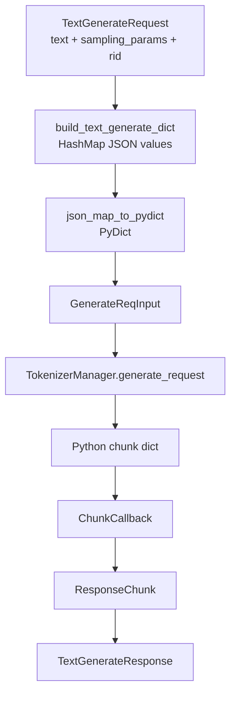

# gRPC-Proto · 数据流

## 你为什么要读

这篇只回答一个问题：一条 gRPC 请求在每个边界变成什么对象、谁持有状态、下一跳是谁。

## 对象生命周期

以 `TextGenerate(stream=true)` 为主线：

| 阶段 | 对象形态 | 状态持有者 | 下一跳 |
|------|----------|------------|--------|
| 客户端入站 | `TextGenerateRequest` | gRPC client / Tonic request | `SglangServiceImpl.text_generate` |
| Rust handler | `rid` + `HashMap<String, serde_json::Value>` | Rust stack | `PyBridge.submit_request` |
| Bridge 入 Python | `PyDict` + `ChunkCallback` | `PyBridge` 的 per-rid state | `RuntimeHandle.submit_request` |
| Python runtime | `GenerateReqInput` | `RuntimeHandle` / `TokenizerManager` event loop | `TokenizerManager.generate_request` |
| Python 输出 | chunk dict，含 `text`/`output_ids`/`meta_info` | async generator | `ChunkCallback.__call__` |
| Rust channel | `ResponseChunk::Data/Finished/Error` | per-rid mpsc channel | Tonic stream loop |
| 客户端回包 | `TextGenerateResponse` | gRPC stream | client consumer |

## 数据流图



## 1. Proto 字段先变成 JSON map

Rust request utils 不直接构造 Python class，而是先构造 `HashMap<String, serde_json::Value>`。这样字段转换集中在 Rust，Python 只需要按已有 `GenerateReqInput` schema 解析。

```rust
# 来源：rust/sglang-grpc/src/utils/request_utils.rs L90-L138
/// Build a request dict for GenerateReqInput from proto TextGenerateRequest fields.
pub(crate) fn build_text_generate_dict(
    rid: &str,
    req: &proto::TextGenerateRequest,
) -> HashMap<String, serde_json::Value> {
    let mut d = HashMap::new();
    d.insert("rid".into(), serde_json::json!(rid));
    d.insert("text".into(), serde_json::json!(req.text));
    d.insert(
        "sampling_params".into(),
        sampling_params_to_map(&req.sampling_params),
    );
    d.insert(
        "stream".into(),
        serde_json::json!(req.stream.unwrap_or(false)),
    );
    d.insert(
        "return_logprob".into(),
        serde_json::json!(req.return_logprob.unwrap_or(false)),
    );
    d.insert(
        "top_logprobs_num".into(),
        serde_json::json!(req.top_logprobs_num.unwrap_or(0)),
    );
    d.insert(
        "logprob_start_len".into(),
        serde_json::json!(req.logprob_start_len.unwrap_or(-1)),
    );
    d.insert(
        "return_text_in_logprobs".into(),
        serde_json::json!(req.return_text_in_logprobs.unwrap_or(false)),
    );
    if let Some(ref lp) = req.lora_path {
        d.insert("lora_path".into(), serde_json::json!(lp));
    }
    if let Some(ref rk) = req.routing_key {
        d.insert("routing_key".into(), serde_json::json!(rk));
    }
    if let Some(rank) = req.routed_dp_rank {
        d.insert("routed_dp_rank".into(), serde_json::json!(rank));
    }
    if let Some(ref session_id) = req.session_id {
        d.insert("session_id".into(), serde_json::json!(session_id));
    }
    if let Some(trace) = trace_headers_to_json(&req.trace_headers) {
        d.insert("external_trace_header".into(), trace);
    }
    d.insert("received_time".into(), serde_json::json!(now_timestamp()));
    d
```

这一步产生两个容易漏掉的字段：`external_trace_header` 和 `received_time`。它们不是 Proto 原字段名，但会被下游可观测链路消费。

## 2. JSON map 再变成 Python dict

PyO3 边界只接受 Python 对象，所以 Rust 在短暂持 GIL 时把 JSON value 递归转成 Python 值。

```rust
# 来源：rust/sglang-grpc/src/utils/py_utils.rs L37-L45
pub(crate) fn json_map_to_pydict<'py>(
    py: Python<'py>,
    map: &HashMap<String, serde_json::Value>,
) -> PyResult<Bound<'py, PyDict>> {
    let py_dict = PyDict::new(py);
    for (k, v) in map {
        py_dict.set_item(k, json_value_to_py(py, v)?)?;
    }
    Ok(py_dict)
```

这一步之后，Rust 不再理解 `GenerateReqInput` 的 Pydantic 或 msgspec 细节；schema 校验交给 Python。

## 3. Python runtime 把 dict 转成内部请求对象

`RuntimeHandle.submit_request` 是跨语言边界进入 SGLang runtime 的唯一主入口。`req_type="generate"` 对应 `GenerateReqInput`，`req_type="embed"` 对应 `EmbeddingReqInput`。

```python
# 来源：python/sglang/srt/entrypoints/grpc_bridge.py L262-L291
    def submit_request(
        self,
        *,
        req_type: str,
        req_dict: dict,
        chunk_callback,
        is_disconnected_fn: Optional[Callable[[], bool]] = None,
    ):
        mock_request = (
            _GrpcRequest(is_disconnected_fn=is_disconnected_fn)
            if is_disconnected_fn is not None
            else None
        )
        if req_type == "generate":
            from sglang.srt.managers.io_struct import GenerateReqInput

            obj = GenerateReqInput(**req_dict)
            stream = req_dict.get("stream", False)
            self._submit_on_tm_loop(
                self._run_generate(obj, chunk_callback, stream, mock_request)
            )
        elif req_type == "embed":
            from sglang.srt.managers.io_struct import EmbeddingReqInput

            obj = EmbeddingReqInput(**req_dict)
            self._submit_on_tm_loop(self._run_embed(obj, chunk_callback, mock_request))
        else:
            raise ValueError(
                f"Unknown req_type: {req_type!r} (expected 'generate' or 'embed')"
            )
```

对象形态到这里已经和 HTTP 入口接近：HTTP 是 JSON body 进 `GenerateReqInput`，gRPC 是 Proto 进 dict 再进 `GenerateReqInput`。

## 4. 输出侧统一成 ResponseChunk

Bridge 不让 Tonic handler 直接理解 Python chunk，而是统一成 `ResponseChunk`。

```rust
# 来源：rust/sglang-grpc/src/bridge.rs L13-L35
#[derive(Debug, Clone)]
pub enum ResponseChunk {
    Data(ResponseData),
    Finished(ResponseData),
    Error(String),
}

impl ResponseChunk {
    fn is_terminal(&self) -> bool {
        matches!(self, Self::Finished(_) | Self::Error(_))
    }
}

#[derive(Debug, Clone)]
pub struct ResponseData {
    pub text: Option<String>,
    pub output_ids: Option<Vec<i32>>,
    pub embedding: Option<Vec<f32>>,
    pub json_bytes: Option<Vec<u8>>,
    pub meta_info: HashMap<String, String>,
}

pub const DEFAULT_RESPONSE_CHANNEL_CAPACITY: usize = 64;
```

这也是为什么 `TextGenerate`、`Generate`、`Embed`、OpenAI pass-through 能共享同一个 channel 机制：不同字段都塞进 `ResponseData`，再由 handler 选择自己需要的字段。

## 5. meta_info 的类型被压成 string map

Proto 里的 `meta_info` 是 `map<string,string>`，但 Python `meta_info` 里可能有数字、布尔、数组或对象。Rust 因此把 value JSON 编码成字符串。

```rust
# 来源：rust/sglang-grpc/src/bridge.rs L785-L801
fn extract_meta_info(chunk: &Bound<'_, PyDict>) -> HashMap<String, String> {
    let mut meta = HashMap::new();
    if let Ok(Some(meta_obj)) = chunk.get_item("meta_info")
        && let Ok(meta_dict) = meta_obj.downcast::<PyDict>()
    {
        for (k, v) in meta_dict.iter() {
            // The proto schema is map<string, string>; encode each Python value as JSON
            // so clients can recover numbers, booleans, arrays, and objects losslessly.
            if let Ok(key) = k.extract::<String>()
                && let Ok(val) = py_value_to_json_string(&v)
            {
                meta.insert(key, val);
            }
        }
    }
    meta
}
```

客户端如果直接把 `meta_info["completion_tokens"]` 当普通数字读，会踩坑；正确方式是按 JSON 字符串解码。

## 6. Tokenize/Detokenize 不一定进入 Scheduler

`Tokenize` 和 `Detokenize` 是本地操作。Rust 优先使用 native tokenizer，失败或不支持时才回退 Python。

```rust
# 来源：rust/sglang-grpc/src/tokenizers.rs L51-L96
impl RustTokenizer {
    /// Load a native tokenizer from a tokenizer path or model directory.
    /// Returns `None` if no supported Rust backend is available.
    pub fn from_tokenizer_path(
        tokenizer_path: &str,
        tokenizer_mode: Option<&str>,
        context_len: i32,
    ) -> Option<Self> {
        let path = Path::new(tokenizer_path);
        let Some(tokenizer_json) = resolve_tokenizer_json(path) else {
            tracing::info!(
                "No native tokenizer candidates found at {:?}; Rust tokenizer disabled",
                path
            );
            return None;
        };

        if matches!(tokenizer_mode, Some("slow")) {
            tracing::info!(
                "Rust tokenizer disabled because tokenizer_mode=slow for {:?}",
                path
            );
            return None;
        }

        match load_backend(&tokenizer_json) {
            Ok(backend) => {
                let tokenizer = Self { backend };
                tracing::info!(
                    "Rust tokenizer loaded via {} from {:?} (context_len={})",
                    tokenizer.backend_name(),
                    tokenizer_json,
                    context_len
                );
                Some(tokenizer)
            }
            Err(e) => {
                tracing::warn!(
                    "Failed to load Rust tokenizer from {:?}: {}. Falling back to Python.",
                    tokenizer_json,
                    e
                );
                None
            }
        }
    }
```

对应 handler 的数据流很短：先 Rust native，后 Python fallback。

```rust
# 来源：rust/sglang-grpc/src/server.rs L474-L520
    async fn tokenize(
        &self,
        request: Request<proto::TokenizeRequest>,
    ) -> Result<Response<proto::TokenizeResponse>, Status> {
        let req = request.into_inner();
        let add_special = req.add_special_tokens.unwrap_or(true);

        // Try Rust-native tokenizer first (no GIL)
        if let Some(tok) = self.bridge.rust_tokenizer() {
            let tokens = tok
                .encode(&req.text, add_special)
                .map_err(Status::internal)?;
            let count = tokens.len() as i32;
            return Ok(Response::new(proto::TokenizeResponse {
                tokens: tokens.iter().map(|&t| t as i32).collect(),
                count,
                max_model_len: self.bridge.context_len(),
                input_text: req.text,
            }));
        }

        // Fallback to Python
        let json_str = tokio::task::spawn_blocking({
            let bridge = self.bridge.clone();
            let text = req.text.clone();
            move || bridge.tokenize_py(&text, add_special)
        })
        .await
        .map_err(|e| Status::internal(format!("Task join error: {}", e)))?
        .map_err(|e| pyerr_to_status(e, "Tokenize failed"))?;

        let v: serde_json::Value = serde_json::from_str(&json_str)
            .map_err(|e| Status::internal(format!("Failed to parse JSON response: {}", e)))?;
        Ok(Response::new(proto::TokenizeResponse {
            tokens: v["tokens"]
                .as_array()
                .map(|a| {
                    a.iter()
                        .filter_map(|x| x.as_i64().map(|n| n as i32))
                        .collect()
                })
                .unwrap_or_default(),
            count: v["count"].as_i64().unwrap_or(0) as i32,
            max_model_len: self.bridge.context_len(),
            input_text: req.text,
        }))
    }
```

因此 `Tokenize` 慢，不一定要先看 Scheduler；先看 Rust tokenizer 是否加载成功。

## 7. OpenAI pass-through 走 bytes，不走 typed dict

OpenAI-compatible RPC 的数据流不是 `GenerateReqInput` typed dict，而是 JSON bytes 进入 Python OpenAI serving class，再以 bytes 回到 Rust。

```rust
# 来源：rust/sglang-grpc/src/bridge.rs L697-L783
// JSON chunk callback for OpenAI pass-through RPCs (raw bytes).
#[pyclass]
struct JsonChunkCallback {
    rid: String,
    state: BridgeStateRef,
    runtime_handle: PyObject,
    tokio_handle: Handle,
}

#[pymethods]
impl JsonChunkCallback {
    /// Register before producing chunks. If a parked chunk drained before registration,
    /// Rust fires `on_ready` immediately so late registration cannot miss the edge.
    fn set_on_ready(&self, py: Python<'_>, on_ready: PyObject) -> PyResult<()> {
        set_on_ready_for_rid(py, &self.rid, &self.state, on_ready)
    }

    fn clear_on_ready(&self) {
        clear_on_ready_for_rid(&self.rid, &self.state);
    }

    #[pyo3(signature = (chunk_bytes, finished=false, error=None, status_code=None))]
    fn __call__(
        &self,
        chunk_bytes: &Bound<'_, pyo3::PyAny>,
        finished: bool,
        error: Option<String>,
        status_code: Option<i32>,
    ) -> PyResult<ChunkSendStatus> {
        let py = chunk_bytes.py();
        let state = lock_or_recover(self.state.as_ref(), "state");
        let sender = match state.channels.get(&self.rid) {
            Some(s) => s.clone(),
            None => return Ok(ChunkSendStatus::Closed),
        };
        drop(state);

        if let Some(err_msg) = error {
            return try_send_chunk(
                py,
                &self.rid,
                &self.state,
                &self.runtime_handle,
                &self.tokio_handle,
                &sender,
                ResponseChunk::Error(err_msg),
            );
        }

        let bytes_data: Vec<u8> = if let Ok(b) = chunk_bytes.extract::<Vec<u8>>() {
            b
        } else if let Ok(s) = chunk_bytes.extract::<String>() {
            s.into_bytes()
        } else {
            vec![]
        };

        let mut meta_info = HashMap::new();
        if let Some(code) = status_code {
            meta_info.insert("status_code".to_string(), code.to_string());
        }

        let data = ResponseData {
            text: None,
            output_ids: None,
            embedding: None,
            json_bytes: Some(bytes_data),
            meta_info,
        };

        let msg = if finished {
            ResponseChunk::Finished(data)
        } else {
            ResponseChunk::Data(data)
        };

        try_send_chunk(
            py,
            &self.rid,
            &self.state,
            &self.runtime_handle,
            &self.tokio_handle,
            &sender,
            msg,
        )
    }
}
```

这说明 typed generate 和 OpenAI pass-through 共享 stream/backpressure，但数据 payload 形态不同。

## 8. Legacy sidecar 是运维旁路

当前 `--grpc-mode` wrapper 会在 request manager ready 后挂 sidecar。sidecar 承担 `/metrics`、`/start_profile`、`/stop_profile` 这类 HTTP 运维端点，不是业务生成路径。

```python
# 来源：python/sglang/srt/entrypoints/grpc_server.py L194-L223
    async def _on_request_manager_ready(request_manager, srv_args, sched_info):
        nonlocal sidecar_runner
        try:
            _add_admin_routes(sidecar_app, request_manager)
        except Exception as e:
            logger.error(
                "Failed to set up admin routes: %s. "
                "Continuing without admin endpoints.",
                e,
                exc_info=True,
            )
        try:
            sidecar_runner = await _start_sidecar_server(
                server_args.host, sidecar_port, sidecar_app
            )
        except OSError as e:
            logger.error(
                "Failed to start HTTP sidecar server: %s. "
                "Continuing without metrics/profile endpoints.",
                e,
                exc_info=True,
            )
        except Exception as e:
            logger.error(
                "Unexpected error starting HTTP sidecar server: %s. "
                "Continuing without metrics/profile endpoints.",
                e,
                exc_info=True,
            )
```

如果业务生成正常但 `/metrics` 不存在，不要先怀疑 Scheduler，先检查 sidecar 是否启动、servicer 版本是否支持 hook。

## 复盘

gRPC/Proto 的对象迁移可以记成四次换壳：

1. Proto request 换成 JSON map。
2. JSON map 换成 Python `GenerateReqInput` 或 `EmbeddingReqInput`。
3. Python chunk 换成 Rust `ResponseChunk`。
4. `ResponseChunk` 换成 Proto response 或 JSON bytes response。

每次换壳都保留同一个 `rid`，这就是排查请求泄漏、断连和 backpressure 的主线。
