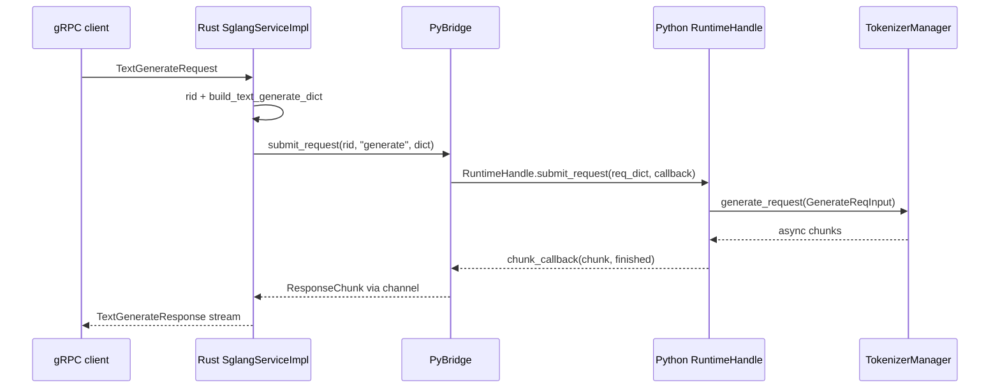

# gRPC-Proto · 源码走读

本篇只追 Native Rust 实现的一条主线：网关发起 `TextGenerate(stream=true)`，SGLang 如何把它从 Proto stream 接到 Python `TokenizerManager.generate_request`，再把 chunk 变回 gRPC stream。它解释的是 `sglang.srt.grpc._core.start_server` 可以启动的实现，不代表当前默认 HTTP 分支或 legacy `--grpc-mode` 已经调用这条入口。

## 读者任务

读完应能回答：

- `TextGenerateRequest` 在哪里变成 Python dict？
- Rust handler 为什么拿到的是 `Receiver<ResponseChunk>`？
- Python `RuntimeHandle` 如何在自己的 event loop 上运行 `generate_request`？
- `finish_reason`、客户端断开、channel 满分别在哪一层处理？

## 长文读法

这篇按跨语言边界读：Proto/Tonic 只负责协议层收发，`PyBridge` 用 per-rid channel 把 Rust stream 和 Python producer 接起来，`RuntimeHandle` 再把请求放回 `TokenizerManager` 所在的 event loop，最后由 `ChunkCallback` / `ResponseChunk` 把 Python chunk 翻回 gRPC stream。

| 读者任务 | 先读 | 要抓住的判断 |
|----------|------|--------------|
| 首次建立跨语言主线 | 主线图、第 1 到 3 节 | gRPC server 是进程内 Rust server，不是 Python loop 上的普通 HTTP route |
| 判断 Rust server 为什么不占 Python loop | 第 2 节 | Tonic 有自己的 Tokio runtime；Python runtime 只在提交请求和消费 chunk 时被调用 |
| 追踪 Proto 字段怎样进入 `GenerateReqInput` | 第 3、5 节 | Tonic handler 先把 Proto 转 dict，Python 侧再把 dict 实例化为请求对象 |
| 追踪 stream chunk 怎样回到客户端 | 第 4、6、7 节 | `PyBridge` 管 channel，`ChunkCallback` 管 Python dict 到 `ResponseChunk`，Tonic stream 管 proto response |
| 排查慢客户端、channel 满、断开 | 第 8、9 节 | backpressure 发生在 Rust channel；断开后通过 abort 回传给 Python runtime |
| 看运维边界和兼容入口 | 第 10 节、运行验证 | message size、health/profile/OpenAI pass-through 属于入口边界，不改变生成主线 |

读的时候不要把四个对象混在一起：Tonic handler 是协议入口，`PyBridge` 是跨语言 channel 管理器，`RuntimeHandle` 是 Python coroutine 调度器，`TokenizerManager.generate_request` 才是真正产出生成 chunk 的地方。

## 主线图



## 1. Proto 编译只生成 server 侧

Rust crate 不是客户端 SDK。`build.rs` 明确 `build_server(true)`、`build_client(false)`，并允许 proto3 optional 字段：

```rust
# 来源：rust/sglang-grpc/build.rs L1-L16
fn main() -> Result<(), Box<dyn std::error::Error>> {
    let proto_path = "../../proto/sglang/runtime/v1/sglang.proto";

    tonic_build::configure()
        .build_server(true)
        .build_client(false)
        .protoc_arg("--experimental_allow_proto3_optional")
        .file_descriptor_set_path(
            std::path::PathBuf::from(std::env::var("OUT_DIR").unwrap())
                .join("sglang_descriptor.bin"),
        )
        .compile_protos(&[proto_path], &["../../proto"])?;

    println!("cargo:rerun-if-changed={}", proto_path);
    Ok(())
}
```

这个 crate 不生成 Rust client stub，只生成 server stub。外部客户端仍可使用同一份 proto，在 Rust、Go、Java、Python 或其他支持 gRPC 的语言中自行生成客户端；“本 crate 不生成”不等于“Rust 客户端不可生成”。

## 2. Python 调 `start_server` 后，Rust 自己开 Tokio runtime

`start_server` 是 Native 扩展暴露给 Python 的可调用入口。当前源码已经实现它，但默认 HTTP 启动链尚未消费 `ServerArgs.enable_grpc/grpc_port`，legacy `--grpc-mode` 也委托外部 servicer；因此这一节只证明实现机制，不证明线上 listener 已自动启动。它拿到 `runtime_handle` 后，不在 Python event loop 上跑 Tonic，而是建立单独 Tokio runtime 和后台线程。

```rust
# 来源：rust/sglang-grpc/src/lib.rs L150-L159
#[pyfunction]
#[pyo3(signature = (host, port, runtime_handle, worker_threads=4, response_channel_capacity=64, response_timeout_secs=300))]
fn start_server(
    host: String,
    port: u16,
    runtime_handle: PyObject,
    worker_threads: usize,
    response_channel_capacity: usize,
    response_timeout_secs: u64,
) -> PyResult<GrpcServerHandle> {
```

启动时先从 Python runtime 提取 tokenizer 信息，尝试构造 Rust native tokenizer，再创建 `PyBridge`：

```rust
# 来源：rust/sglang-grpc/src/lib.rs L203-L232
    let tokenizer_info = extract_tokenizer_info(&runtime_handle)?;

    let rust_tokenizer = tokenizer_info.tokenizer_path.as_deref().and_then(|p| {
        RustTokenizer::from_tokenizer_path(
            p,
            tokenizer_info.tokenizer_mode.as_deref(),
            tokenizer_info.context_len,
        )
    });

    let rt = tokio::runtime::Builder::new_multi_thread()
        .worker_threads(worker_threads)
        .enable_all()
        .thread_name("sglang-grpc-tokio")
        .build()
        .map_err(|err| {
            pyo3::exceptions::PyRuntimeError::new_err(format!(
                "Failed to build Tokio runtime for gRPC server: {}",
                err
            ))
        })?;
    let tokio_handle = rt.handle().clone();

    let bridge = Arc::new(PyBridge::new(
        runtime_handle,
        rust_tokenizer,
        tokenizer_info.context_len,
        response_channel_capacity,
        tokio_handle,
    ));
```

真正的 Tonic server 在线程里执行：

```rust
# 来源：rust/sglang-grpc/src/lib.rs L237-L257
    let join_handle = std::thread::Builder::new()
        .name("sglang-grpc".to_string())
        .spawn(move || {
            if let Err(e) = rt.block_on(server::run_grpc_server(
                listener,
                bridge_clone,
                shutdown_clone,
                response_timeout,
            )) {
                tracing::error!("gRPC server exited with error: {}", e);
            }
        })
        .map_err(|e| {
            pyo3::exceptions::PyRuntimeError::new_err(format!("Failed to spawn gRPC thread: {}", e))
        })?;

    Ok(GrpcServerHandle {
        shutdown,
        join_handle: Some(join_handle),
    })
}
```

这里的设计压力是隔离 event loop：Tonic stream 不应该占住 TokenizerManager 的 Python loop；Python loop 只负责实际 runtime 请求。

## 3. Tonic handler 把 TextGenerate 变成 request dict

`text_generate` 的第一段只做三件事：取 `rid`，把 proto request 转 dict，交给 bridge。

```rust
# 来源：rust/sglang-grpc/src/server.rs L222-L236
    async fn text_generate(
        &self,
        request: Request<proto::TextGenerateRequest>,
    ) -> Result<Response<Self::TextGenerateStream>, Status> {
        let req = request.into_inner();
        let rid = req
            .rid
            .clone()
            .unwrap_or_else(|| uuid::Uuid::new_v4().to_string());
        let req_dict = build_text_generate_dict(&rid, &req);

        let mut receiver = self
            .bridge
            .submit_request(&rid, "generate", req_dict)
            .map_err(|e| pyerr_to_status(e, "Failed to submit request"))?;
```

`build_text_generate_dict` 是 typed Proto 进入 Python 数据模型的第一处字段映射：

```rust
# 来源：rust/sglang-grpc/src/utils/request_utils.rs L90-L138
/// Build a request dict for GenerateReqInput from proto TextGenerateRequest fields.
pub(crate) fn build_text_generate_dict(
    rid: &str,
    req: &proto::TextGenerateRequest,
) -> HashMap<String, serde_json::Value> {
    let mut d = HashMap::new();
    d.insert("rid".into(), serde_json::json!(rid));
    d.insert("text".into(), serde_json::json!(req.text));
    d.insert(
        "sampling_params".into(),
        sampling_params_to_map(&req.sampling_params),
    );
    d.insert(
        "stream".into(),
        serde_json::json!(req.stream.unwrap_or(false)),
    );
    d.insert(
        "return_logprob".into(),
        serde_json::json!(req.return_logprob.unwrap_or(false)),
    );
    d.insert(
        "top_logprobs_num".into(),
        serde_json::json!(req.top_logprobs_num.unwrap_or(0)),
    );
    d.insert(
        "logprob_start_len".into(),
        serde_json::json!(req.logprob_start_len.unwrap_or(-1)),
    );
    d.insert(
        "return_text_in_logprobs".into(),
        serde_json::json!(req.return_text_in_logprobs.unwrap_or(false)),
    );
    if let Some(ref lp) = req.lora_path {
        d.insert("lora_path".into(), serde_json::json!(lp));
    }
    if let Some(ref rk) = req.routing_key {
        d.insert("routing_key".into(), serde_json::json!(rk));
    }
    if let Some(rank) = req.routed_dp_rank {
        d.insert("routed_dp_rank".into(), serde_json::json!(rank));
    }
    if let Some(ref session_id) = req.session_id {
        d.insert("session_id".into(), serde_json::json!(session_id));
    }
    if let Some(trace) = trace_headers_to_json(&req.trace_headers) {
        d.insert("external_trace_header".into(), trace);
    }
    d.insert("received_time".into(), serde_json::json!(now_timestamp()));
    d
```

注意字段名 `external_trace_header`：这是 gRPC 的 `trace_headers` 接入 Python 追踪字段的地方。

## 4. PyBridge 用 per-rid channel 连接 Rust stream 和 Python producer

`submit_request` 创建 channel，然后在短暂持 GIL 时调用 Python `RuntimeHandle.submit_request`。Rust handler 留在自己这一侧等待 `Receiver<ResponseChunk>`。

```rust
# 来源：rust/sglang-grpc/src/bridge.rs L177-L198
    pub fn submit_request(
        &self,
        rid: &str,
        req_type: &str,
        req_dict: HashMap<String, serde_json::Value>,
    ) -> PyResult<Receiver<ResponseChunk>> {
        let receiver = self.create_channel(rid)?;
        let rid_owned = rid.to_string();

        let result = Python::with_gil(|py| -> PyResult<()> {
            let py_req_dict = json_map_to_pydict(py, &req_dict)?;
            let callback = self.make_chunk_callback(py, rid_owned)?;

            let kwargs = PyDict::new(py);
            kwargs.set_item("req_type", req_type)?;
            kwargs.set_item("req_dict", py_req_dict)?;
            kwargs.set_item("chunk_callback", callback)?;

            self.runtime_handle
                .call_method(py, "submit_request", (), Some(&kwargs))?;
            Ok(())
        });
```

这段解释了为什么 Rust handler 不是直接 await Python generator：Python 只拿 callback；Rust stream 只消费 channel。两边通过 `rid` 关联。

## 5. Python RuntimeHandle 把 dict 实例化为 GenerateReqInput

Python 侧 `RuntimeHandle` 持有 `tokenizer_manager`，并确保 TokenizerManager 的 handle loop 已建立：

```python
# 来源：python/sglang/srt/entrypoints/grpc_bridge.py L55-L79
class RuntimeHandle:
    """Thin Python handle that the Rust gRPC server calls into.

    Provides synchronous ``submit_*``, ``abort``, and info methods.
    Each submit method receives a ``chunk_callback`` (a Rust-side PyO3 object)
    that it invokes with ``(chunk_dict, finished, error)`` for each response
    chunk produced by TokenizerManager.
    """

    def __init__(
        self,
        tokenizer_manager,
        template_manager,
        server_args,
        scheduler_info: Optional[Dict] = None,
    ):
        self.tokenizer_manager = tokenizer_manager
        self.template_manager = template_manager
        self.server_args = server_args
        self.scheduler_info = scheduler_info or {}

        self._openai_serving_classes = None

        self.tokenizer_manager.auto_create_handle_loop()
        self._event_loop = self.tokenizer_manager.event_loop
```

`submit_request` 根据 `req_type` 构造内部输入对象，然后把 coroutine 丢到 TokenizerManager loop：

```python
# 来源：python/sglang/srt/entrypoints/grpc_bridge.py L262-L324
    def submit_request(
        self,
        *,
        req_type: str,
        req_dict: dict,
        chunk_callback,
        is_disconnected_fn: Optional[Callable[[], bool]] = None,
    ):
        mock_request = (
            _GrpcRequest(is_disconnected_fn=is_disconnected_fn)
            if is_disconnected_fn is not None
            else None
        )
        if req_type == "generate":
            from sglang.srt.managers.io_struct import GenerateReqInput

            obj = GenerateReqInput(**req_dict)
            stream = req_dict.get("stream", False)
            self._submit_on_tm_loop(
                self._run_generate(obj, chunk_callback, stream, mock_request)
            )
        elif req_type == "embed":
            from sglang.srt.managers.io_struct import EmbeddingReqInput

            obj = EmbeddingReqInput(**req_dict)
            self._submit_on_tm_loop(self._run_embed(obj, chunk_callback, mock_request))
        else:
            raise ValueError(
                f"Unknown req_type: {req_type!r} (expected 'generate' or 'embed')"
            )

    async def _run_generate(self, obj, chunk_callback, stream: bool, request):
        ready_event = None
        try:
            ready_event = self._install_on_ready(chunk_callback) if stream else None
            gen = self.tokenizer_manager.generate_request(obj, request=request)
            if stream:
                async for chunk in gen:
                    finished = (
                        chunk.get("meta_info", {}).get("finish_reason") is not None
                    )
                    keep_going = await self._send_with_backpressure(
                        chunk_callback,
                        ready_event,
                        chunk,
                        finished=finished,
                        timeout_abort_rid=obj.rid,
                    )
                    if finished or not keep_going:
                        return
                # Defensive: generator exited without a finish_reason chunk.
                self._safe_callback(chunk_callback, {}, finished=True)
            else:
                result = await gen.__anext__()
                self._safe_callback(chunk_callback, result, finished=True)
        except StopAsyncIteration:
            self._safe_callback(chunk_callback, {}, finished=True)
        except Exception as e:
            logger.error("gRPC generate error for rid=%s: %s", obj.rid, e)
            self._send_native_error(chunk_callback, str(e))
        finally:
            if stream:
                self._uninstall_on_ready(chunk_callback)
```

这里的关键判断：gRPC 流式结束不是由 proto client 决定，而是由 Python chunk 的 `meta_info.finish_reason` 被识别为 terminal，再通过 callback 标记 `finished=True`。

## 6. ChunkCallback 把 Python dict 转成 ResponseChunk

Python callback 调回 Rust 时，Rust 从 dict 中抽取 `text`、`output_ids`、`embedding`、`meta_info`，再按 `finished` 生成 `Data` 或 `Finished`。

```rust
# 来源：rust/sglang-grpc/src/bridge.rs L630-L694
    #[pyo3(signature = (chunk, finished=false, error=None))]
    fn __call__(
        &self,
        chunk: &Bound<'_, PyDict>,
        finished: bool,
        error: Option<String>,
    ) -> PyResult<ChunkSendStatus> {
        let py = chunk.py();
        let state = lock_or_recover(self.state.as_ref(), "state");
        let sender = match state.channels.get(&self.rid) {
            Some(s) => s.clone(),
            None => return Ok(ChunkSendStatus::Closed),
        };
        drop(state);

        if let Some(err_msg) = error {
            return try_send_chunk(
                py,
                &self.rid,
                &self.state,
                &self.runtime_handle,
                &self.tokio_handle,
                &sender,
                ResponseChunk::Error(err_msg),
            );
        }

        let text: Option<String> = chunk
            .get_item("text")?
            .and_then(|v| v.extract::<String>().ok());

        let output_ids: Option<Vec<i32>> = chunk
            .get_item("output_ids")?
            .and_then(|v| v.extract::<Vec<i32>>().ok());

        let embedding: Option<Vec<f32>> = chunk
            .get_item("embedding")?
            .and_then(|v| v.extract::<Vec<f32>>().ok());

        let meta_info = extract_meta_info(chunk);

        let data = ResponseData {
            text,
            output_ids,
            embedding,
            json_bytes: None,
            meta_info,
        };

        let msg = if finished {
            ResponseChunk::Finished(data)
        } else {
            ResponseChunk::Data(data)
        };

        try_send_chunk(
            py,
            &self.rid,
            &self.state,
            &self.runtime_handle,
            &self.tokio_handle,
            &sender,
            msg,
        )
    }
```

`ResponseChunk` 是 gRPC bridge 的最小公共响应格式：

```rust
# 来源：rust/sglang-grpc/src/bridge.rs L13-L35
#[derive(Debug, Clone)]
pub enum ResponseChunk {
    Data(ResponseData),
    Finished(ResponseData),
    Error(String),
}

impl ResponseChunk {
    fn is_terminal(&self) -> bool {
        matches!(self, Self::Finished(_) | Self::Error(_))
    }
}

#[derive(Debug, Clone)]
pub struct ResponseData {
    pub text: Option<String>,
    pub output_ids: Option<Vec<i32>>,
    pub embedding: Option<Vec<f32>>,
    pub json_bytes: Option<Vec<u8>>,
    pub meta_info: HashMap<String, String>,
}

pub const DEFAULT_RESPONSE_CHANNEL_CAPACITY: usize = 64;
```

## 7. Tonic stream 把 ResponseChunk 映射成 Proto response

Rust handler 的 stream loop 只关心四类情况：普通 data、finished、error、channel closed/timeout。

```rust
# 来源：rust/sglang-grpc/src/server.rs L242-L287
        let stream = async_stream::stream! {
            let mut abort_guard = RequestAbortGuard::new(bridge.clone(), rid_clone.clone());
            loop {
                match recv_chunk_with_timeout(&mut receiver, response_timeout, || "Stream chunk timed out".to_string()).await {
                    Ok(Some(ResponseChunk::Data(data))) => {
                        yield Ok(proto::TextGenerateResponse {
                            text: data.text.unwrap_or_default(),
                            meta_info: data.meta_info,
                            finished: false,
                        });
                    }
                    Ok(Some(ResponseChunk::Finished(data))) => {
                        abort_guard.disarm();
                        yield Ok(proto::TextGenerateResponse {
                            text: data.text.unwrap_or_default(),
                            meta_info: data.meta_info,
                            finished: true,
                        });
                        break;
                    }
                    Ok(Some(ResponseChunk::Error(msg))) => {
                        abort_guard.disarm();
                        yield Err(Status::internal(msg));
                        break;
                    }
                    Ok(None) => {
                        let (status, should_abort) = closed_stream_status(&bridge, &rid_clone);
                        if should_abort {
                            abort_guard.abort_now();
                        } else {
                            abort_guard.disarm();
                        }
                        yield Err(status);
                        break;
                    }
                    Err(status) => {
                        abort_guard.abort_now();
                        yield Err(status);
                        break;
                    }
                }
            }
        };

        Ok(Response::new(Box::pin(stream)))
    }
```

这段是 gRPC 侧 stream 语义的落点：`finished` 是 proto 字段，不是 Python 原始字段；timeout 会触发 abort。

## 8. backpressure 防止慢客户端拖垮 Python producer

Rust 先尝试 `try_send`。如果 channel 满，只允许一个 parked chunk；如果第二个 chunk 在第一个还没 drain 前到来，就关闭 stream 并 abort。

```rust
# 来源：rust/sglang-grpc/src/bridge.rs L524-L555
fn try_send_chunk(
    py: Python<'_>,
    rid: &str,
    state: &BridgeStateRef,
    runtime_handle: &PyObject,
    tokio_handle: &Handle,
    sender: &Sender<ResponseChunk>,
    msg: ResponseChunk,
) -> PyResult<ChunkSendStatus> {
    let terminal = msg.is_terminal();
    match sender.try_send(msg) {
        Ok(()) => {
            if terminal {
                remove_channel_refs(rid, state);
            }
            Ok(ChunkSendStatus::Ready)
        }
        Err(TrySendError::Full(msg)) => {
            if !register_pending_send(rid, state) {
                tracing::warn!(
                    rid,
                    "gRPC bridge received another chunk before the parked chunk drained; closing stream"
                );
                close_channel_with_error(
                    py,
                    rid,
                    state,
                    runtime_handle,
                    TerminalError::ChannelFull { rid: rid.into() },
                );
                return Ok(ChunkSendStatus::Closed);
            }
```

Python 侧看到 `Pending` 后，会等 Rust on-ready 唤醒；如果 300 秒没等到，会 abort 这条请求：

```python
# 来源：python/sglang/srt/entrypoints/grpc_bridge.py L115-L153
    async def _send_with_backpressure(
        self,
        chunk_callback,
        ready_event: Optional[asyncio.Event],
        payload,
        *,
        timeout_abort_rid=None,
        **kwargs,
    ) -> bool:
        status = self._safe_callback(chunk_callback, payload, **kwargs)
        if status is None or self._is_closed_status(status):
            return False
        if not self._is_pending_status(status):
            return True

        if kwargs.get("finished"):
            return True
        if ready_event is None:
            return True

        try:
            await asyncio.wait_for(
                ready_event.wait(), timeout=self._BACKPRESSURE_TIMEOUT_S
            )
        except asyncio.TimeoutError:
            if timeout_abort_rid is not None:
                self._abort_request_id(timeout_abort_rid)
                logger.warning(
                    "gRPC chunk backpressure wait timed out after %ss; aborted request",
                    self._BACKPRESSURE_TIMEOUT_S,
                )
            else:
                logger.warning(
                    "gRPC chunk backpressure wait timed out after %ss; closing stream",
                    self._BACKPRESSURE_TIMEOUT_S,
                )
            return False
        ready_event.clear()
        return True
```

这就是“慢客户端不会让 Python 无限堆 chunk”的源码证据。准确状态机是：channel 有空间时 `Ready`；首次满时 park 一个 chunk 并返回 `Pending`；Python 应等待 on-ready；若 parked chunk 尚未 drain，producer 又发送第二个 chunk，bridge 才以 `ChannelFull` 关闭并 abort。bounded channel 和一个 parked send 共同构成上限。

## 9. 四种终止路径必须分开

客户端丢弃 Tonic stream 时，`RequestAbortGuard` 会调用 `bridge.abort`，再由 Python 转给 `TokenizerManager.abort_request`。但它只是异常终止的一条路径：receiver closed 会记录 `ClientDisconnected`，等待 chunk 超时会主动 `abort_now`，显式 `Abort` RPC 则直接进入 abort handler；正常 `Finished` 和已经封装成 `ResponseChunk::Error` 的 Python 终态会 disarm guard。

```rust
# 来源：rust/sglang-grpc/src/server.rs L88-L139
struct RequestAbortGuard {
    bridge: Arc<PyBridge>,
    rid: String,
    armed: bool,
}

impl RequestAbortGuard {
    fn new(bridge: Arc<PyBridge>, rid: impl Into<String>) -> Self {
        Self {
            bridge,
            rid: rid.into(),
            armed: true,
        }
    }

    fn disarm(&mut self) {
        self.armed = false;
    }

    fn abort_now(&mut self) {
        if self.armed {
            self.armed = false;
            spawn_abort(self.bridge.clone(), self.rid.clone());
        }
    }
}

impl Drop for RequestAbortGuard {
    fn drop(&mut self) {
        if self.armed {
            // Dropping a response stream means the client stopped consuming; propagate
            // cancellation to Python without blocking the Tokio worker.
            spawn_abort(self.bridge.clone(), self.rid.clone());
        }
    }
}

fn spawn_abort(bridge: Arc<PyBridge>, rid: String) {
    match tokio::runtime::Handle::try_current() {
        Ok(handle) => {
            let _ = handle.spawn_blocking(move || {
                let _ = bridge.abort(&rid, false);
            });
        }
        Err(_) => {
            tracing::warn!(
                rid,
                "Skipping gRPC request abort because no Tokio runtime is available"
            );
        }
    }
}
```

Python 侧 abort 用 `run_coroutine_threadsafe` 投递到 TokenizerManager loop，避免 Rust 线程直接操作 async runtime：

```python
# 来源：python/sglang/srt/entrypoints/grpc_bridge.py L343-L373
    def abort(self, rid: str = "", abort_all: bool = False):
        """Abort a request by request ID or abort all active requests."""
        loop = self._tm_loop

        try:
            running_loop = asyncio.get_running_loop()
        except RuntimeError:
            running_loop = None

        if running_loop is loop:
            self.tokenizer_manager.abort_request(rid=rid, abort_all=abort_all)
            return

        future = asyncio.run_coroutine_threadsafe(
            self._abort_async(rid, abort_all),
            loop,
        )
        try:
            future.result(timeout=self._ABORT_TIMEOUT_S)
        except TimeoutError:
            future.cancel()
            logger.error(
                "gRPC abort timed out after %ss (rid=%r, abort_all=%s); "
                "tokenizer_manager loop appears stuck",
                self._ABORT_TIMEOUT_S,
                rid,
                abort_all,
            )

    async def _abort_async(self, rid: str, abort_all: bool) -> None:
        self.tokenizer_manager.abort_request(rid=rid, abort_all=abort_all)
```

## 10. Tonic server 还有两个入口层边界

消息大小由 `SGLANG_TONIC_PAYLOAD` 临时控制，默认 64 MiB：

```rust
# 来源：rust/sglang-grpc/src/server.rs L29-L58
/// 64 MiB — leaves headroom for multimodal inputs and OpenAI JSON pass-through bodies,
/// well above tonic's 4 MiB decode default.
pub const DEFAULT_GRPC_MAX_MESSAGE_SIZE: usize = 64 * 1024 * 1024;

/// Resolve the per-message size cap (bytes) applied to the Tonic encoder/decoder.
//
// TODO(grpc-args): promote SGLANG_TONIC_PAYLOAD to a proper `--grpc-max-message-size`
// server argument once the launcher PR (3/4) wires server args through.
fn resolve_max_message_size() -> usize {
    match std::env::var("SGLANG_TONIC_PAYLOAD") {
        Ok(raw) => match raw.parse::<usize>() {
            Ok(n) if n > 0 => {
                tracing::info!(
                    bytes = n,
                    "Using SGLANG_TONIC_PAYLOAD override for gRPC max message size"
                );
                n
            }
            _ => {
                tracing::warn!(
                    value = %raw,
                    default = DEFAULT_GRPC_MAX_MESSAGE_SIZE,
                    "Ignoring invalid SGLANG_TONIC_PAYLOAD; using default"
                );
                DEFAULT_GRPC_MAX_MESSAGE_SIZE
            }
        },
        Err(_) => DEFAULT_GRPC_MAX_MESSAGE_SIZE,
    }
}
```

Native Tonic listener 的认证还没有和 HTTP 对齐，因此源码注释明确不能默认暴露。这个安全结论不能自动扩展到外部 `smg-grpc-servicer`，后者需按安装版本单独核验：

```rust
# 来源：rust/sglang-grpc/src/server.rs L973-L1007
/// Start the Tonic gRPC server on the given address.
//
// TODO(grpc-auth): this listener is currently unauthenticated. Before exposing
// it in any default deploy path, gate it with the same API-key / admin-key
// checks the HTTP server applies (see issue tracking gRPC auth parity).
pub async fn run_grpc_server(
    listener: std::net::TcpListener,
    bridge: Arc<PyBridge>,
    shutdown: Arc<Notify>,
    response_timeout: Duration,
) -> Result<(), Box<dyn std::error::Error + Send + Sync>> {
    let addr = listener.local_addr()?;
    let listener = tokio::net::TcpListener::from_std(listener)?;
    let service = SglangServiceImpl {
        bridge,
        response_timeout,
    };

    let max_message_size = resolve_max_message_size();
    let svc = proto::sglang_service_server::SglangServiceServer::new(service)
        .max_decoding_message_size(max_message_size)
        .max_encoding_message_size(max_message_size);

    tracing::info!("gRPC server listening on {}", addr);

    tonic::transport::Server::builder()
        .add_service(svc)
        .serve_with_incoming_shutdown(TcpListenerStream::new(listener), async move {
            shutdown.notified().await;
            tracing::info!("gRPC server shutting down");
        })
        .await?;

    Ok(())
}
```

## 运行验证

先用静态检查确认“实现存在”和“启动接线存在”是两回事，再按环境补编译或运行验证：

| 验证点 | 方法 | 预期现象 |
|--------|------|----------|
| legacy 分发 | `rg -n "grpc_mode|serve_grpc" sglang/python/sglang/launch_server.py` | `grpc_mode` 分支早于默认 HTTP 分支，并导入 `entrypoints.grpc_server` |
| Native 配置是否已接线 | 搜索 `enable_grpc|grpc_port|start_server` 的生产调用点 | 能看到 `ServerArgs` 解析和扩展定义，但默认 HTTP 启动链没有消费调用 |
| Python bridge 语法 | 对 `grpc_bridge.py`、`grpc_server.py` 运行 `python -m py_compile` | 四个入口文件编译通过；若 import SGLang 失败，应区分语法检查与 Windows/POSIX 依赖问题 |
| Rust crate | `cargo test --manifest-path "sglang/rust/sglang-grpc/Cargo.toml"` | toolchain、protoc 和依赖齐全时完成编译/测试；失败先按构建依赖定位，不冒充 listener smoke test |
| Native Rust 扩展存在 | `python -c "import sglang.srt.grpc._core as c; print(hasattr(c, 'start_server'))"` | 只有安装产物包含 Rust 扩展且 SGLang 依赖可导入时才输出 `True` |
| backpressure/abort | 合格 Linux 环境中让 client 停止读取或断开 | `Pending/on-ready` 或 disconnect/abort 日志能沿同一 `rid` 对齐，活动请求最终释放 |

## 复盘

这条源码主线可以压缩成一句话：gRPC handler 不运行模型，它只把 Proto 请求翻译成 Python 输入对象，并用一个有背压的 per-rid channel 把 Python async generator 翻译回 Tonic stream。
