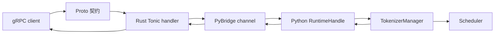

# gRPC-Proto

这组文档解决一个入口层问题：当用户不用 HTTP/SSE，而是让内网网关用 gRPC 对接 SGLang 时，请求到底经过哪套协议、哪段 Rust、哪段 Python，以及最后是否仍然进入 `TokenizerManager` 和 Scheduler。

读完后应该能做三件事：

1. 判断当前可运行的 `--grpc-mode` 独立路径和环境变量预留的 Native gRPC 伴生路径有什么区别。
2. 沿一条 `TextGenerate(stream=true)` 请求画出 `Proto -> Tonic handler -> PyBridge -> RuntimeHandle -> TokenizerManager -> gRPC stream`。
3. 排查 gRPC 模式下常见的导入失败、sidecar 缺失、消息过大、客户端断开后请求未取消等问题。

## 首次阅读路径

| 读者任务 | 先读 | 再读 |
|----------|------|------|
| 第一次理解 gRPC 入口 | [[SGLang-gRPC-Proto-核心概念]] | [[SGLang-gRPC-Proto-数据流]] |
| 要改 proto 或 Rust handler | [[SGLang-gRPC-Proto-源码走读]] | [[SGLang-gRPC-Proto-学习检查]] |
| 正在排障部署 | [[SGLang-gRPC-Proto-排障指南]] | [[SGLang-gRPC-Proto-数据流]] |
| 要和 HTTP/OpenAI API 对照 | [[SGLang-HTTP-Server]]、[[SGLang-OpenAI-API]] | 本专题的 OpenAI pass-through 部分 |

## 心理模型

把 Native gRPC 实现想成一个“跨语言协议闸门”。typed RPC 直接把 Proto 字段改写成内部请求；只有 OpenAI-compatible RPC 才把 JSON body 交给既有 serving handler，并在回程解析 SSE。当前 `--grpc-mode` 则是另一条依赖外部 servicer 的 legacy 启动路径，不能套用下面每一个 Rust/PyO3 细节。



Native gRPC 不是独立推理后端：typed generate/embed 最终构造 `GenerateReqInput` 或 `EmbeddingReqInput`，OpenAI pass-through 则复用 Python serving handler；两路都把模型执行交回 Python runtime。Proto/Tonic 替换的是入口 wire protocol，不是 Scheduler、KV Cache 或模型执行层。

## 源码范围

| 路径 | 读它时关注什么 |
|------|----------------|
| `proto/sglang/runtime/v1/sglang.proto` | gRPC 对外契约，区分 typed RPC、OpenAI JSON pass-through、Admin/Ops |
| `rust/sglang-grpc/build.rs` | proto 如何编译成 Rust server 侧代码 |
| `rust/sglang-grpc/src/lib.rs` | PyO3 暴露的 `start_server`，如何启动独立 Tokio runtime |
| `rust/sglang-grpc/src/server.rs` | Tonic handler、stream 映射、abort guard、消息大小限制 |
| `rust/sglang-grpc/src/bridge.rs` | per-rid channel、callback、backpressure、meta_info 编码 |
| `rust/sglang-grpc/src/utils/request_utils.rs` | Proto 字段如何转成 `GenerateReqInput`/`EmbeddingReqInput` dict |
| `python/sglang/srt/entrypoints/grpc_bridge.py` | Python `RuntimeHandle` 如何把 Rust 调用接回 `TokenizerManager` |
| `python/sglang/srt/entrypoints/grpc_server.py` | 当前 `--grpc-mode` 的 legacy wrapper 与 HTTP sidecar |
| `python/sglang/launch_server.py` | `grpc_mode` 在启动分发里的位置 |

## 当前状态

本专题必须先分清两条线：

| 路径 | 当前地位 | 入口 | 关键风险 |
|------|----------|------|----------|
| `--grpc-mode` | 当前启动分发里的独立 gRPC 模式 | `launch_server.run_server -> serve_grpc` | 依赖 `smg-grpc-servicer`，HTTP sidecar 由 hook 能力决定 |
| Native Rust gRPC | 已有 PyO3 扩展和 Rust server 代码，但默认 HTTP 分支尚未接线 | `sglang.srt.grpc._core.start_server` | 认证、CLI 参数、HTTP 并存接线尚未默认接入 |
| Encoder gRPC | encoder-only 特殊路径 | `encoder_only + grpc_mode` | 服务 PD 分离，不是本文主线 |

启动分支的源码证据：

```python
# 来源：python/sglang/launch_server.py L15-L35
def run_server(server_args):
    """Run the server based on server_args.grpc_mode and server_args.encoder_only."""
    if server_args.encoder_only:
        # For encoder disaggregation
        if server_args.grpc_mode:
            from sglang.srt.disaggregation.encode_grpc_server import (
                serve_grpc_encoder,
            )

            asyncio.run(serve_grpc_encoder(server_args))
        else:
            from sglang.srt.disaggregation.encode_server import launch_server

            launch_server(server_args)
    elif server_args.grpc_mode:
        # TODO: Once the native Rust gRPC server starts alongside HTTP in the
        # default path below (controlled by SGLANG_ENABLE_GRPC / SGLANG_GRPC_PORT),
        # remove this legacy SMG path and the grpc_mode flag.
        from sglang.srt.entrypoints.grpc_server import serve_grpc

        asyncio.run(serve_grpc(server_args))
```

这里最重要的判断是：`elif server_args.grpc_mode` 和 HTTP 默认分支互斥。注释里的 `SGLANG_ENABLE_GRPC / SGLANG_GRPC_PORT` 是未来默认 HTTP 路径旁挂 Native gRPC 的接线目标，不等于当前 `--grpc-mode` 已经走 Native Rust server。

## 与相邻专题的关系

| 相邻专题 | 衔接点 |
|----------|--------|
| [[SGLang-启动链路]] | `ServerArgs.grpc_mode` 如何从 CLI 进入 `run_server` |
| [[SGLang-HTTP-Server]] | Native typed/OpenAI bridge 最终复用 `TokenizerManager` 以下主线；legacy servicer 的内部实现不能从 Native bridge 反推 |
| [[SGLang-OpenAI-API]] | Proto 里的 OpenAI-compatible RPC 走 JSON pass-through |
| [[SGLang-TokenizerManager]] | `RuntimeHandle` 把 typed request 变成 `GenerateReqInput`/`EmbeddingReqInput` 后进入这里 |

## 读完后的检查点

继续读 [[SGLang-gRPC-Proto-学习检查]] 时，不检查“贴了多少段源码”，而检查是否能复述这些不变量：

- `TextGenerate` 和 `Generate` 在 Proto 上不同，但 Rust 都提交为 `req_type="generate"`。
- gRPC stream 的 backpressure 由 Rust bounded channel 和 Python `ChunkSendStatus` 共同完成。
- 客户端断开时，Rust 的 `RequestAbortGuard` 要把 abort 传播回 Python。
- `meta_info` 在 Proto 中是 `map<string,string>`，复杂 Python 值会 JSON 编码成字符串。
- `--enable-metrics` 在 legacy `--grpc-mode` 下依赖 HTTP sidecar hook。
