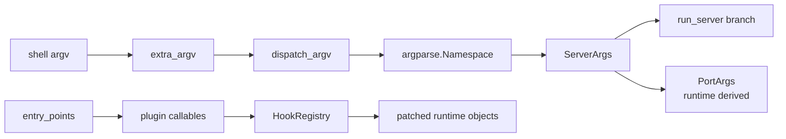
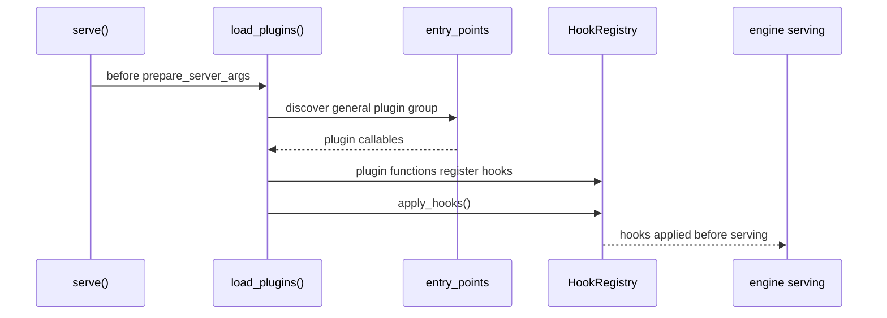

# 启动链路 · 数据流

## 你为什么要读

这篇只看对象怎么变形。启动链路没有网络请求，也没有 tensor；它处理的是参数、插件和启动入口。

## 1. 对象生命周期



| 对象 | 形态 | 生产者 | 消费者 |
|------|------|--------|--------|
| shell argv | `List[str]` | shell / console script | `cli.main:main` |
| `extra_argv` | 未被根 parser 消耗的参数 | `parse_known_args()` | `serve()` |
| `dispatch_argv` | 去掉 `--model-type` 后的参数 | `_extract_model_type_override` | `get_model_path`、diffusion parser、`prepare_server_args` |
| `raw_args` | `argparse.Namespace` | `parser.parse_args` | `ServerArgs.from_cli_args` |
| `ServerArgs` | 经 post-init 规范化的 server-wide 配置 | `from_cli_args` + `__post_init__` | `run_server`、后续 `check_server_args`、HTTP/gRPC/Ray/Encoder |
| `PortArgs` | IPC/NCCL 坐标 | runtime 启动阶段 | HTTP Server、Engine、TokenizerManager、Scheduler |
| hooks | target 到 callable 的 registry | 插件函数 | `HookRegistry.apply_hooks` |

## 2. argv 如何分层

示例命令：

```powershell
sglang serve --model-path meta-llama/Llama-3.1-8B-Instruct --tp-size 2 --port 8080
```

分层结果：

| 阶段 | 对象内容 |
|------|----------|
| console script | 调用 `sglang.cli.main:main` |
| root parser | `args.subcommand = "serve"` |
| root parser | `extra_argv = ["--model-path", "meta-llama/Llama-3.1-8B-Instruct", "--tp-size", "2", "--port", "8080"]` |
| serve dispatcher | `model_type = "auto"` |
| serve dispatcher | `dispatch_argv` 与 `extra_argv` 相同 |
| LLM parser | `raw_args.model_path`、`raw_args.tp_size`、`raw_args.port` |
| dataclass | `ServerArgs(model_path="meta-llama/Llama-3.1-8B-Instruct", tp_size=2, port=8080)`，其余字段走默认值或 post-init 派生 |

`from_cli_args` 只使用 Namespace 上存在的 dataclass 字段，无 CLI 面的字段留默认值。

这里的箭头不是纯数据拷贝：dataclass 构造会运行 `__post_init__`，可能读取模型配置、查询设备、选择 backend 和改写环境变量。后续 engine 初始化还会调用 `check_server_args()` 完成另一批跨字段校验。

```python
# 来源：python/sglang/srt/server_args.py L6862-L6869
    def from_cli_args(cls, args: argparse.Namespace):
        # Some dataclass fields (e.g. stat_loggers) intentionally have no CLI
        # surface and won't appear on the argparse Namespace. Skip them so the
        # dataclass default applies.
        attrs = [
            attr.name for attr in dataclasses.fields(cls) if hasattr(args, attr.name)
        ]
        return cls(**{attr: getattr(args, attr) for attr in attrs})
```

## 3. config 如何并入 argv

如果命令包含 `--config prod.yaml --port 8081`，配置文件会先转成 CLI 参数，再和显式 CLI 合并。

```python
# 来源：python/sglang/srt/server_args_config_parser.py L52-L83
    def merge_config_with_args(self, cli_args: List[str]) -> List[str]:
        """
        Merge configuration file arguments with command-line arguments.

        Configuration arguments are inserted after the subcommand to maintain
        proper precedence: CLI > Config > Defaults

        Args:
            cli_args: List of command-line arguments

        Returns:
            Merged argument list with config values inserted

        Raises:
            ValueError: If multiple config files specified or no config file provided
        """
        config_file_path = self._extract_config_file_path(cli_args)
        if not config_file_path:
            return cli_args

        config_data = self._parse_yaml_config(config_file_path)
        config_args = self._convert_config_to_args(config_data)

        # Merge config args into CLI args
        config_index = cli_args.index("--config")

        # Split arguments around config file
        before_config = cli_args[:config_index]
        after_config = cli_args[config_index + 2 :]  # Skip --config and file path

        # Simple merge: config args + CLI args
        return config_args + before_config + after_config
```

YAML 的 dict 会被转成 `--key value` 形式。bool、list、dict 有不同转换规则。

```python
# 来源：python/sglang/srt/server_args_config_parser.py L141-L187
    def _convert_config_to_args(self, config: Dict[str, Any]) -> List[str]:
        """Convert configuration dictionary to argument list."""
        args = []

        for key, value in config.items():
            key_norm = key.replace("-", "_")
            if key_norm in self.unsupported_actions:
                action = self.unsupported_actions[key_norm]
                msg = f"Unsupported config option '{key_norm}' with action '{action.__class__.__name__}'"
                raise ValueError(msg)
            if isinstance(value, bool):
                self._add_boolean_arg(args, key, value)
            elif isinstance(value, list):
                self._add_list_arg(args, key, value)
            elif isinstance(value, dict):
                self._add_scalar_arg(args, key, json.dumps(value))
            else:
                self._add_scalar_arg(args, key, value)

        return args

    def _add_boolean_arg(self, args: List[str], key: str, value: bool) -> None:
        """
        Add boolean argument to the list.

        Only store_true flags:
            - value True -> add flag
            - value False -> skip
        Regular booleans:
            - always add --key true/false
        """
        key_norm = key.replace("-", "_")
        if key_norm in self.store_true_actions:
            if value:
                args.append(f"--{key}")
        else:
            args.extend([f"--{key}", str(value).lower()])

    def _add_list_arg(self, args: List[str], key: str, value: List[Any]) -> None:
        """Add list argument to the list."""
        if value:  # Only add if list is not empty
            args.append(f"--{key}")
            args.extend(str(item) for item in value)

    def _add_scalar_arg(self, args: List[str], key: str, value: Any) -> None:
        """Add scalar argument to the list."""
        args.extend([f"--{key}", str(value)])
```

排障时要记住：config 不是独立运行时对象，它只是 parse 前被转换成 argv。

还要记住两个前置边界：合并器只识别精确的 `--config FILE` 两个 token，`--config=FILE` 不触发合并；而且 `serve()` 在这一步之前已经调用 `get_model_path()`，所以模型路径不能只存在 YAML 中。

## 4. 插件数据流



插件发现时，平台选择会排除未选平台包：

```python
# 来源：python/sglang/srt/plugins/__init__.py L89-L100
def _get_excluded_dists() -> set[str]:
    """Compute dist names to skip when ``SGLANG_PLATFORM`` is set.

    Returns dist names that provide a platform plugin but are NOT the one
    selected by ``SGLANG_PLATFORM``.  This prevents unselected platform
    packages from registering hooks that pull their hardware dependencies.
    """
    selected = envs.SGLANG_PLATFORM.get()
    if not selected:
        return set()
    platform_eps = entry_points(group=PLATFORM_PLUGINS_GROUP)
    return {ep.dist.name for ep in platform_eps if ep.dist and ep.name != selected}
```

插件执行后，hook registry 会应用到目标函数或类。

```python
# 来源：python/sglang/srt/plugins/hook_registry.py L426-L430
    def decorator(hook: Callable) -> Callable:
        HookRegistry.register(target, hook, type)
        return hook

    return decorator
```

`plugin_hook` 本身只注册 hook，真正修改目标在 `apply_hooks()`。目标可以在 apply 时被解析；若其他已加载模块持有 `from X import Y` 的旧绑定，registry 还会扫描 `sys.modules` 传播补丁。因此“尽早加载”是当前入口顺序和可维护性选择，“开始服务前完成 apply”才是硬边界。

## 5. `ServerArgs` 到 runtime 分支

控制 `run_server` 的关键字段分散在 `ServerArgs` 不同分组：

```python
# 来源：python/sglang/srt/server_args.py L835-L840
    soft_watchdog_timeout: A[
        Optional[float],
        "Set soft watchdog timeout in seconds. If a forward batch takes longer than this, the server will dump information for debugging.",
    ] = None
    sleep_on_idle: A[bool, "Reduce CPU usage when sglang is idle."] = False
    use_ray: A[bool, "Use Ray actors for scheduler process management."] = False
```

```python
# 来源：python/sglang/srt/server_args.py L2378-L2384
    # -------------------------------------------------------------------------
    # Encode prefill disaggregation
    # -------------------------------------------------------------------------
    encoder_only: A[
        bool,
        "For MLLM with an encoder, launch an encoder-only server",
    ] = False
```

`grpc_mode` 在 HTTP server 分组中，见 [[SGLang-启动链路-核心概念]]。这些字段在 `run_server` 中只被读取，不再解释来源。

## 6. Runtime 派生 `PortArgs`

`PortArgs` 不是用户直接输入，而是进入 HTTP/Engine 后由 `ServerArgs` 派生。普通模式使用单机 IPC；DP attention 模式会从 `dist_init_addr` 或 HTTP port 派生 TCP 端口。

```python
# 来源：python/sglang/srt/server_args.py L7672-L7684
        if not server_args.enable_dp_attention:
            # Normal case, use IPC within a single node
            return PortArgs(
                tokenizer_ipc_name=f"ipc://{tempfile.NamedTemporaryFile(delete=False).name}",
                scheduler_input_ipc_name=f"ipc://{tempfile.NamedTemporaryFile(delete=False).name}",
                detokenizer_ipc_name=f"ipc://{tempfile.NamedTemporaryFile(delete=False).name}",
                nccl_port=nccl_port,
                rpc_ipc_name=f"ipc://{tempfile.NamedTemporaryFile(delete=False).name}",
                metrics_ipc_name=f"ipc://{tempfile.NamedTemporaryFile(delete=False).name}",
                tokenizer_worker_ipc_name=tokenizer_worker_ipc_name,
                decoupled_spec_ipc_config=decoupled_spec_ipc_config,
                instance_id=instance_id,
            )
```

这条边界很重要：启动链路文档解释 `ServerArgs` 如何生成；HTTP Server 文档解释 `PortArgs` 如何被 engine 和子进程消费。

## 7. 失败信号对应对象

| 症状 | 对象阶段 | 入口 |
|------|----------|------|
| `sglang --help` 没有 `--model-path` | root parser | `cli/main.py` |
| `--model-type` unknown argument | dispatcher hint 没剥离 | `cli/serve.py` |
| config 文件后缀错误 | config parse | `ConfigArgumentMerger._validate_yaml_file` |
| `--config=prod.yaml` 看似接受但配置没生效 | merge gate | `prepare_server_args` 只检查精确 `--config` token |
| 模型路径只写在 YAML 仍提示必填 | early peek 早于 config merge | `get_model_path` |
| CLI 覆盖 config 失败 | config merge 顺序 | `merge_config_with_args` |
| model path 必填错误 | early peek | `get_model_path` |
| 参数组合 ValueError | post-init 或 engine 校验 | `ServerArgs.__post_init__`、`check_server_args` |
| Ray ImportError | runtime branch | `run_server` |
| ZMQ IPC 地址异常 | runtime derived | `PortArgs.init_new` |

## 复盘

本篇主线描述的是主进程中的解析控制面，不是服务请求数据面。核心对象从字符串逐步变成结构化配置，再进入 runtime 分支；插件是并行且进程局部的控制面，各相关进程都应在开始服务前完成加载和 apply。
